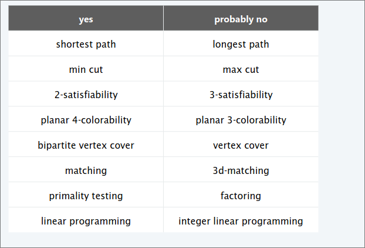
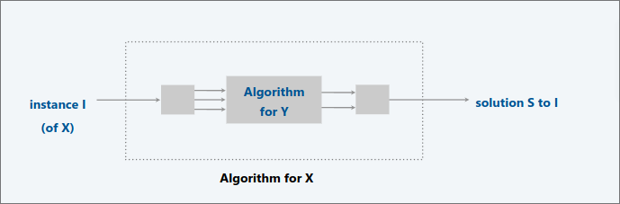
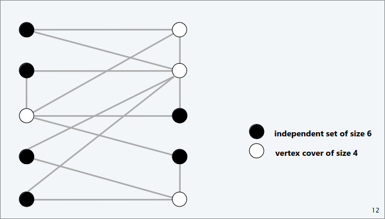
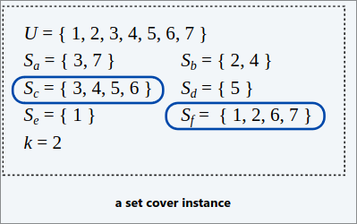
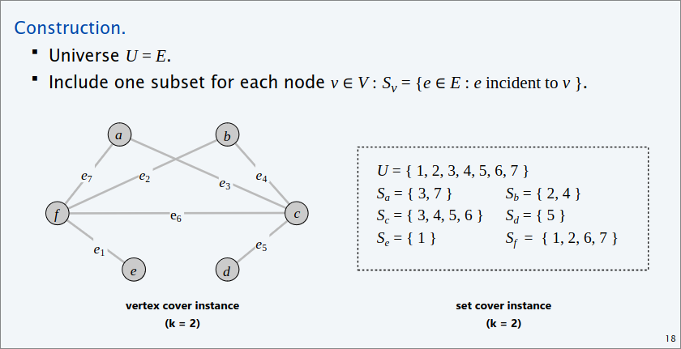
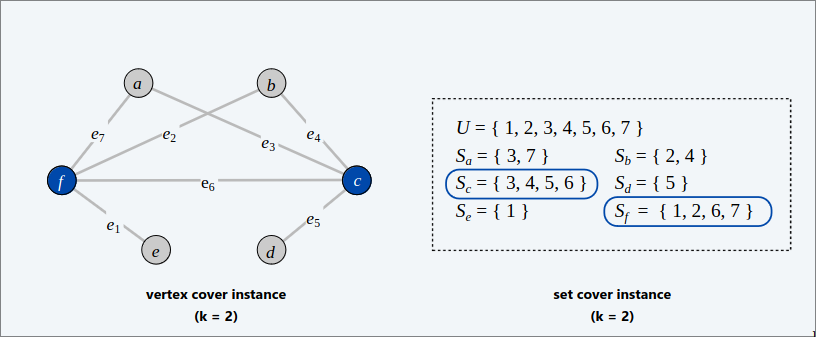
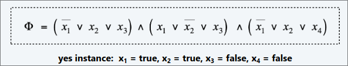
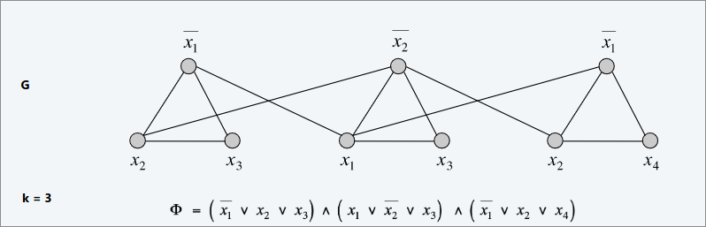

# Intractability  
### Algorithm design pattern  
+ Greedy
+ Divide et Impera
+ Dynamic Programmation 
+ Duality
+ Reductions  
+ Local Search  
+ Randomization  

### Algorithm design antipatterns  
+ NP-completeness $O(n^k)$ algorithm unlikely
+ PSPACE-completeness 
+ Undecibility  

### Which problems will  be able to solve in practice? Those with poly-time algorithms  

  

## Classify problems  

### Desiderata 
 Classify problems according to those that can be solved in polynomial time and those that cannot.  

## Poly-time reductions  
### Desiderata   
Suppose we could solve problem $Y$ in polynomial time.  
What else could we solve in polynomial time? 

### Reductions  
Problem $X$ polynomial time (Cook) reduces to problem $Y$ if arbitrary instances of problem $X$ can be solved using:  
+ Polynomial number of standard computational steps, plus  
+ Polynomial number of calls to oracle that solves problem $Y$  

  

> [!NOTE]  
> Notation: $X \leq_p Y$  
> we pay for time to write down instances of $Y$ sent to oracle $\implies$ instances of $Y$ must be of polynomial size.  

> [!NOTE]  
> if $X \leq_p Y$ and $Y$ can be solved in polynomial time, then $X$ can be solved in polynomial time.  

> [!NOTE]  
> If both $X\leq_p Y$ and $Y\leq_p X$, we use notation $X \equiv_p Y$  

## Indipendent Set  
Given a graph $G=(V,E)$ and an integer $k$, is there a subset of $k$ vertices such that no two are adjacent?  

## Vertex Cover  
Given a graph $G=(V,E)$ and an integer $k$, is there a subset of $k$ (or fewer) vertices such that each edge is incident to at least one vertex in the subset?  

  

### Theorem   

$INDIPENDENT$- $SET \equiv_p VERTEX$- $COVER$  

#### Dim  

We show $S$ is an Indipendent set of size $k$ iff $V-S$ is a vertex cover of size $n-k$  

$(\implies)$  

+ Let $S$ be any indipendent set of size $k$   
+ $V-S$ is of size $n-k$  
+ Consider an arbitrary edge $(u,v) \in E$.  
+ $S$ indipendent: 
  - $\implies$ either $u \notin S$, or both.  
  - $\implies$ either $u \in V-S$, or $v \in V-S$, or both  
+ Thus, $V-S$ covers $(u,v)$  

$(\impliedby)$  

+ Let $V-S$ be any vertex cover of size $n-k$  
+ $S$ is of size $k$    
+ Consider an arbitrary edge $(u,v) \in E$  
+ $V-S$ is a vertex cover:  
  - $\implies$ either $u \in V-S$, or $v\in V-S$, or both.  
  - $\implies$ either $u \notin S$ or  $v \notin S$, or both.  
+ Thus, $S$ is and indipendent set.  

## Set Cover  
Given a set $U$ of elements , a collection $S$ of subsets of $U$, and an integer $k$, are there $\leq k$ of these subsets whose union is equal to $U$?  

  

### Theorem  
$VERTEX$- $COVER \leq_p SET$- $COVER$  

#### Dim  
Given a $VERTEX$-$COVER$ instance $G=(V,E)$ and $k$, we construct a $SET$- $COVER$ instance $(U,S,k)$ that has a set cover of size $k$ iff $G$ has a vertex-cover of size $k$  

  

### Lemma  
$G=(V,E)$ contains a vertex cover of size $k$ iff $(U,S,k)$ contains a set cover of size $k$  
#### Dim  
$(\implies)$  

Let $X \subseteq V$ be a vertex cover of size $k$ in $G$  
+ Then $Y=${$S_v: v \in V$} is a set cover of size $k$  

$(\impliedby)$  

Let $Y \subseteq S$ be a set cover of size $k$ in $(U,S,k)$.  
+ Then $X=${$v:S_v \in Y$} is a vertex cover of size $k$ in $G$.  

  

## Satisfiability  

### SAT  
Given a CNF formula $\phi$, does it have a satisfying truth assignment?  

### 3SAT  
SAT where each clause contains exactly 3 literals (and each literal corresponds to a different variable)  

  

> [!NOTE]  
> **HYPOTHESIS**: There does not exist a poly-time algorithm to 3SAT ($P\neq NP$)  

### Theorem  
$3$-$SAT \leq_p INDIPENDENT$-$SET$  

#### Dim  
Given an istance $\phi$ of $3$-$SAT$, we construct an istance $(G,k)$ of $INDIPENDENT$-$SET$ that has an indipendent set of size $k=|\phi|$ iff $\phi$ is satisfiable.  

##### Construction  
+ $G$ contains 3 nodes for each clause, one foreach literal.  
+ Connect 3 literals in a clause in a triangle  
+ Connect literal to each of its negations  

### Lemma  
$\phi$ is satisfiable iff $G$ contains an indipendent set of size $k=|\phi|$  

#### Dim  

$(\implies)$  Consider any satisfyng assignment for $\phi$  
+ Select one true literal from each clause/triangle  
+ This is an indipendent set of size $k=|\phi|$  

$(\impliedby)$ Let $S$ be indipendent set of size $k$  
+ $S$ must contain exactly one node in each triangle  
+ Set these literals to $true$ (and remaining literals consistently)  
+ All clauses in $\phi$ are satisfied.  

  

