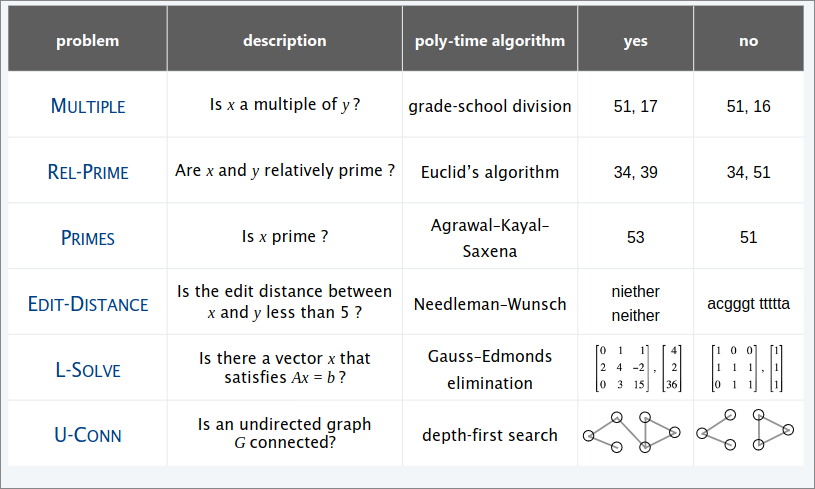

# Intractability II  
## P  

#### Decision Problem  
+ Problem $X$ is a set of strings  
+ Instance $s$ is one string  
+ Algorithm $A$ solves problems $X$:  
  - $A(s)=$  
    - $yes$ if $s \in X$  
    - $no$ if $s \notin X$  

> [!NOTE]  
> Algorithm $A$ runs in polynomial time  if for every string $s$, $A(s)$ terminates in $\leq p(|s|)$ "steps", where $p(.)$ is some poly-time algorithm (deterministic Turing machine)  
## Some problems in P  
### P   
Decision problems for which there exists a poly-time algorithm.  

  

## NP  

> [!NOTE]  
> Algorithm $C(s,t)$ is a **certifier** for problem $X$ if for every string $s$: $s \in X$ iff there exists a string $t$ such that $C(s,t)=yes$  

> [!NOTE]  
> **NP** = set of decision problems for which there exists a poly-time certifier  
> + $C(s,t)$ is a poly-time algorithm  
> + Certificate $t$ is of polynomial size: $|t|\leq p(|s|)$ for some polynomial $p(.)$.  

  

## Certificates and certifiers: SAT  

#### SAT   
Given a CNF formula $\phi$, does it have a satisfying truth assignment?

#### Certificate  
An assignment of truth values to the Boolean variables  
#### Certifier  
Check that each clause in $\phi$ has at least one true literal   

  

> [!NOTE]  
> $SAT \in NP$   

## Certificate and certifiers: Hamilton Path  
### Hamilton Path
Given an undirected graph $G=(V,E)$, does there exist a simple path $p$ that visits every node  

#### Certificate  
A permutation $\pi$ of the $n$ nodes  

#### Certifiers  
Check that $\pi$ contains each node in $V$ exactly once, and that $G$ contains an edge between each pair of adjacent nodes   
  

> [!NODE]  
> $HAMILTON$- $PATH\in NP$  

## Two problems that probably do not belong to NP  
#### CHECKERS  
Given a board position in an $n$-by-$n$ generalization of checkers, can black guarantee a win?  

#### CO-LONGEST-PATH  
Given an undirected graph $G=(V,E)$, is the length of the longest simple path $\leq k$?  

## Some problems in NP  
### NP  
Decision problems for which there exists a poly-time certifier   

  

## P,NP,EXP  
### P  
Decision problems for which there exists a poly-time algorithm  

### NP  
Decision problems for which exists a poly-time certifier  

### EXP  
Decision problems for which there exists an exponential-time algorithm  
### Proposition   
$P \subseteq NP$  

#### Dim  
Consider any problem $X \in P$  
+ By definition, there exists a poly-time algorithm $A(s)$ that solves $X$  
+ Certificate $t=\epsilon$, certifier  

### Proposition  
$NP \subseteq EXP$  
#### Dim  
Consider any problem $X \in NP$  
+ By definition, there exists a poly-time certifier $C(s,t)$ for $X$  
where certificate $t$ satisfies $|t|\leq p(|s|)$ for some polynomial $p(.)$  
+ To solve instance $s$, run $C(s,t)$ on all strings $t$ with $|t|\leq p(|s|)$  
+ Return $yes$ iff $C(s,t)$ returns $yes$ for any of these potential certificates  

### Fact  
$P \neq EXP \implies P\neq NP$ or $NP \neq EXP$, or both.  

## P VS NP  
Is the decision problem as easy the certification problem?  
  

#### If yes  
Efficient algorithm for $3SAT, VERTEXCOVER,FACTOR,...$

#### If no  
No efficient algorithm for $3SAT, VERTEXCOVER,FACTOR,...$  

## Polynomial transformation  
#### DEF  
Problem $X$ polynomial reduces to problem $Y$ if arbitrary instances of problem $X$ can be solving using:  
+ Polynomial number of standard computational steps, plus  
+ Polynomial number of calls to oracle that solves problem $Y$  

#### DEF  
Problem $X$ polynomial transformation to problem $Y$ if given any instance $x$ of $X$, we can construct an instance $y$ of $Y$ such that $x$ is a $yes$ instance of $X$ iff $y$ is a $yes$ instance of $Y$  

>[!NOTE]  
>Polynomial transformation is polynomial reduction with just one call to oracle for $Y$, exactly at the end of the algorithm for $X$   

## NP complete  
A problem $Y \in NP$ with the property that for every problem $X \in NP$ , $X \leq_p Y$.  

### Proposition  
Suppose $Y\in NPcomplete$. Then $Y \in P$ iff $P=NP$  
#### Dim  
$(\impliedby)$   

If $P=NP$, then $Y \in P$ beacuse $Y \in NP$  

$(\implies)$   

Suppose $Y \in P$:  
+ Consider any problem $X \in NP$. Since $X \leq_p Y$, we have $X \in P$  
+ This implies $NP \subseteq P$  
+ We already know $P \subseteq NP$. Thus, $P=NP$  

## Theorem Cook-Levin  
### Theorem  
$SAT \in NPcomplete$  

> [!NOTE]  
> To prove that $Y \in NPcomplete:$  
> 1. Show that $Y \in NP$  
> 2. Choose an $NPcomplete$ problem $X$  
> 3. Prove that $X \leq_pY$  

### Proposition  
if $X \in NPcomplete$, $Y \in NP$, and $X \leq_p Y$, then $Y \in NPcomplete$  
#### Dim  
Consider any problem $W \in NP$. Then, both $W \leq_p X$ and $X \leq_p Y$  
+ By transitivity, $W \leq_p Y$  
+ Hence $Y \in NPcomplete$  

### Theorem  
Unless $P=NP$, there exist problems in $NP$ that are neither in $P$ nor $NPcomplete$

