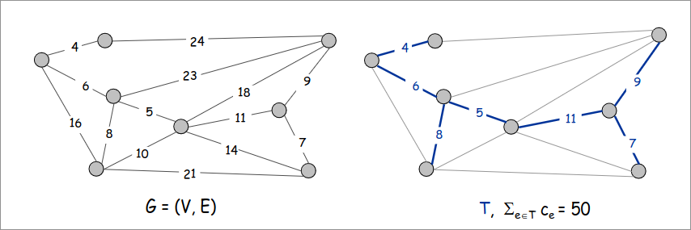
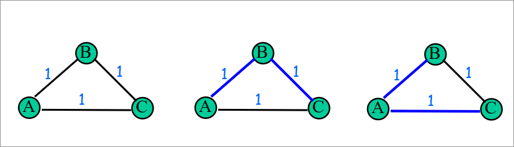
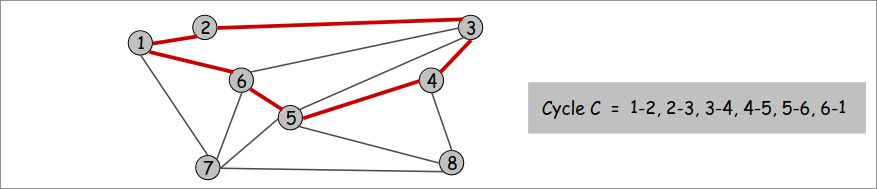
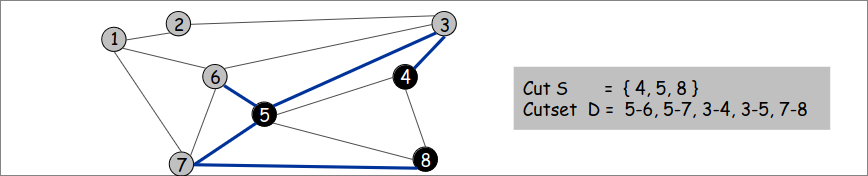
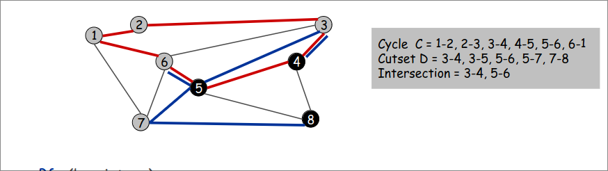
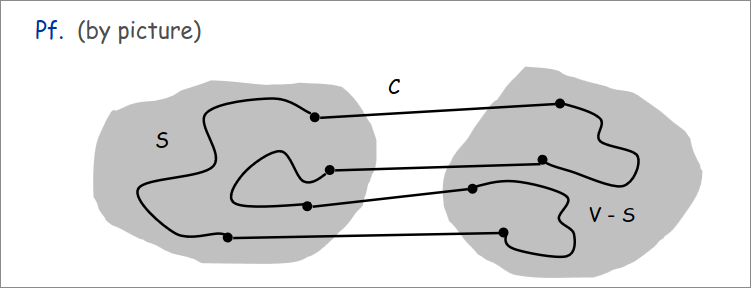
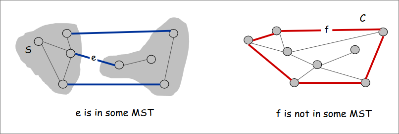
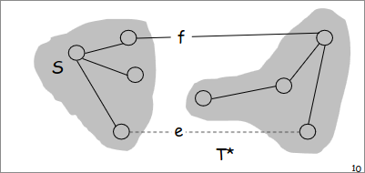
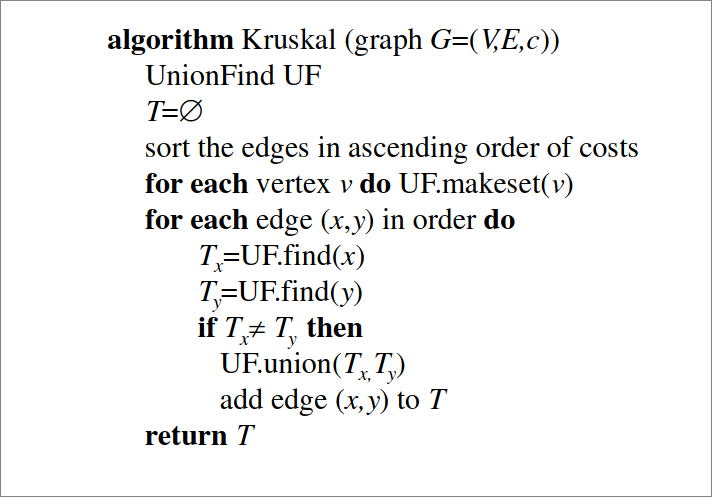

# Minimum Spanning Tree  
Given a connected graph $G=(V,E)$ with real-valued edge weights $c_{e}$, an MST is a subset of the edges $T \subseteq E$ such that T is a spanning tree whose sum of edge weights is minimized  

  

**Cayley's Theorem**  
There are $n^{n-2}$ spanning trees of $K_{n}$  

## The Minimum Spanning Tree problem  
- Input:  
  - a connected weighted undirected graph $G = (V,E)$ with real-valued edge weights $c_e$  
- Feasible solution:  
  - a spanning tree $T$ of $G$, es: a tree $T=(V,F)$ with $T \subseteq E$ (reaching aall vertices of $G$)
- measure (to minimize):
  - the weight (or cost) of $T$, es: $c(T)= \sum_{e \in T} c_e$  

## Application 
MST is fundamental problem with diverse applications.  

- Network design:  
  - telephone, electrical, hydraulic, TV cable, computer, road  
- Approximation algorithms for NP-hard problems:
  - travelling salesperson problem, Steiner tree;
- Indirect applications:
  - max bottleneck paths,
  - LDPC codes for error correction
  - image registration with Renyi entropy  
  - learning salient features for real-time face verification
  - reducing data storage in sequencing amino acids in a protein  
  -  model locality of particle interactions in turbulent fluid flows 
  - autoconfig protocol for Ethernet bridging to avoid cycles in a network  

## Uniqueness of MST  
The MST is not unique in general  

  

**Property**: If G has distinct weights then the MST is unique.  

## Cycles and Cuts  
**Cycles**: Set of edges the form a-b, b-c, c-d, ... , y-z, z-a  

  

**A Cut**: A cut is a subset of nodes S (Sometime defined as a partition of $V$ into $S$ and $V\S$).  

**Cutset**: The corresponding cutset $D$ of a cut $S$ is the subset of edges with exactly one endpoint in $S$.  

  

## Cycle-Cut Intersection  
**Claim**: A cycle and a cutset intersect in an even number of edges  

  

**Pf** (by picture):  

  

## Greedy Algorithms 
**Cut Property**: Let $S$ subset of nodes, and let a be a min cost edge with exactly one endpoint in $S$. Then there exists an MST $T^*$ containing $e$.  

**Cycle property**: Let $C$ any cycle, and let $f$ be a max cost edge belonging to $C$. Then there exists an MST $T^*$ that does not contain $f$.  

  

*Dim Cut Property* (exchange argument):  
+ Suppose $e$ does not belong to $T^*$  
+ Adding $e$ to $T^*$ creates a cycle $C$ in $T^*$.  
+ Edge $e$ is both in the cycle $C$ and in the cutset $D$ corresponding to $S$   
$\implies$ there exists another edge, say $f$ that is in both $C$ and $D$.  
+ $T' = T^* \cup {e} - {f}$ is also a spanning tree.
+ Since $c_e \leq c_f$ , cost($T'$) $\leq$ cost($T^*$).  
+ Then $T'$ is an MST containing $_\square$  

  

*Dim Cycle Property* (exchange argument):  
+ Suppose $f$ belongs to $T^*$  
+ Deleting $f$ from $T^*$ creates a cut in $S$ in $T^*$  
+ Edge $f$ is both in the cycle $C$ and in the cutset $D$ corresponding to S.  
$\implies$ there exists another edge, say $e$, that is both $C$ and $D$.  
+ $T' = T^* \cup {e} - {f}$ is also a spanning tree.  
+ Since $c_e \leq c_f$, cost($T'$) $\leq$ cost($T^*$).
+ Then $T'$ is and MST that does not contain $f$.  

**Kruskal's algorithm**: Start with $T = \phi$. Consider edges in ascending order of cost. Insert edge $e$ in $T$ unless doing so would create cycle.  

**Reverse-Delete algorithm**: Start with $T = E$. Consider edges in descending order of cost. Delete edge $e$ from $T$ unless doing so would disconnect $T$.  

**Prim's algorithm**: Start with some root node $s$ and greedily a tree T from $s$ outward. At each step, add the cheapest edge $e$ to $T$ that has exactly one endpoint in $T$.  

**Remark** All three algorithms produce an MST.  

# Kruskal's algorithms  
**Kruskal's algorithm**: Start with $T = \phi$. Consider edges in ascending order of cost. Insert edge $e$ in $T$ unless doing so would create cycle.  

**Remark**  
An efficient implementation of Kruskal's algorithm uses a Union-Find data structure:
+ to mantain the connected components of the current solutions  
+ to check whether the current edge forms a cycle (with the current solution)  

  

