# Network Flow
A **flow network** is a tuple $G=(V,E,s,t,c)$.

> [!NOTE]  
> Digraph $(V,E)$ with source $s \in V$ and sink $t \in V$  
> Capacity $c(e)$ for each $e \in E$

**Intuition** Material flowing through a transportation network; material originates at source and is sent to sink  

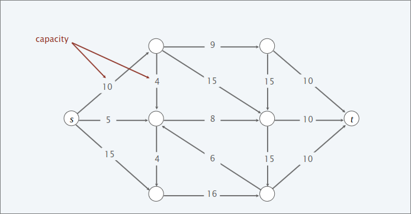  

## Minimum-cut problem  
### DEF  
An **st-cut (cut)** is a partition $(A,B)$ of the nodes with $s \in A$ and $t \in B$

### DEF  
Its **capacity** is the sum of the capacities of the edges from $A$ to $B$  

$cap(A,B)= \sum_{e out A} c(e)$

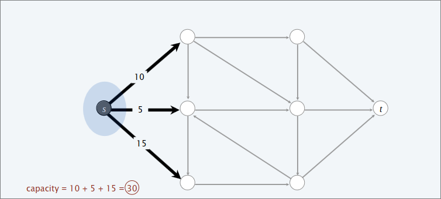  

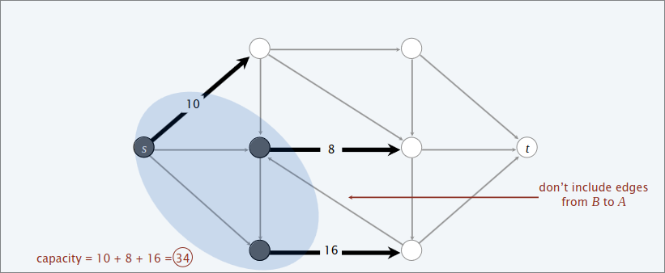  

### Min-cut problem    

Find a cut of minimum capacity  

## Maximum-flow problem  

### DEF  

An **st-flow (flow)** $f$ is a function that satisfies:  
  1. For each $e \in E$ : $0 \leq f(e)\leq c(e)$  
  2. For each $v \in V-\{s,t\}$ : $\sum_{eintov} f(e)=\sum_{e out of v}f(e)$  

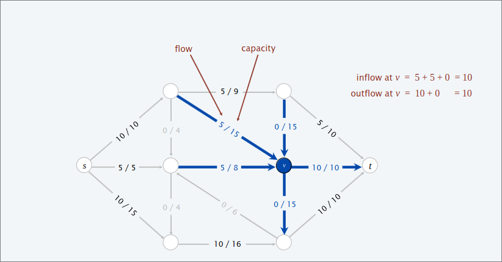  

### DEF  
The **value** of a flow $f$ is : $val(f)=\sum_{eoutf}f(e)-\sum_{e in to s}f(e)$

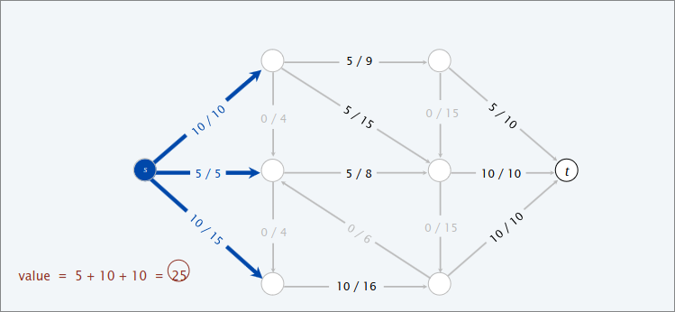  

### Max-flow problem  

Find a flow of maximum value  

## Toward a max-flow algorithm  

**Greedy algorithm**:
  1.  Start with $f(e)$ for each edge $e \in E$  

  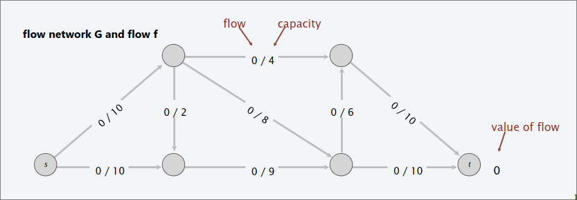  

  2.  Find an $s \rightarrow t$ path $P$ where each edge has $f(e)<c(e)$  
  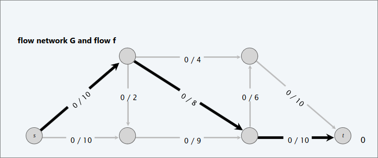  
  3.  Augument flow along path $P$  
  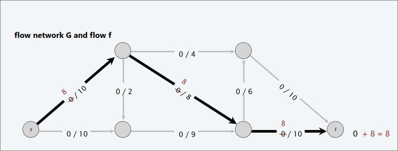  
  
  4. Repeat until you get stuck  

  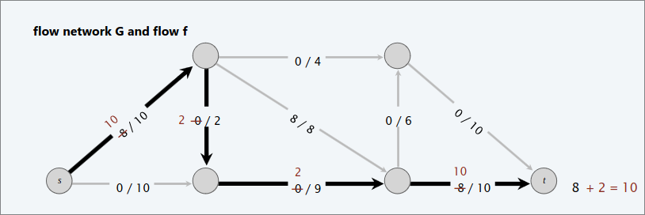  
  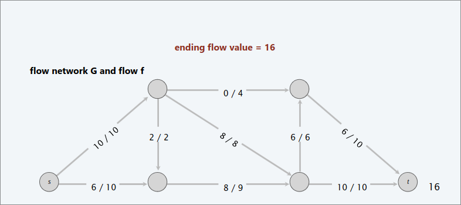  

#### BUT  

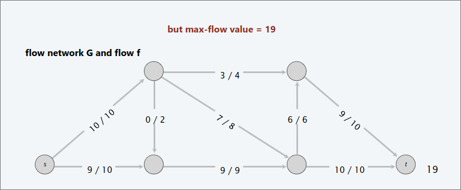  

#### Why does the greedy algorithm fail?

Consider flow network $G'$  
  + The unique max flow $f^*$ has $f^*(v,w)=0$  
  + Greedy algorithm could choose $s \rightarrow v \rightarrow w \rightarrow t$ as first path  

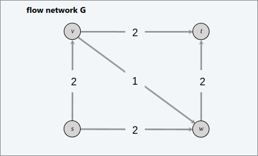  

**Bottom line** Need some mechanism to "undo" a bad decision  

## Residual Network  

**Original edge** $e=(u,v) \in E$  
  + Flow $f(e)$  
  + Capacity $c(e)$  
  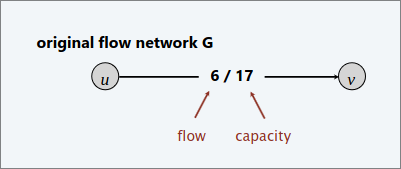  

**Reverse edge** $e^{reverse}=(v,u)$  
  + "Undo" flow sent  

**Residual capacity**  

$c_f(e)=$ {  

  + $c(e)-f(e)$ if $e\in E$  

  + $f(e^{reverse})$ if $e^{reverse} \in E$

}

**Residual network** $G_f=(V,E_f,s,t,c_f)$  

>[!NOTE]  
>$E_f=$ {$e: f(e)<c(e)$} $\cup$ {$e: f(e^{reverse})>0$}  
> Key property: $f'$ is a flow in $G_f$ iff $f+f'$ is a flow in $G$.  

  

## Augmenting path  

### DEF  

An **augmenting path** is a simple $s \rightarrow t$ path in the residual network $G_f$  

### DEF  
The **bottleneck capacity** of an augmenting path $P$ is the minimum residual capacity of any edge in $P$  

#### Key property  

Let $f$ be a flow and let $P$ be an augumenting path in $G_f$.  
Then, after calling $f' \leftarrow AUGUMENT(f,c,p)$,  
the resulting $f'$ is a flow and $val(f')+bottleneck(G_f,P).  

## Ford-Fulkerson algorithm  

1. Start with $f(e)=0$ for each edge $e \in E$  
2. Find an $s \rightarrow t$ path $P$ in the residual network $G_f$  
3. Augument flow along path $P$  
4. Repeat until you get stuck  

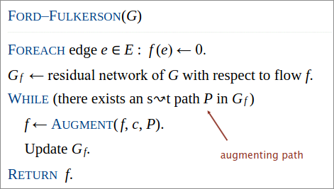  

