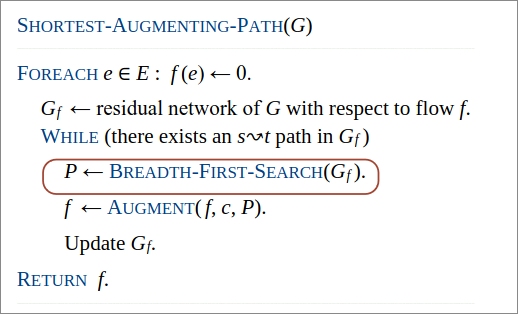

# Network Flow  
## Relationship between flows and cuts  
### Flow value lemma  
Let $f$ be any flow and let $(A,B)$ be any cut. Then, the value of the flow $f$ equals the net flow across the cut $(A,B)$.  

$val(f)= \sum_{e out of A} f(e)- \sum_{e in to A}f(e)$  

  

#### Dim  

$val(f)= \sum_{e out of A} f(e)- \sum_{e in to A}f(e)$  

$val(f)= \sum_{e out of s} f(e)- \sum_{e in to s}f(e)$    

$= \sum_{v \in A}(\sum_{e out of v} f(e)- \sum_{e in to v}f(e))$  

$val(f)= \sum_{e out of A} f(e)- \sum_{e in to A}f(e)$  

### Weak duality 

Let $f$ be any flow and $(A,B)$ be any cut. Then, $val(f) \leq cap(A,B)$

#### Dim  

$val(f)= \sum_{e out of A} f(e)- \sum_{e in to A}f(e)$  

$\leq \sum_{e out of A} f(e)$  

$\leq \sum_{e out of A} f(e)$  

$= cap(A,B)$  

  

## Certificate of optimality  

#### Corollary  
Let $f$ be a flow let $(A,B)$ be any cut  
If $val(f)=cap(A,B), then $f$ is a max flow and $(A,B)$ is a min cut

#### Dim  

For any flow $f': val(f') \leq cap(A,B) = val(f)$  
For any cut $(A',B'): cap(A',B') \geq val(f) = cap(A,B)$  

### Max-flow min-cut theorem  

Value of a max flow = capacity of a min cut  

### Augumenting path theorem  

A flow $f$ is a max flow iff no augumenting paths

#### Dim  

The following three conditions are equivalent for any flow $f$:  
1. There exists a cut $(A,B)$ such that $cap(A,B)=val(f)$  
2. $f$ is max flow  
3. There is no augmenting path with respect to $f$  

[$i \implies ii$]  

This is the weak duality corollary.  

[$ii \implies iii$]  

Suppose that there is an augumenting path with respect to $f$  
Can improve flow $f$ by sending flow along this path  
Thus,$f$ is not a max flow.  

[$iii \implies i$]  

Let $f$ be a flow no augmenting paths  
Let $A=$ set of nodes reachable from $s$ in residual network $G_f$  
By definition of $A: s\in A$  
By definition of flow $f: t \notin A$  

  

#### Theorem  

Given any max flow $f$, can compute a min cut $(A,B)$ in $O(m)$ time.  

## Analysys of FF  algorithm  

> [!NOTE]  
> Every edge capacity $c(e)$ is an integer between $1$ and $C$  

#### Integrality Invariant  
Throughout Ford-Fulkerson, every edge flow $f(e)$ and residual capacity $c_f(e)$ is an integer  

> ##### Dim  
> By induction on the number of augmenting path.  

#### Theorem  
Ford-Fulkerson terminates after at most $val(f^*) \leq nC$ augmenting paths, where $f^*$ is a max flow.  
> ##### Dim
> Each augmentation increases the value of the flow by at least $1$  

#### Corollary  
The running time of Ford-Fulkerson is $O(m$ $val(f^*)) = O(mnC)$  

> ##### Dim  
> Can use either BFS or DFS to find augmenting path in $O(m)$ time  

#### Integrality theorem  

There exists an integral max flow $f^*$  

> ##### Dim   
> Since Ford-Fulkerson terminates, theorem follows from integrality variant  (and augmenting path theorem)  

#### Is generic Ford-Fulkerson algorithm poly-time in input size?   No it's pseudo-polynomial   

## Number of augmenting paths can be exponential in input size 

## Choosing good augmenting paths  

#### Choose augmenting paths with:  

1. Sufficiently large bottleneck capacity
2. Fewest edges  

Choosing augmenting paths with "large" bottleneck capacity  
+ Mantain scaling paramater $\Delta$  
+ Let $G_f(\Delta)$ be the part of the residual network containing only those edges with capacity $\geq \Delta$
+ Any augmenting path in $G_f(\Delta)$ has bottleneck capacity $\geq \Delta$  

## Capacity Scaling
  

## Analysys Capacity Scaling

#### Lemma 1  
There are $1+ ⌊log_2(C)⌋$ scaling phases

#### Lemma 2  
There are $\leq 2m$ augmentation per scaling phase  

>[!NOTE]  
> Total number of augmentations: $O(m^2log(C))$  

#### Theorem   
The capacity-scaling algorithm takes $O(m^2log(C))$  

## Shortest augmenting path  

#### How to choose next augmenting path in Ford-Fulkerson ? Pick one that uses the fewest edges  

  

## Analysys Shortest augmenting path  

#### Lemma 1  
The total number of augmentations is at most $m n$  

#### Theorem  
The shortest-augmenting-path algorithm takes $O(m^2n)$ time.  

