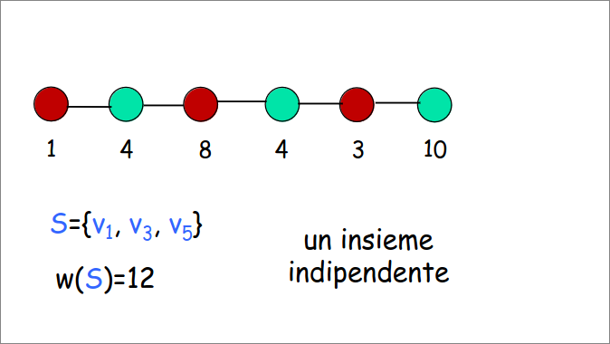
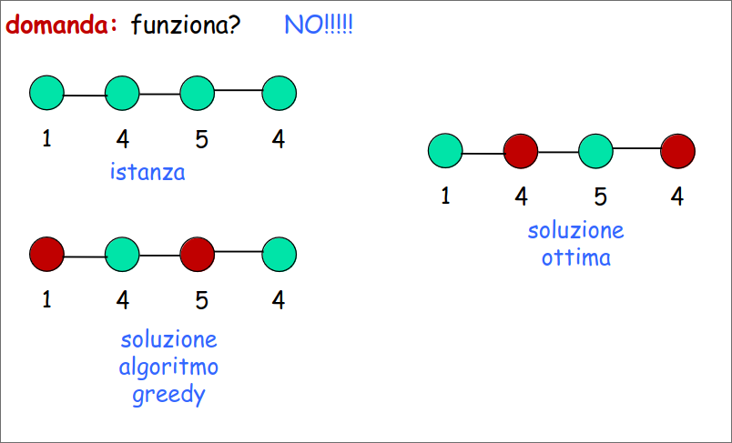
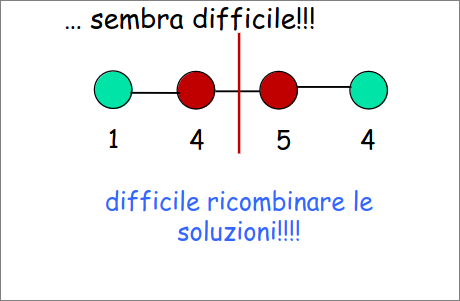
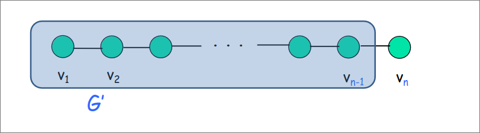
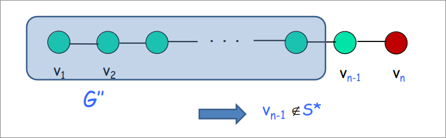
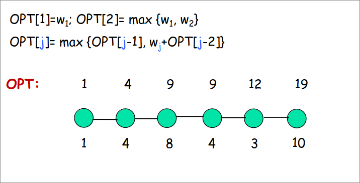
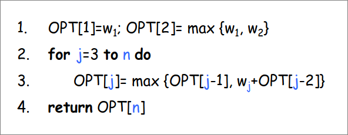
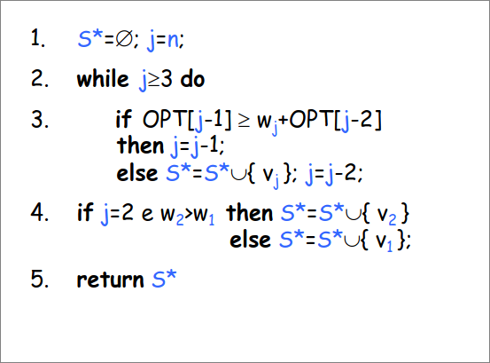

# Programmazione Dinamica  
## Insieme Indipendente di peso massimo (su grafi a cammino)  
**INPUT:** Un cammino $G$ di $n$ nodi. Ogni nodo $v_i$ ha un peso $w_i$  
**GOAL:** trovare un insieme indipendente di peso massimo, ovvero un insieme $S$ di nodi tale che:  

($i$) $S$ è un II,  
($ii$) $w(S) = \sum_{v_i \in S}w_i$ è più grande possibile  

Un insieme indipendente di $G$ è un sottoinsieme di nodi che non contiene due nodi adiacenti, ovvero per ogni coppia di nodi dell'insieme i due nodi non sono collegati da un arco.  

  

  

## Progettiamo un algoritmo: che approccio usare?  
### Forza Bruta: Enumerazione  

**IDEA:**  enumeriamo tutti i sottoinsiemi degli $n$ nodi, per ogniuno verifichiamo che è un insieme indipendente, ne calcoliamo il peso e teniamo quello massimo.  

Ma quanti sottoinsiemi guardiamo? $2^n$ (TROPPI!).  

### Approccio greedy  
**IDEA:** Costruisco la soluzione in modo incrementale scegliendo ogni volta il nodo indipendente di valore massimo  

Funziona?  

  

### Divide Et Impera  
**IDEA:** Divido il cammino a metà, calcolo ricorsivamente l'II di peso massimo sulle due metà e poi ricombino le soluzioni  

Corretto?  Posso risolvere (efficientemente) i conflitti che ho quando ricombino?  

  

> [!WARNING]  
Non stiamo capendo davvero la struttura del problema.  

## Un nuovo approccio  
**passaggio critico:** ragionare sulla struttura/proprietà della soluzione ottima del problema  

> ![!NOTE]  
in termini di soluzioni (ottime) di sottoproblemi più "piccoli"  

**Obiettivo:** esprimere la soluzione del problema come combinazione di soluzioni di sottoproblemi. Se le combinazioni sono "poche" possiamo cercare la  cercare la combinazione giusta per forza bruta.  

### Ragionando sulla struttura della soluzione  
Sia $S^*$ la soluzione ottima, ovvero l'II di peso massimo in $G$  

> [!NOTE]  
$v_n \in S^*$ o $v_n \notin S^*$  

**Caso 1**: $v_n \notin S^*$  

considera $G' = G -$ {$v_n$}  
allora $S^*$ è una soluzione ottima per $G'$  

Se esistesse una soluzione $S$ migliore per $G'$, $S$ sarebbe migliore anche per $G$: assurdo!  

  

**Caso 2:** $v_n \in S^*$  

considera $G''= G -$ {$v_{n-1},v_n$}  
allora $S^* \backslash$ {$v_n$} è una soluzione ottima per $G''$  

se esistesse una soluzione $S$ migliore per $G''$, $S \cup${$v_n$} sarebbe migliore di $S'$ per $G$: assurdo!  

  

### Verso l'algoritmo  
*PROPRIETÀ:* l'II di peso massimo per $G$ deve essere o:  

($i$) l'II di peso massimo per $G'$  
($ii$) $v_n$ unito all'II di peso massimo per $G''$  

**IDEA:** calcolare le due soluzioni e ritornare la migliore delle due  
Possiamo risolvere ricorsivamente?  

$T(n)=T(n-1)+T(n-2)+O(1)$  

$T(n)=O(\phi^n)$  (TROPPO!)  

**Ma quanti problemi distinti sono risolti dall'algoritmo ricorsivo?** $\Theta(n)$  
c'è un sottoproblema per ogni prefisso di $G$  

**IDEA:** Procediamo iterativamente considerando prefissi di $G$ dai più piccoli verso i più grandi.  

### Esempio  

+ $G_j:$ sottocamino composto dai primi $j$ vertici di $G$  
+ Sottoproblema $j:$ calcolare il peso del miglior II per $G_j$  
+ $OPT[j]:$ valore soluzione sottoproblema $j$, ovvero peso dell'II di peso massimo di $G_j$  

  

$G_j:$ sottocamino composto dai primi $j$ vertici di $G$  
$OPT[j]:$ vettore di $n$ elementi  
dentro $OPT[j]$ voglio mettere il peso dell'II di peso massimo di $G$  
  

$T(n)=\Theta(n)$  

>[!NOTE]  
L'algoritmo calcola il valore della soluzione ottima, ma non la soluzione  

## Ricostruire la soluzione in tempo lineare  

**IDEA SEMPLICE:**  Mentre calcoliamo i valori $OPT[j]$ possiamo mantenere esplicitamente anche la soluzione:  

> Corretta ma non efficiente  

**IDEA MIGLIORE:** Ricostruire la soluzione solo alla fine sfruttando $OPT[j]$.    

**PROPRIETA' CHIAVE**:  

$v_j \in II$ di peso massimo $\Leftrightarrow w_j + OPT[j-2] \geq OPT[j-1]$  

  

$T(n)=\Theta(n)$  

## Principi Generali  

1. identificare un numero piccolo di sottoproblemi  
> calcolare l'II di peso massimo di $G_j, j=1,...,n$  

2. descrivere la soluzione di un generico sottoproblema in funzione delle soluzioni di sottoproblemi più piccoli  
> $OPT[j]=max(OPT[j-1],w_j+OPT[j-2])$  

3. le soluzioni dei sottoproblemi sono memorizzate in una tabella  

4. avanzare opportunamente nella tabella, calcolando la soluzione del sottoproblema corrente in funzione delle soluzioni di sottoproblemi già risolti.  

## Proprietà dei sotto problemi  
1. essere pochi  

2. risolti tutti i sottoproblemi si può calcolare velocemente la soluzione al problema originale  
> spesso la soluzione cercata è semplicemente quella del sottoproblema più grande  

3. ci devono essere sottoproblemi "piccoli"  
> caso base  
4. ci deve essere un ordine in cui risolvere i sottoproblemi  
> e quindi un modo di avanzare nella tabella e riempirla
