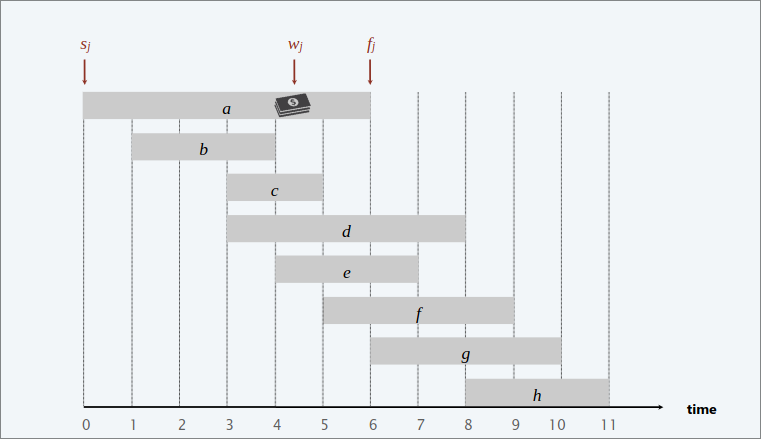
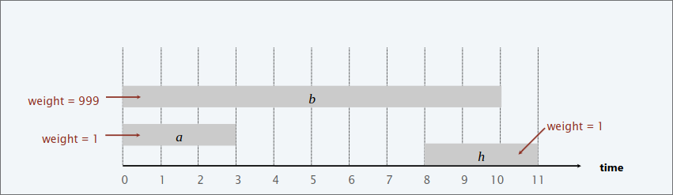
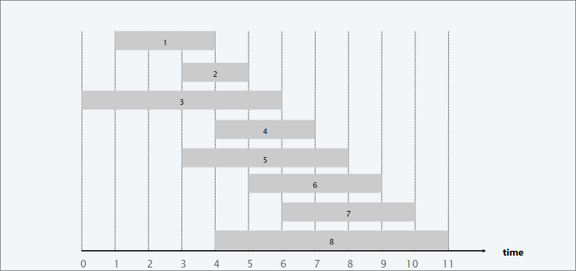
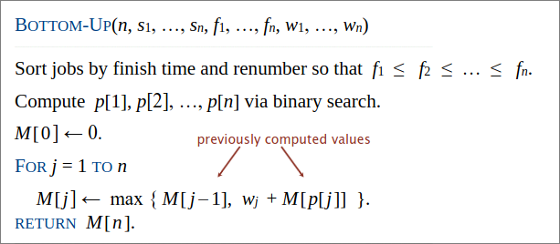
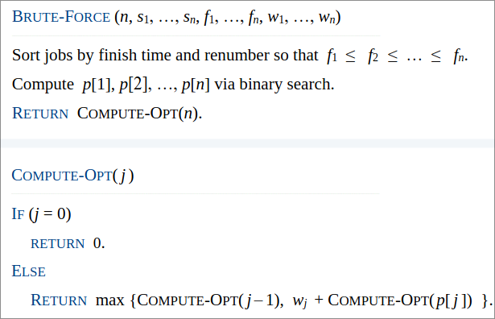
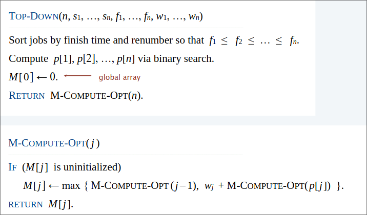
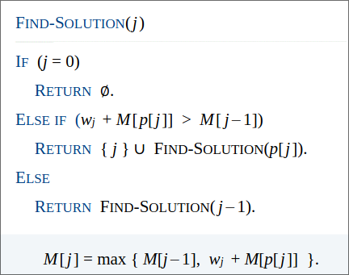

# Programmazione Dinamica II  

+ **Greed** Process the input in some order , myopically making irrevocable decisions  

+ **Divide and Conquer** Break up a problem into *independent* subproblems; solve each subproblem; combine solutions to subproblems to form solution to original problem.  

+ **Dynamic programming** Break up a problem into a series of *overlapping* subproblems; combine solutions to smaller subproblems to form solution to large subproblem.  

## Weighted interval scheduling  
Job $j$ starts at $s_j$, finishes at $f_j$ and has weight $w_j>0$.  
Two jobs are *compatible* if the don't overlap.  
**Goal:** find max-weight subset of mutually compatible jobs.  

  

### Earliest-finish-time first algorithm  

Consider jobs in ascending order of finish time  
Add job to subset if it is compatible with previously chosen jobs  

>[!WARNING]  
Greedy algorithm is correct if all weights are 1  

  

>[!NOTE]  
Jobs are in ascending order of finish time: $f_1 \leq f_2 \leq ... \leq f_n$  

**DEF:**  $p(j)$ = largest index $i<j$ such that job $i$ is compatible with $j$.  

  
*ES*: $p(8)=1$, $P(7)=3$, $P(2)=0$  

**DEF:** $OPT(j)$ = max-weight of any subset of mutually compatible jobs for subproblem consisting only of jobs $1,2,...,j$  

**Goal** $OPT(n)$ = max weight of any subset of mutually compatible jobs  

**CASE 1** $OPT(j)$ does not select job $j$  
Must be an optimal solution to problem consisting of remaning jobs $1,2,...,j-1$.  

**CASE 2** $OPT(j)$ selects job $j$  
+ collect profit $w_j$  
+ can't use incompatible jobs {$p(j)+1, p(j)+2,...,j-1$}  
+ Must include optimal solution to problem consisting of remaning compatible jobs $1,2,...,p(j)$  

**Bellman equation:** $OPT(j)$=  
{  

+ $0$ if $j>0$  
+ $max${$OPT(j-1),w_j+OPT(p(j))$}

}

  

**RUNNING TIME:** $O(nlogn)$:  

+ $O(nlogn)$: mergesort  
+ compute $p(j)$ foreach $j: O(nlogn)$: binary search  
+ cycle takes $O(n)$  

  

$T(n)$={  

+ $\Theta(1)$ if $n = 1$  
+ $2T(n-1)+\Theta(1)$  if $n>1$

}  

$T(n)=\Theta(2^n$)   

>[!NOTE]  
>Recursive algorithm is slow beacuse of overlapping subproblem $\implies$ exponential-time algorithm.  

### Memoization  

Cache result of subproblem $j$ in $M[j]$.  
Use $M[j]$ to avoid solving subproblem $j$ more than once.  

  

**Claim:**  Memoized version of algorithm takes $O(nlogn)$ time.  

*Pf*:  
+ Sort by finish time: $\O(nlogn)$ (mergesort).  
+ Compute $p[j]$ for each : $O(nlogn)$ (binary search)  

- $M-COMPUTE-OPT(j):$ each invocation takes $O(1)$ time and either  
  - (1) returns an initialized value $M[j]$  
  - (2) initializes $M[j]$ and makes two recursive calls   

- Progress measure $\phi=\#$ initialized entries among $M[1:n]$  
  - initially $\phi =0$; throughout $\phi \le n$  
  - (2) increases $\phi$ by $1 \implies 2n$ recursive calls.  
+ Overall running time of $M-COMPUTE-OPT(n)$ is $O(n)$  

## FIND SOLUTION  

  

>[!NOTE]  
$\#$ of recursive calls $\le n \implies O(n)$  

| Memoization (top-down) | Table-based (bottom-up) |
|----------|----------|
| More intuitive   | **Harder to grasp**        |
| Easier to index subproblems by  other objects (es: sets)| **Need to index subproblems with integers**        |
| Only computes necessary subproblems   | **Always computes all subproblems**        |  
|**Function calls overhead** | No recursion. More cache efficient. |  
|**Time complexity is harder to analyze** | Time complexity is easy to analyze|  
|  |  Short and clean code |  

