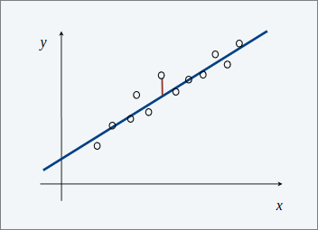
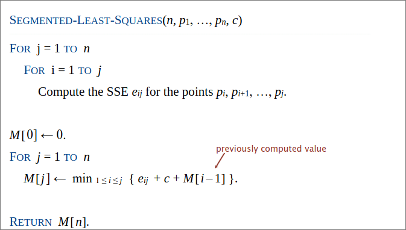
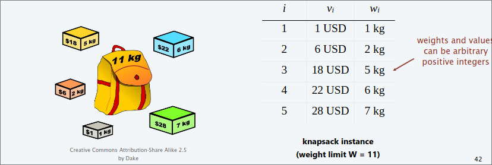
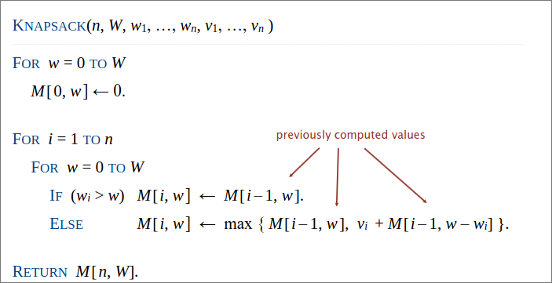
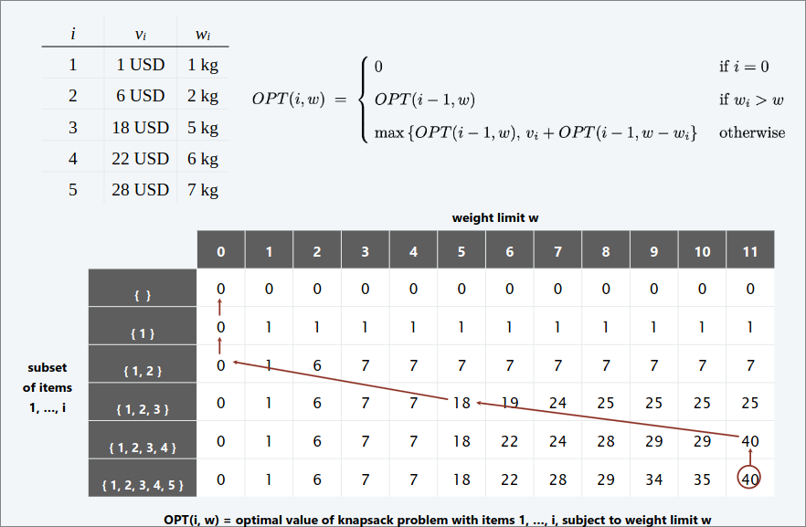

# Programmazione Dinamica III  
## Least squares  
**Foundational problem in statistics**  

+ Given $n$ points in the plane: $(x_1,y_1),...,(x_n,y_n)$.  
+ Find a line $y = ax + b$ that minimizes the sum of the squared error:  

> $SSE= \sum_{i=1}^{n} (y_i-ax_i-b)^2$   

  

**Solution** Calculus $\implies$ min error is achieved when:  

$a = \frac{n \sum_i x_i y_i-(\sum_i x_i)(\sum_i y_i)}{n \sum_i x^2_i-(\sum_i x_i)^2}, b=\frac{\sum_i y_i - a \sum_i x_i}{n}$  

## Segmented least squares  
+ Points lie roughly on a sequence of several line segments.  
+ Given $n$ points in the plane: $(x_1,y_1),...,(x_n,y_n)$ with $x_1 < x_2 < ... < x_n$, find a sequence of line minimizes $f(x)$  

**Q** What is a reasonable choice for $f(x)$ to balance accuracy (*goodness of fit*) and parsimony (*number of line*)?  

**GOAL** Minimize $f(x) = E+ cL$ for some constant $c > 0$, where:  
+ $E$ = sum of the sums of the squared errors in each segment   
+ $L$ = number of lines  

### DP  

**Notation**  
+ $OPT[j]$ = minimum cost for points $p_1,p_2,...,p_n$  
+ $e_{ij}$ = $SSE$ for points $p_i,p_{i+1},...,p_j$  

**To compute $OPT[j]$**:  
+ Last segment uses points $p_i,p_{i+1},...,p_j$ for some $i \< j$  
+ Cost = $e_{ij} + c + OPT(i-1)$  

**Bellman equation**  
$OPT(j) =$ {  

+ $0$ if $j=0$  
+ $min_{1\le i \le j}(e_{ij}+c+OPT(i-1))$  

}

  

**Theorem** DP algorithm solves the segmented least squares problem in $O(n^3)$ time in $O(n^2)$ space  

**Pf**  
Bottleneck = computing $SSE$ $e_{ij}$ for each $i$ and $j$  

$a_{ij} = \frac{n \sum_k x_k y_k-(\sum_k x_k)(\sum_k y_k)}{n \sum_k x^2_k-(\sum_k x_k)^2}, b_{ij}=\frac{\sum_k y_k - a \sum_k x_k}{n}$  

$O(n)$ to compute $e_{ij}$  

**Remark** Can be improved to $O(n^2)$ time  

+ Foreach $i$ : precompute cumulative sums $\sum_{k=1}^i x_k, \sum_{k=1}^i y_k, \sum_{k=1}^i x^2_k, \sum_{k=1}^i x_ky_k$  
+ Using cumulative sums , can compute $e_{ij}$ in $O(1)$ time.  

## Knapsack problem  

**Goal** Pack Knapsack so as to maximize total value of items taken.  
+ There are $n$ items : item $i$ provides value $v_i > 0$ and weights $w_i > 0$  
+ Value of a subset of items = sum of values of individual items   
+ Knapsack has weight limit of $W$  

**Es** The subset $\{ 1,2,5 \}$ has value $\$ 35$ (and weight 10)  
**Es** The subset $\{ 3,4 \}$ has value $\$ 40$ (and weight 11)  

**ASS** All values and weights are integral  

  

### DP False Start  

**Def** $OPT(i)=$ optimal value of Knapsack problem with items $1,...,i$  
**GOAL** $OPT(n)$  

**Case 1** $OPT(i)$ does not select item $i$  
+ $OPT$ selects best of $\{ 1,2,...,i-1 \}$  

**Case 2** $OPT(i)$ selects item $i$  
+ Selecting item $i$ does not immediately imply that we will have to reject other items  
+ Without knowing which other items were selected before $i$, we don't even know if we have enough room for $i$  

**Conclusion** Need more subproblems!  

### DP Two Variables  

**DEF** $OPT(i,w)=$ optimal value of Knapsack problem with items $1,...,i$ subject to weight limit $w$  
**GOAL** $OPT(n,W)$  

**Case 1**  $OPT(i)$ does not select item $i$  
+ $OPT(i,w)$ selects best of $\{ 1,2,...,i-1 \}$ subject to weight limit $w$  

**Case 2** selects item $i$  
+ Collect value $v_i$  
+ New weight limit = $w-w_i$  
+ $OPT(i,w)$ selects best of $\{ 1,2,...,i-1 \}$ subject to new weight limit  

**Bellman equation**  

$OPT(i,w)=$ {  
+ $0$ if $i=0$  
+ $OPT(i-1,w)$ if $w_i > w$  
+ $max(OPT(i-1,w),v_i+OPT(i-1,w-w_i))$ otherwise  

}  

  

  

**Theorem** The DP algorithm solves the Knapsack problem with $n$ items and maximum weight $W$ in $\Theta(nW)$ time and $\Theta(nW)$ space.  

**Pf**  
+ Takes $O(1)$ time per table entry  
+ There are $\Theta(nW)$ table entries  
+ After computing optimal values , can trace back to find solution:  
$OPT(i,w)$ takes $i$ i if $M[i,w] > M[i-1,w]$  

**Remarks**  
+ Algorithm depends critically on assumption that weights are integral  
+ Assumption that values are integral was not used  

### Is the running time of the DP algorithm for the Knapsack problem polynomial?  

NO beacuse $\Theta(nW)$ is not polynomial function of the input size, it's **pesudo-polynomial**  

### pesudo-polynomial  

An algorithm whose running time is polynomial in the values of the input (*es* the largest integer in the input)

