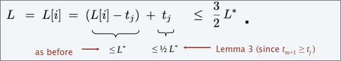

# Algoritmi di approssimazione  
### Supponiamo di dover risolvere un problema di ottimizzazione NP-difficile. Cosa dovrei fare?  
Sacrificare una delle tre seguenti caratteristiche:  
1. Esecuzioni in tempo polinomiale 
2. Risolvere istanze arbitrarie del problema  
3. Trovare la soluzione ottima al problema  

## Algortimi di $\rho$-approssimazione  
1. Esecuzioni in tempo polinomiale 
2. Risolvere istanze arbitrarie del problema  
3. Trovare la soluzione con un rapporto di approssimazione $\Rho$ rispetto all'ottimo  

### Dimostrare che il valore della soluzione è vicino all'ottimo senza conoscere il valore ottimo.  

Un algoritmo di $\alpha$-approssimazione per un problema di ottimizzazione è un algoritmo polinomiale che per tutte le istanze del problema produce una soluzione il cui valore è lontana al più un fattore $\alpha$ dal valore della soluzione ottima di quell'istanza.  

+ #### Minimization  
  + $a \geq 1$, per ogni soluzione $x$ ritornata, $cost(x)\leq \alpha OPT(x)$ 
+ #### Maximization
  + $a \leq 1$, per ogni soluzione $x$ ritornata, $cost(x)\geq \alpha OPT(x)$ 

### Load Balancing  
#### Input
$m$ macchine identiche; $n \geq m$ jobs, job $j$ ha un tempo di esecuzione $t_j$  

Il lavoro $j$ deve essere eseguito in modo contiguo su una macchina.
Una macchina può elaborare al massimo un lavoro alla volta.  

Sia $S[i]$ il sottoinsieme dei jobs assegnati alla macchina $i$.
Il **load** della macchina $i$ è $L[i] = \sum_{j \in S[i]}t_j$.  

Il **makespan** è il massimo load su qualsiasi macchina $L=max_iL[i]$

Assegna ogni job ad una macchina in modo da minimizzare il makespan  

>[!NOTE]
> Il load balancing è hard anche se m = 2 macchine  
> PARTITION $\leq_p$ LOAD BALACING  

## Algoritmo  

Consideriamo $n$ lavori in un ordine fisso.
Assegna il lavoro $j$ alla macchina $i$ il cui carico è finora il più piccolo.  

  

Usando coda con priorità che mantenga i carichi $L[k]$ $O(nlogm)$  

## Teorema  

L'algoritmo greedy è un 2-approssimazione.
+ Prima analisi del caso peggiore di un algoritmo di approssimazione.
+ Necessità di confrontare la soluzione risultante con il makespan ottimale $L'$  

Generalmente, per valutare la soluzione approssimata, bisogna confrontarla con un certo valore che è un lowerbound della soluzione ottima.

### Lemma 
Per ogni $k$ : il makespan ottimale $L' \geq t_k$ .
#### dim
La soluzione ottima deve esse maggiore uguale del tempo di processamento di un qualsiasi job $k$  

### Lemma  
Il makespan ottimo $L' \geq \frac{1}{m}\sum_{k}t_k$  
#### dim  
Il tempo totale di processamento è $\sum_{k}t_k$
Una delle $m$ macchine deve fare almeno una frazione $\frac{1}{m}$ del lavoro totale.  

## Analisi
### Teorema 
L'algoritmo greedy è un'approssimazione 2.

#### dim

Consideriamo il carico $L[i]$ della macchina con collo di bottiglia $i$ (macchina col carico maggiore, alla fine dell'algoritmo).

Sia $j$ l'ultimo lavoro pianificato sulla macchina $i$.
Quando il lavoro $j$ è stato assegnato alla macchina $i$, aveva il carico più piccolo.
Il suo carico prima dell'assegnazione è $L[i] – t_j$ ; quindi $L[i] – tj \leq L[k]$ per ogni $1 \leq k \leq m$.  
Somma le disuguaglianze su tutti i $k$ e dividi per $m$:
$L[i]-t_j \leq \frac{1}{m}\sum_{k}L[k]=\frac{1}{m}\sum_{k}t_k \leq L'$ (per il Lemma 2)  

  
## Tempo di elaborazione più lungo (LPT). 

Ordina $n$ jobs in ordine decrescente di tempo di elaborazione; quindi eseguire l'algoritmo precedente.  

### Analisi  
#### Lemma  
Se ci sono più di $m$ macchine, $L' \geq 2 t_{m+1}$  
##### dim  
Considera il tempo di elaborazione dei primi m+1 jobs $t_1 \geq t_2 \geq … \geq t_{m+1}$  
Ciascuna richieda almeno $t_{m+1}$ tempo.  
Ci sono $m + 1$ jobs e $m$ macchine, quindi per il principio della piccionaia,
almeno una macchina ottiene due jobs.    

#### Teorema
La regola LPT è un algoritmo di $\frac{3}{2}$-approssimazione.
##### dim

Considerare il carico $L[i]$ della macchina con collo di bottiglia $i$.
Supponiamo che $j$ sia l'ultimo job schedulato sulla macchina $i$  
  

L'analisi non è stretta  
#### Teorema
La regola LPT è un algoritmo di $\frac{4}{3}$-approssimazione.

