# Alcune applicazioni del max-flow e min-cut  

## Accopiamenti bipartiti  

Dato un grafo non orientato $G=(V,E)$, un sottoinsieme degli archi $M \subseteq E$ è un accoppiamento se ogni nodo appare in al più un arco in $M$.  

#### Obiettivo  
Dato $G$, trovare un accoppiamento di cardinalità massima  

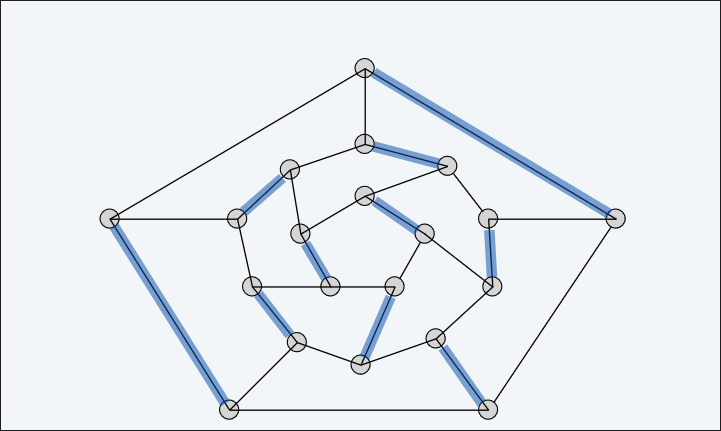  

Un grafo $G$ è bipartito se i nodi possono essere partizionati in due sottoinsiemi $L$ e $R$ tale che ogni arco connettono un nodo in $L$ con un nodo in $R$.    
#### Obiettivo
Dato $G=(L \cup U, E)$ bipartito, trovare un accoppiamento di cardinalità massima.  
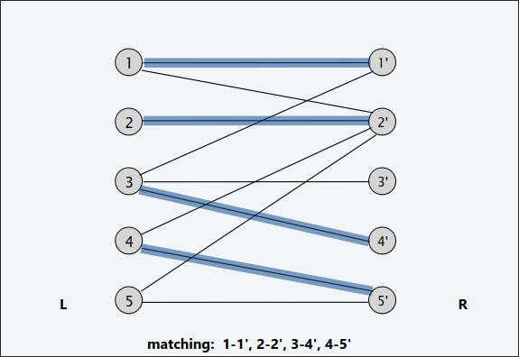  
### Accoppiamenti perfetti  (in grafi bipartiti)
Dato un grafo $G=(V,E)$, un sottoinsieme degli archi $M \subseteq E$ è un accoppiamento perfetto se ogni nodo appare in esattamente un arco in $M$  

Dato un grafo bipartito $G=(L \cup R, E)$ trova un accoppiamento perfetto o riporta correttamente che non esiste eventualmente.  

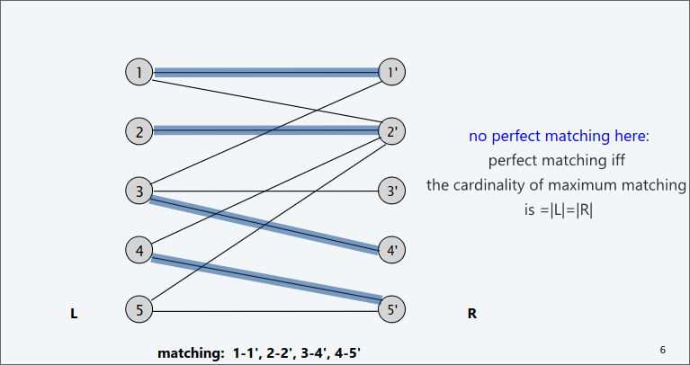  

### Formulazione per il max-flow  
1. Crea un grafo $G'=(L \cup R \cup \set{S,T},E')$ diretto
2. Inidirizza tutti gli archi da $L$ a $R$ e assegna a questi archi capacità infinita.  
3. Aggiungi archi di capacità 1 da $s$ a $L$  
4. Aggiungi archi di capacità 1 da $R$ a $t$  

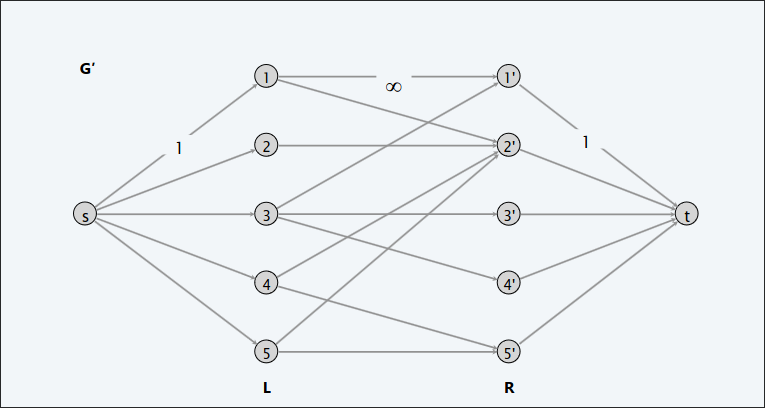  
### Prove di correttezza 

#### Teorema  
C'è una corrispondenza $1-1$ tra gli accoppiamenti di cardinalità $k$ in $G$ e flusso intero di valore $k$ in $G'$
##### dim  
$(\implies)$  

Dato un accoppiamento $M$ in $G$ di cardinalità $k$, considera il flusso $f$ che invia $1$ unità ad ognuno dei $k$ percorsi corrispondenti. Dunque $f$ è un flusso di valore $k$ (perché il flusso che passa negli archi da $s$ a $L$ è al più di un'unità e viene inoltrato verso i $k$ percorsi in $G$).  

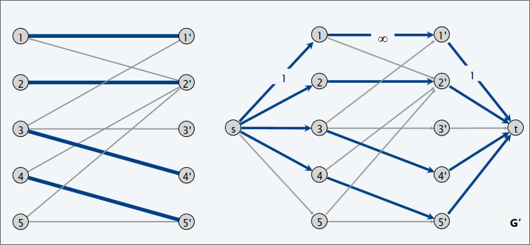  

$(\impliedby)$  

Dato $f$ un flusso intero in $G'$ di valore $k$. Considera $M$ come l'insieme di archi da $L$ a $R$ con $f(e)=1$ in $G'$:
+ Ogni nodo in $L$ e $R$ partecipa in al più un arco in $M$ (questo perché il flusso che arriva ad un nodo è al più uno, quindi è impossibile che da un nodo in $L$ vengano inviati due unità di flusso ad un nodo in $R$)  
+ In più $|M|=k$ basta applicare il flow lemma sul taglio $(L \cup \set{s}, R \cup \set{t})$ che dice che il flusso netto nel taglio è uguale al valore del flusso, ovvero $k$  

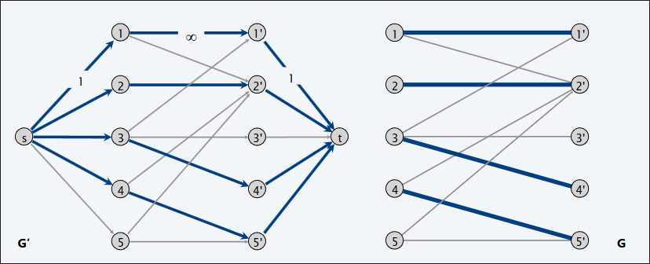   

#### Corollario
Puoi risolvere il problema dell'accoppiamento bipartito attraverso la formulazione del max-flow  
##### dim  
+ Teorema interabilità $\implies$ esiste un flusso massimo $f'$ in $G'$ intero  
+ La corrispondenza $1-1 \implies$ $f'$ corrisponde alla massima cardinalità dell'accoppiamento  

### Tempo di esecuzione  

Con Ford&Fulkerson: $\leq n$ aumenti $\implies O(m\ n)$ passi  

## Cammini archi disgiunti  

Due cammini sono **archi disgiunti** se non hanno archi in comune  

#### Obiettivo  
Dato un digrafo $G=(V,E)$ e due nodi $s,t$ trova il massimo numero di cammini da $s$ a $t$ di archi disgiunti  

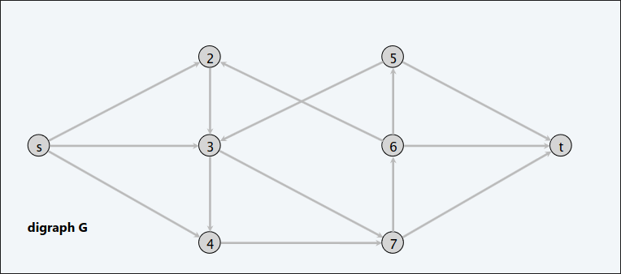  
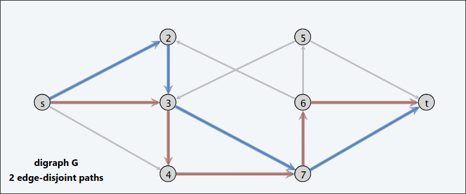  

### Formulazione per il max-flow  

Assegna capacità $1$ ad ogni arco  
#### Teorema  
C'è una corrispondenza $1-1$ tra i $k$ percorsi da $s$ a $t$ con archi disgiunti in $G$ e il flusso intero di valore $k$ in $G'$  +
##### dim  
$(\implies)$  
+ Dato $P_1,...,P_k$ $k$ percorsi da $s$ a $t$ ad archi disgiunti in $G$.  
+ Imposta $f(e)=\set{1 \iff \text{ arco e partecipa in un qualche percorso Pj}\ \land \ 0 \text{ altrimenti}}$.
+ Poiché i cammini sono disgiunti per archi, f è un flusso di valore k.  

Con $k$ cammini disgiunti e portando flusso negli archi che partecipano in questi cammini disgiunti ovviamente il numero di percorsi è uguale al valore del flusso che parte da $s$.  

$(\impliedby)$  
+ Dato $f$ un flusso intero in $G'$ di valore $k$  
+ Considera l'arco $(s,u)$ con $f(s,u)=1$:
  + per la conservazione del flusso  esiste un arco $(u,v)$ con $f(u,v)=1$
  + continua fino a quando raggiungi $t$, scegliendo sempre un nuovo arco  
+ Produci $k$ (non necessariamente semplici) percorsi con archi disgiunti 

#### Corollario
Puoi risolvere il problema dei percorsi ad archi disgiunti attraverso la formulazione del max-flow  
##### dim  
+ Teorema interabilità $\implies$ esiste un flusso massimo $f'$ in $G'$ intero  
+ La corrispondenza $1-1 \implies$ $f'$ corrisponde al massimo numero di percorsi da $s$ a $t$ ad archi disgiunti in $G$.  

### Tempo di esecuzione  

Con Ford&Fulkerson: $\leq n$ aumenti $\implies O(m\ n)$ passi    

## Segmentazioni immagini  

  

### Segmentazione foreground / background  
+ Etichetta ogni pixel nella figura come se appartenesse al foreground o al background
+ $V$ insieme di pixel, $E$ coppie di pixels vicini
+ ad ogni pixel associo due valori:
  + $a_i \geq 0$ è la probabilità che il pixel $i$ sia nel foreground  
  +  $b_i \geq 0$ è la probabilità che il pixel $i$ sia nel background   
+ ad ogni vicino $i,j$ associo $p_{ij}$ ovvero una penalità di separazione etichettando uno tra $i ,j$ come foreground e l'altro come background    

Se $a_i > b_i$ meglio etichettare $i$ in foreground  
Se i vicini di $i$ si trovano nel foreground probabilmente anche $i$ si trova nel foreground  

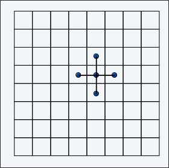

#### Obiettivo 
Trovare una partizione $(A,B)$ , dove $A$ è il foreground e $B$ il background, che massimizza:  
$\sum_{i \in A}a_i \ + \ \sum_{j \in B}b_j-\sum_{(i,j)\in E \land |A \cap\set{i,j}|=1}p_{ij}$  

Per massimizzare questa funzione obiettivo, devo scegliere dove inserire i pixels $i,j$ minimizzando la penalità se scelgo di mettere $i$ in una partizione e $j$ in un'altra.    

**L'idea è di formulare il problema come  problema min-cut**

## Formulazione min-cut

Il nostro problema:
+ è di massimizzazione
+ non ha sorgenti o destinazioni
+ E' un grafo non diretto (la matrice di pixel)  

Trasformiamo dunque il problema di massimizzazione, in un problema di minimizzazione  

$MAX \ \sum_{i \in A}a_i \ + \ \sum_{j \in B}b_j-\sum_{(i,j)\in E \land |A \cap\set{i,j}|=1}p_{ij}$  

$MIN \ -\sum_{i \in A}a_i \ - \ \sum_{j \in B}b_j+\sum_{(i,j)\in E \land |A \cap\set{i,j}|=1}p_{ij}$  

$MIN \ (\sum_{i \in V}a_i \ + \ \sum_{j \in V}b_j)-\sum_{i \in A}a_i \ - \ \sum_{j \in B}b_j+\sum_{(i,j)\in E \land |A \cap\set{i,j}|=1}p_{ij}$ 

Aggiungo una costante che non dipende dalla partizione , sto aggiungendo una stessa quantità ad ogni possibile soluzione, questo per ottenere

$MIN \ \sum_{j \in B}a_j \ + \ \sum_{i \in A}b_i+\sum_{(i,j)\in E \land |A \cap\set{i,j}|=1}p_{ij}$  

Alla fine sto semplicemente dicendo che massimizzare ad esempio la somma degli $a_i$ quindi guadagnare $a_i$ e come minimizzare la somma dei $b_i$ quindi perdere $b_i$.  

Ora creiamo il grafo  

+ Aggiungo un nodo per ogni pixel  
+ Per ogni nodo ho archi bidirezionali invece degli archi non orientati pesati con $p_{ij}$
+ Aggiungo una sorgente $s$ che corrisponde al foreground
+ Aggiungo una destinazione $t$ che corrisponde al background  

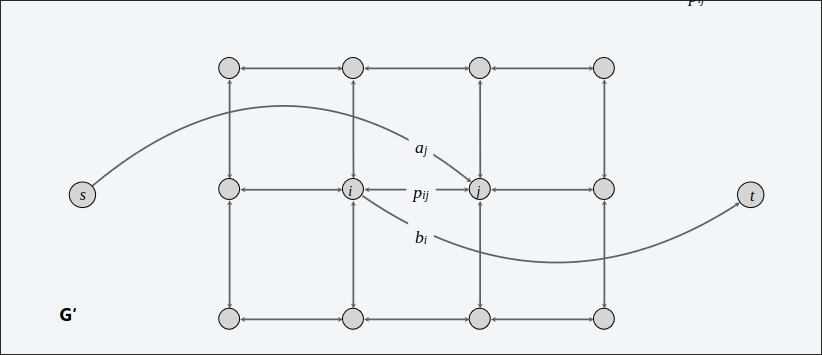  

Considera il minimo taglio $(A,B)$ in $G'$, ove $A$ corrisponde al foreground.  

$cap(A,B)= \sum_{j \in B}a_j \ + \ \sum_{i \in A}b_i+\sum_{(i,j)\in E \land |A \cap\set{i,j}|=1}p_{ij}$  

Precisamente la quantità che volevamo minimizzare!  

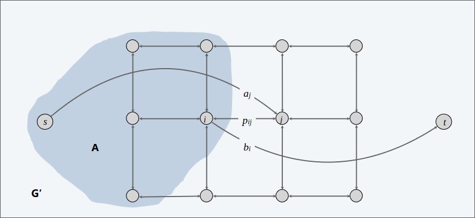  

Gli archi da $s$ verso tutti i nodi hano peso $a_j$ gli archi da tutti i nodi verso $t$ hanno peso $b_i$, ogni arco tra i nodi hanno peso $p_{ij}$ voglio trovare un $st$-cust che minimizza il più possibile $cap(A,B)$.
## Eliminazione baseball

### Quale team ha ancora possibilità di finire il campionato col maggior numero di vittorie?  

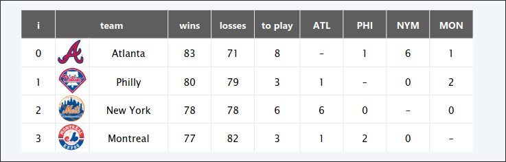  

**MONTREAL è matematicamente eliminato**
+ Montreal finisce con al più 80 vittorie 
+ Atlanta già ne ha 83
**PHILLY è matematicamente eliminato**
+ Philly finisce con al più 83 vittorie
+ Una tra NY o Atlanta finirà con almeno 84 vittorie.  

### Classifica corrente (input)
+ Insieme $S$ di teams
+ Squadra distinta $z \in S$
+ Squadra $x$ ha già vinto $w_x$ partite già
+ Squadra $x$ e $y$ si affrontano $r_{xy}$ volte aggiuntive  

#### Obiettivo
Data la classifica corrente , c'è qualche risultato delle partite rimanenti in cui la squadra $z$ finisce con il maggior numero di (o pareggio per la maggior parte) vittorie?  

### Formulazione max flow  

#### Può il team 4 vincere?   
Assumiamo che il team 4 vince tutte le partite dunque $w_4+r_4$ vittorie.  
Dividiamo le partite rimanenti in modo che tutte le squadre abbiano al più $w_4+r_4$ vittorie.  

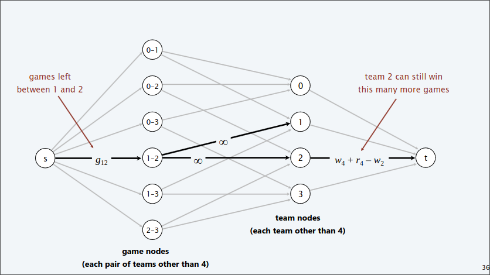  

Nella seconda "colonna" di nodi vi sono tutte le coppie di team che devono affrontarsi nelle rimanenti partite (non mettiamo 4 perché stiamo assumendo che le vince tutte). Aggiungiamo un nodo $s$ collegato a tutti i nodi nella colonna con archi pesati con valore $g_{ij}$ (nell'esempio $g_{12}$) ovvero il numero di partite che devono effettuare uno contro l'altro i teams $i$ e $j$.  
Nella terza colonna ci sono i teams. Da un nodo nella seconda colonna vi è un arco verso un nodo della terza colonna se questo nodo corrisponde ad un team indicato dalla coppia da cui parte l'arco (nell'esempio dal nodo $(1,2)$ partono due archi verso il nodo del team $1$ e del team $2$). Infine i nodi dei team nella terza colonna hanno un arco verso un nodo $t$. Peso questi archi in modo tale da vincolare la soglia di vittorie che possono fare i team (nella figura peso in quel modo l'arco ovvero con capacità $w_4+r_4-w_2$ in modo tale da vincolare il numero di vittorie di $2$ che non deve superare $w_4+r_4$).

#### Teorema  
Team 4 non è eliminato se e soltanto se il massimo flusso satura tutti gli archi che escono da $S$  
##### dim  
+ Teorema di integralità $\implies$ ogni gioco rimanente tra $x$ e $y$ aggiunge un
numero di vittorie per la squadra $x$ o la squadra $y$  
+ Capacità degli archi $(x,y)$ assicurano che nessuna squadra vinca troppe partite.  

Se c'è  un arco che lascia $s$ non saturato ma non riesco più a spinegere flusso perché gli archi che vanno verso $t$ sono saturi , significa che la coppia di teams nel nodo collegato all'arco non saturo può ancora effettuare una partita, e uno dei due può superare il numero di vittorie del team 4.2