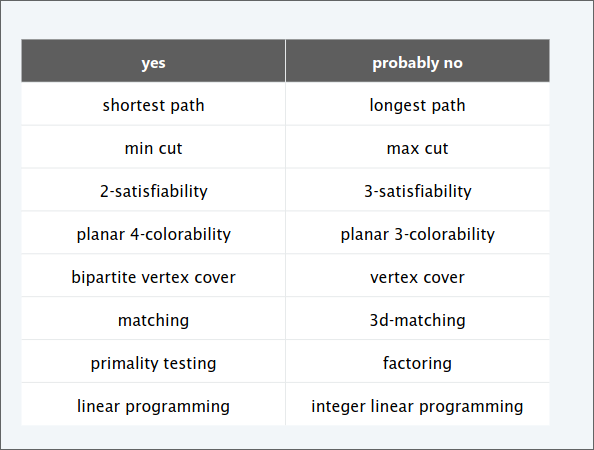
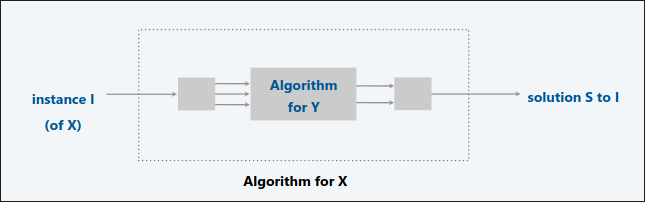
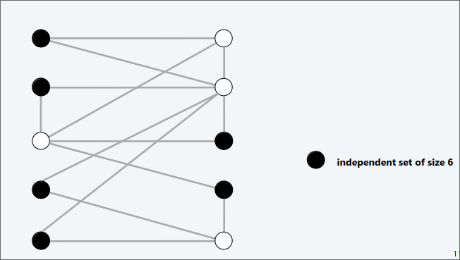
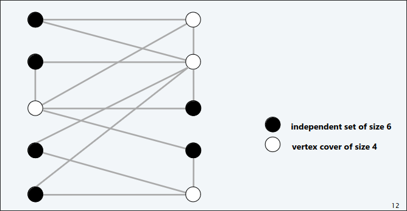
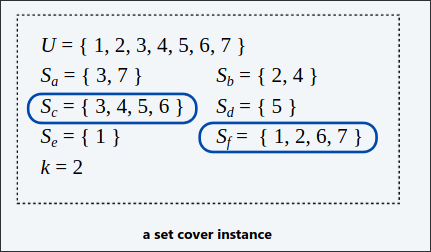
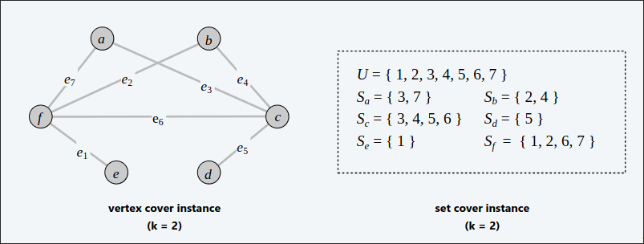
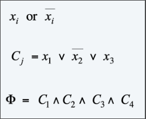
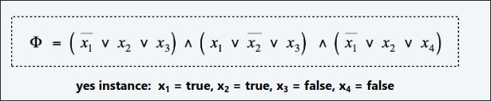
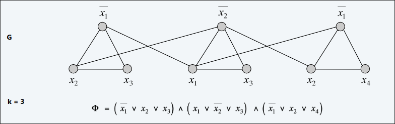

# Intrattabilità  

### Quali problemi siamo in grado di risolvere in pratica?

Di seguito alcuni problemi polinomiali

  

## Classificare i problemi

### Goal
Classificare i problemi in base a quelli che possono essere risolti in tempo polinomiale e quelli che non possono esserlo.  

## Riduzioni polinomiali  
#### Goal

Supponiamo di poter risolvere il problema Y in tempo polinomiale. Cos’altro potremmo risolvere in tempo polinomiale?  

Il problema $X$ si riduce polinomialmente al problema $Y$ se istanze arbitrarie del problema $X$ possono essere risolte utilizzando:
+ Numero polinomiale di passi di calcoli standard
+ Numero polinomiale di chiamate all'oracolo che risolve il problema Y.

  

>[!NOTE]
> Notazione: $X \leq_p Y$  
> Noi paghiamo il tempo per riscrivere le istanze di $Y$ da inviare all'"oracolo". Le istanze di $Y$ devono avere dimensione polinomiale.  

>[!IMPORTANT]
> Se $X \leq_p Y$ e $Y$ può essere risolto in tempo polinomiale,
allora $X$ può essere risolto in tempo polinomiale.
> Se $X \leq_p Y$ e $X$ non può essere risolto in tempo polinomiale,
allora $Y$ non può essere risolto in tempo polinomiale.  
> Se $X \leq_p Y$ e $Y \leq_p X$ noi usiamo la notazione $X \equiv_p Y$. In questo caso $X$ può essere risolto in tempo polinomiale se e soltanto se $Y$ anche.  

## INDIPENDENT SET

Dato un grafo $G=(V,E)$ e un intero $k$ trovare un sottoinsieme di $k$ nodi tale che non ci sono coppie adiacenti.  

  

## VERTEX COVER

Dato un grafo $G=(V,E)$ e un intero $k$ trovare un sottoinsieme di $k$ nodi tale che ogni arco è incidente ad un nodo in nel sottoinsieme.  

  

### Teorema  

$IS \equiv_p VC$  

#### dim  

Noi mostriamo che $S$ è un IS di dimensione $k$ se e soltanto se $V-S$ è un VC di dimensione $n-k$  

$(\implies)$  

Dato $S$ IS di dimensione $k$, l'insieme $V-S$ è di dimensione $n-k$.  
Considerato un arco arbitrario $(u,v) \in E$. 
$S$ è un IS $\implies$ $u \notin S \ \lor v\notin S $ oppure $u \in V-S \ \lor \ v\in V-S$. Dunque $V-S$ copre l'arco $(u,v)$   

$(\impliedby)$  

Dato $V-S$ un qualsiasi VC di dimensione $n-k$. l'insieme $S$ è di dimensione $k$.  
Considerato un arco arbitrario $(u,v) \in E$. 
$V-S$ è un VC $\implies$ $u \in V-S \ \lor \ v\in V-S$ oppure $u \notin S \ \lor v\notin S $. Dunque $S$ è un IS  

## SET COVER  

Dato un insieme $U$ di elementi, una collezione $S$ di sottoinsiemi di $U$ e un intero $k$, ci sono al più $k$ sottoinsiemi la quale unione è uguale a $U$.  

  

### Teorema  
$VC \leq_p SC$  
#### dim  
Dato un'istanza di $VC$, costruiamo un'istanza di $SC$, $(U,S,k)$ per cui vi è un $SC$ di dimensione $k$ se e soltanto se $G$ ha un $VC$ di dimensione $k$.  

##### Costruzione  

+ $U=E$ (Ovvero ogni elemento è rappresentato da un'arco nel grafo di $VC$)  
+ Includi un sottoinsieme per ogni nodo $v \in V: S_v=\set{e\in E:e \text{  è incidente in }v}$  

  

#### Lemma
$G=(V,E)$ contiene un $VC$ di dimensione k $\iff$ $(U,S,k)$ contiene un $SC$ di dimensione $k$
##### dim  
$(\implies)$
Dato $X \subseteq V$ un $VC$ di dimensione $k$, allora $Y=\set{S_v: v\in X}$ è un $SC$ di dimensione $k$  

$(\impliedby)$
Dato $Y \subseteq S$ un $SC$ di dimensione $k$ in $(U,S,k)$, allora $X=\set{v:S_v\in Y}$ è un $VC$ di dimensione $K$ in $Gz$  

## SAT  
### Letterali  
Una variabile booleana  

#### Clausola  
Una disgiunzione dei letterali   
#### CNF  
Una formula proposizionale $\phi$ che è una congiunzione di clausole   

Data una formula in CNF $\phi$, vi è un'assegnazione di verità che soddisfa $\phi$  

>[!IMPORTANT]
>3SAT: SAT dove le clausole contengono esattamentre 3 letterali diversi  
>   

### $3SAT \leq_p IS$  
Data un'istanza $\phi$ di $3SAT$ noi costruiamo un'istanza $(G,k)$ di $IS$ tale che ha un IS di dimensione $k=|\phi| \iff \phi$ è soddisfacibile  

#### Costruzione  
+ $G$ contiene 3 nodi per ogni clausola, uno per ogni letterale  
+ Connetti tre letterali in una clausola in un triangolo  
+ Connetti i letterali con ogniuna delle loro negazioni  

#### Lemma
$\phi$ è soddisfacibile $\iff$ $G$ ha un IS di dimensione $k=|\phi|$  
##### dim  
$(\implies)$  

Considera un qualsiasi assegnamento che soddisfa $\phi$:  
+ Seleziona un letterale vero da ogni clausola (triangolo)  
+ Questo è un IS di dimensione $|\phi|$  

Facile ho un nodo per ogni clausola nell'IS, se prendo un nodo vero, siccome ho archi solo con i corrispettavi negati nelle altre clausole, non possono esserci nodi adiacenti .  

$(\impliedby)$  

Dato $S$ un IS di dimensione $k$:
+ $S$ contiene esattamente un nodo per ogni clausola  
+ Imposta quei letterali come veri (e i rimanenti coerenti) 
+ Tutte le clausole in $\phi$ sono soddisfatte.

  

