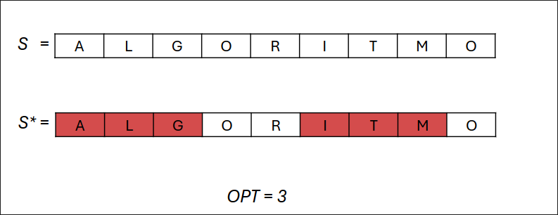
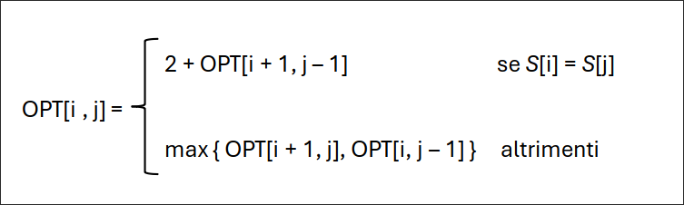
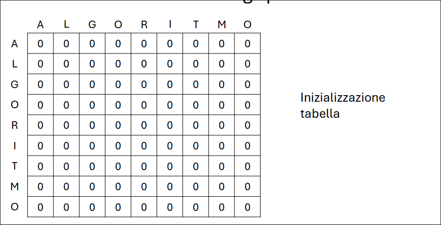
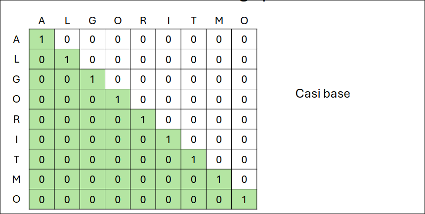
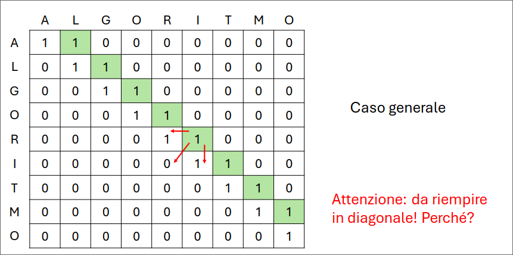
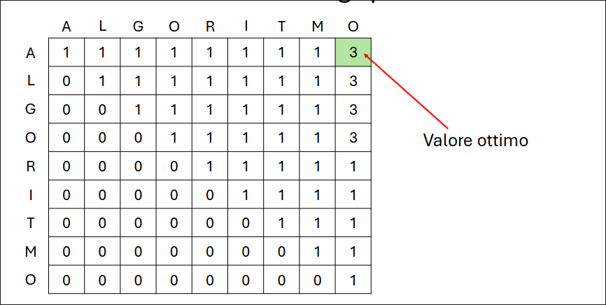
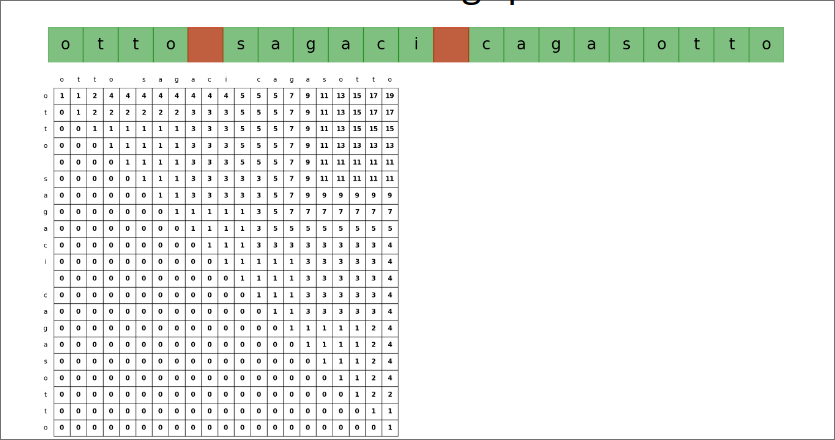
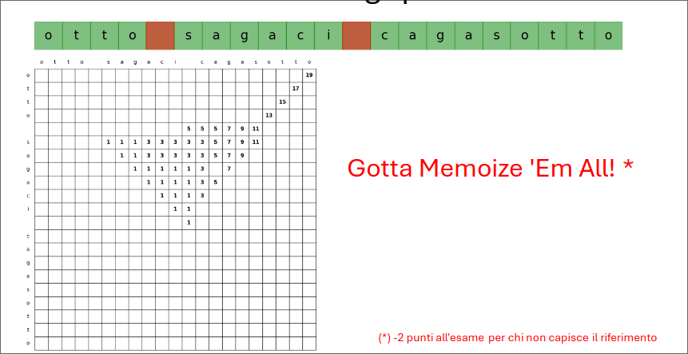

# Esercitazione PD  
## Massima sottostringa palindroma  
### Input  
Una stringa $S$ di $n$ caratteri  
### Goal 
Eliminare da $S$ dei caratteri (anche nessuno) in modo tale che la sottostringa risultante $S'$ sia palindroma e di lunghezza massima.  
### OPT  
Massima lunghezza sottostringa palindroma  
  

$OPT[i,j]$ = massima lunghezza della sottostringa palindroma di $S[i,..,j]$  

### Caso base  
+ $if\  i > j \rightarrow OPT[ i, j ] = 0$
+ $OPT[ i, i ] = 1$  

### Soluzione  
$OPT[1,n]$  

### Bellman Eq  

  

La prima parte, se due estremi sono uguali, mi conviene metterli nella soluzione sommando l'ottimo che ho nel mezzo della sequenza data dai due estremi.  
Altrimenti se scarto $i$ prendo l'ottimo tra $i+1$ e $j$ e se scarto $j$ prendo l'ottimo da $i$ a $j-1$.  




  

**TEMPO:** $O(n^2)$  

```python  
def opt(s:str)->int:
    n=len(s)
    M=[[0]*n for _ in range(n)]
    for i in range(n):
        M[i][i]=1  
    for d in range(1,n):
        for i in range(n-d): # scorrimento in diagonale  
            j=i+d
            if s[i]==s[j]:
                M[i][j]=2+M[i+1][j-1]
            else:
                M[i][j]=max(M[i+1][j],M[i][j-1])  
    return M[0][n-1]  
```

### Ma dobbiamo riempire veramente tutta la tabella?  

  

Tante celle vuote sono inutilizzate, riempiamo solo quelle necessarie  

  

```python
def opt(s:str,i:int,j:int,cache:dict=dict())->int:
    if (i,j) in cache:
        return cache[i,j] 
    if i > j:
        cache[i,j]=0
    elif i==j:
        cache[i,j]=1
    else:
        if s[i]==s[j]:
                cache[i][j]=2+opt(s,i+1,j-1,cache)
            else:
                cache[i][j]=max(opt(i+1,j,cache),opt(s,i,j-1,cache))  
    return cache[i,j]  
```
### Come trovare la soluzione  
```python
def solution(s:str,OPT:dict,i:int,j:int)->str:
    if i>j:
        return ""  
    elif i==j:
        return s[i]  
    elif s[i]==s[j]:
        return s[i]+solution(s,OPT,i+1,j-1)+s[j]
    elif OPT[i+1,j] > OPT[i,j-1]:
        return solution(s,OPT,i+1,j)
    else:
        return solution(s,OPT,i,j-1)
```