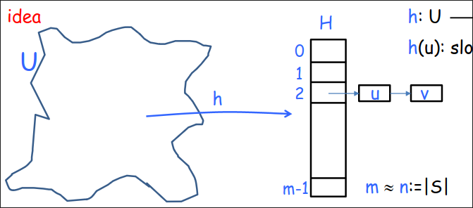

# Tabelle Hash  
## Il problema del dizionario  
Dato un universo $U$ di possibili elementi, mantieni un sottoinsieme $S \subseteq U$ sulla quale è possibile eseguire le seguenti operazioni:  
+ **make-dictionary()**: Inizializza un dizionario vuoto
+ **insert(u)**: Aggiunge un elemento $u \in U$ a $S$
+ **delete(u)**: Elimina $u$ da $s$, se $u$ è in $S$
+ **look-up(u)**: Determina se $u$ è in $S$  

Universo $U$ può essere enormemente grande quindi definire un array di dimensione $|U|$ è inammisibbile  

Una soluzione: $AVL$ o le hash tables (spazio $O(S)$ e tempo $O(1)$).  

#### idea  
**$h: U \rightarrow \set{0,1,...,m-1}$** dove $h(u)$ è la cella dove viene messo $u$.  
  

>Definiamo come collisione la situazione in cui $h(u)=h(v)$ e $v \neq u$  
>$H[i]=$ linked list di tutti gli elementi di $h$ mappati nello slot $i$  
> Insert,delete,search $u$ avvengono computando $h(u)$ e scandendo la lista $H[h(u)]$  

#### Goal  
Trovare una funzione $h$ che spartisca gli elementi.  

Per qualsiasi funzione hash deterministica si può trovare un insieme $S$ dove tutti gli elementi di $S$ sono mappati sullo stesso slot $\implies \Theta(n)$ operazioni  

L'obiettivo è trovare una funzione $h$ di hash tale che rispetti le seguenti caratteristiche:
  1. Deterministica: La stessa chiave deve produrre lo stesso indice.
  2. Uniforme: Le chiavi devono essere distribuite uniformemente nell'array per minimizzare le collisioni.
  3. Veloce da calcolare: Dovrebbe essere computazionalemente efficiente per garantire l'accesso rapido.  

Una famiglia $\mathcal{H}$ di funzioni hash è **universale** se:  
per ogni $u,v \in U ,\ v \neq u \ Pr_{h\in\mathcal{H}}(h(u)=h(v))\leq \frac{1}{m}$ Ovvero se la probabilità che che una funzione di hash inserisca due caratteri diversi nella stessa linked list è $\leq \frac{1}{m}$.  

#### Teorema  
Sia $\mathcal{H}$ una famiglia di funzioni hash universali. Sia $S\subseteq U$ di $n$ elementi. Dato $u \in S$. Scegli una funzione casuale $h$ da $\mathcal{H}$ e sia $X$ la variabile aleatoria che conta il numero di elementi di $S$ mappati su $h(u)$. Allora $E[X] \leq 1+ \frac{n}{m}$