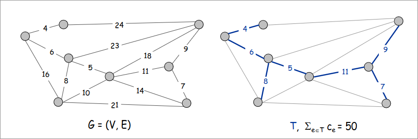
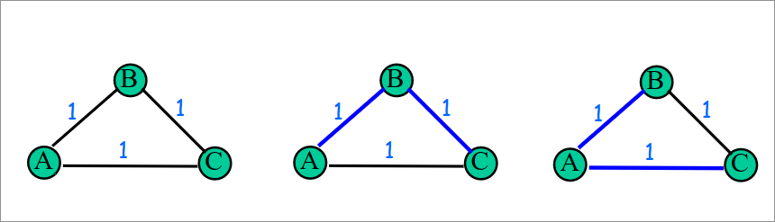
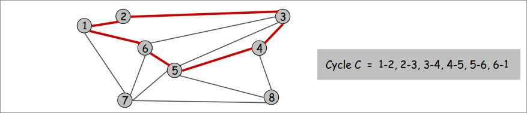
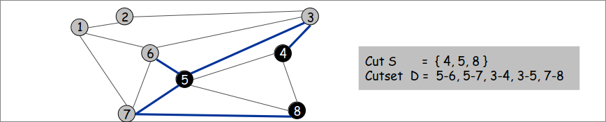
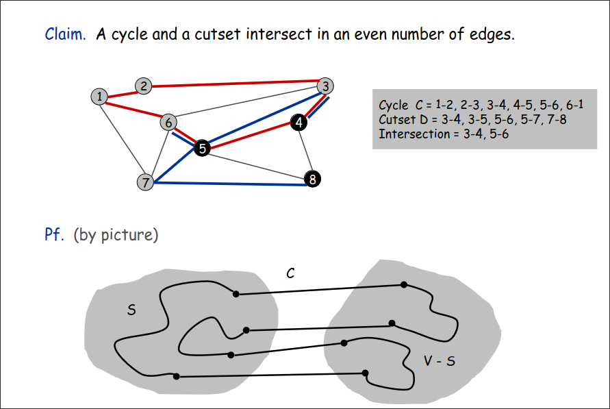
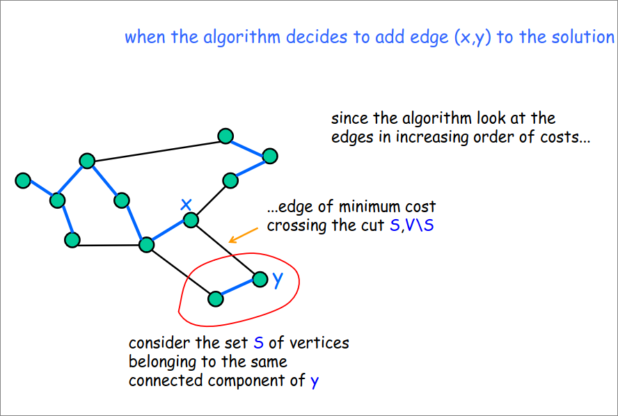
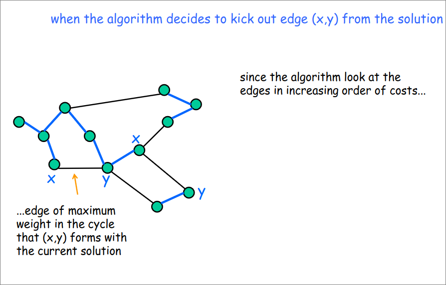
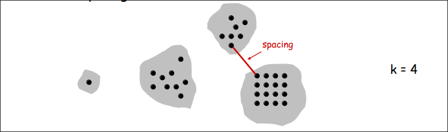

# Minimum Spanning Tree 
Dato un grafo connesso non orientato $G=(V,E)$ archi pesati con valori reali $c_e$, un MST è un sottoinsieme degli archi $T \subseteq E$ tale che $T$ è uno spanning tree la cui somma dei pesi degli archi è minimizzata.  

  

>[!IMPORTANT]
>Ci sono $n^{n-2}$ spanning tree di $K_n$ (dunque non si possono usare algoritmi **brute force**)   

#### *INPUT*  
1. Un grafo non orientato, connesso e pesato $G=(V,E)$ con archi pesati con valori reali $c_e$

#### *SOLUZIONE POSSIBILE*
1. Uno spanning tree $T$ di $G$

#### *MISURA DA OTTIMIZZARE*  
1. Peso (o costo) di $T$  

## Unicità del MST  
  
L'MST non è unico in generale  

> [!IMPORTANT] 
> Se $G$ ha pesi distinti allora MST è unico    

## Cicli e tagli  
Un **ciclo** è un insieme di archi della forma $a-b,b-c,c-d,...,y-z,z-a$  
  

Un **taglio** è una partizione di $V$ in $S$ e $V \backslash S$   
Il corrispondente **cutset** $D$ di un taglio $S$ è un sottoinsieme di archi con esattamente un endpoint in $S$  
  

>[!IMPORTANT]  
> L'intersezione di un ciclo e un cutset è composto da un numero pari di archi  
>   
> Data una partizione in $V$ (**taglio**), $S$ e $V \backslash S$, nel caso il ciclo prenda i soli nodi di una delle due partizioni, allora l'intersezione è vuota. Ma nel caso prenda dei nodi in $S$ e dei nodi in $V \backslash S$ allora vi è un arco che da $S$ va in $V \backslash S$ e un altro che va da $V \backslash S$ in $S$, siccome vi è un ciclo che deve "chiudersi".  

### Proprietà taglio e ciclo

#### Proprietà del taglio
Dato $S$ un qualsiasi sottoinsieme dei nodi e dato $e$ un arco di costo minimo con esattamente un endpoint in $S$. Allora esiste un MST $T^*$ che contiene $e$.  
##### dim
+ Supponiamo che $e$ non sia in $T^*$. 
+ Aggiungere $e$ a $T^*$ crea un ciclo $C$ in $T^*$.
+ L'arco $e$ è sia nel ciclo $C$ che nel cutset $D$ corrispondente a $S$, allora esiste un altro arco $f$ che è sia nel ciclo $C$ che in $D$.  
+ $T'=T^* \cup \set{e}-\set{f}$ è anche uno spanning tree.  
+ Siccome $c_e \leq c_f$ (da ipotesi $e$ ha costo minimo), $cost(T')\leq cost(T^*)$.  
+ Dunque $T'$ è un MST contenente $e$  
#### Proprietà del ciclo  
Dato $C$ un qualsiasi ciclo in $G$ e dato $f$ l'arco di peso massimo appartenente a $C$. Allora esiste un MST $T^*$ che non contiene $f$.  
##### dim  
+ Supponiamo che $f$ sia in $T^*$. 
+ Eliminando $f$ da $T^*$ creiamo un taglio $S$in $T^*$.  
+ L'arco $f$ è sia nel ciclo $C$ che nel cutset $D$ corrispondente a $S$, allora esiste un altro arco $e$ che è sia nel ciclo $C$ che in $D$.  
+ $T'=T^* \cup \set{e}-\set{f}$ è anche uno spanning tree.  
+ Siccome $c_e \leq c_f$ (da ipotesi $e$ ha costo minimo), $cost(T')\leq cost(T^*)$.  
+ Dunque $T'$ è un MST non contenente $f$  

## Algoritmo di Kruskal  
Inizia con $T$ vuoto. Considera archi in ordine crescente di costo. Inserisce l'arco $e$ in $T$ fino a quando non si crea un ciclo.  

> [!IMPORTANT] 
> Un efficiente implementazione dell'algoritmo di Kruskal utilizza la UnionFind:  
> + Per mantenere le componenti connesse della soluzione corrente
> + Per controllare se gli archi correnti formano un ciclo  

```
algoritmo Kruskal (graph G=(V,E,w))
    UnionFind UF  
    T=empty
    ordina gli archi in ordine crescente di costo 
    foreach vertice v do UF.makeSet(v)
    foreach arco (x,y) in ordine do  
        Tx=UF.find(x)
        Ty=UF.find(y)
        if Tx != Ty then
            UF.union(Tx,Ty)
            aggiungi arco (x,y) in T
    return T
```
### Correttezza per proprietà del taglio


Quando l'algoritmo sta decidendo se aggiungere nell'albero l'arco $(x,y)$, siccome gli archi sono ordinati in modo crescente, l'arco $(x,y)$ è sicuramente quello minimo che attraversa il taglio $S$ individuato dalla componente connessa di $y$.

### Correttezza per proprietà del ciclo

  

Se aggiungessimo l'arco $(x,y)$ ,scartato dall'algoritmo, nell'albero MST, quello formerebbe un ciclo siccome $x$ e $y$ si trova nella stessa componenente connessa, siccome l'algoritmo considera gli archi in ordine crescente di peso, l'arco $(x,y)$ sarebbe l'arco di peso massimo in quel ciclo, dunque l'algoritmo (per la proprietà del ciclo) correttamente decide di scartarlo.  

### Complessità  
$O(m \ logn \ + UF(m,n))$  
+ Usando QuickFind con union by size :$O(m \ logn \ + m+ n\ logn)=O(m \ logn)$
+ Usando QuickUnion con union by size :$O(m \ logn \ + n\ logn+ n) =O(m \ logn)$

## Algoritmo di Prim  
Inizia con un qualunque nodo radice $s$ e in modo greedy forma l'albero $T$ da $s$ verso gli altri nodi. Ad ogni passo, aggiunge l'arco più economico $e$ a $T$ che ha esattamente un endpoint in $T$  

```
Prim(G, s):
foreach (v in V) a[v]= inf
a[s]=0
Inizializza una coda con priorità vuota Q
foreach (v in V) inserisci v in Q con priorità a[v]
S = empty
T = empty
while (Q is not empty) {
    u = delete min element da Q
    S=S+{ u }
    foreach (arco e = (u, v) incidente a u)
        if ((v not in S) and (c_e < a[v]))
            fai u padre di v in T
            decrease priority a[v] to c_e
return T
```

### Correttezza
Immediata conseguenza della proprietà del taglio, usata esattamente $n-1$ volte.  
### Complessità  
$O(m+n\ logn)$ con heap di fibonacci  

## Clustering  
Dato un insieme $U$ di $n$ oggetti etichettati $p_1,...,p_n$, classificarli in gruppi coerenti  

La **funzione di distanza** è un valore numerico che specifica la "vicinanza" di due oggetti  

#### $k$-clustering: 
Dividere oggetti in $k$ gruppi non vuoti  
>[!NOTE]
>La funzione di distanza deve soddisfare rigide proprietà:  
>1. $d(p_i,p_j)=0 \iff p_i=p_j$
>2. $d(p_i,p_j)\geq 0$
>3. $d(p_i,p_j)=$(p_j,p_i)$ 

Lo **spacing** è la minima distanza tra una coppia di oggetti in clusters differenti.

Dato un intero $k$, trovare un $k$-clustering  che massimizza lo spacing  
  

### Single-linkage k-clustering algorithm  

1. Crea un grafo con insieme di vertici $U$, corrispondenti agli $n$ clusters;  
2. Trova la coppia di oggetti tra loro più vicini, tale che ogni ogni oggetto è in un clusters diverso, e aggiungi un arco tra loro;
3. Ripeti $n-k$ volte fino a che ci sono esattamente $k$ clusters.  
   
> [!IMPORTANT]
> La procedura è precisamente l'algoritmo di Kruskal (eccetto che si ferma appena si hanno 4 componenti connesse).
> Equivalentemente possiamo trovare un MST ed eliminare k-1 archi più "costosi".  

>[!NOTE]
> Eseguendo l'algortimo di Kruskal fino alla fine, implicitamente produce un Clustering Gerarchico.  

### Teorema  
Dato $C^*$ il clustering $C^*_1,...,C^*_k$ formato eliminando i $k-1$ archi del MST più "costosi". $C^*$ è un $k$-clustering che massimizza lo spacing.  

#### dim
+ Dato $C$ che denota un qualunque altro clustering $C_1,...,C_k$.  
+ Lo spacing di $C^*$ è la lunghezza $d^*$ dei k-1 degli archi più "costosi" del MST.  
+ Dati $p_i,p_j$ nello stesso cluster in $C^*$,detto $C^*_r$, ma in due diversi clusters in $C$, detti $C_s$ e $C_t$.  
+ Un qualsiasi arco $(p,q)$ nel percorso da $p_i,p_j$ in $C^*_r$ si estende su due diversi clusters in $C$.  
+ Tutti gli archi nel percorso $p_i,p_j$ hanno lunghezza $\leq d^*$ dato che l'algoritmo di Kruskal li ha scelti.  
+ Spacing di $C$ è $\leq d^*$ dato che $p$ e $q$ di trovano in due diversi clusters.