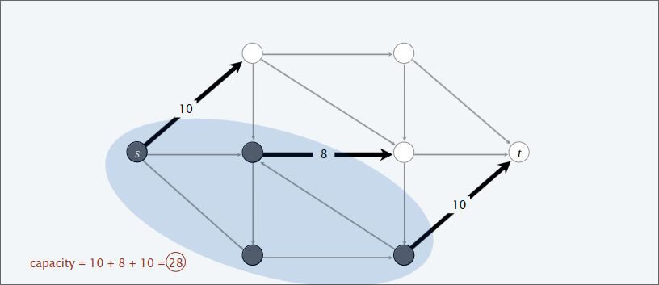
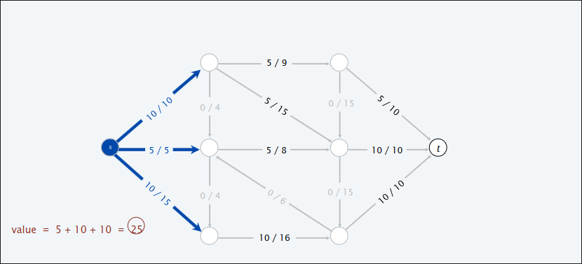
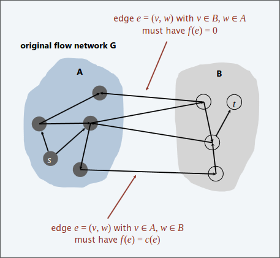

# Problemi di Flusso
Una **rete di flusso** è una tupla $G=(V,E,s,t,c)$. Un grafo diretto $(V,E)$ con sorgente $s \in V$ (assumendo che ogni nodo sia raggiungibile da $s$) e una destinazione $t \in V$. Capacità $c(e)\geq 0$ per ogni $e \in E$. 

>[!NOTE]
> Intuitivamente, materiale che scorre lungo la rete di trasporto; il materiale viene originato nella sorgente ed è mandato a destinazione

  

## Problema del minimo taglio

Un **st-cut** è una partizione $(A,B)$ dei nodi con $s \in A$ e $t \in B$  
La sua **capacità** è la somma delle capacità degli archi che da $A$ vanno in $B$

$cap(A,B)= \sum_{e \ out \ of \ A} c(e)$    

    

#### Obiettivo: Trovare un taglio di capacità minima!  

## Problema del massimo flusso

Un **st-flow** è una funzione $f$ che soddisfa:  
+ Per ogni arco $e \in E:0 \leq f(e) \leq c(e)$
+ Per ogni nodo $v \in V - \set{s,t}: \sum_{e \ in \ to \ v}f(e)=\sum_{e \ out \ of \ v}f(e)$  [Conservazione del flusso]

Il **valore** del flusso $f$ è $val(f)=\sum_{e \ out \ to \ s}f(e)-\sum_{e \ in \ of \ s}f(e)$      

#### Obiettivo: Trovare un flusso di valore massimo!  

## Verso un algoritmo per il max flow  

### Greedy Template  
1. Inizia con $f(e)=0$ per ogni arco $e \in E$  

2. Trova un percorso $s \rightarrowtail t$ detto $P$ dove in ogni arco $f(e) < c(e)$  
  
3. Aumenta il flusso lungo il percorso $P$
  
4. Ripeti finché non hai ulteriori percorsi disponibili  
  

Nell'esempio il greedy alla fine trova il seguente valore di flusso  
  
Sbagliando perché il massimo flusso ottenibile da questa rete è $19$  
  

#### Perché fallisce?  Una volta che il greedy incrementa il flusso in un arco, non lo decrementa mai!  

>[!NOTE]
> Necessitiamo di un meccanismo che esegue "undo" su una decisione sbagliata  

## Reti residue  

#### Arco originale  
$e=(u,v)\in E$

  

#### Arco al contrario  
$e^{reverse}=(v,u)$    

$
    c_f(e) =
    \begin{cases}
    c(e)-f(e) \ if \ e \in E \\
    f(e^{reverse})\ if \ e^{reverse}\in E 
    \end{cases}
$    

  

#### Rete residua  
$G=(V,E_f,s,t,c_f)$:
+ $E_f=\set{e: f(e) < c(e)} \cup \set{e: f(e^{reverse})>0}$
+ $f'$ è un flusso in $G_f$ se e soltanto se $f'+f$ è un flusso in $G$  

  

## Cammino aumentante  

Un **cammino aumentante** è un percorso semplice $s \rightarrowtail t$ nella rete residua $G_f$  

La **bottleneck capacità** di un cammino aumentante $P$ è la minima capacità residua in uno dei qualsiasi archi in $P$.  

Dato $f$ un flusso e $P$ un cammino aumentante in $G_f$.  
Quindi, dopo aver chiamato $f' ← AUGMENT(f,c,P)$,  il risultato $f'$ è un flusso e   $val( f′) = val( f ) + bottleneck(Gf, P)$  

  

## Algoritmo Ford-Fulkerson

1. Inizia con $f(e)=0$ per ogni arco $e \in E$ 
2. Trova un percorso $s \rightarrowtail t$ detto $P$ nella rete residua $G_f$
3. Aumenta il flusso lungo il percorso $P$
4. Ripeti finché non hai ulteriori percorsi disponibili  

  

## Relazione tra flusso e taglio  

#### Lemma  
Dato $f$ un qualsiasi flusso e dato $(A,B)$ un qualsiasi taglio. Allora il valore del flusso $f$ è uguale al flusso netto attraverso il taglio $(A,B)$.  

**$val(f)= \sum_{e \ out \ of \ A}f(e)-\sum_{e \ in \ to \ A}f(e)$**
  
 
  
##### dim

$val(f)$

$=\sum_{e \ out \ to \ s}f(e)-\sum_{e \ in \ of \ s}f(e)$

$= \sum_{v \in A}(\sum_{e \ out \ of \ v}f(e)-\sum_{e \ in \ to \ v}f(e)) \ (\text{per la conservazione del flusso questa differenza sarà sempre uguale a 0 tranne per il nodo }s)$

$=\sum_{e \ out \ of \ A}f(e)-\sum_{e \ in \ to \ A}f(e) \ (\text{Questo invece perché A contiene } s)$

#### Dualità debole  
Dato $f$ un qualsiasi flusso e $(A,B)$ un taglio qualsiasi. Allora $val(f) \leq cap(A,B)$  
##### dim  
$val(f)$  

$=\sum_{e \ out \ of \ A}f(e)-\sum_{e \ in \ to \ A}f(e)$  

$\leq \sum_{e \ out \ of \ A}f(e)$  

$\leq \sum_{e \ out \ of \ A}c(e) = cap(A,B)$   

#### Corollario  
Sia $f$ un qualsiasi flusso e $(A,B)$ un qualsiasi taglio.  
Se $val(f)=cap(A,B)$ allora $f$ è un flusso massimo e $(A,B)$ è un taglio minimo  
##### dim  
Per un qualsiasi flusso $f': val(f') \leq cap(A,B)=val(f)$.  
Per un qualsiasi taglio $(A',B'): (A',B') \geq val(f)=cap(A,B)$  

### Teorema Max-flow Min-cut  
Valore del flusso massimo è uguale alla capacità del minimo taglio  
### Teorema del cammino aumentante  
Un flusso $f$ è massimo flusso se e soltanto se non ci sono cammini aumentanti in $G_f$  

#### dim  
I seguenti tre enunciati sono equivalenti:  
1. Esiste un taglio $(A,B)$ tale che $cap(A,B)=val(f)$.
2. $f$ è un flusso massimo. 
3. Non ci sono cammini aumentanti rispetto a $f$.  

[1 $\implies$ 2]  

Conseguenza della dualità debole  

[2 $\implies$ 3]  (dimostriamo per contrapposizione [$\neg$3 $\implies$ $\neg$2])  

Supponiamo che ci sia un cammino aumentante rispetto a $f$.  
Possiamo migliorare il flusso $f$ inviando flusso lungo questo percorso.  
Dunque $f$ non è un flusso massimo.  

[3 $\implies$ 1]  

Sia $f$ un flusso che non ha cammini aumentanti.  
Sia $A$ un insieme di nodi raggiungibile da $s$ nella rete residua in $G_f$  
Per definizione $s \in A$  
Per definizione di flusso $f$ $t \notin A$  (non ci sono più cammini aumentanti in $G_f$ dunque $t$ non è raggiungibile da $s$ e dunque non è in $A$) 

$val(f)= \sum_{e \ out \ of \ A}f(e)-\sum_{e \ in \ to \ A}f(e)$

$=\sum_{e \ out \ of \ A}c(e)-0 =cap(A,B)$  

  

Se l'arco nell'immagine $e=(v,w)$ non fosse saturato allora in $G_f$ avrei un arco che dal nodo in $A$ mi porta al nodo in $B$, dunque sarebbe raggiungibile da $s$ e quel nodo dovrebbe anch'esso stare in $B$.  

Se l'arco nell'immagine $e=(w,v)$ non fosse vuoto allora in $G_f$ avrei un arco che dal nodo in $A$ mi porta al nodo in $B$, dunque sarebbe raggiungibile da $s$ e quel nodo dovrebbe anch'esso stare in $B$.  

Dunque per forza di cose gli archi che da $A$ vanno in $B$ devono essere saturi e gli archi che da $B$ vanno in $A$ devono essere liberi. Dunque ho quei valori nelle sommatorie.  

#### Teorema
Dato un qualsiasi flusso massimo $f$, si può calcolare un minimo taglio $(A,B)$ in $O(m)$ passi.  
##### dim  
Dato $A$ insieme dei nodi raggiungibili da $S$ in $G_f$   
  

## Tempo di esecuzione Ford&Fulkerson  
>[!NOTE]
> Assumiamo che ogni arco abbia capacità $c(e)$ intera da $1,...,C$. Ogni flusso nell'arco $f(e)$ e la residue capacità $c_f(e)$ sono interi.  

#### Teorema  
L'algortimo di Ford&Fulkerson termina dopo al più $val(f')\leq nC$ cammini aumentanti, dove $f'$ è il massimo flusso.  
##### dim  
Ogni cammino aumentante incrementa il valore del flusso di almeno $1$.  

#### Corollario  
Il tempo di esecuzione dell'algoritmo è $O(m \ val(f'))=O(m \ nC)$  
##### dim  
Si può usare BFS o DFS per trovare un cammino aumentante in $O(m)$ passi.    

> [!NOTE]
> Con capacità intere, il flusso massimo ha valore intero  

>[!IMPORTANT]
> L'algoritmo Ford&Fulkerson è **pseudo-polinomiale**, se la capacità massima è $C$, l'algoritmo può eseguire $\geq C$ iterazioni. 
 
 Il numero di cammini aumentanti può essere esponenziale nella dimensione dell'input  

   
 

## Scegliere buoni cammini aumentanti  

Scegliere una grande bottleneck capacità e il minor numero possibile di archi.  

### Capacità scalabile  

1. Mantieni un parametro scalabile $\Delta$  
2. Dato $G_f(\Delta)$ parte della rete residua contenenti solo archi con peso $\geq \Delta$ 
3. Qualsiasi cammino aumentante in $G_f(\Delta)$ ha bottleneck capacità $\geq \Delta$  

  

  

#### Tempo di esecuzione  

##### Lemma  
Ci sono $1+ ⎣log_2 C⎦$ fasi di ridimensionamento  
##### Lemma  
Ci sono $\leq 2m$ aumenti per fasi di ridimensionamento  (in totale $O(m \ log C)$)  

##### Teorema  
L'algoritmo richiede $O(m^2 \ logC)$ passi.  

### Cammini brevi  

Prendi il cammino che usa meno archi   

  

#### Tempo di esecuzione  

##### Lemma 
Il numero totale di aumenti è al più $m\ n$  

##### Teorema  
L'algoritmo richiede $O(m^2\ n)$ passi.