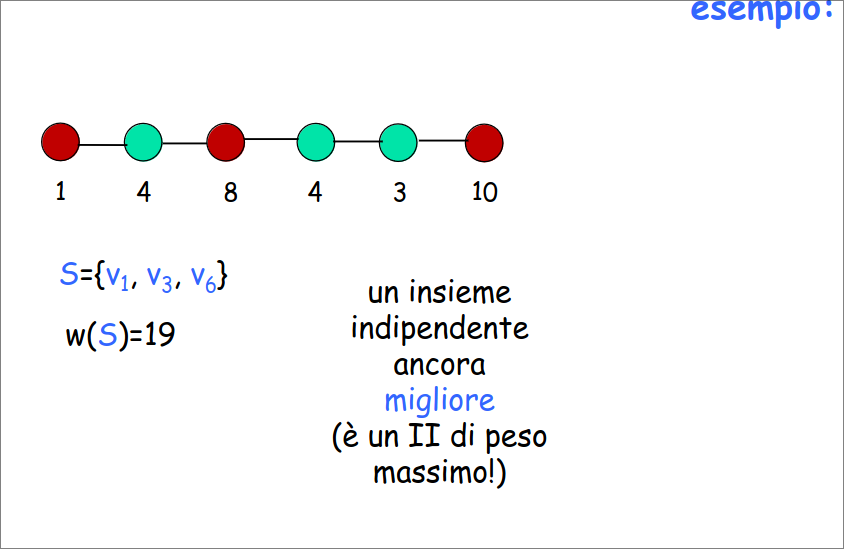
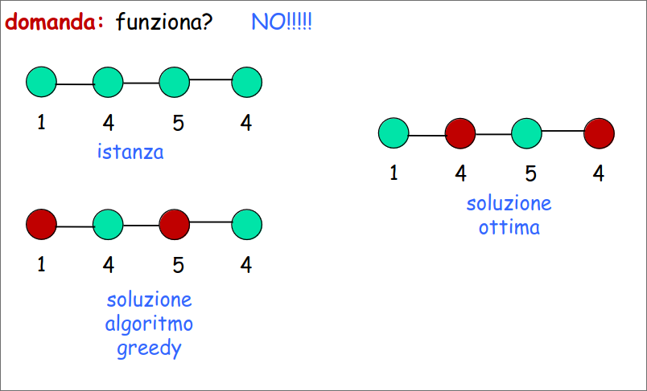
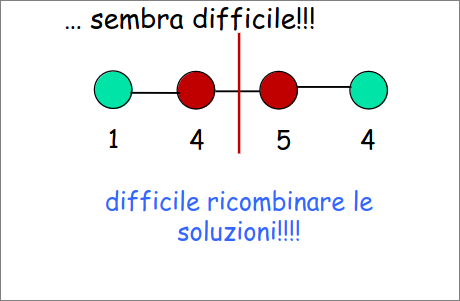
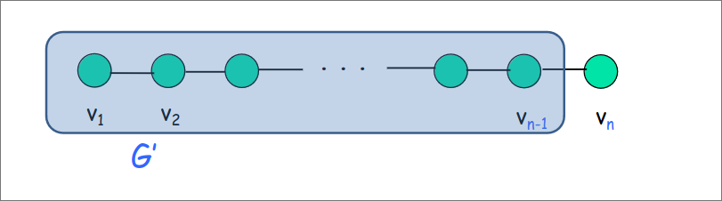
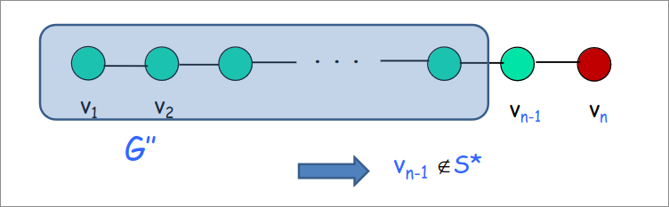
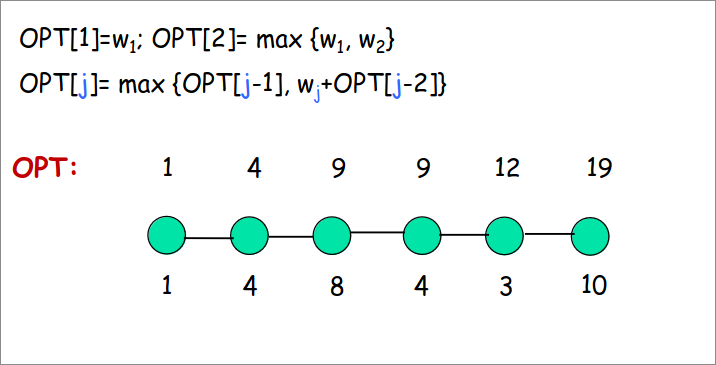
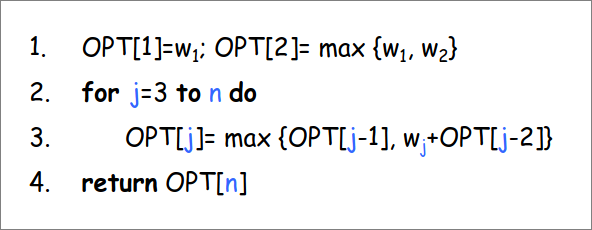
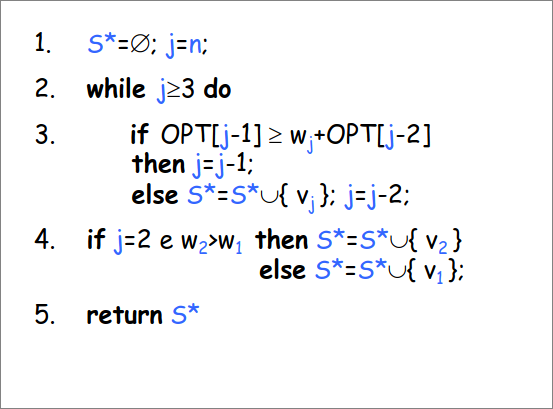

# Programmazione Dinamica  
## Insieme indipendente di peso massimo  

**INPUT**: Un cammino $G$ di $n$ nodi. Ogni nodo $v_i$ ha un peso $w_i$.  
**GOAL**: Trovare un insieme indipendente di **peso massimo**, ovvero un insieme $S$ di nodi tale che:  
1. $S$ è un insieme indipendente (sottoinsieme dei nodi del grafo tale che non ci sono due nodi collegati da un arco, attento qui si parla di cammino, non è hard!)  
2. $w(s)=\sum_{v_i\in S}w_i$ è più grande possibile  

  

### Proviamo vari approcci  

#### Forza Bruta: Enumerazione  

Enumeriamo tutti i sottoinsiemi degli n nodi, per ognuno verifichiamo che è un insieme indipendente, ne calcoliamo il peso e teniamo quello di peso massimo.  

Il problema è che i sottoinsiemi sono tanti, $2^n$.

#### Greedy  
Costruisco la soluzione in modo incrementale scegliendo ogni volta il nodo indipendente di valore massimo.  

Non funziona! Di seguito il controesempio  
  

#### Divide et Impera  
Divido il cammino a metà, calcolo ricorsivamente l’II di peso massimo sulle due metà e poi ricombino le soluzioni.  

Non funziona. Difficile ricombinare le soluzioni  

    

### Un nuovo approccio  

Ragionare sulla struttura/proprietà della soluzione ottima del problema, in termini di soluzioni (ottime) di sottoproblemi più “piccoli”.  

**Obiettivo:** esprimere la soluzione del problema come combinazione di soluzioni di (opportuni) sottoproblemi. Se le combinazioni sono “poche” possiamo cercare la combinazione giusta per forza bruta.  

Sia $S'$ la soluzione ottima, ovvero l’II di peso massimo di $G$.
Considera l’ultimo nodo $v_n$ di $G$.  
**Oss:** $v_n \notin S'$ o $v_n \in S'$  

+ $(v_n \notin S')$
Considera $G'=G- \set{v_n}$.
Allora $S'$ è una soluzione ottima per $G'$.
se esistesse una soluzione $S$ migliore per $G’$, $S$ sarebbe migliore anche per $G$: assurdo! (ovvio perché $S'$ non contiene $v_n$ dunque se $S$ fosse una soluzione ottima per $G'$ lo sarebbe per tutto $G$ dunque $S'$ non sarebbe una soluzione ottima). 

+ $(v_n \in S')$  
Considera Considera $G'=G- \set{v_{n-1},v_n}$. 
Allora $S' \backslash \set{v_n}$ è una soluzione ottima per $G’’$.  
Se esistesse una soluzione $S$ migliore per $G’’$, $S \cup \set{v_n}$ sarebbe
migliore di $S'$ per $G$: assurdo!  
  

**Proprietà**: l'II di peso massimo di $G$ deve essere o:  
1. l'II di peso massimo per $G'$
2. $v_n$ unito all'II di peso massimo per $G''$  

#### IDEA FOLLE
Calcolare tutte e due le soluzioni e ritornare la migliore delle due. 
Ricorsivamente avrei:  
$T(n)=T(n-1)+T(n-2)+1=O(\phi^n)$  
Il problema è che per risolvere un "sottoproblema" vengono risolti ricorsivamente ogni volta i precedenti "sottoproblemi".  

Ma i sottoproblemi distinti sono pochi, $O(n)$. Ne ho uno ogni prefisso di $G$.  

**Idea**: Procediamo iterativamente considerando prefissi di G dai più piccoli verso i più grandi.

+ $G_j$: sottocammino composto dai primi j vertici di $G$
+ Sottoproblema $j$: calcolare il peso del miglior II per $G_j$
+ $OPT[j]$: valore soluzione sottoproblema $j$, ovvero peso dell’II di peso massimo di $G$.  

  
### Algoritmo

   

## Ricostruire la soluzione  
***PROPRIETÀ CHIAVE:***
$v_j \in II$ di peso massimo di $G_j \iff w_j+OPT[j-2]\geq OPT[j-1]$  

### Algoritmo per la soluzione   

  

## Principi generali della DP  
1. Identificare un numero piccolo di sottoproblemi
> es: calcolare l’II di peso massimo di $G_j$, $j=1,…,n$
2. Descrivere la soluzione di un generico sottoproblema in funzione
delle soluzioni di sottoproblemi più “piccoli”
> es: $OPT[j]=max \set{OPT[j-1], wj+OPT[j-2]}$
3. Le soluzioni dei sottoproblemi sono memorizzate in una tabella.  
4. Avanzare opportunamente sulla tabella, calcolando la soluzione del
sottoproblema corrente in funzione delle soluzioni di sottoproblemi
già risolti.  

## Proprietà che devono avere i sottoproblemi  
1. Essere pochi
2. Risolti tutti i sottoproblemi si può calcolare velocemente la soluzione al problema originale
> spesso la soluzione cercata è semplicemente quella del sottoproblema più grande
3. Ci devono essere sottoproblemi “piccoli”
> casi base
4. Ci  deve essere un ordine in cui risolvere i sottoproblemi  
> e quindi un modo di avanzare nella tabella e riempirla  

## Maledetti sottoproblemi  

La chiave di tutto è la definizione dei “giusti” sottoproblemi.
La definizione dei “giusti” sottoproblemi è un punto di arrivo.
Solo una volta definiti i sottoproblemi si può verificare che l’algoritmo è 
corretto.

Se la definizione dei sottoproblemi è un punto di arrivo, come ci arrivo? **ragionando sulla struttura della soluzione (ottima) cercata**.
La struttura della soluzione può suggerire i sottoproblemi e l’ordine
in cui considerarli