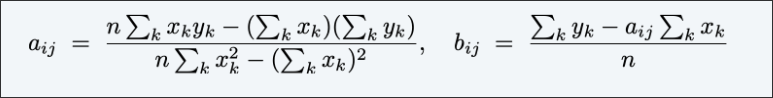

# Programmazione Dinamica
## Paradigmi 
+ **Greedy** Elabora l'input in un qualsiasi ordine, prendendi miopemente  decisioni irrevocabili.  
+ **Divide-et-Impera** Spezza un problema in sottoproblemi indipendenti; risolve ogni sottoproblema, combina le soluzioni ai sottoproblemi in modo da formare la soluzione del problema originale.  
+ **Dynamic Programming**   Spezza un problema in una serie di sottoproblemi sovrapponibili; combina le soluzioni di un sottoproblema più piccolo per formare la soluzione di un sottoproblema più grande.

## Weighted interval scheduling  
Job $j$ inizia al tempo $s_j$, finisce a $f_j$, e ha peso $w_j > 0$. Due jobs sono **compatibili** se essi non si sovrappongono.   
### Goal  
Trovare un sottoinsieme di job mutualmente compataibili di peso massimo.  

  

> [!NOTE]
> L'algoritmo greedy Earliest finish-time first è corretto se i pesi sono tutti di 1
> L'algoritmo greedy fallisce per la versione con i pesi.
>   

> [!NOTE]
> I jobs sono ordinati in ordine crescente di tempo di fine.  

>[!IMPORTANT] 
>$p(j)=$ il più piccolo indice $i<j$ tale che job $i$ è compatibile con job $j$  
> Ex. $p(8)=1, p(7)=3,p(2)=0$  

### DP

$OPT[j]=$ il peso massimo di qualsiasi sottoinsieme di job compatibili per sottoproblema costituito solo dai job $1, 2, ..., j$.  
#### Goal
$OPT[n]$

+ #### Caso1
  $OPT[j]$ non sceglie il job $j$: deve essere una soluzione ottima del problema costituito dai jobs $1,2,...,j-1$ rimanenti.    
+ #### Caso 2  
  $OPT[j]$ sceglie il job $j$: 
  + Colleziona il profitto $w_j$.
  + Non è possibile utilizzare job incompatibili $\set{ p(j) + 1, p(j) + 2, ..., j – 1 }$ (ovviamente se il job $j$ è nella soluzione ottima, i job incompatibili non potranno essere nella soluzione ottima).
  + Deve includere la soluzione ottimale al problema consistente nei rimanenti jobs compatibili $1, 2, ..., p(j)$.  

**Proprietà della sottostruttura dell'ottimo (exchange argument)**  

#### Equazione di Bellman  

    

O prendo l'ottimo dei primi $1,...,j-1$ job nel caso $j$ non faccia parte dell'ottimo, o prendo il peso di $j$ sommato all'ottimo del sottoproblema $p(j)$ (ovvero il primo job di indice più grande compatibile con $j$) nel caso $j$ sia nella soluzione ottima.  

### Bottom-up DP  

  

#### Tempo di esecuzione  
La versione bottom-up usa $O(nlogn)$ passi:  
+ Ordino per tempo di fine: $O(nlogn)$
+ Computo $p[j]$ per ogni $j$: $O(nlogn)$ (Ricerca Binaria)  
+ Ciclo for richiede $O(n)$ passi  

### Ritorno alla ricorsione  
  
  
La prima chiamata è su $n-1$, la seconda (nel caso peggiore, i job sono tutti compatibili) $p[j]=n-1$  

Questo algoritmo è lento, perché ricalcola ogni volta le soluzioni dei sottoproblemi.  

  

### Memoization  

#### Programmazione dinamica top-down (memoization) 
+ Salva i risultati dei sottoproblemi $j$ in $M[j]$
+ Usa $M[j]$ per evitare di risolvere il sottoproblema $j$ più di una volta.  

  

#### Tempo di esecuzione  
La versione con memization usa $O(nlogn)$ passi  
##### dim  
+ Ordina per tempo di fine: $O(nlogn)$
+ Calcola $p[j]$ per ogni $j$: $O(nlogn)$
+ $M$-$COMPUTE$-$OPT(j)$: ogni invocazione richiede $O(1)$ passi e o:
  + (1) ritorna un valore inizializzato $M[j]$
  + (2) inizializza $M[j]$ ed esegue due chiamate ricorsive  
+ Misura del progresso $\phi=$ numero delle voci inizializzate tra $M[1,...,n]$:  
  + inizialmente $\phi=0$, finché $\phi \leq n$
  + (2) incrementa $\phi$ di $1 \implies \leq 2n$ chiamate ricorsive   

 
Il tempo di esecuzione complessivo di $M$-$COMPUTE$-$OPT(n)$ è $O(n)$  

### Algoritmo per la soluzione  
  

Il numero di chiamate ricorsive è $O(n)$  
## Longest increasing subsequence  
### Bevi il più possibile  
Robert vuole bere il più possibile:  
+ Robert cammina per le strade delle terre del Re e incontra $n$ taverne $t_1, t_2, ..., t_n$, in ordine.
+ Quando Robert incontra una taverna $t_i$, lui può o fermarsi a bere qualcosa o continuare a piedi
+ Il vino servito nella taverna $t_i$ ha forza $s_i$
+ La forza delle bevute di Robert deve essere aumentare nel tempo  

#### Goal 
Calcola il massimo numero di fermate che Robert fa per bere.  

  

$Optimal \ Sol=6$

### DP  

+ #### Sottoproblema:
  $OPT[i]:$ lunghezza della longest increasing subsequence $S[1],...,S[i]$  

+ #### Caso base
  $OPT[1]=1$
+ #### Soluzione  
  $OPT[n]$  
+ #### Equazione di Bellman????????  

Posso dire che se una taverna non è nella soluzione ottima, allora prendo l'ottimo della taverna precedente, altrimenti se c'è prendo la soluzione ottima della taverna precedente e sommo 1.  
Ma così non funziona perché l'elemento precedente ad $i$ potrebbe essere più grande di $i$.  

### Consiglio: può essere utile, a volte,  aggiungere dei vincoli ai sottoproblemi  

  $OPT[i]:$ lunghezza della longest increasing subsequence $S[1],...,S[i]$ che termina con $S[i]$  

  

  

+ #### Sottoproblema:
  $OPT[i]:$ lunghezza della longest increasing subsequence $S[1],...,S[i]$ che termina con $S[i]$  

+ #### Caso base
  $OPT[1]=1$
+ #### Soluzione  
  $max_{i=1,...,n}OPT[i]$  
+ #### Equazione di Bellman
  $OPT[i]=1+max\set{0, max_{j=1,...,i-1 \ tc \ S[j]<S[i]}OPT[i] }$  

  

#### Tempo di esecuzione  
Ogni $OPT[i]$ è calcolato in $O(i)=O(n) \implies$ $O(n^2)$ passi.  

## Segmented least squares  

### Least Squares:  
+ Dati $n$ punti nel piano: $(x_1,y_1),...,(x_n,y_n)$
+ Trova una retta $y=ax+b$ che minimizza la somma degli errori quadratici:  

$SSE=\sum_{i=1}^n(y_i-ax_i-b)^2$  
  

#### Goal  
Calcola i valori di $a$ e $b$ che minimizzano $SSE$:  

    

### Segmented least squares   
I punti si trovano all'incirca su una sequenza di diversi segmenti di linea.  
Dati $n$ punti nel piano: $(x_1, y_1), (x_2, y_2) , …, (x_n, y_n)$ con $x_1 < x_2 < ... < x_n$, trova una sequenza di righe che minimizzi $f(x)$.  

>[!NOTE]
>$f(x)$ deve contenere due aspetti, questi segmenti devono approssimare bene i punti che coprono questi segmenti (**accuratezza**) e da altra parte vorrei che questi segmenti non fossero tanti (**parsimonia**), altrimenti potrei scegliere una linea per ogni coppia di nodi ma così non avrei approssimato nulla. Se usassi una retta per ogni coppia di punti avrei acuratezza 0.  

#### GOAL
Minimizzare $f(x)=E+cL$ per qualche costante $c>0$ (ogni linea ha un certo costo $c$, questo è il senso, e aggiungerla costa dunque $c$, più $c$ è alto meno archi posso usare, più $c$ è piccolo meno archi posso usare, $c$ è il grado di parsimonia):
+ $E:$ somma delle $SSE$ in ogni segmento
+ $L:$ numero di segmenti  

#### Notazione

$OPT[j]$= è la sequenza di punti $p_1,...,p_j$ di costo minimo 
$e_{ij}=SSE$ per le sequenze di punti $p_i,p_{i+1},p_{i+2},...,p_j$  

#### Per calcolare $OPT[j]$  
L'ultimo segmento usa i punti $p_i,...,p_j$ per qualche $i\leq j$. Il costo è $e_{ij}+c+OPT(i-1)$  

#### Equazione di bellman  
  

### Algoritmo  
  

Per ogni coppia $i,j$ prendo la coppia con costo: $SSE+c$ minimo e tra questi vi sommo l'ottimo del segmento fino a $i-1$. Quindi indovino il valore $i$, ovvero il punto dove inizia il segmento

### Analisi  
#### Teorema
L'algoritmo $DP$ risolve il problema dei minimi quadrati segmentati in tempo $O(n^3)$ e spazio $O(n^2)$.  

##### dim  

**Bottleneck**=calcolare $SSE \ e_{ij}$ per ogni $i,j$:  

  

$O(n)$ per calcolare $e_{ij}$  

> [!IMPORTANT]
> Può essere implementato in $O(n^2)$:
> Per ogni $i$: pre calcola le somme comulative:  
>   
> Così è possibile calcolare $e_{ij}$ in $O(1)$.  

## Knapsack Problem  

Prepara lo zaino in modo da massimizzare il valore totale degli oggetti presi:
+ Ci sono $n$ oggetti: l'oggetto i fornisce il valore $v_i > 0$ e pesa $w_i > 0$.
+ Valore di un sottoinsieme di elementi = somma dei valori dei singoli elementi.
+ Lo zaino ha un limite di peso di $W$.  

>[!NOTE]
>Il sottoinsieme $\set{1,2,5}$ ha valore $35 \ USD$ (e peso $10$)
>Il sottoinsieme $\set{3,4}$ ha valore $40 \ USD$ (e peso $11$) 
>**Assunzione**: valori e peso sono interi
>  

### DP : falso inizio  

$OPT(i)$ = valore ottimo del problema dello zaino con gli elementi $1, …, i$.  

#### Goal
$OPT[n]$  

+ #### Caso 1 $OPT[i]$ non inserisce l'item i
  $OPT$ seleziona i migliori $\set{1,2,...,i-1}$
+ #### Caso 2 $OPT[i]$ inserisce l'item i
  La selezione dell'elemento $i$ non implica immediatamente che dovremo rifiutare altri item. Senza sapere quali altri elementi sono stati selezionati prima di $i$, non sappiamo nemmeno se abbiamo abbastanza spazio per $i$.  

Abbiamo bisogno dunque di più informazioni, $OPT(i)$ non definisce appieno il problema che stiamo affrontando.  
**IN CONCLUSIONE**, abbiamo bisogno di più sottoproblemi. Ovvero di tenere conto anche quanto ho spazio a disposizione.

### DP: due variabili  
$OPT(i,w)$= valore ottimale del problema dello zaino con gli elementi $1, …, i$, soggetto a limite di peso $w$  (la capacità disponibile) 

#### Goal  
$OPT(n,W)$  

+ #### Caso 1 $OPT[i,w]$ non seleziona l'item $i$ ($w_i>w$, ad esempio)
   $OPT(i,w)$ seleziona i migliori i-1 item soggetti al limite di peso $w$  
+ #### Caso 2 $OPT[i,w]$ selezione l'item $i$ 
  Colleziona il valore $v_i$
  Il nuovo limite di peso è $w-w_i$  
  $OPT(i,w)$ seleziona i migliori $i-1$ oggetti sogetti al nuovo peso.  

### Bellman Eq.  
  
### Algoritmo 
  
 
  

La soluzione ottima è $\set{3,4}$, se il valore nella stessa colonna ma riga precedente uguale significa che l'elemento $i$ non l'ho messo, altrimenti si. 
#### Teorema  
L'algoritmo $DP$ risolve il problema dello zaino con $n$ oggetti e peso massimo $W$ in tempo $\Theta(n W)$ e spazio $\Theta(n W)$.  
##### dim  
Richiede $O(1)$ passi per voce di tabella.
Sono presenti nella tabella $\Theta(n W)$ voci .
Dopo aver calcolato i valori ottimali, è possibile risalire per trovare la soluzione:
$OPT(i, w)$ prende l'elemento $i$ se e solo se $M [i, w] > M [i – 1, w]$.
> [!IMPORTANT]
> L'algoritmo dipende estremamente dall'assunzione che pesi siano interi, per i valori non è rilevante.  

## Pseudopolinomiale  
$\Theta(nW)$ è una complessità pseudopolinomiale e non polinomiale.  
Un algoritmo il cui tempo di esecuzione è polinomiale nei valori dell'input (ad esempio il più grande intero presente in
l'ingresso):
+ efficiente quando i numeri coinvolti nell'input sono ragionevolmente piccoli (ad esempio, nel problema dello zaino quando i $w_i$ sono piccoli)
+ non necessariamente polinomiale nella dimensione dell'input (numero di bit richiesti per rappresentano l'input)