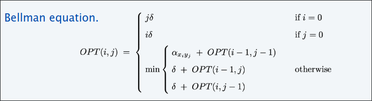

# Sequence alignment  
## Similiarità tra due stringhe  
  

**Mismatches:** somma del numero di coppie di caratteri diversi tra di loro;
**Gap:** somma del numero di caratteri che non sono in nessuna coppia.  

## Edit distance  

L'edit distance è la distanza che da l'informazione di quanto due parole siano diverse tra di loro, più la distanza è piccola, più sono simili.  

+ Gap penality: $\delta$, missmatch penalty: $a_{pq}$
+ $Cost=$ somma delle penalità dei gap e mismatch  

L'edit distance fra due parole è il costo minimo che ho per trasformare la prima parola nella seconda. Ci sono diversi modi per trasformare la prima nella seconda e ognuna ha un costo. Io voglio il costo minimo tra due parole, per trasformare la prima nella seconda.  

  

#### Es  

Qual'è l'edit distance tra due stringhe   

$PALETTE$ e $PALATE$

Assumiamo $\delta=2$ e missmatch  $=1$  

  

$Cost=3$

#### Goal  
Date due stringe: $x_1,...,x_m$, $y_1,...,y_n$, trova l'allineamento di costo minimo.  

Un **allineamento** $M$ è un insieme di coppie ordinate $(x_i,y_j)$ tale che ogni carattere appare in al più una coppia e non hanno incroci, ovvero $(x_i -y_j)$ e $(x_{i'}-y_{j'})$ incrociano se $i < i'$  ma $j > j'$.  

Il **costo** dell' allineamento $M$ è:  

  

Ovvero la somma delle penalità dei mismatch per ogni coppia nell'allineamento $M$ (se sono uguali i caratteri la penalità è 0) più la somma delle penalità dei gap per ogni carattere in $x$ o in $y$ che non sono in un allineamento.  

  

## Struttura del problema  

$OPT(i,j)=$ è il minimo costo per allineare i prefissi delle stringhe $x_1...x_i$ e $y_1...y_j$  

#### Goal  
$OPT(m,n)$  

+ #### Caso 1 matches $x_i-y_j$  
Paga il missmatch $a_{ij}$ più il costo minimo per allineare i precedenti $x_1...x_{i-1}$ e $y_1...y_{j-1}$  

+ #### Caso 2 lascia unmatched $x_i$
  Paga il gap $\delta$ per $x_i$ più il costo minimo per allineare i precedenti $x_1...x_{i-1}$ e $y_1...y_{j}$  
+ #### Caso 3 lascia unmatched $y_j$
  Paga il gap $\delta$ per $y_j$ più il costo minimo per allineare i precedenti $x_1...x_{i}$ e $y_1...y_{j-1}$    

### Equazione di bellman  
  
Casi base, diciamo quando $x$ è vuota allora devo inserire unicamente valori gap $\delta$ tante volte quanti sono i caratteri in $y$ ovvero $j$,  
viceversa
quando $y$ è vuota allora devo inserire unicamente valori gap $\delta$ tante volte quanti sono i caratteri in $x$ ovvero $i$.
## Algoritmo  
  

## Traceback  
  

## Analisi  
L'algoritmo DP calcola la edit distance (e un ottimo allineamento) di due stringhe di lunghezza $m$ e $n$ nel tempo e nello spazio $\Theta(mn)$.  
### dim  
Algoritmo calcola l'edit distance, e possibile risalire per estrarre l'allineamento ottimale stesso.  

## Algoritmo di Hirschberg  
### Teorema  
Esiste un algoritmo per trovare un ottimale allineamento nel tempo $O(mn)$ e nello spazio $O(m + n)$. (combinazione tra Divide et impera e PD)  

### Primo approccio  
  
Per calcolare la prossima colonna/riga della matrice , mantieni solo due colonne/ righe la volta   

$O(m+n)$ spazio   

>[!NOTE]
> Così possiamo calcolare l'edit distance ma non l'allineamento  

### Edit Distance graph  

Sia $f(i, j)$ la lunghezza del cammino minimo da $(0,0)$ a $(i, j)$  (la lunghezza dello shortest path da 0,0 a i,j)
#### Lemma  
$f(i,j)=OPT(i,j)$ per tutti gli $i,j$   $OPT(i,j)$ è la lunghezza ottima da $i,j$  

  
##### dim lemma
+ #### caso base  $f(0,0)=OPT(0,0)=0$  
+ #### ipotesi induttiva   
  Assumi vero per tutti gli $(i',j')$ con $i+j < i'+j'$: 
  l'ultimo arco nel cammino minimo per $(i,j)$ viene da $(i-1,j-1)$ o $(i-1,j)$ o da $(i,j-1)$.  
  Dunque:  

  $f(i,j)=
  \\\
  \\ = min\set{\alpha_{x_i,y_i}+f(i-1,j-1),\delta+f(i,j-1),\delta+f(i-1,j)} \text{ ( che per ipotesi induttiva)}
  \\\ 
  \\
  =  min\set{\alpha_{x_i,y_i}+OPT(i-1,j-1),\delta+OPT(i,j-1),\delta+OPT(i-1,j)} \text{ ( che per l'Eq Bellman )}\\\ \\  = OPT(i,j)$

  

Puoi calcolare $f(^.,j)$ per qualsiasi $j$ in $O(mn)$ passi e $O(m+n)$ spazio  

  

Dato $g(i,j)$ che denota la lunghezza del percorso minimo da $f(i,j)$ a $(m,n)$   

  

Puoi calcolare $g(^.,j)$ invertendo gli archi orientati e invertendo i ruoli di $(0,0)$ e $(m,n)$ (praticamente adesso faccio la stessa cosa di $(0,0),(i,j)$ però con $(m,n),(i,j)$).  

  

Dunque puoi calcolare $g(^.,j)$ per qualsiasi $j$ in $O(mn)$ passi e $O(m+n)$ spazio  
  

>[!NOTE]
> La lunghezza del percorso minimo usata da $(i,j)$ è $f(i,j)+g(i,j)$  
> 

>[!NOTE]
> Dato $q$ un indice che minimizza $f(q,\frac{n}{2})+g(q,\frac{n}{2})$. Dunque esiste un cammino minimo da $(0,0)$ a $(m,n)$ che usa il nodo $(q,\frac{n}{2})$   
> 

#### Divide  
Trova un indice $q$ che minimizza $f(q,\frac{n}{2})+g(q,\frac{n}{2})$; salva il nodo $i-j$ come parte della soluzione.  
#### et Impera  
Ricorsivamente calcola l'allineamento ottimo in ogni pezzo  
  

### Analisi dello spazio usato  
#### Teorema
L'algoritmo di Hirschberg usa spazio $\Theta(m+n)$ 
##### dim  
Ogni chiamata ricorsiva utilizza spazio $\Theta(m)$ per calcolare $f(^·, \frac{n}{2})$ e $g(^·, \frac{n}{2})$   
È necessario mantenere solo lo spazio $\Theta(1)$ per chiamata ricorsiva 
Numero di chiamate ricorsive $\leq n$.  

### Analisi del tempo usato   
#### Teorema
Sia $T(m, n)$ = tempo massimo di esecuzione dell'algoritmo di Hirschberg su stringhe di lunghezza al massimo $m$ e $n$. Allora, $T(m, n) = O(m n)$  
##### dim    
+ $O(m n)$ tempo per calcolare $f(^·, \frac{n}{2})$ e $g(^·, \frac{n}{2})$ e trovare l'indice $q$ (gli OPT(i,j) comunque vengono calcolati tutti).
+ $T(q, \frac{n}{2}) + T(m – q, \frac{n}{2})$ tempo per due chiamate ricorsive
+ (Sostituzione) Scegli una costante $c$ per cui:  
  + $T(m,2)\leq cm$
  + $T(2,n)\leq cn$
  + $T(m,n) \leq cmn + T(q,\frac{n}{2})+T(m-q,\frac{n}{2})$  
+ Claim: $T(m,n)\leq 2cmn$
+ Casi Base: m=2,n=2
+ Ipotesi induttiva:  
  + $T(m', n') \leq 2 c m' n'$ per ogni $(m', n')$ con $m' + n' < m + n$. 

$T(m,n) \leq T(q,\frac{n}{2})+T(m-q,\frac{n}{2})+  cmn   
\\\
\\
\text{( che per ipotesi induttiva )}\leq 2 cq  \frac{n}{2} + 2c(m-q)\frac{n}{2}+cmn
\\\
\\
=c q n + c m n – c q n + c m n 
\\\
\\
=2cmn$  

## Bellman-Ford-Moore  

### Shortest-path-problema  
Dato un grafo diretto $(A,B)$, con un arco abitrario di lunghezza $l_{vw}$, trova il percorso minimo con nodo sorgente $s$ e nodo destinazione $t$.  

  

> [!NOTE]
> L'algoritmo di Dijkstra non produce cammini minimi con archi di lunghezza negativa   

>[!NOTE]
> Aggiungere una costante alle lunghezze di ogni arco positivizzando i pesi non risolve il problema  

Un ciclo negativo è un ciclo diretto per cui la somma della lunghezza degli archi è negativa.  

  
#### Lemma 1
Se qualche percorso $v \rightarrow t$ contiene un ciclo negativo, allora non esiste un cammino v↝t minimo.
##### dim  
Se esiste un tale ciclo $W$, altrimenti è possibile girare lungo questo ciclo e ottenere un cammino minimo migliore  

#### Lemma 2 
Se $G$ non ha cicli negativi, allora esiste un percorso minimo $v \rightarrow t$ semplice (ovvero che ha $n-1$ archi).  
##### dim  
Tra tutti i percorsi minimi $v \rightarrow t$ considera quello che usa meno archi possibili, se questo cammino $P$ contiene un ciclo diretto $W$, possiamo rimuovere la porzione di $P$ corrispondente a $W$ senza incrementare la lunghezza del cammino.  

### Single-destination shortest-paths problem  
Dato un grafo $G = (V, E)$ con lunghezze dei bordi $l_{vw}$ (ma nessun ciclo negativo) e un nodo distinto $t$, trovare un cammino $v\rightarrow t$ minimo per ogni nodo $v$  (ovvero voglio trovare i cammini minimi a partire da un nodo destinazione $t$, da ogni singolo nodo a $t$)

### Negative-cycle problem  
Dato un grafo $G = (V, E)$ con lunghezze degli spigoli $l_{vw}$, trovare un ciclo negativo (se ne esiste uno).  

  

### DP  
$OPT(i,v)=$ cammino minimo $v \rightarrow t$ che usa al più $i$ archi  
#### Goal  
$OPT(n-1,v)$ per ogni $v$ (per il lemma2, se non ci sono cicli diretti esiste un cammino minimo $v \rightarrow t$ semplice)  

+ #### Caso 1 Il percorso più breve $v\rightarrow t$ utilizza $leq i – 1$ archi  
  $OPT(i,v)=OPT(i-1,v)$
+ #### Caso 2 Il percorso più breve $v\rightarrow t$ utilizza esattamente $i$ archi  
  Se $(v, w)$ è il primo arco nel percorso più breve $v\rightarrow t$, si sostiene un costo di $l_{vw}$.
  Quindi, seleziona il percorso $w \rightarrow t$ migliore utilizzando  $\leq i – 1$ archi.
### Eq Bellman
  
### Algoritmo
  

#### Teorema  

Dato un digrafo $G = (V, E)$ senza cicli negativi l'algoritmo calcola la lunghezza del cammino minimo $v\rightarrow t$ per ogni nodo $v$ nel tempo $\Theta(mn)$ e nello spazio $\Theta(n^2)$.  
##### dim  
La tabella richiede $\Theta(n^2)$  
Ogni iterazione $i$ richiede $\Theta(m)$ passi da quando viene esaminato ogni arco una singola volta.  

#### Trovare il cammino minimo 
+ Approccio 1: mantenere il $successore[i, v]$ che punta al nodo successivo su un cammino $v\rightarrow t$ minimo utilizzando archi $\leq i$.
+ Approccio 2: calcolare le lunghezze ottimali $M[i, v]$ e considerarle solo archi con $M[i, v] = M[i – 1, w] + l_{vw}$. Qualsiasi percorso diretto in questo il sottografo è il percorso più breve.  
### Ottimizzazioni spaziali  
Mantieni due array 1-dimensionali:  
+ $d[v]=$ lunghezza di un cammino $v\rightarrow t$ minimo che abbiamo trovato finora.
+ $successore[v]$ = nodo successivo su un percorso $v\rightarrow t$  
### Ottimizzazioni nelle performance  
Se $d[w]$ non è aggiornata nell'iterazione $i-1$ non ha senso considerare gli archi che entrano in $w$ nell'iterazione $i$ (se quel valore non è cambiato anche la stima non è variata quindi non ha senso controllare gli archi entranti in $w$) 
### Algoritmo  

#### Lemma   

Per ogni nodo $v : d[v]$ è la lunghezza di un percorso $v \rightarrow t$.  

#### Lemma  
Per ogni nodo $v: d[v]$ è monotona decresecente  

#### Lemma  
Dopo il passo $i, d[v] \leq$ lunghezza del cammino minimo $v \rightarrow t$ usando al più $i$ archi  

##### dim  (induzione)  
+ Caso base: $i=0$
+ Assumi vero dopo il passo $i$:  
  + Dato $P$ un qualsiasi cammino da $v \rightarrow t$ con $\leq i+1$ archi
  + Dato $(u,w)$ il primo arco in $P$ e dato $P'$ un sottocammino da $w$ a $t$  
  + Per ipotesi induttiva alla fine della passata $i$, $d[w]\leq l(P')$ perché $P'$ è un percorso $w \rightarrow t$ con $\leq i$ archi.  E per via del Lemma 4 sarà sempre così perché può solo decrementare la stima  
  + Dopo consideriamo l'arco $(v,w)$ al passo $i+1:$
    + $d[v] \leq l_{vw}+d[w]\leq l_{vw}+l(P')=l(P)$  

### Correttezza 
#### Teorema  
Supponendo che non ci siano cicli negativi, Bellman-Ford-Moore calcola le lunghezze dei cammini $v \rightarrow t$ in tempo $O(mn)$ e nello spazio  $\Theta(n)$.
##### dim
Per il Lemma 2 ho che il cammino minimo esiste e usa al più $n-1$ archi, per il Lemma 5 la stima del cammino minimo per un nodo $v$ verso $t$ e la minore possibile utilizzando $n-1$ archi.

>[!NOTE]
> Bellman-Ford-Moore è in genere più veloce nella pratica.
> L'arco $(v, w)$ viene considerato nel passaggio $i + 1$ solo se $d[w]$ viene
> aggiornato nel passaggio $i$.
> Se il percorso più breve ha $k$ archi, l'algoritmo lo trova dopo $\leq
>  k$ passaggi  

#### Claim  
Durante Bellman-Ford-Moore, seguendo il $successore[v]$ i puntatori danno un percorso diretto da $v$ a $t$ di lunghezza $d[v]$  

#### FALSO!  
1. La lunghezza del percorso del successore da $v \rightarrow t$ potrebbe essere strettamente più piccola di $d[v]$  

  

2. Se ci sono cicli negativi, il sottografo dei successori può avere un ciclo diretto

    

#### Lemma 
Un qualsiasi ciclo diretto $W$ in un grafo dei successori è un ciclo negativo  
##### dim  
Se $successore[v]=w$, noi dobbiamo avere che $d[v] \geq d[w]+l{vw}$ (le stime sono uguali solo quando $d[w]$ è impostato e $d[w]$ può solo decrescere e $d[w]$ decresce solo quando il $sucessore[v]$ è reimpostato).  
Dato $v_1 \rightarrow v_2 \rightarrow ... \rightarrow v_k \rightarrow v_1$ è una sequenza di nodi in un ciclo diretto $W$.  
Supponiamo che $(v_k, v_1)$ sia l'ultimo arco in $W$ aggiunto al grafo dei successori  
Abbiamo che:  
+ $d[v_1] \geq d[v_2]+l(v_1,v_2)$
+ $d[v_2] \geq d[v_3]+l(v_2,v_3)$
.
.
.
+ $d[v_{k-1}] \geq d[k]+l(v_{k-1},v_k)$
+ $ d[v_k] > d[v_1]+l(v_k,v_1)$  

La somma delle disuguaglianze produce $l(v_1,v_2)+l(v_2,v_3)+l(v_{k-1},v_k)+l(v_k,v_1) < 0$  

#### Teorema  
Supponendo che non ci siano cicli negativi, Bellman-Ford-Moore trova
cammini $v\rightarrow t$ più brevi per ogni nodo $v$ in tempo $O(mn)$ e spazio extra $\Theta(n)$  
##### dim  
Il grafo dei successori non può avere cicli diretti [Lemma6]  

### Algoritmo cicli negativi  
  

Dopo aver eseguito le $n-1$ passate, viene fatta un ulteriore passata, diciamo se posso migliorare ancora le stime $d[v]>d[w]+l_{vw}$ allora vi è un ciclo negativo.  

#### Lemma
Se c'è un ciclo negativo (che può raggiungere $t$) il (modificato)
l'algoritmo lo segnala.  
##### dim  
Se non ci sono cicli negativi dopo $n$ passate non succede nulla.  
Dato $v_1 \rightarrow v_2 \rightarrow ... \rightarrow v_k \rightarrow v_1$ è una sequenza di nodi in un ciclo diretto negativo $W$.  
Assumiamo per contraddizione che l'algoritmo non restituisca l'esistenza del ciclo  (la condizione dell'ultimo IF è sempre falsa).  
Allora:  

+ $d[v_1] \leq d[v_2]+l(v_1,v_2)$
+ $d[v_2] \leq d[v_3]+l(v_2,v_3)$
.
.
.
+ $d[v_{k-1}] \leq d[k]+l(v_{k-1},v_k)$
+ $ d[v_k] \leq d[v_1]+l(v_k,v_1)$  

La somma delle disuguaglianze produce $l(v_1,v_2)+l(v_2,v_3)+l(v_{k-1},v_k)+l(v_k,v_1) \geq 0$ ($W$ non può essere un ciclo negativo: ASSURDO!)  