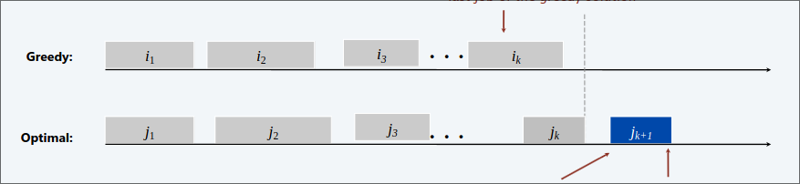

# Interval Scheduling  

 Job $j$ inizia al tempo $s_j$ e finisce al tempo $f_j$. 
Due job sono detti **compatibili** se essi non si sovrappongono.  
 

### Obiettivo

Trovare il massimo sottoinsieme di job compatibili

  

#### *INPUT*  
1. Un insieme di $n$ intervalli $I_1,...,I_n$  
2. L'intervallo $I_i$ inizia al tempo $s_i$ e finisce al tempo $s_j$  

#### *SOLUZIONE POSSIBILE*
1. Un sottoinsieme $S$ di intervalli compatibili 

#### *MISURA DA OTTIMIZZARE*  
1. Numero di intervalli schedulati  

## Algoritmi Greedy  
Considera i jobs in un qualsiasi ordine e prende ogni job disponibile compatibile con quelli già presi.  

+ ### Tempo di inzio $[X]$
  Considera i job in ordine crescente di tempo di inizio

+ ### Tempo di fine $[\circledcirc]$
  Considera i job in ordine crescente di tempo di fine

+ ### Intervallo più corto $[X]$
  Considera i job in ordine crescente di tempo di fine - tempo d'inizio

+ ### Minori conflitti $[X]$
    Per ogni job $j$, conta il numero di jobs $c_j$ in conflitto con $j$. Schedula in ordine crescente di $c_j$  

## Algoritmo tempo di fine  

  

###  Complessità : $O(nlogn)$  

## Analisi algoritmo  

Sia $i_1,...,i_k$ l'insieme di jobs scelti dal greedy  (Tempo di fine)  
Sia $j_1,...,j_m$ l'insieme di jobs scelti dall'ottimo  (Tempo di fine)

> [!NOTE]
> Denotiamo con $f(i_r)$ il tempo di fine del job $i_r$  

####  Lemma  
Per ogni $r=1,2,...,k$ noi abbiamo $f(i_r) \leq f(j_r)$  
##### *dim*
+ $r=1$ Ovvio. Osserviamo che il primo job dell'algoritmo greedy finisce prima del primo job del ottimo. Questo perchè i job sono ordinati in modo crescente per tempo finale, e il greedy va a scegliere il più piccolo in assoluto.    
    
+ $r>1$ Supponiamo vera per $r-1$ la proprietà $f(i_{r-1}) \leq f(j_{r-1})$. Adesso l'ottimo sceglie il job $j_r$ , che a sua volta è compatibile con i job selezionati dal greedy (siccome $f(i_{r-1}) \leq f(j_{r-1})$). Quindi il greedy, avendo i job ordinati per finish time, per forza andrà a guardare job con $f(i_r) \leq f(j_r)$ andando a selezionare o uno che finisce prima, quindi $f(i_r)$ oppure proprio $f(j_r)$.  

####  Teorema   

L'algoritmo è **ottimo**.   
##### *dim*  

Sia $i_1,...,i_k$ l'insieme di jobs scelti dal greedy  (Tempo di fine)  
Sia $j_1,...,j_m$ l'insieme di jobs scelti dall'ottimo  (Tempo di fine)

Assumiamo che il greedy non sia ottimale, dunque $m > k$, applicando il Lemma con $r=k$, abbiamo che $f(i_k)\leq f(j_k)$. Siccome $m > k$, significa che l'algoritmo ottimo sceglie un job $k+1$ che inizia dopo la fine di $j_k$ ma anche dopo $i_k$ (per il Lemma). Di conseguenza il job $j_{k+1}$ è compatibile anche con i job selezionati dal greedy, dunque il greedy sceglierebbe anche il job $j_{k+1}$ ottenendo un insieme di job ottimo.    

# Interval Partitioning  

Lezione $j$ inizia al tempo $s_j$ e finisce al tempo $f_j$  
### Obiettivo  
Trovare il minimo numero di classi per schedulare tutte le lezioni cosicché due lezioni non si effettuino nello stesso momento nella stessa classe.  

  

### *INPUT*  
1. Un insieme di $n$ intervalli $I_1,...,I_n$  
2. L'intervallo $I_i$ inizia al tempo $s_i$ e finisce al tempo $s_j$  

#### *SOLUZIONE POSSIBILE*
1. Una partizione di intervalli in sottoinsiemi (classi) $C_1,...,C_d$ tale che ogni $C_i$ contiene esclusivamente intervalli compatibili 

#### *MISURA DA OTTIMIZZARE*  
1. Numero di classi  

## Algoritmi Greedy  
Considera le lezioni in un qualsiasi ordine. Assegna ogni lezione ad una classe disponibile. Alloca una nuova classe, se nessuna è disponibile  

+ ### Tempo di inzio $[\circledcirc]$
  Considera le lezioni in ordine crescente di tempo di inizio

+ ### Tempo di fine $[X]$
  Considera le lezioni in ordine crescente di tempo di fine

+ ### Intervallo più corto $[X]$
  Considera le lezioni in ordine crescente di tempo di fine - tempo d'inizio

+ ### Minori conflitti $[X]$
    Per ogni lezione $j$, conta il numero di lezioni $c_j$ in conflitto con $j$. Schedula in ordine crescente di $c_j$  
## Algoritmo tempo di inizio

  

>[!NOTE]
> Può essere implementato in $O(nlogn)$:  
> Ordina in base al tempo d'inizio, e memorizza le classi in una **coda con priorità** (key=tempo di fine dell'ultima lezione)  
> - Per allocare una nuova classe fai una **INSERT**
> - Per schedulare una lezione $j$ in una classe $k$, fai una **INCREASE KEY** alla classe $k$ di $f_j$
> - Per determinare se una lezione $j$ è compatibile con una qualsiasi classe, confronta $s_j$ con **FIND-MIN**.  
> 
> Il numero totale di operazioni sulla coda con priorità è $O(n)$; ogniuna richiede tempo $O(logn)$.  

## Un lowerbound per la soluzione ottima 

> [!IMPORTANT]
> La **profondità** di un insieme di intervalli aperti è il massimo numero di intervalli che contengono un qualsiasi punto dato.  

**Il numero di classi necessario è maggiore uguale alla profondità**

  

> [!IMPORTANT] 
> L'algoritmo non schedula mai due lezioni incompatibili nella stessa classe  

### Teorema
L'algoritmo è **ottimo**  
##### *dim*  
Sia $d$ il numero di classi allocate dall'algoritmo.  
La classe $d$ è stata aperta perché avevamo bisogno di schedulare una lezione $j$ incompatibile con una qualsiasi lezione in una delle $d-1$ classi.  
Dunque ci sono $d$ lezioni e ogniuna finisce dopo $s_j$.  
Dato che abbiamo ordinato in base al tempo d'inizio, ognuno di questi intervalli non iniziano più tardi di $s_j$. Dunque abbiamo $d$ intervalli che si sovrappongono al tempo $s_j + \epsilon$. Di conseguenza si usano almeno $d$ classi.