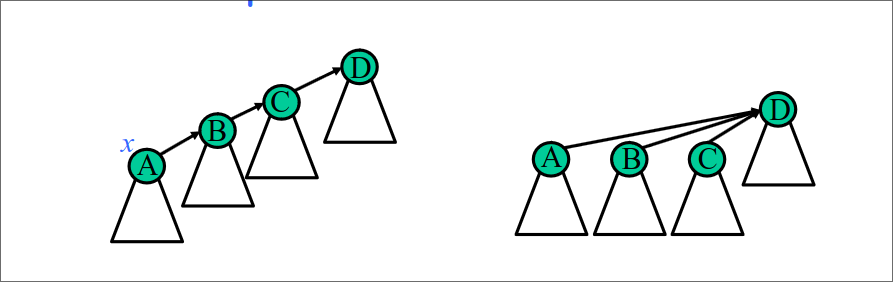

# Union Find  
## Il problema Union Find  
Mantenere una collezione di insiemi disgiunti contenenti elementi distinti (es. interi $1,...,n$) durante l'esecuzione di una sequenza di operazioni del seguente tipo:  
+ **makeSet($x$)**: crea il nuovo insieme $x=\set{x}$ di nome $x$  
+ **find($x$)**: restituisce il nome dell'insieme contenente l'elemento $x$
+ **union($A,B$)**: unisce gli insiemi $A,B$ in un unico insieme, di nome A, e distrugge i vecchi insiemi $A$ e $B$  

   

> [!IMPORTANT]
> Con $n$ elementi possono essere eseguite al più $n-1$ union

## QuickFind  
Usiamo una foresta di alberi di altezza $1$ per rappresentare gli insiemi disgiunti. In ogni albero:  
+ Radice = nome dell'insieme
+ Foglie= elementi (incluso l'elemento (nella radice) rappresentativo)

```
makeset(elem e):
    crea un nuovo albero, composto da due nodi: una radice ed una foglia.  
    Memorizza l'elemento e sia nella foglia che nella radice
union(name a, name b): 
    considera l'albero A corrispondente all'insieme di nome a, e l'albero B  
    corrispondente all'insieme di nome b. Sostituisce tutti i puntatori dalle foglie di B alla radice di B con i puntatori alla radice di A. Cancella la vecchia radice di B
find(elem e) -> name:
    accede alla foglia x corrispondente all'elemento e. Da tale nodo segue il puntatore al padre, che è la radice dell'albero, e restituisce il nome memorizzato nella radice.  
```

  

### <span style="color:red"> Complessità operazioni? </span>  

#### makeSet($x$): $O(1)$

#### find($x$): $O(1)$

#### union($A,B$): $O(n)$ 

>[!IMPORTANT]
>#### E se eseguo una sequenza arbitraria di operazioni?
>union($n-1$,$n$)   
union($n-2$,$n-1$) 
union($n-3$,$n-2$)
.
.
.
union($2$,$3$)
union($1$,$2$) 
>### $\Theta(n^2)$

## Quick Find con euristica union by size  
***IDEA***: fare in modo che un nodo non cambi troppo spesso padre  

Nell'unione degli insiemi $A$ e $B$ attacchiamo gli elementi dell'insieme di cardinalità minore a quello di cardinalità maggiore, e se necessario modifichiamo la radice dell'albero ottenuto (per aggiornare il nome)  
  
```
makeSet(elem e):
    crea un nuovo albero, composto da due nodi: una radice ed una foglia.  
    Memorizza l'elemento e sia nella foglia che nella radice.  
    Inizializza la cardinalità del nuovo insieme a 1, 
    assegnando il valore size(x)=1 alla radice x    

find(elem e) -> name:
    accede alla foglia x corrispondente all'elemento e. Da tale nodo segue il puntatore al padre, che è la radice dell'albero, e restituisce il nome memorizzato nella radice.    

union(name a, name b)
        considera l'albero A corrispondente all'insieme di nome a, e l'albero B corrispondente all'insieme di nome b, 
        Se size(A) >= size(B), muovi tutti i puntatori dalle foglie di B alla radice di A, e cancella la vecchia radice di B.
        Altrimenti (size(B) > size(A)) memorizza nella radice di B il nome di A, muovi tutti i puntatori dalle foglie di A alla radice di B, 
        e cancella la vecchia radice A. In entrambi i casi assegna al nuovo insieme la somma delle cardinalità dei due insiemi originali
        (size(A) + size(B))
```

### <span style="color:red"> Complessità operazioni? </span>  

#### makeSet($x$): $O(1)$

#### find($x$): $O(1)$

#### union($A,B$): 
+ **$O(n)$** (nel caso peggiore)
+ **$O(logn)$** (ammoritizzata)  

  
Vogliamo dimostrare che se eseguiamo $m$ find, $n$ makeSet e le al più $n-1$ union, il tempo richiesto dall'intera sequenza è al più $O(m+nlogn)$.  

Quando eseguiamo una union, per ogni nodo che cambia padre pagheremo tempo costante. 
Osserviamo ora che ogni nodo può cambiare al più $O(logn)$ padri, poiché ogni volta che un nodo cambia padre la cardinalità dell'insieme al quale apparterrà è almeno doppia rispetto a quella dell'insieme cui apparteneva:  
+ all'inizio un nodo è in un insieme di dimensione almeno 1  
+ poi se cambia padre in un insieme di almeno dimensione 2  
+ all'$i$-esimo cambio è in un insieme di dimensione almeno $2^i$  

Il tempo speso per un singolo nodo sull'intera sequenza di $n$ union è $O(logn)$

## QuickUnion  
Usiamo una foresta di alberi di altezza $1$ per rappresentare gli insiemi disgiunti. In ogni albero:  
+ Radice = elemento rappresentativo dell'insieme
+ Foglie= elementi (escluso l'elemento (nella radice) rappresentativo)  

  


### <span style="color:red"> Complessità operazioni? </span>  

#### makeSet($x$): $O(1)$

#### find($x$): $O(n)$

#### union($A,B$): $O(1)$  

>[!IMPORTANT] 
> particolari sequenze di union possono generare un albero di altezza lineare, e quindi la find è molto inefficiente (costa $n-1$ nel caso peggiore) . 
> Se eseguiamo $n$ makeSet, $n-1$ union come sopra, seguite da $m$ find, il
tempo richiesto dall’intera sequenza di operazioni è $O(n+n-1+mn)=O(mn)$

## Quick Union con euristica union by size  

***IDEA***: fare in modo che per ogni insieme l’albero corrispondente abbia altezza piccola.

Nell'unione degli insiemi $A$ e $B$ rendiamo la radice dell'albero con meno nodi figlia della radice dell'albero con più nodi  
  

#### Lemma  
Con la union by size, dato un albero QuickUnion con size (numero di nodi) $s$ e altezza $h$ vale che $s \geq 2^h$.  

L’operazione find richiede tempo $O(log n)$.
L’intera sequenza di operazioni costa $O(n+m log n)$.  

> [!NOTE]
> #### Euristica compressione cammini  
>  
>***IDEA***: quando eseguo find($x$) e attraverso il cammino da $x$ alla
radice, comprimo il cammino, ovvero rendo tutti i nodi del cammino figli della radice.  
> ***Intuizione***: find($x$) ha un costo ancora lineare nella lunghezza del cammino attraversato, ma prossime find costeranno di meno

#### Teorema  (Tarjan&van Leeuwen)  
Usando in QuickUnion le euristiche di union by rank (o by size) e compressione dei cammini, una qualsiasi sequenza di $n$ makeSet, $n-1$ union e $m$ find hanno un costo di $O(n+m \ \alpha(n+m,n))$.  

$\alpha(n+m,n)$ è la funzione inversa di Ackermann