# Il problema della gestione di insiemi disgiunti (UNION_FIND)
## Il problema
Mantenere una **collezione di insiemi disgiunti** contenenti elementi distinti (ad esempio, interi da $1,...,n$) durante l'esecuzione di una sequenza di operazioni del seguente tipo:  
+ **makeSet(x)**: crea il nuovo insieme **x={x}** di nome **x**;
+ **union(A,B)**: unisce gli insiemi **A** e **B** in un unico insieme, di nome **A** e dsitrugge i vecchi insiemi **A** e **B** (si suppone di avere un riferimento a questi due insiemi);
+ **find(x)**: restiuisce il nome dell'insieme contenente l'elemento **x** (si suppone di avere un riferimento diretto a questo elemento);

**Applicazioni**: Algoritmo di KrusKal per la determinazione del minimo albero ricoprente di un grafo, calcolo dei minimi antenati comuni, ecc...  

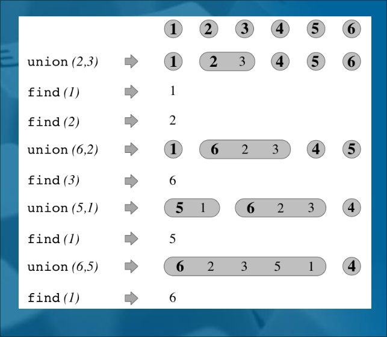  

<b> n </b> = 6 <br>
      L'elemento in grassetto dà il nome all'insieme <br>
      <b>D:</b> Se ho <b>n</b> elementi, quante union posso fare al più       ? <br>
      <b>R: n-1</b>  

<span style="color: red">Obiettivo: </span> Progettare una struttura dati che sia efficiente su una sequenza arbitraria di operazioni  

<span style="color:red">Idea: </span> Rappresentare gli insiemi disgiunti con una foresta  

Ogni insieme è un **albero radicato**, la **radice** contiene il nome dell'insieme (elemento rappresentativo).  

Due strategie: **QuickFind** e **QuickUnion**.  

## Alberi QuickFind  

Usiamo una foresta di alberi di altezza 1 per rappresentare gli insiemi disgiunti. In ogni albero:  
- Radice = nome dell'insieme;
- Foglie = elementi (incluso quello rappresentativo).  

````
classe QuickFind implementa UnionFind:
dati: S(n) = O(n)
    una collezione di insiemi disgiunti di elementi elem; ogni insieme
    ha un nome name.
operazioni:
    - makeSet(elem e) T(n)=O(1)
      crea un nuovo albero, composto da due nodi: una radice ed un 
      unico figlio (foglia). 
      Memorizza e sia nella foglia dell'albero che come nome nella radice  
    - union(name a, name b) T(n)=O(n)
      considera l'albero A corrispondente all'insieme di nome a, e l'albero
      B corrispondente all'insieme di nome b. Sostituisce tutti i puntatori dalle foglie  
      di B alla radice di B con puntatori alla radice di A. Cancella
      la vecchia radice di B  
    - find(elem e)--> name T(n)=O(1)
      accede alla foglia x corrispondente all'elemento e. Da tale nodo
      segue il puntatore al padre, che è la radice dell'albero, e 
      restiuisce il nome memorizzato in tale radice.  
````

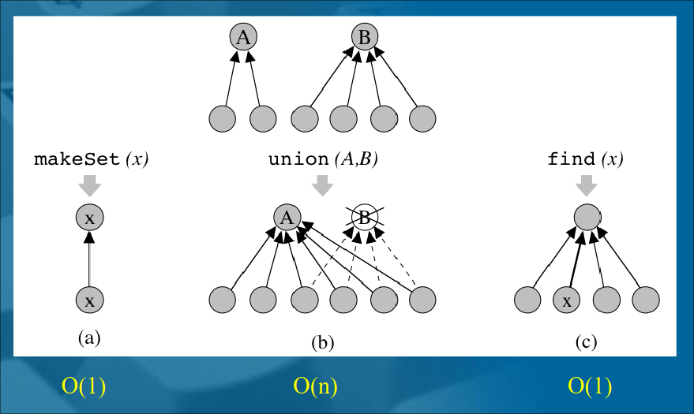  

> [!NOTE]    
> **e se eseguo una squenza arbitraria di operazioni?**
> find e makeSet richiedono solo tempo $O(1)$ ma particolari sequenze di union possono essere molto inefficienti  
> 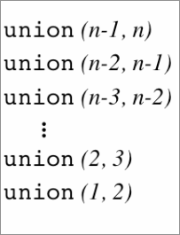  
>
> 1 cambio puntatore  
> 2 cambio puntatori   
> .  
> .  
> n-2 cambi puntatori  
> n-1 cambi puntatori  
> 
> <span style="font-size:30px">$\Theta(n^2)$</span>

## Migliorare la struttura QuickFind: euristica *union by size*  

<span style="color:red"> Idea: </span> fare in modo che un nodo / elemento non cambi troppo spesso padre  

Nell'unione degli insiemi A e B, attacchiamo gli elementi dell'insieme di cardinalità minore a quello di cardinalità maggiore, e se neccessario modifichiamo la radice dell'albero ottenuto (per aggiornare il nome), ogni insieme mantiene esplicitamente anche la propria size.  

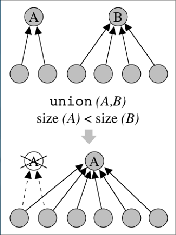  

```
classe QuickFindBilanciato implementa UnionFind:
dati S(n)=O(n)
  una collezione di insiemi disgiunti di elementi elem; ogni insieme 
  ha un nome name  
operazioni:
  makeSet(elem e) T(n)=O(1)  
    crea un nuovo albero, composto da due nodi: una radice ed un  
    unico figlio (foglia). Memorizza e sia nella radice che nella  
    foglia dell'albero. Inizializza la cardinalità del nuovo  
    insieme ad 1, assegnando il valore size(x) = 1 alla radice x  
  find(elem e)--> name T(n)=O(1)  
    accede alla foglia x corrispondente all'elemento e. Da tale  
    nodo segue il puntatore al padre, che è la radice dell'albero  
    , e restiuisce il nome memorizzato in tale radice  
  union(name a, name b)  T_am=O(log(n))  
    considera l'albero corrispondente all'insieme di nome a,   
    e l'albero B corrispondente all'insieme di nome b. Se   
    size(A)>= size(B), muovi tutti i puntatori dalle foglie di B  
    alla radice di A, e cancella la vecchia radice di B.  
    Altrimenti memorizza nella radice di B il nome A, muovi  
    tutti i puntatori dalle foglie di A alla radice di B, e  
    e cancella la vecchia radice di A. In entrambi i casi assegna  
    al nuovo insieme la somma delle cardinalità dei due insiemi  
    originali (size(A)+size(B)).
```
>![NOTE]  
>T_am = tempo per operazione ammortizzato sull'intera sequenza di unioni.  
>Una singola union può costare $\Theta(n)$, ma l'intera sequenza di n-1 union costa $O(nlogn)$.  

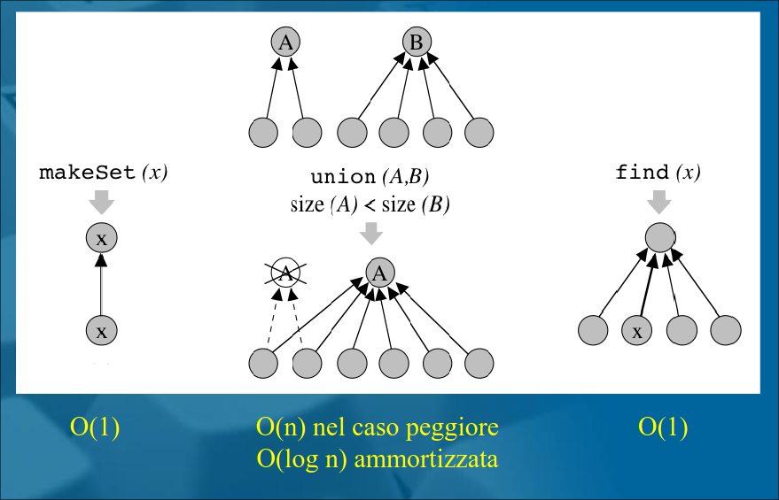  

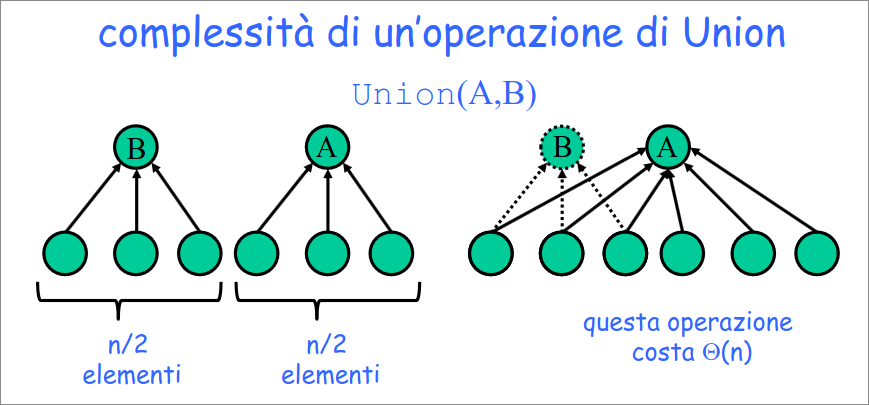  

**domanda**: quanto costa cambiare padre a un nodo? tempo costante  
**domanda (cruciale)**: quante volte può cambiare padre un nodo? al più log n  
### Analisi ammortizzata  
Vogliamo dimostrare che se eseguiamo m find n makeSet, e le al più n-1union, il tempo richiesto dall'intera sequenza di operazioni è $O(m+nlogn)$  

**Idea della dimostrazione**  

E' facile vedere che find e makeSet richiedono tempo $\Theta(m+n)$  
Per analizzare le operazioni di union, ci concentriamo su un singolo nodo/elemento e dimostriamo che il tempo speso per tale nodo è $O(logn)$ $\implies$ in totale $O(n logn)$  

Quando eseguiamo una union, per ogni nodo che cambia padre pagheremo tempo costante  
Osseriviamo ora che ogni nodo può cambiare al più $O(logn)$ padri, poiché ogni volta che un nodo cambia padre la cardinalità dell'insieme al quale apparterrà è almeno doppia riespetto all'insieme a cui apparteneva!  
+ All'inizio un nodo è un insieme di dimensione $1$,  
+ poi se cambia padre in un insieme di dimensione $2$,  
+ all'$i$-esimo cambio è in un insieme di dimensione almeno $2^i$  

$\implies$ il tempo speso per un singolo nodo sull'intera sequenza di n union è $O(logn)$.  
$\implies$ L'intera sequenza costa:
  $O(m+n+nlogn)=O(m+nlogn)$  
## Alberi QuickUnion

Usiamo una foresta di alberi di altezza anche maggiore di 1 per rappresentare gli insiemi disgiunti. In ogni albero:
+ Radice = elemento rappresentativo dell'insieme  
+ Rimanenti nodi = altri elementi (escluso l'elemento nella radice)  

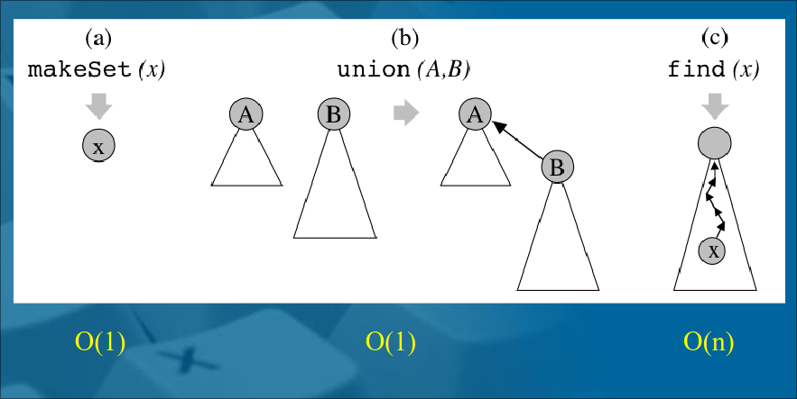  

e se eseguo una sequenza arbitraria di operazioni?  

particolari sequenze di union possono generare un albero di altezza lineare, e quindi la find è molto inefficiente ( costa n-1 nel caso peggiore)  

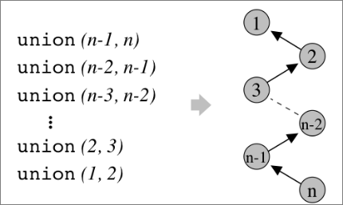  

Se esegiamo n makeSet, n-1 union seguite da m find il tempo richiesto dall'intera sequenza di operazioni è $O(n+n-1+mn) = O(mn)$  

### Migliorare la struttura QuickUnion: euristica *union by size*  

<span style="color:red">Idea: </span> fare in modo che per ogni insieme l'albero corrispondente abbia altezza piccola  

**Union by size**: nell'unione degli insiemi A e B rendiamo la radice dell'albero con meno nodi figlia della radice con l'albero con più nodi  

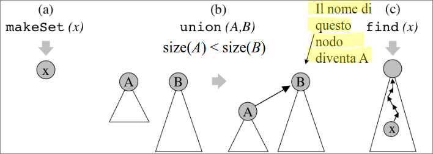  

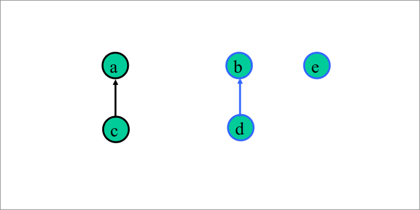  
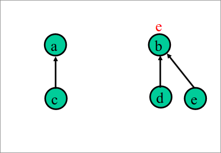  
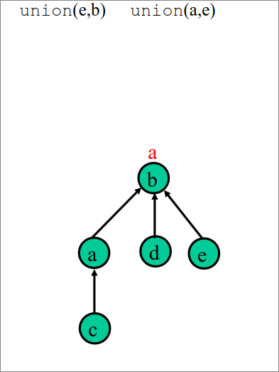  

**Lemma**: Con la union by size, dato un albero QuickUnion con size (numero di nodi) s e altezza h vale che $s\geq 2^h$.  

L'operazione find richiede tempo $O(logn)$  
L'intera sequenza di operazioni costa $O(n+mlogn)$


