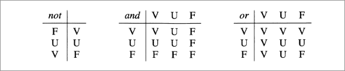

# ALGEBRA RELAZIONALE
L'algebra relazionale è costituita da un insieme di operatori, definiti su relazioni che producono ancora relazioni come risultati. In questi modo è possibile costruire espressioni che coinvolgono più operatori, allo scopo di formulare interrogazioni anche complesse.  
## Unione, intersezione, differenza  
Per iniziare, notiamo che le relazioni sono insiemi, e quindi ha senso definire su di esse operatori insiemistici tradizionali di unione, differenza e intersezione.  
Dobbiamo prestare attenzione al fatto che una relazione non è genericamente un insieme di tuple, ma un insieme di tuple *omogenee*, cioè definite sugli stessi attributi. Dunque non ha senso, nel modello relazionale, definirli con riferimento a relazioni su attributi diversi.  
Pertanto consideriamo ammissibili solo applicazioni degli operatori di unione, intersezione e differenza a coppie di operandi definiti sugli stessi attributi.  

  
## Ridenominazione
  

La limitazione imposta negli operatori insiemistici, pur giustificata, risulta però particolarmente pesante. Consideriamo la figura: sarebbe sentato eseguire su di esse una sorta di unione, al fine di ottenere tutte le coppie "genitore-figlio", ma ciò non è possibile perché l'attributo intuitivamente indicato **Genitore** si chiama **Padre** in una relazione e **Madre** nell'altra.  
Per risolvere il problema, introduciamo un operatore, che ha come unico obiettivo quello di adeguare i nomi degli attributi. L'operatore è detto *ridenominazione*.  

  

Nella figura vediamo bene come, fra operando e risultato, cambi solo l'intestazione, mentre il corpo rimane invariato. Infatti la ridenominazione agisce solo sullo schema, nell'esempio cambiando il nome dell'attributo **Padre** in **Genitore** , come indicato dalla notazione
**Genitore $\leftarrow$ Padre** posta a pedice del simbolo $\rho$ che denota l'operatore di ridenominazione.  
  

  
## Selezione 
Selezione e proiezione svolgono funzioni complementari. Sono entrambe definite su un operando e producono come risultato una porzione dell'operano. Più precisamente la selezione produce un sottoinsieme delle tuple, su tutti gli attributi, mentre la proiezione da un risultato cui contribuiscono tutte le tuple ma su un sottoinsieme di attributi.  
  

  
  

Queste due figure mostrano esempi di selezione, denotato dal simbolo $\sigma$ a pedice del quale viene indicata la "condizione di selezione" opportuna. Come mostrato dagli esempi, le condizioni di selezione possono prevedere confronti fra attributi e fra attributi e costanti, possono essere ottenute, anche, combinando condizioni semplici con i connettivi logici $\lor$, $\land$, $\neg$.

*DEF* : La *selezione* $\sigma_{F}(r)$, in cui $r$ è una relazione e $F$ una formula proposizionale, produce una relazione sugli stessi attributi di $r$ che contiene le tuple di $r$ su cui $F$ è vera.  

## Proiezione

La definizione dell'operatore di proiezione è ancora più semplice: dati una relazione $r(X)$ e un sottoinsieme $Y$ di $X$, la *proiezione* di $r$ su $Y$ ottenute dalle tuple di $r$ considerando solo i valori su $Y$ :  
$\pi_{Y}(r)$ = { $t[Y] \in r$}  

  

Come scritto prima, la proiezione permete di decomporre verticalmente le relazioni: il risultato della proiezione contiene in questo caso tante tuple quante l'operando, definite però solo su una parte degli attributi.  

  

In questa figura è mostrata un'altra proiezione, in cui si nota una situazione diversa: il risultato contiene un nmero di tuple inferiore rispetto a quelle dell'operando, perché le relazioni sono definite come insiemi e non possono in esse comparire più tuple uguali fra loro: i contributi uguali "collassano" in una sola tupla.  
Notiamo anche che esiste un legame fra vincoli di chiave e le proiezioni: $\pi_[Y](r)$ contiene lo stesso numero di tuple di $r$ se e solo se $Y$ è superchiave per $r$. Infatti:
+ se $Y$ è superchiave, allora $r$ non contiene tuple uguali su $Y$. Quindi ogni tupla dà un contributo diverso alla proiezione;
+ se la proiezione ha tante tuplle quante l'operando, allora ciascuna tupla di $r$ contribuisce alla proiezione con valori diversi, quindi $r$ non contiene coppie di tuple uguali su $Y$.  
## Join  
L'operatore che permette di correlare dati contenuti in relazioni diversi, confrontando i valori contenuti in esse. Esistono due varianti dell'operatore, il *join naturale* e il *theta-join*.  

### Join naturale 

Il *join naturale* è un operatore che correla dati in relazioni diverse, sulla base di valori uguali in attributi con lo stesso nome.  
  

Denoitiamo l'operatore con $\bowtie$. Il risultato del join è costituito da una relazione sull'unione degli insiemi di attributi degli operandi e le sue tuple sono ottenute combinando le tuple degli operandi con valori uguali sugli attributi comuni (attributo **Reparto**, in figura).  
In generale il *join naturale* $r_{1}\bowtie r_{2}$ di $r_{1}(X_{1})$ e $r_{2}(X_{2})$ è una relazione definita su $X_{1} X_{2}$, come segue:  
$r_{1}\bowtie r_{2}$ = {$t$ su $X_{1}X_{2}$ | esistono $t_{1} \in r_{1}$ e $t_{2}\in r_{2}$ con $t[X_{1}] = t_{1}$ e $t[X_{2}]=t_{2}$}.  

  

Consideriamo le relazioni *INFRAZIONI* e *AUTO* insieme al join di esse.Notiamo che ciascuna delle tuple di *INFRAZIONI* è stata combinata con una e una sola delle tuple di *AUTO*: $(i)$ una sola perché **Prov** e **Numero** formano una chiave di *AUTO* $(ii)$ almeno una perché è definitio il vincolo di integrità referenziale fra *Prov* e *Numero* in *INFRAZIONI* e (la chiave primaria di) *AUTO*. Il join, quindi, ha esattamente tante tuple quante la relazione *INFRAZIONI*.  

  

La figura mostra un altro esempio di join. Qui combiniamo i dati nelle due relazioni sulla base del valore del figlio ottendendo la coppia di genitori, per ogni persona per cui entrambi siano indicati nella base di dati.  
### Join completi e incompleti
  

Nella figura che raffigura un join naturale tra le relazioni con attributi **Impiegato**, **Reparto**, **Capo** possiamo dire che ciascuna tupla di ciascuno degli operandi contribuisce ad almeno una tupla contribuisce ad almeno una tupla del risultato (il join si dice *completo*): per ogni tupla $t_{1}$ di $r_{1}$, esiste una tupla $t$ in $r_{1}\bowtie r_{2}$ tale che $t[X_{1}]=t_{1}$ (e analogamente per $r_{2}$). Questa proprietà non è sempre verificata, perché richiede una corrispondenza fra le tuple delle due relazioni.  

La figura precedente a quanto scritto mostra un join in cui alcune tuple degli operandi non contribuiscono al risultato, perché l'altra tupla non contiene tuple con gli stessi valori sull'attributo comune. Queste tuple vengono chiamati *dangling*.  
Come caso limite è ovviamente possibile che nessuna delle tuple degli operandi sia combinabile, e allora il risultato del join è la relazione vuota:  

  

All'estremo opposto, è possibile che ciascuna delle tuple di ciascuno degli operandi sia combinabile con tutte le tuple dell'altro:  

  

All'estremo opposto, è possibile che ciascuna dele tuple di ciascuno degli operandi sia combinabile con tutte le tuple dell'altro.  
In tal caso, il risultato contiene un numero di tuple pari al prodotto delle cardinalità degli operandi e cioè $|r_{1}| x |r_{2}|$.  

Ricapitolando, possiamo dire che il join $r_{1}$ e $r_{2}$ contiene un numero di tuple compreso fra 0 e $|r_{1}| x |r_{2}|$.  
Inoltre:
+ se il join di $r_{1}$ e $r_{2}$ è completo, allora contiene almeno un numero di tuple pari al massimo fra $|r_{1}| |r_{2}|$  
+ se $X_{1} \cap X_{2}$ contiene una chiave per $r_{2}$, allora il join di $r_{1}(X_{1})$ e $r_{2}(X_{2})$ contiene al più $|r_{1}|$ tuple;
+  se $X_{1} \cap X_{2}$ coincide con una chiave per $r_{2}$ e sussiste il vincolo di riferimento fra  se $X_{1} \cap X_{2}$ in $r_{1}$ e la chiave di $r_{2}$, allora il join di $r_{1}(X_{1})$ e $r_{2}(X_{2})$ contiene esattamente $|r_{1}|$ tuple.  

### Join esterni 
La caratteristica del join di "tralasiare" le tuple di una relazione senza controparte nell'altra è utile in molti casi ma potenzialmente pericolsa in altri, in quanto può omettere informazioni importanti.  

  

Come nella figura , supponiamo di essere interessati a tutti gli impiegati, con l'indicazione del capo se noto. Allo scopo è stato proposto l'operatore *join esterno*, che prevede che tutte le tuple diano un contributo al risultato, eventualmente estese con valori nulli ove non vi siano controparti.  Ne esistono tre varianti: *sinistro* che estende solo le tuple del primo operando, quello *destro*, che estende le tuple sel secondo operando e quello *completo*, che le estende tutte.

  

### Theta-join ed equi-join  
  

Osservando la figura possiamo notare che un prodotto cartesiano ha di solito ben poca utilità, in quanto concatena tuple non necessariamente correlate semanticamente. Ineffetti il prodotto cartesiano viene seguito da una selezione che centra l'attenzione su tuple correlate come nella seguente figura:

  

Per questa ragione viene spesso definito un operatore derivato, il *theta-join*, come prodotto cartesiano seguito da una selezione:

$r_{1} \bowtie r_{2} = \sigma_{F}(r_{1} \bowtie r_{2})$.
dove $F$ è una formula proposizionale e $r_{1}, r_{2}$ non hanno attributi comuni.

La relezione nella figura può esse ottenuta per mezzo del theta-join:

*IMPIEGATI* $\bowtie_{Progetto=Codice}$ *PROGETTI*.  

UN theta join in cui la condizione di $F$ sia una congiunzione di ugualglianza, con attributo della prima relazione e uno della seconda viene chiamato *equi-join*. Quindi la relazione nella figura precedente è ottenuta per mezzo di un equi-join.

Dal punto di vista pratico il theta-join e ancor di più l'equi-join hanno una grae importanza in quanto la maggior parte delle basi di dati non utilizzano i nomi di attributo per correlare relazioni, pertanto non utilizzano il join naturale ma l'equi-join e il theta-join.  

## Interrogazioni in algebra relazionale 
Un interrogazione può essere definita come una funzione che applicata a istanze di base di dati, produce relazioni.  
Più precisamente, dato uno schema $R$ di base di dati, un'ibterrogazione è una funzione che , per ogni istanza di $r$ di $R$, produce una relazione su un dato insieme di attributi $X$. Le espressioni dei vari linguaggi di interrogazione "rappresentano" o "realizzano" interrogazioni: ogni espressione definisce una funzione. Indichiamo con $E(r)$ il *risultato* dell'applicazione dell'espressione $E$ alla base di dati $r$.  

dato il seguente schema:  

  

La prima interrogazione che consideriamo è molto semplice: *trovare matricola, nome ed età degli impiegati che guadagnano più di 40 mila euro*.  
In questo caso con una selezione possiamo porre l'attenzione sulle sole tuple che soddisfano la condizione e con una proiezione eliminiamo gli attributi non richiesti:  

  

$\pi_{Matr,Nome,Età}(\sigma_{Stipendio>40}(IMPIEGATI))$  

Il risultato di questa espressione, applicata a questa base di dati è:  
  

La seconda interrogazione coinvolge entrambe le relazioni dello schema, *trovare le matricole dei capi degli impiegati che guadagnano più di 40 mila euro*:  

$\pi_{Capo}(SUPERVISIONE\bowtie_{Impiegato=Matr}\sigma_{Stipendio>40}(IMPIEGATI))$  

  

Passiamo a esempi più complessi. Il primo: *trovare nome e stipendio dei capi degli impiegati che guadagnano più di 40 mila euro*. In questo caso, possiamo ovviamente far uso dell'espressione precedente, ma dobbiamo poi produrre, per ciascuna tupla del risultato le informazioni richieste sul capo, che vanno estratte dalla relazione $IMPIEGATI$.  
Intuitivamente, la soluzione prevede il join della relazione $IMPIEGATI$, con il risultato dell'espressione precedente, ma con un avvertenza: in generale, il capo e l'impiegato differiscono, quindi le due tuple di $IMPIEGATI$ che contribuiscono a una tupla del join sono diverse.  
Il join deve quindi essere preceduto da una ridenominazione che "cambi" tutti i nomi degli attributi.  

$\pi_{NomeC,StipC}(\rho_{MatrC,NomeCmStipC,EtàC \leftarrow Matr,Nome,Stip,Età}(IMPIEGATI)$  

$\bowtie_{MatrC=Capo}$  

$SUPERVISIONE \bowtie_{Imp=Matr}\sigma_{Stip>40}(IMPIEGATI))$  

Il risultato:  

  

## Equivalenza di espressioni algebriche  

L'algebra relazionale, come molti altri stumenti formali in contesti diversi, permette di formulare espressioni fra loro *equivalenti*, cioè che producono lo stesso risultato.  

$E_1 \equiv_R E_2$ se $E_1(r) = E_2(r), \forall{r}$ di $R$ (**equivalenza dipendente dallo schema**).  

$E_1 \equiv E_2$ se $E_1 \equiv_R E_2$ $\forall R$  

L'equivalenza di espressioni dell'algebra risulta particolarmente importante dal punto di vista applicativo, nella fase di esecuzione delle interrogazioni. Esse vengono tradotte in algebra relazionale e viene valutato il costo, in termini di dimensioni dei risultati intermedi. In presenza di varie alternative equivalenti, viene scelta quella di costo minore.  
Vengono spesso utilizzate *trasformazioni di equivalenza*, operazioni che sostituiscono un'espressione con un'altra a essa equivalente.  
Vediamo alcune trasformazioni:  
1. **Atomatizzazione delle selezioni**: una selezione congiuntiva può essere sostituita da una cascata di selezioni atomiche:  

$\sigma_{F_1 \land F_2}(E) \equiv \sigma_{F_1}(\sigma_{F_2}(E))$  

2. **Idempotenza delle proiezioni**: una proiezione può essere trasformata in una cascata di proiezioni che "eliminano" i vari attributi in fasi successive:  

$\pi_X(E) \equiv \pi_X(\pi_{XY}(E))$  

3. **Anticipazione della selezione rispetto al join**:  

$\sigma_F(E_1 \bowtie E_2) \equiv E_1 \bowtie \sigma_F(E_2)$  

4. **Anticipazione della proiezione rispetto al join**:  

$\pi_{X_1 Y_2}(E_1 \bowtie E_2) \equiv E_1 \bowtie \pi_{Y2}(E2)$  
(se gli attributi in $X_2 - Y_2$ non sono coinvolti nel join).  

Combinando con Idempotenza delle proiezioni:  

$\pi_Y(E_1 \bowtie_F E_2) \equiv \pi_Y(\pi_{Y_1}(E_1)\bowtie \pi_{Y_2}(E_2))$  

Dove $X_1$ e $X_2$ gli attributi di $E_1$ ed $E_2$ e con $J_1$ e $J_2$ i rispettivi sottoisniemi coinvolti nella condizione $F$ di join:  

$Y_1 = ( X_1 \cap Y) \cup J_1$  
$Y_2 = ( X_2 \cap Y) \cup J_2$  

5. **Ingoblamento di una selezione in un prodotto cartesiano a formare un join**:  

$\sigma_F(E_1 \bowtie E_2) \equiv E_1 \bowtie_F E_2$  

con $X_1 \cap X_2 = \emptyset$  

6. **Distributività della selezione rispetto l'unione**:  

$\sigma_F(E_1 \cup E_2) \equiv \sigma_F(E_1)\cup\sigma_F(E_2)$  

7. **Distributività della selezione alla differenza**:  
$\sigma_F(E_1-E_2) \equiv \sigma_f(E_1)-\sigma_F(E_1)-\sigma_F(E_2)$  

8. **Distributività della proiezione rispetto all'unione**:  
$\pi_X(E_1 \cup E_2) \equiv \pi_X(E_1) \cup \pi_X(E_2)$  

9. $\sigma_{F_1 \lor F_2}(R) \equiv \sigma_{F_1}(R) \cup \sigma_{F_2}(R)$  

10. $\sigma_{F_1 \land F_2}(R) \equiv \sigma_{F_1}(R) \cap \sigma_{F_2}(R) \equiv \sigma_{F_1}(R) \bowtie \sigma_{F_2}(R)$   
11. $\sigma_{F_1 \land \lnot(F_2)}(R) \equiv \sigma_{F_1}(R)-\sigma_{F_2}(R)$  

12. $E \bowtie(E_1 \cup E_2) \equiv (E \bowtie E_1) \cup (E \bowtie E_2)$  

## Algebra con valori nulli  

Estensione degli operatori logici ad una logica a 3 valori (VERO, FALSO, SCONOSCIUTO(U))  

  

A IS NULL è vero su una ennupla t se il valore di t su A è nullo; falso se è specificato  

A IS NOT NULL è vero su una tupla t se il valore di t su A è specificato; falso se è nullo  

$\sigma_{Età>30}(PERSONE)$ restituisce le persone la cui età è nota e > 30 anni  

$\sigma_{Età>30 \land Età IS NULL}(PERSONE)$ restituisce le persone che potrebbero avere più di 30 anni.  

## Viste  

Abbiamo visto che può risultare utile mettere a disposizione degli utenti rappresentazioni diverse per gli stessi dati. Nel modello relazionale, la tecnica prevista a questo scopo è quella delle *relazioni derivate*, relazioni il cui è contenuto è funzione del contenuto di altre relazioni. In una base di dati relazionale possono quindi esistere reazioni di *base*, il cui contenuto è autonomo, e derivate il cui contenuto è funzione di altre relazioni derivate.  
Possono esistere due tipi di relazione:  
+ *viste materializzate*: relazioni derivate effettivamente memorizzate nella base di dati;

* *relazioni virtuali* (chiamate anche *viste*): relazioni definite per mezzo di funzioni, che non memorizzate nella base di dati, ma utilizzabili nelle interrogazioni come se lo fossero.  

Le viste materializzate hanno vantaggi:  

+ Permettono di mostrare a un utente le sole componenti della base di dati che interessano  

+ Espressioni molto complesse possono essere definite come viste  

+ **Sicurezza:** è possibile definire dei diritti di accesso relativi ad una vista  

+ In caso di ristrurazzione della base di dati, le "vecchie" relazioni possono essere di nuovo ricavate mediante viste, consentendo l'uso di applicazioni che fanno riferimento al vecchio schema.  

  

### Interrogazioni sulle viste  

Sono eseguite sostituendo alla vista la sua definizione  

$SEL_{Capo='Leoni'}(SUPERVISIONE)$  

Viene eseguita come  

$SEL_{Capo='Leoni'}(PROJ_{Impiegato,Capo}(Afferenza JOIN Direzione))$  

### Viste, motivazioni  

Schema esterno: ogni utente vede solo  

+ ciò che gli interessa e nel modo in cui gli interessa, senza essere distratto dal resto  
+ ciò che è autorizzato a vedere

Strumento di programmazione  

+ si può semplificare la scrittura di interrogazioni: espressioni complesse e sottoespressioni ripetute  
Utilizzo di programmi esisteni su schemi ristrutturati  

### Viste come stumento di programmazione  

*Trovare gli impiegati che hanno lo stesso capo di Rossi*  

+ **Senza Vista:**  

$PROJ_{Impiegato}(Afferenza JOIN Direzione) JOIN$ $REN_{ImpR, RepR \leftarrow Imp,Reparto}(SEL_{Impiegato='Rossi'})(Afferenza JOIN Direzione))$  

+ **Con la vista:**  

$PROJ_{Impiegato}(Supervisione)JOIN$ $REN_{ImprR,RepR \leftarrow Imp,Reparto}(SEL_{Impiegato='Rossi'}(Supervisione))$  

  

**Aggiornare una vista: ** modificare le relazioni di base in modo che la vista "ricalcolata", rispecchi l'aggiornamento  

L'aggiornamento sulle relazioni di base corrispondente a quello specificato sulla vista deve essere univoco, però in generale non lo è.
Ben pochi aggiornamenti sono ammissibili.

