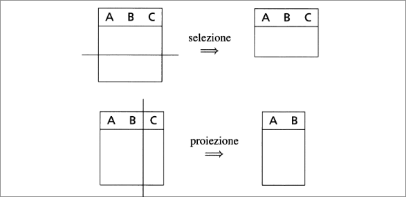

# ALGEBRA RELAZIONALE
L'algebra relazionale è costituita da un insieme di operatori, definiti su relazioni che producono ancora relazioni come risultati. In questi modo è possibile costruire espressioni che coinvolgono più operatori, allo scopo di formulare interrogazioni anche complesse.  
## Unione, intersezione, differenza  
Per iniziare, notiamo che le relazioni sono insiemi, e quindi ha senso definire su di esse operatori insiemistici tradizionali di unione, differenza e intersezione.  
Dobbiamo prestare attenzione al fatto che una relazione non è genericamente un insieme di tuple, ma un insieme di tuple *omogenee*, cioè definite sugli stessi attributi. Dunque non ha senso, nel modello relazionale, definirli con riferimento a relazioni su attributi diversi.  
Pertanto consideriamo ammissibili solo applicazioni degli operatori di unione, intersezione e differenza a coppie di operandi definiti sugli stessi attributi.  

  
## Ridenominazione
  

La limitazione imposta negli operatori insiemistici, pur giustificata, risulta però particolarmente pesante. Consideriamo la figura: sarebbe sentato eseguire su di esse una sorta di unione, al fine di ottenere tutte le coppie "genitore-figlio", ma ciò non è possibile perché l'attributo intuitivamente indicato **Genitore** si chiama **Padre** in una relazione e **Madre** nell'altra.  
Per risolvere il problema, introduciamo un operatore, che ha come unico obiettivo quello di adeguare i nomi degli attributi. L'operatore è detto *ridenominazione*.  

  

Nella figura vediamo bene come, fra operando e risultato, cambi solo l'intestazione, mentre il corpo rimane invariato. Infatti la ridenominazione agisce solo sullo schema, nell'esempio cambiando il nome dell'attributo **Padre** in **Genitore** , come indicato dalla notazione
**Genitore $\leftarrow$ Padre** posta a pedice del simbolo $\rho$ che denota l'operatore di ridenominazione.  
  

  
## Selezione 
Selezione e proiezione svolgono funzioni complementari. Sono entrambe definite su un operando e producono come risultato una porzione dell'operano. Più precisamente la selezione produce un sottoinsieme delle tuple, su tutti gli attributi, mentre la proiezione da un risultato cui contribuiscono tutte le tuple ma su un sottoinsieme di attributi.  
  

  
  

Queste due figure mostrano esempi di selezione, denotato dal simbolo $\sigma$ a pedice del quale viene indicata la "condizione di selezione" opportuna. Come mostrato dagli esempi, le condizioni di selezione possono prevedere confronti fra attributi e fra attributi e costanti, possono essere ottenute, anche, combinando condizioni semplici con i connettivi logici $\lor$, $\land$, $\neg$.

*DEF* : La *selezione* $\sigma_{F}(r)$, in cui $r$ è una relazione e $F$ una formula proposizionale, produce una relazione sugli stessi attributi di $r$ che contiene le tuple di $r$ su cui $F$ è vera.  

## Proiezione

La definizione dell'operatore di proiezione è ancora più semplice: dati una relazione $r(X)$ e un sottoinsieme $Y$ di $X$, la *proiezione* di $r$ su $Y$ ottenute dalle tuple di $r$ considerando solo i valori su $Y$ :  
$\pi_{Y}(r)$ = { $t[Y] \in r$}  

  

Come scritto prima, la proiezione permete di decomporre verticalmente le relazioni: il risultato della proiezione contiene in questo caso tante tuple quante l'operando, definite però solo su una parte degli attributi.  

  

In questa figura è mostrata un'altra proiezione, in cui si nota una situazione diversa: il risultato contiene un nmero di tuple inferiore rispetto a quelle dell'operando, perché le relazioni sono definite come insiemi e non possono in esse comparire più tuple uguali fra loro: i contributi uguali "collassano" in una sola tupla.  
Notiamo anche che esiste un legame fra vincoli di chiave e le proiezioni: $\pi_[Y](r)$ contiene lo stesso numero di tuple di $r$ se e solo se $Y$ è superchiave per $r$. Infatti:
+ se $Y$ è superchiave, allora $r$ non contiene tuple uguali su $Y$. Quindi ogni tupla dà un contributo diverso alla proiezione;
+ se la proiezione ha tante tuplle quante l'operando, allora ciascuna tupla di $r$ contribuisce alla proiezione con valori diversi, quindi $r$ non contiene coppie di tuple uguali su $Y$.  
## Join  
L'operatore che permette di correlare dati contenuti in relazioni diversi, confrontando i valori contenuti in esse. Esistono due varianti dell'operatore, il *join naturale* e il *theta-join*.  

**Join naturale** Il *join naturale* è un operatore che correla dati in relazioni diverse, sulla base di valori uguali in attributi con lo stesso nome.  
  

Denoitiamo l'operatore con $\bowtie$. Il risultato del join è costituito da una relazione sull'unione degli insiemi di attributi degli operandi e le sue tuple sono ottenute combinando le tuple degli operandi con valori uguali sugli attributi comuni (attributo **Reparto**, in figura).  
In generale il *join naturale* $r_{1}\bowtie r_{2}$ di $r_{1}(X_{1})$ e $r_{2}(X_{2})$ è una relazione definita su $X_{1} X_{2}$, come segue:  
$r_{1}\bowtie r_{2}$ = {$t$ su $X_{1}X_{2}$ | esistono $t_{1} \in r_{1}$ e $t_{2}\in r_{2}$ con $t[X_{1}] = t_{1}$ e $t[X_{2}]=t_{2}$}.  

  

