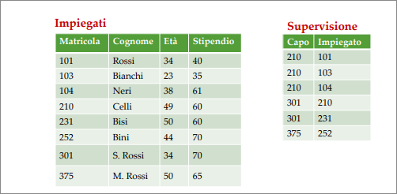
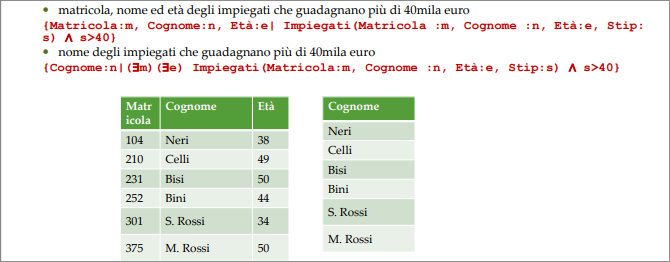
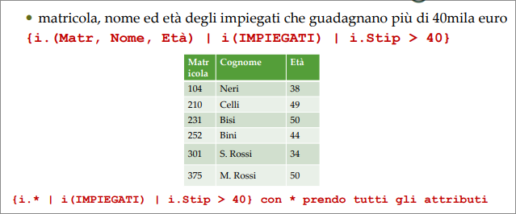
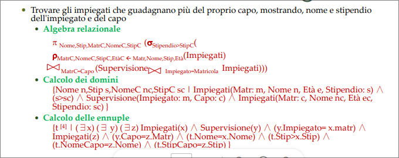
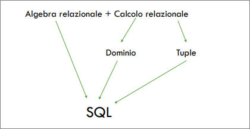

# Calcolo Relazionale  
Con il termine *calcolo relazionale* si fa riferimento a una famiglia di linguaggi di interrogazione, basati sul calcolo dei predicati del primo ordine, che hanno la caratteristica di essere *dichiarativi*, cioè di specificare le proprietà del risultato delle interrogazioni anziché la procedura seguita per generarlo.  

## Calcolo relazionale su domini  

Le espressioni del calcolo relazionale sui domini hanno la forma:  
{$A_1: x_1,...,A_k:x_k | f$}  

dove:  

+ $A_1,...,A_k$ sono attributi distinti;  
+ $x_1,...,x_k$ sono *variabili*;  
+ $f$ è una formula, secondo le seguenti regole:  
  - Vi sono formule *atomiche*, di due tipi:  
    - $R(A_1: x_1,...,A_p:x_p)$, dove $R(A_1,...,A_p)$ è uno schema di relazione e $x_1,...,x_p$ sono variabili;  
    - $x\theta y$ o $x\theta c$, con $x$ e $y$ variabili , $c$ costante, $\theta$ *operatore di confronto*  
  - Se $f_1$ e $f_2$ sono formule, allora $f_1 \lor f_2, f_1 \land f_2$ e $\lnot f_1$;  
  - Se $f$ è una formula e $x$ una variabile, allora $\exist x(f)$ e $\forall x(f)$ sono formule.  

Una espressione nel calcolo relazionale (query) ha la seguente forma:  

**Calcolo dei domini**: {$A_1:x_1,...,A_k : x_k | f$}  
dove $A_1,...,A_k$ sono gli attributi distinti e $x_1,...,x_k$ sono variabili di dominio che rendono vera la formula corretta $f$.  

**Calcolo delle ennuple**: {$x | f$}, dove $x$ è una variabile di ennupla che rende vera la formula corretta $f$.  

  

  

Un linguaggio di interrogazione è **indipendente dal dominio** se il suo risultato, su ciascuna istanza di base di dati, non varia al variare del dominio rispetto al quale l'espressione è valutata.  
Si assume l'ipotesi di <b>mondo chiuso</b> in cui i domini sono ristretti ai valori presenti.   

Il calcolo relazionale sui Domini ha dei difetti:  

+ Agisce sui domini invece che sui valori  
+ Per il motivo precedente diventa "verboso"  
+ Può portare espressioni che non hanno senso  
+ Occorre un linguaggio che 'focalizzi' le tuple d'interesse  

## Calcolo relazionale su tuple  

Espressione: {Target list | Range list | formula}  

Dove Target list: lista degli obiettivi con elementi $Y:x.Z$ o $x.Z se Z:x.Z$ o $x.*$, Range list: elenco delle variabili libere della formula con i relativi campi di variabilità.  Formula è del tipo:  
+ $x.A \theta c$ o $x.A \theta y.B$
+ connettivi di formule
+ $\exist x(R)$ o $\forall x(R)(f)$

  

Il calcolo su tuple però non permette di esprimere tutte le interrogazioni che possono essere formulate in Algebra relazionale.  

  

Per ogni espressione del calcolo relazionale che sia indipendente dal dominio esiste un'espressione dell'algebra relazionale equivalente ad esse.  
Per ogni espressione dell'algebra relazionale esiste un'espressione del calcolo relazionale equivalente ad essa.  

  

