# Metodologie e modelli per il progetto  
## Il ciclo di vita dei sistemi informativi  
Il *ciclo di vita* di un sistema informativo, comprende generalmente:  

+ **Studio di fattibilità**. Serve a definire costi delle varie alternative possibili e stabilire le priorità di realizzazione delle varie componenti del sistema.  

+ **Raccolta e analisi dei requisiti**. Consiste nell'individuazione e nello studio delle proprietà e delle funzionalità che il sistema informativo dovrà avere.  

+ **Progettazione**. Si divide generalmente in *progettazione dei dati e progettazione delle applicazioni*. Nella prima di individua la struttura e l'organizzazione che i dati dovranno avere, nell'altra si definiscono le caratteristiche dei programmi applicativi.  

+ **Implementazione**. Consiste nella realizzazione del sistema informativo secondo la struttura e le caratteristiche definite nella fase di progettazione. Viene costruita e popolata la base di dati.  

+ **Validazione e collaudo**. Serve a verificare il corretto funzionamento e la qualità del sistema informativo. La sperimentazione- deve prevedere, per quanto possibile, tutte le condizioni operative.  

+ **Funzionamento**. In questa fase il sistema informativo diventa operativo ed esegue i compiti per i quali era stato originariamente progettato.    

Va precisato che il processo non è mai strettamente sequenziale in quanto durante l'esecuzione di una delle attività citate bisogna rivedere decisioni prese.  

### Metodologie di progettazione e basi di dati  

La metodologia più consolidata è articolata in tre fasi principali:  

+ **Progettazione concettuale**. Il suo scopo è quello di rappresentare le specifiche informali della realtà di interesse in termini di una descrizione formale e completa, ma dai criteri di rappresentazione utilizzati nei sistemi di gestione di basi di dati.  
In questa fase, il progettista deve cercare di rappresentare il contenuto della base di dati, senza preoccuparsi nè delle modalità con le quali queste informazioni verranno codificate in un sisema reale, nè dell'efficienza dei programmi che fanno uso di queste informazioni.  

+ **Progettazione logica**.  Consiste nella traduzione dello schema concettuale definito nella fase precedente, in termini di del modello di rappresentazione dei dati adottato dal sistema di gestione di base di dati a disposizione.  
Un modello logico ci consente di descrivere i dati secondo una rappresentazione ancora indipendente da dettagli fisici, ma concreta perché disponibile nei sistemi di gestione di basi di dati. In questa fase, le scelte si basano, anche, su criteri di ottimizzazione delle operazioni da effettuare sui dati.  
Si fanno anche uso di tecniche formali di verifica della qualità dello schema logico ottenuto (*normalizzazione*).  

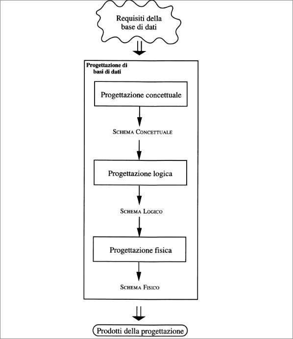  

## Modello Entità-Relazione  

Il modello Entità-Relazione è un modello *concettuale* di dati e fornisce una serie di strutture, dette *costrutti*, atte a descrivere la realtà di interesse in una maniera facile da comprendere.  
Questi costrutti vengono utilizzati per definire *schemi* che descrivono l'organizzazione e la struttura delle *occorrenze* dei dati (valori assunti dai dati al variare del tempo).  

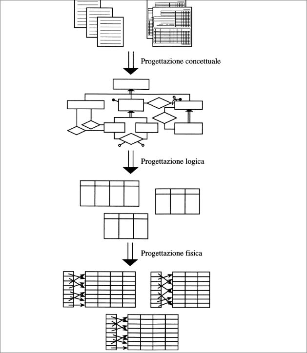  

Di seguito tutti i costrutti che il modello E-R mette a disposizione:  

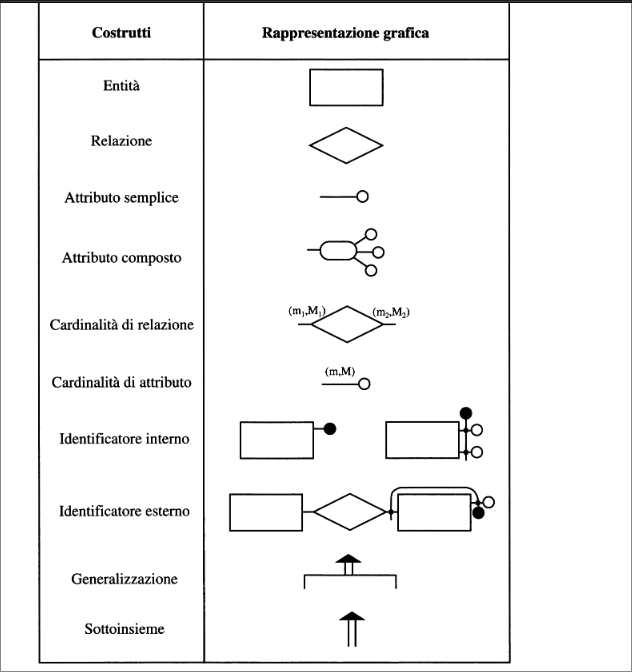  

### I costrutti principali del modello  

**Entità**: Rappresentano classi di oggetti (fatti, cose, persone) che hanno proprietà comuni ed esistenza "autonoma" ai fini dell'applicazione di interesse:  

  

$CITTA', DIPARTIMENTO, IMPIEGATO, ACQUISTO$ e $VENDITA$ sono esempi di entità.  
Una occorenza di un'entità è un oggetto della classe che l'entità rappresenta. Le città di Roma,Milano,Palermo sono esempi di occorrenze dell'entita $CITTA'$.  

**Relazioni (o associazioni)**: Rappresentano legami logici, significativi per l'applicazione d'interesse, tra due o più entità. $RESIDENZA$ è un esempio di relazione che può sussistere tra le entità $CITTA'$ e $IMPIEGATO$, mentre $ESAME$ è un esempio di relazione tra le entità $STUDENTE$ e $CORSO$.  
Una occorenza di relazione è un'ennupla,costituita da occorrenze di entità, una per ciascuna delle entità coinvolte.  

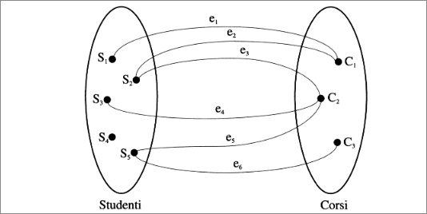  

Esempi di occorrenze della relazione $ESAME$ tra le entità $STUDENTE,CORSO$ sono le coppie $e_1,e_2,e_3,e_4,e_5,e_6$  

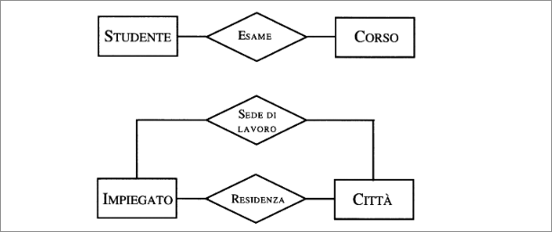  

E' anche possibile avere relazioni *ricorsive*, ovvero relazioni tra una entità e se stessa.  

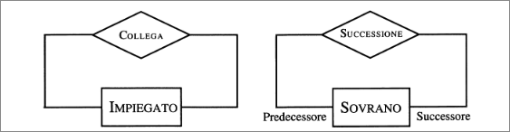  

Nella figura la relazione $COLLEGA$ sull'entità $IMPIEGATO$ connette coppie di impiegati che lavorano insieme, mentre la relazione $SUCCESSIONE$ sull'entità $SOVRANO$ associa a ogni sovrano di una dinastia il suo immediato successore. Da notare che , la relazione $SUCCESSIONE$ non è simmetrica. In questo caso è necessario stabilire i due *ruoli* che l'entità coinvolta gioca nella relazione. Questo può essere fatto con degli identificatori (**Successore** e **Predecessore**) alle linee uscenti.  
E' possibile infine avere relazioni n-arie, relazioni cioè che coinvolgono più di due entità.  

  

**Attributi**: descriono le proprietà elementari di entità o relazioni che sono di interesse ai fini dell'applicazione. Per esempio *Cognome*,**Stipendio**, **Età** sono possibili attributi dell'entità $IMPIEGATO$, mentre *Data* e *Voto* lo sono per la relazione $ESAME$ tra $STUDENTE$ e $CORSO$. Un attributo associa a ciascuna occorrenza di entità o relazione un valore appartenente a un insieme, detto *dominio*m che ccontiene i valori ammissibili per l'attributo.  
Per esempio l'attributo **Cognome** dell'entità $IMPIEGATO$ può avere come dominio l'insieme delle stringhe di 20 caratteri, mentre l'attributo *Età* può avere come dominio gli interi compresi tra 18 e 65.  

Può essere utile raggruppare gli attributi di una medesima entità o relazione che presentano affinità nel loro significato o uso: l'insieme di attributi viene detto *attributo composto*.  
Possiamo per esempio raggruppare gli attributi *Via*,*Numero*,*CAP* dell'entità $PERSONA$ per formare l'attributo composto *Indirizzo*.  

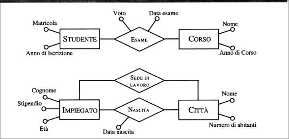  
  

**Costruzione di schemi con i costrutti di base:** I tre costrutti visti del modello E-R ci permettono già di costruire schemi per descrivere la realtà di una certa complessità.   

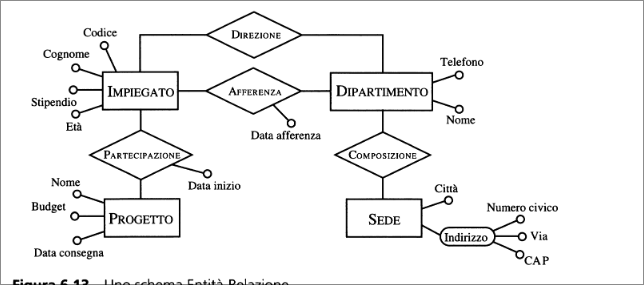  

Partendo dall'entità $SEDE$ e procedendo in senso antiorario si può vedere che una sede dell'azienda è dislocata in una certa città e ha un certo indirizzo (attributi **Città** e **Indirizzo**). Ogni sede è organizzata in dipartimenti (relazione $COMPOSIZIONE$) e ogni dipartimento ha un nome e un numero di telefono ($DIPARTIMENTO$ e opportuni attributi). A questi dipartimenti differiscono, gli impiegati dell'azienda (relazione $AFFERENZA$ e attributi) e ci sono impiegati che dirigono tali dipartimenti (relazione $DIREZIONE$). Per gli impiegati vengono rappresenti il cognome, stipendio, età, codice identificativo ($IMPIEGATO$ e attributi). Gli impiegati lavotono su progetti a partire da una certa data (relazione $PARTECIPAZIONE$ e attributo). Ogni progetto ha un nome, budget, data di consegna ($PROGETTO$ e attributi).  

### Altri costrutti del modello  

**Cardinalità delle relazioni:** Dicono quante volte, in una relazione tra entità, un'occorrenza di una di queste entità può essere legata a occorrenze delle altre entità coinvolte. Per esempio, se in una relazione $ASSEGNAMENTO$ tra le entità $IMPIEGATO$ e $INCARICO$ specifichiamo per la prima entità una cardinalità minima pari a uno e una cardinalita massima pari a cinque, vogliamo indicare che un impiegato può partecipare a un minimo di una occorrenza e a un massimo di cinque occorrenza dalla relazione $ASSEGNAMENTO$.  
Se per $INCARICO$ specifichiamo una cardinalità minima pari a zero e una massima pari a 50 imponamo che un certo incarico può partecipare o a nessuna occorrenza oppure a 50 occorrenze al massimo della relaazione $ASSEGNAMENTO$  

  

Nella maggior parte dei casi è sufficiente usa solo tre valori: zero, uno e il simbolo $N$ (un intero maggiore di 1). In particolare:  

+ per la cardinalità minima, zero o uno;  
+ per la cardinalità massima, uno o molti ($N$); nel primo caso la partecipazione dell'entità relativa può essere vista come una funzione (parziale se la cardinalità minima vale zero) che associa a una occorrenza dell'entità una sola occorrenza dell'altra entitò che partecipa alla relazione; nel secondo c'è invece un'associazione con un numero arbitrario di occorrenze dell'altra entità.  

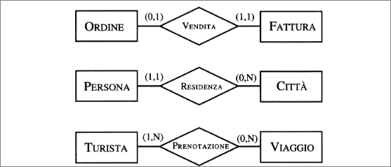  

Per esempio, le cardinalità della relazione $RESIDENZA$ ci dicono che ogni persona può essere residente in una e una sola città, mentre ogni città può non aver residenti oppure ha molti residenti.  

Osservando le cardinalitò massima, è possibile classificare le relazioni vinarie in base al tipo di corrispondenza che viene stabilita tra le occorrenze dell'entità coinvolte come la relazione $VENDITA$ , definiscono una corrispondenza uno a uno (vengono denominate *relazioni uno a uno*).  
Le relazioni aventi un'entita con cardinalità massima pai a uno e 'altra con cardinalità massima pari a $N$, come la relazione $RESIDENZA$ vengono denominate *relazioni uno a molti*. Infine le relazioni aventi cardinalità massima pari a $N$ ($PRENOTAZIONE$), sono dette *relazioni molti a molti*.  

**Cardinalità degli attributi:** Possono essere specificate per gli attributi di entità o relazioni e descrivono il numero minimo e massimo di valori dell'attributo associati a ogni occorrenza di entità o relazione. IN questi casi l'attributo rappresenta una funzione che associa a ogni occorrenza di entità un solo valore dell'attributo. Il valore per un certo attributo può essere nullo, o possono esistere diversi valori di un certo attributo per una occorrenza di entità.  

  

Nella figura viene presentato un esempio di entità con attributi dotati di cardinalità. Sulla base della cardinalità risulta che una persona un uno e un solo cognome, può avere o non avere un numero di patente, e ha almeno un recapito telefonico (uno o più).  

Diremo che un attributo con cardinalità minima pari a zero è *opzionale* , mentre *obbligatorio* se pari a 1. Diremo infine che un attributo è *multivalore* se la sua cardinalità massima è $N$.  

**Identificatori delle entità:** Vengono specificati per ciascuna entità di uno schema e descrivono i concetti (attributi e/o entità) dello schema che permettono di identificatore in maniera univoca le occorrenze delle entità.  
In molti casi uno o più attributi sono sufficienti a individuare un identificatore: si parla in questo caso di identificatore *interno* (o *chiave*).  

  

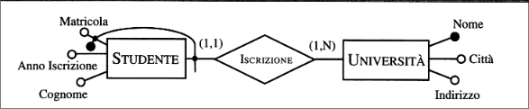  

Alcune volte però gli attributi di un'entità non sono sufficienti a identificare univocamente le sue occorrenze. Si consideri l'entità $STUDENTE$. L'attributo **Matricola** non è sufficiente per identificare univocamente lo studente (poiché due studenti possono avere stessa matricola in due università diverse).  
Quindi un identificatore corretto per $STUDENTE$ è costituito dall'attributo **Matricola** e dall'entità $UNIVERSITÀ$.  
Da notare, che questa identificazione è resa possibile dalla relazione una a molti tra le entità $UNIVERSITÀ$ e $STUDENTE$, che associa a ogni studente una e una sola università.  
Quindi un'entità $E$ può essere identificata da altre entità solo se tali sono coinvolte in una relazione a cui $E$ partecipa con cardinalità (1,1). Si parla di identificatore *esterno*.  

+ Un identificatore può coinvolgere uno o più attributi, ogniuno dei quali deve avere cardinalità (1,1);
+ Un'identificazione esterna può coinvolgere una o più entità, ogniuna delle quali deve essere membo di una relazione alla quale l'entità da identificare partecipa con cardinalità (1,1);
+ Un'identificazione esterna può coinvolgere un'entità che è a sua volta identificata esternamente, purché non vengano generati cicli di identificazioni esterne;  
+ Ogni entità deve avere almeno un identificatore, ma ne può avere in generale più di uno: gli attributi e le entità coinvolte in alcune identificazioni possono essere opzionali.  

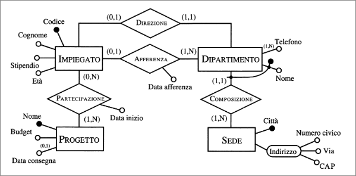  

**Generalizzazioni:**  Rappresentano legami logici tra un entità $E$, detta *genitore* e una o più entità $E_1,....,E_n$, dette figlie. $E$ le comprende come caso particolarre. Si dice in questo caso che $E$ è *generalizzazione* di $E_1,...,E_n$ e che queste sono *specializzazioni* di $E$.  
Per esempio l'entità $PERSONA$ è una generalizzazione delle entità $UOMO$ e $DONNA$.  

Tra le entità coinvolte in una generalizzazione vale:  

+ Ogni occorrenza di un'entità figlia è anche una occorrenza dell'entità genitore (un occorrenza di $AVVOCATO$ è un'occorrenza di $PROFESSIONISTA$);
+ Ogni proprietà dell'entità genitore (attributi, identificatori, relazioni,...) è anche una proprietà delle entità figlie. Per esempio se $PERSONA$ ha attributi **Cognome** ed **Età**, anche le entità $UOMO$ e $DONNA$ possiedono questi attributi. Inoltre l'identificatore di $PERSONA$ è valido anche per $UOMO$ e $DONNA$. Queste proprietà delle generalizzazioni è nota sotto il nome di *ereditarietà*.  

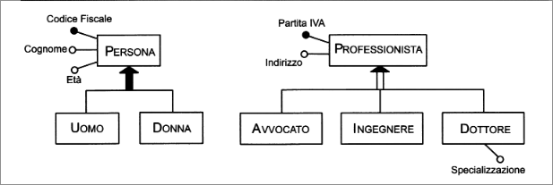  

Per le entità figlie le proprietò ereditate non vengono rappresentate esplicitamente.  
Le generalizzazioni possono essere classificate sulla base di due proprietà tra loro ortogonali.  

+ Una generalizzazione è *totale* se ogni occorrenza dell'entità genitore è una occorrenza di almeno una delle entità figlie, altrimenti è *parziale*  
+ Una generalizzazione è *esclusiva* se ogni occorrenza dell'entità genitore è al più un'occorrenza di una delle entità figlie, altrimenti è *sovrapposta*  

La generalizzazione tra $PERSONA$,$UOMO$,$DONNA$ è per esempio totale (gli uomini e le donne costituiscono tutte le persone) ed esclusiva (una persona è uomo o donna).  
Una generalizzazione tra $PROFESSIONISTA$ e $INGEGNERE$ e $DOTTORE$ è invece parziale ed esclusiva, poiché assumiamo che ciascun professionista abbia una sola professione principale e che vi siano altre professioni oltre a queste tre. Tra $PERSONA$ e $STUDENTE$ e $LAVORATORE$ esiste infine una generalizzazione parziale e sovrapposta poiché esistono studenti che sono anche lavoratori.  

In generale una stessa entità può essere coinvolta in più generalizzazioni diverse.  
Possono esserci generalizzazioni su più livelli: *gerarchia* di generalizzazioni.  
Infine una generalizzazione può avere solo un'entità figlia: si parla di *sottoinsieme*.  

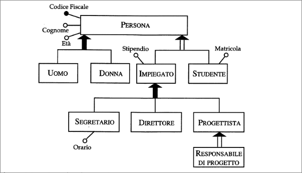  

