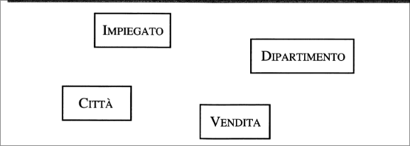

# Metodologie e modelli per il progetto  
## Il ciclo di vita dei sistemi informativi  
Il *ciclo di vita* di un sistema informativo, comprende generalmente:  

+ **Studio di fattibilità**. Serve a definire costi delle varie alternative possibili e stabilire le priorità di realizzazione delle varie componenti del sistema.  

+ **Raccolta e analisi dei requisiti**. Consiste nell'individuazione e nello studio delle proprietà e delle funzionalità che il sistema informativo dovrà avere.  

+ **Progettazione**. Si divide generalmente in *progettazione dei dati e progettazione delle applicazioni*. Nella prima di individua la struttura e l'organizzazione che i dati dovranno avere, nell'altra si definiscono le caratteristiche dei programmi applicativi.  

+ **Implementazione**. Consiste nella realizzazione del sistema informativo secondo la struttura e le caratteristiche definite nella fase di progettazione. Viene costruita e popolata la base di dati.  

+ **Validazione e collaudo**. Serve a verificare il corretto funzionamento e la qualità del sistema informativo. La sperimentazione- deve prevedere, per quanto possibile, tutte le condizioni operative.  

+ **Funzionamento**. In questa fase il sistema informativo diventa operativo ed esegue i compiti per i quali era stato originariamente progettato.    

Va precisato che il processo non è mai strettamente sequenziale in quanto durante l'esecuzione di una delle attività citate bisogna rivedere decisioni prese.  

### Metodologie di progettazione e basi di dati  

La metodologia più consolidata è articolata in tre fasi principali:  

+ **Progettazione concettuale**. Il suo scopo è quello di rappresentare le specifiche informali della realtà di interesse in termini di una descrizione formale e completa, ma dai criteri di rappresentazione utilizzati nei sistemi di gestione di basi di dati.  
In questa fase, il progettista deve cercare di rappresentare il contenuto della base di dati, senza preoccuparsi nè delle modalità con le quali queste informazioni verranno codificate in un sisema reale, nè dell'efficienza dei programmi che fanno uso di queste informazioni.  

+ **Progettazione logica**.  Consiste nella traduzione dello schema concettuale definito nella fase precedente, in termini di del modello di rappresentazione dei dati adottato dal sistema di gestione di base di dati a disposizione.  
Un modello logico ci consente di descrivere i dati secondo una rappresentazione ancora indipendente da dettagli fisici, ma concreta perché disponibile nei sistemi di gestione di basi di dati. In questa fase, le scelte si basano, anche, su criteri di ottimizzazione delle operazioni da effettuare sui dati.  
Si fanno anche uso di tecniche formali di verifica della qualità dello schema logico ottenuto (*normalizzazione*).  

  

## Modello Entità-Relazione  

Il modello Entità-Relazione è un modello *concettuale* di dati e fornisce una serie di strutture, dette *costrutti*, atte a descrivere la realtà di interesse in una maniera facile da comprendere.  
Questi costrutti vengono utilizzati per definire *schemi* che descrivono l'organizzazione e la struttura delle *occorrenze* dei dati (valori assunti dai dati al variare del tempo).  

  

Di seguito tutti i costrutti che il modello E-R mette a disposizione:  

  

### I costrutti principali del modello  

**Entità**: Rappresentano classi di oggetti (fatti, cose, persone) che hanno proprietà comuni ed esistenza "autonoma" ai fini dell'applicazione di interesse:  

  

$CITTA', DIPARTIMENTO, IMPIEGATO, ACQUISTO$ e $VENDITA$ sono esempi di entità.  
Una occorenza di un'entità è un oggetto della classe che l'entità rappresenta. Le città di Roma,Milano,Palermo sono esempi di occorrenze dell'entita $CITTA'$.  

**Relazioni (o associazioni)**: Rappresentano legami logici, significativi per l'applicazione d'interesse, tra due o più entità. $RESIDENZA$ è un esempio di relazione che può sussistere tra le entità $CITTA'$ e $IMPIEGATO$, mentre $ESAME$ è un esempio di relazione tra le entità $STUDENTE$ e $CORSO$.  
Una occorenza di relazione è un'ennupla,costituita da occorrenze di entità, una per ciascuna delle entità coinvolte.  

  

Esempi di occorrenze della relazione $ESAME$ tra le entità $STUDENTE,CORSO$ sono le coppie $e_1,e_2,e_3,e_4,e_5,e_6$  

  

E' anche possibile avere relazioni *ricorsive*, ovvero relazioni tra una entità e se stessa.  

  

Nella figura la relazione $COLLEGA$ sull'entità $IMPIEGATO$ connette coppie di impiegati che lavorano insieme, mentre la relazione $SUCCESSIONE$ sull'entità $SOVRANO$ associa a ogni sovrano di una dinastia il suo immediato successore. Da notare che , la relazione $SUCCESSIONE$ non è simmetrica. In questo caso è necessario stabilire i due *ruoli* che l'entità coinvolta gioca nella relazione. Questo può essere fatto con degli identificatori (**Successore** e **Predecessore**) alle linee uscenti.  
E' possibile infine avere relazioni n-arie, relazioni cioè che coinvolgono più di due entità.  

  

**Attributi**: descriono le proprietà elementari di entità o relazioni che sono di interesse ai fini dell'applicazione. Per esempio *Cognome*,**Stipendio**, **Età** sono possibili attributi dell'entità $IMPIEGATO$, mentre *Data* e *Voto* lo sono per la relazione $ESAME$ tra $STUDENTE$ e $CORSO$. Un attributo associa a ciascuna occorrenza di entità o relazione un valore appartenente a un insieme, detto *dominio*m che ccontiene i valori ammissibili per l'attributo.  
Per esempio l'attributo **Cognome** dell'entità $IMPIEGATO$ può avere come dominio l'insieme delle stringhe di 20 caratteri, mentre l'attributo *Età* può avere come dominio gli interi compresi tra 18 e 65.  

Può essere utile raggruppare gli attributi di una medesima entità o relazione che presentano affinità nel loro significato o uso: l'insieme di attributi viene detto *attributo composto*.  
Possiamo per esempio raggruppare gli attributi *Via*,*Numero*,*CAP* dell'entità $PERSONA$ per formare l'attributo composto *Indirizzo*.  

  

