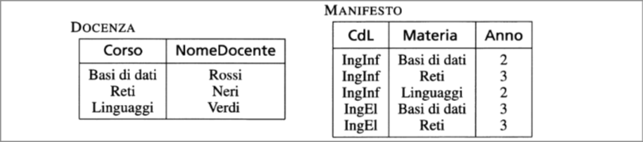

# Modelli dei Dati 
## DBMS VS FILE SYSTEM
> L'efficienza di un sistema si misura in termini di: 
> - Tempo;
> - Memoria.  
>
> La gestione di insiemi di dati grandi e persistenti è possibile anche attraverso sistemi più semplici, i *file system* dei sistemi 
operativi.  
I **DBMS** sono stati concepiti e realizzati per estendere le funzioni dei file system, fornendo la possibilità di accesso condiviso 
agli stessi dati da parte di più utenti e applicazioni e garantendo anche molti altri servizi in maniera integrata.  
Nei **programmi tradizionali** che accedono ai file, ogni programma contiene una descrizione della struttura del file stesso, con i conseguenti rischi di *incoerenza* fra le descrizioni.  
Nei DBMS esiste una porzione della base di dati (***Catalogo***,***Dizionario***) che contiene una descrizione centrallizata dei dati che può essere utilizzata dai vari programmi.

## Modello di rappresentazione di dati 
>Un **modello dei dati** è un insieme di concetti utilizzati per organizzare i dati di interesse e descriverne la struttura in modo   che essa risulti comprensibile a un elaboratore.  
  Ogni modello dei dati fornice **meccanismi di strutturazione**, analoghi ai costruttori di tipo dei linguaggi di programmazione (ad esempio in *C* è possibile costruire tipi per mezzo dei costruttori *struct*,*union*,**pointer*,...)
*Il modello relazionale dei dati* permette di definire tipi per mezzo del costruttore **relazione**, che consete di organizzare i dati in insieme di record a struttura fissa.
Una relazione viene spesso rappresentata per mezzo di una tabella, le cui righe rappresentano specifici record e le cui colonne 
corrispondono ai campi del record.
In una base di dati relazionale ci sono in generale più relazioni.  
  
Oltre al modello relazionale abbiamo:  
> - *il modello gerarchico*, basato sull'uso di strutture ad albero;  
> - *il modello reticolare*, basato sull'uso di grafi;
> - *il modello a oggetti*, estende alle basi di dati il paradigma di programmazione a oggetti;
> - *il modello XML*, rivisitazione del modello gerarchico, in cui però i dati vengono presentati assieme alla loro descrizione e non devono sottostare rigidamente a un'unica struttura logica;
> - *NoSQL*, che cercano di superare alcune delle limitazioni dei sistemi relazionali in termini di prestazioni quanto di rigidità dell'organizzazione dei dati.  
>
>I modelli dei dati elencati sono detti **logici**, per sottolineare il fatto che le strutture utilizzate da questi modelli, pur essendo astratte, riflettono una particolare organizzazione (alberi, grafi, tabelle, oggetti). Sono stati poi introdotti altri modelli di dati, detti **concettuali**. Il loro nome deriva dal fatto che tendono a descrivere concetti del mondo reale, piuttosto che i dati utili a rappresentarli.

## Schemi e Istanze

Nelle basi di dati esiste una parte invariante nel tempo, detta *schema* della base di dati, costituita dalle caratteristiche dei dati, e una parte variabile nel tempo detta istanza della base di dati. Nella foto precedente, le relazioni hanno una struttura fissa: la relazione DOCENZA ha due colonne (**attributi**), che si riferiscono rispettivamente a corsi e docenti.
*Lo schema di una relazione* è costituito dalla sua intestazione, cioè dal nome della relazione seguito dai nomi dei suoi attributi ad esempio:

 
  
    <i>DOCENTE</i>
  
  (Corso,
  NomeDocente)

Viceversa, le righe della tabella variano nel tempo, e corrispondono ai corsi attualmente offerti e ai relativi docenti.
Durante la vita della base di dati, docenti e corsi vengono aggiunti, tolti o modificati. *L'istanza di una relazione* è costituita dall'insieme, variante nel tempo, delle sue righe. Ad esempio: 

  Basi di Dati Rossi  
  Reti Neri  
  Linguaggi Verdi

Le tre righe fanno riferimento allo schema e solo attarverso di esso possono essere interpretate.
Si dice che lo schema è la componente intensionale della base di dati e l'istanza la componente estensionale.

## Livelli di astrazione nei DBMS
>La nozione di modello e di schema descritta può essere ulteriormente sviluppata tenendo presenti altre dimensioni nella descrizione dei dati. In particolare esiste un'architettura standard per DBMS articolata su tre livelli, detti *esterno*, *logico*, *interno*; per ciascun livello esiste uno schema.
> - *Lo schema logico* costituisce una descrizione dell'intera base di dati per mezzo del modello logico adottato dal DBMS (modello relazionale o a oggetti)
> - *Lo schema interno* costituisce la rappresentazione dello schema logico per mezzo di strutture fisiche di memorizzazione. Per esempio, una relazione può essere rappresentata fisicamente per mezzo di un file sequenziale, un file hash o un file sequenziale con più indici
> - *Lo schema esterno* costituisce la descrizione di una porzione della base di dati di interesse, per mezzo del modello logico. Uno schema esterno può prevedere organizzazioni dei datidiverse rispetto a quelle utilizzate nello schema logico, che riflettono il punto di vista di un particolare utente o più. Pertanto è possibile associare a uno schema logico vari schemi esterni.  
>
> Nei sistemi moderni il livello esterno non è esplicitamente presente, ma è possibile definire relazioni derivate (*viste*).Per esempio come in figura:
>
>
> Uno studente potrebbe essere interessato solo ai corsi offerti dal manifesto del suo corso di laurea; questa indormazione è presente nella relazione *ELETTRONICA*, ottenuta come vista a partire dalla relazione *MANIFESTO*.  
Inoltre tramite- il meccanismo delle *autorizzazioni di accesso*, è possibile disciplinare gli accessi degli utenti alla base di dati
