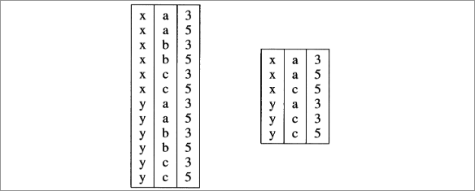
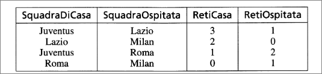
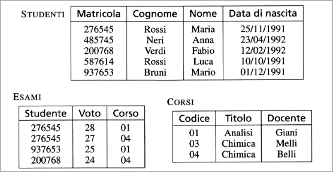

# Modello Relazionale 
## Modello relazionale: strutture
### Modelli logici nei sistemi di basi di dati 
 Il *modello relazionale* si basa su due concetti, *relazione* e *tabella*.  
La nozione di relazione proviene dalla matematica, in particolare dalla teoria degli insiemi, mentre il concetto di tabella è semplice e 
intuitivo. 
Il modello relazonale risponde al requisito dell'indipendenza dei dati, che prevede una distinzione dei dati, fra livello *fisico* e *logico*.
gli utenti che accedono ai dati e ai programmatori che creano applicazioni fanno riferimento solo al livello logico, non è necessario conoscere le strutture fisiche.
Il termine relazione viene utilizzato in tre accezioni differenti:
 - *relazione matematica*, secondo la definizione normalmente data nella teoria degli insiemi
- *relazione* secondo la definizione del modello relazionale che presenta alcune differenze rispetto alla teoria degli insiemi
 - *relazione* costrutto del modello concettuale (*Entity-Relationship*), utilizzato per descrivere legami nel mondo reale.  
### Relazioni e tabelle
Dati due insiemi $\mathrm{D}_1$ e $\mathrm{D}_2$ , $\mathrm{D}_1$ X $\mathrm{D}_2$ l'insieme delle coppie ordinate ($\mathcal{v}_1$, $\mathcal{v}_2$), tali che $\mathcal{v}_1$ è un elemento di $\mathrm{D}_1$ e 
$\mathcal{v}_2$ è un elemento di $\mathrm{D}_2$.  

Una *relazione matematica* sugli insiemi $\mathrm{D}_1$ e $\mathrm{D}_2$ (chiamati ***domini*** della relazione) è un sottoinsieme di $\mathrm{D}_1$ X $\mathrm{D}_2$. 
Dati gli insiemi $\mathcal{A}$={1,2,4} e $\mathcal{B}$={a,b} la cui una possibile relazione matematica. Una possibile relazione matematica su questi è {(1,a),(2,a),(4,a)}.  
Le relazioni possono essere rappresentate sotto forma tabellare.
  
>
Le definizioni precedenti di prodotto cartesiano e relazione matematicafanno riferimento a due insiemi, ma possono essere generalizzate rispetto al numero di insiemi. Dati $\mathcal{n}$ > 0 insiemi ,$\mathcal{D}_1$ ,...,$\mathcal{D}_n$. Non necessariamente distinti, $\mathcal{D}_1$ X...X $\mathcal{D}_n$
 è costituito dall'insieme delle $\mathcal{n}$-uple($\mathcal{v}_1$,...,$\mathcal{v}_n$) tale che $\mathcal{v}_\mathcal{i}$ appartiene a $\mathcal{D}_\mathcal{i}$ per 1 $\leq$ $\mathcal{i}$ $\leq$ $\mathcal{n}$.
Una *relazione matematica* sui domini $\mathcal{D}_1$,...,$\mathcal{D}_\mathcal{n}$ è un sotto insieme del prodotto cartesiano $\mathcal{D}_1$ X ... X $\mathcal{D}_\mathcal{n}$.  
Il numero delle $\mathcal{n}$ componenti del prodotto cartesiano viene detto *grado* del prodotto cartesiano e della relazione.
Il nuero di elementi della relazione viene chiamato *cardinalità* della relazione.
Di seguito una rappresentazione tabellare del prodotto cartesiano e di una relazione di grado tre sui domini $\mathcal{C}$={$\mathcal{x},\mathcal{y}$}, $\mathcal{D}$={$\mathcal{a},\mathcal{b},\mathcal{c}$}, $\mathcal{E}$={$\mathcal{3},\mathcal{5}$}. La relazione ha cardinalità pari a sei.  
  
Le relazioni (e le corrispondenti tabelle) possono essere utilizzate per rappresentare dati di interesse per qualche applicazione. Ad esempio
la seguente relazione: 
  
che contiene i dati relativi ai risultati di un insieme di partite di calcio.  
Essa è definita con riferimento a due domini *intero* e *stringa*, ogniuno dei quali compare due volte. La relazione è un sottoinsieme del prodotto cartesiano 

<b>Stringa x Stringa x Intero x Intero</b>
  

### Relazioni con attributi
In base alla definizione, una relazione matematica è un *insieme* di 
$\mathcal{n}$-uple *ordinate* ($\mathcal{v}_\mathcal{1}$,...,$\mathcal{v}_\mathcal{n}$), con $\mathcal{v}_\mathcal{i}$ $\in$ $\mathcal{D}_\mathcal{i}$ con $\mathcal{i}$=$\mathcal{1},...,\mathcal{n}$.  
Con riferimento all'uso che facciamo delle relazioni per organizzare i dati nelle nostre base di dati, possiamo dire che ciascuna n-upla contiene dati fra loro collegati, stabilendo un legame fra loro.  

Per esempio la prima n-upla della relazione nella figura stabilisce un legame fra i valori "Juventus", "Lazio", "3", "1". A indicare che il risultato della partita fra Juventus e Lazio è 3 a 1. Possiamo poi ricordare che una relazione è un insieme:
+ non è definito un ordinamento fra le n-uple;
+ le n-uple sono distinte tra loro.  

Al tempo stesso ciascuna n-upla è, al proprio interno, *ordinata*: l'$\mathcal{i}$-valore di ciascuna proviene dall'$\mathcal{i}$esimo dominio.  
Una relazione è sostanzialmente un insieme di record omogenei, definiti sugli stessi campi.  
Nel caso dei recordy, a ogni campo è associato un nome, detto attributo, che descrive il "ruolo" giocato dal dominio stesso.  
Ad esempio per la relazione relativa alle partite, possiamo usare nomi quali **SquadraDiCasa**, **SquadraOspitata**, **RetiCasa**, **RetiOspitata**.  

Nella rappresentazione tabellare, utilizziamo gli attributi come intestazioni per le colonne, che devono essere diversi l'uno dall'altro.
Modificando la definizione di relazione con l'introduzione degli attributi, possiamo vedere che l'ordinamento degli attributi risulta irrilevante: non è più necessario parlare di primo dominio, secondo dominio e così via, è sufficiente fare riferimento agli attributi.  
Per formalizzare i concetti, indichiamo con $\mathcal{D}$ l'insieme dei domini e specifichiamo la corrispondenza fra attributi e domini, nell'ambito di una relazione, per mezzo di una funzione *dom* : $\mathcal{X} \rightarrow \mathcal{D}$ che associa a ciascun attributo A $\in \mathcal{X}$. Poi diciamo che una *tupla* su un insieme di attributi $\mathcal{X}$ è una funzione *t* che associa a ciascun attributo A $\in \mathcal{X}$ un valore del dominio *dom*(A).
Possiamo quindi dare la nuova definizione di relazione: una *relazione* su $\mathcal{X}$ è un insieme di tuple su $\mathcal{X}$.  
Se *t* è una tupla su $\mathcal{X}$ e A $\in \mathcal{X}$, allora *t*[A] indica il valore di *t* su A. Ad esempio:  
*t*[**SquadraOspitata**] = Lazio   
ma anche per insiemi di attributi:  
*t*[**SquadraOspitata,RetiOspitata**]  
è una tupla su due attributi.  
### Relazioni e basi di dati 
Di solito non è sufficiente (per organizzare dati per un'applicazione) una singola relazione: una base di dati in genere è costituita da più relazioni.  

  
+ la prima relazione contiene informazioni relative a un insieme di studenti (con matricola,cognome,nome,data);
+ la seconda relazione contiene informazioni relative agli esami: il numero di matricola dello studente, il codice del corso e il voto. Questa relazione fa riferimento ai dati contenuti nella prima e seconda relazione;
+ la terza relazione contiene informazioni su alcuni corsi, con codice, titolo e docente.  

La base di dati nella figura mostra una delle caratteristiche fondamentali del modello relazionale, che viene indicata dicendo che esso è "basato su valori": i riferimenti fra dati in relazioni diverse sono rappresentati per mezzo di valori di domini che compaiono nelle tuple.
Questo modello presenta i seguenti vantaggi:
+ esso richiede di rappresentare solo ciò che è rilevante dal punto di vista dell'applicazione; i puntatori sono qualcosa di aggiuntivo;
+ la rappresentazione logica dei dati non fa alcun riferimento a quella fisica, che può cambiare nel tempo;
+ essendo tutta l'informazione contenuta nei valori, è relativamente semplice trasferire i dati da un contesto a un altro.  

Possiamo ora riassuemere le definizioni relative al modello relazionale con un po' di precisione:
+ Uno *schema di relazione* è costituito da un simbolo $\mathcal{R}$, detto *nome della relazione*, e da un insieme di *attributi* $\mathcal{X}$ = {$\mathcal{A}_\mathcal{1},...,\mathcal{A}_\mathcal{n}$}, il tutto indiciato di solito con $\mathcal{R}$($\mathcal{X}$)
+ Uno *schema di base di dati* è un insieme di schemi di relazione con nomi diversi:
***R*** = { $\mathcal{R}_{1},...,\mathcal{R}_{\mathcal{n}}$ }
