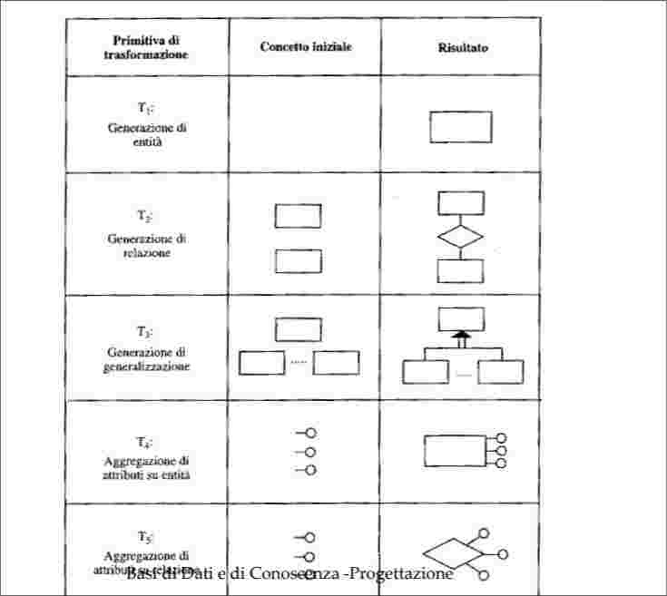

# Progettazione Concettuale  

## Raccolta e analisi dei requisiti  
Per *raccolta di requisiti* si intende la completa individuazione dei problemi che l'applicazione da realizzare deve risolvere e le caratteristiche che tale applicazione dovrà avere (dati e operazioni).  
*L'analisi dei requisiti* consiste nel chiarimento e nell'organizzazione delle specifiche dei requisiti.  

I requisiti di un'applicazione provengono da fonti, le cui principali:  
+ *Gli utenti dell'applicazione* (interviste, documentazione scritta dagli utenti).  
+ *Documentazione esistente* che ha qualche pertinenza con il problema allo studio: moduli, regolamenti, procedure aziendali, normative.  
+ *Realizzazioni persistenti*, applicazioni che si devono rimpiazzare o che devono interagire con il sistema da realizzare. La conoscenza di questi applicativi può fornirci informazioni utili.  

Proviamo a fissare alcune regole per ottenere una specifica dei requisiti più precisa e senza ambiguità  

+ **Scegliere il corretto livello di astrazione.** È bene evitare termini troppo generici o troppo specifici che rendono poco chiaro un concetto.  
+ **Standardizzare la struttura delle frasi.** Nella specifica di requisiti è preferibile utilizzare sempre lo stesso stile sintattico.  
+ **Evitare frasi contorte.** Le definizioni devono essere semplici e chiare.  
+ **Individuare sinonimi/omonimi e unificare i termini**. I sinonimi  omonimi possono generare ambiguità e vanno chiarite: sinonimi unificando i termini , omonimi trovandone altri.  
+ **Rendere esplicito il riferimento tra termini.** L'assenza di un contesto di riferimento rende alcuni concetti ambigui: bisogna esplicitare il riferimento tra termini.  
+ **Costruire un glossario dei termini.** Per la comprensione e la precisazione dei termini usati.  

  

  
*Esempio di strutturazione dei requisiti*

## Rappresentazione concettuale dei dati  
### Criteri generali di rappresentazione  
Nella progettazione concettuale conviene seguire le "regole concettuali" del modello E-R.  

+ *Se un concetto ha proprietà significative e/o descrive classi di oggetti con esistenza autonoma, è opportuno rappresentarlo con una entità*.
+ *Se un concetto ha una struttura semplice e non possiede proprietà rilevanti associate, è opportuno rappresentarlo con un attributo di un altro concetto a cui si riferisce*  
+ *Se sono state individuate due (o più) entità e nei requisiti compare un concetto che le associa, questo concetto può essere rappresentato da una relazione*  
+ *Se uno o più concetti risultano essere casi particolari di un altro, è opportuno rappresentarli facendo uso di una generalizzazione*.  

## Strategie di progetto   
### Strategia top-down  
In questa stragia lo schema concettuale viene prodotto mediante una serie di raffinamenti successivi a partire da uno schema iniziale che descrive tutte le specifiche con pochi concetti molto astratti. Lo schema viene poi via via raffinato mediante trasformazioni che aumentano il dettaglio dei vari concetti presenti:  

  

In figura vengono rappresentati i diversi piani di raffinamento del processo: ogniuno di questi piani contiene uno schema che descrive le medesime informazioni a un diverso livello di dettaglio.   
Nel passaggio da un livello di raffinamento a un altro, lo schema viene modificato facendo uso di alcune trasformazioni elementari che vengono denominate *primitive di trasformazione top-down*  

Esempi di queste sono:  
+ La definizione degli attributi di una entità o di una relazione;  
+ La reificazione di un attributo o di una entità;  
+ La decomposizione di una relazione in due relazioni distinte  
+ La trasformazione di una entità in una gerarchia di generalizzazione.  

  

Il vantaggio della strategia top-down è che il progettista può inizialmente descrivere le specifiche dei dati trascurandone i dettagli, per poi entrare nel merito.  

### Strategia bottom-up  

In questa strategia, le specifiche iniziali sono suddivise in componenti via via sempre più piccole, fino a quando queste componenti descrivono un frammento elementare della realtà di interesse. A questo punto, le varie componenti vengono rappresentate da semplici schemi concettuali che possono consistere anche in singoli concetti. I vari schemi così ottenuti vengono poi fusi fino a giungere, attraverso una completa integrazione di tutte le componenti,allo schema concettuale finale.  

  

La fase di decomposizione delle specifiche, la successiva fase di rappresentazione delle componenti di base e la fase finale d'integrazione degli schemi elementari. A differenza della strategia top-down, con questa strategia i vari concetti presenti nello schema finale vengono via via introdotti durante le varie fasi. Anche in questo caso , lo schema finale si ottiene attraverso alcune trasformazioni elementari che vengono denominate *primitive di trasformazioni bottom-up* che introducono in uno schema nuovi concetti non presenti precedentemente e in grado di descrivere aspetti della realtà di interesse che non erano ancora stati rappresentati.  
Esempi di questi:  
+ L'introduzione di una nuova entità o di una relazione dall'analisi delle specifiche.  
+ L'individuazione nelle specifiche di un legame tra diverse entità riconducibile a una generalizzazione.  
+ L'aggregazione di una serie di attributi in un entità o in una relazione.  

  

Il vantaggio della strategia bottom-up è che si adatta a una decomposizione del problema in componenti più semplici, facilmente individuabili. Si presta bene in lavori di gruppo.  

### Strategia Inside-Out

Si individuano inizialmente solo alcuni concetti importanti e poi si procede a partire da questi, a "macchia d'olio". Si rappresentano prima i concetti in relazione con i concetti iniziali, per poi muoversi verso quelli più lontani.  

  

Si può osservare che è stata individuata inizialmente l'entità $IMPIEGATO$ con i suoi attributi. A partire da queste entità sono state rappresentate le correlazioni esistenti tra gli impiegati e i dipartimenti dell'azienda, individuando le relazioni $DIREZIONE$ e $AFFERENZA$ e l'entità $DIPARTIMENTO$ con i relativi attributi. Infine partendo da quest'ultima entità  sono state rappresentate le sedi dell'azienda e l'appartenenza dei dipartimenti alle relative sedi.  

  

Questa strategia ha il vantaggio che non richiede integrazioni. D'altro canto è necessario esaminare , di volta in volta, tutte le specifiche per individuare concetti non ancora rappresentati e descrivere i nuovi concetti in dettaglio.  

### Strategia mista

Cerchiamo di combinare i vantaggi della strategia top-down e bottom-up.  
Il progettista suddivide i requisiti in componenti separate, come in bottom-up ma allo stesso tempo definisce uno *schema scheletro* contenente i concetti principali dell'applicazione.  

E la più flessibile tra le strategie viste: suddivide un problema complesso in sottoproblemi e procede per raffinamenti successivi.  

## Qualità di uno schema concettuale  

#### Correttezza  
Lo schema utilizza i costrutti del modello di riferimento  

#### Completezza  

tutti i dati di interesse sono rappresentati e tutte le operazioni sono eseguibili a partire dai concetti descritti nello schema  

#### Leggibilità  
I requisiti sono rappresentati in modo comprensibile. 

#### Minimilità  

Le specifiche sono rappresentate una sola volta. Non sempre le ridondanze sono inutili.  

## Metodologia di progettazione  

#### Analisi dei requisiti  

1. Costruire un glossario dei termini  
2. Analizzare i requisiti ed eliminare le ambiguità presenti  
3. Ragruppare i requisiti in insiemi omogenei  

#### Passo base  
1. individuare i concetti più rilevanti e rappresentatarli in uno schema scheletro  

#### Passo iterativo  (per tutti i sottoschemi)  
1. Raffinare i concetti presenti sulla base delle loro specifiche  
2. Aggiungere nuovi concetti allo schema per descrivere specifiche non ancora descritte.  

#### Passo d'integrazione  

1. Integrare i vari sottoschemi in uno schema generale facendo riferimento allo schema scheletro.  

#### Analisi di qualità  
1. Verificare la correttezza dello schema ed eventualmente ristrutturare lo schema  
2. Verificare la completezza dello schema ed eventualmente ristrutturare lo schema  
3. Verificare la minimilità e eventualmente ristrutturare lo schema  
4. Verificare la leggibilità ed eventualmente ristrutturare lo schema  

