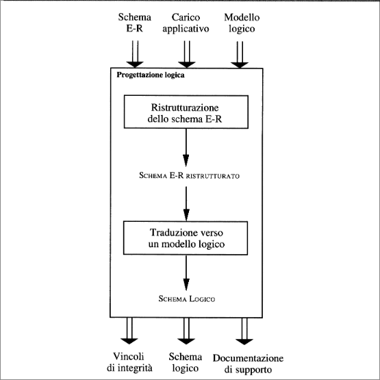
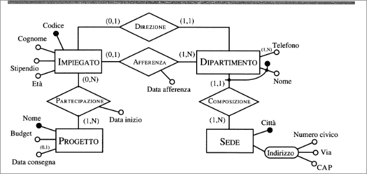
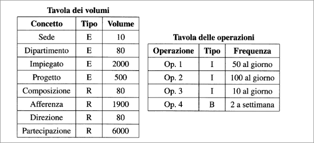
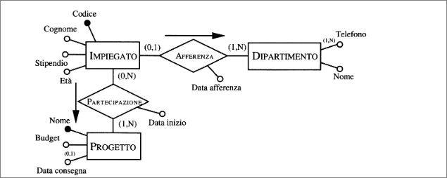
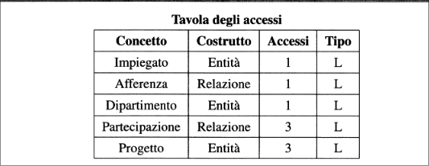

# Progettazione Logica  
## Fasi della progettazione logica
Le attività principali della progettazione logica sono la riorganizzazione dello schema concettuale e la traduzione in un modello logico.  
La progettazione logica viene articolata in due fasi:  
+ **Ristrutturazione dello schema E-R:** È una fase indipendente dal modello logico scelto e si basa su criteri di ottimizzazione dello schema e di semplificazione della fasse successiva  
+ **Traduzione verso il modello logico:** fa riferimento ad un unico modello logico (nel nostro caso, relazionale) e può includere una ulteriore ottimizzazione che si basa sulle caratteristiche del modello logico stesso  

  

I dati di ingresso della prima fase sono lo schema concettuale prodotto nella fase precedente e il *carico applicativo* previsto, in termini di dimensione dei dati e caratteristiche delle operazioni.  
Il risultato è che si ottiene uno schema E-R ristrutturato, che non è più uno schema concettuale, in quanto costituisce una rappresentazione dei dati che tiene conto degli aspetti realizzativi. In questa seconda fase è possibile effettuare delle ottimizzazioni (*normalizzazione*). Lo schema logico finale, i vincoli d'integrità definiti su di esso e la relativa documentazione, costituiscono i prodotti finali della progettazione logica.  

## Analisi delle prestazioni su schemi E-R  
+ **Costo di una operazione:** viene valutato in termini di numero di occorrenze di entità e associazioni che mediamente vanno visitate per rispondere a una operazione sulla base di dati.  
+ **Occupazione di memoria:** viene valutato in termini dello spazio di memoria necessario per memorizzare i byte descritti dallo schema.  

Necessitiamo di ulteriori informazioni:

+ **Volume dei dati:**  
  - numero di occorrenze di ogni entità e associazione dello schema;
  - dimensioni di ciascun attributo.  
+ **Caratteristiche delle operazioni:**  
  - tipo dell'operazione (interattiva o batch);  
  - frequenza;
  - dati coinvolti.  

  

Prendiamo come esempio il modello in figura, le possibili operazioni potrebbero essere:  

**Operazione 1:** assegna un impiegato a un progetto  
**Operazione 2:** trova i dati di un impiegato, del dipartimento nel quale lavora e dei progetti ai quali partecipa  
**Operazione 3:** trova i dati di tutti gli impiegati di un certo dipartimento  
**Operazione 4:** per ogni sede, trova i suoi dipartimenti con il cognome del direttore e l'elenco degli impiegati del dipartimento  

Il volume dei dati e le caratteristiche generali delle operazioni possono essere descritti facendo uso di tabelle come:  

  

Nella tavola dei volumi vengono riportati tutti i concetti dello schema (entità e associazioni) con il volume previsto a regieme.  
Nella tavola di operazioni riportiamo per ogni operazione, la frequenza prevista e un simbolo che indica se l'operazione è interattiva (**I**)o batch (**B**).  

Nella tavola dei volumi, il numero delle occorrenze delle associazioni dipende da due parametri: il numero delle occorrenze delle associazioni dipende da due parametri: il numero delle occorrenze delle entità coinvolte nelle associazioni e il numero (medio) di partecipazioni di una occorrenza di entità alle occorrenze di associazioni. Il secondo parametro dipende a sua volta dalle cardinalità delle associazioni.  
Per esempio, il numero di occorrenze dell'associazione $COMPOSIZIONE$ è pari al numero dei dipartimenti, perché le cardinalità ci dicono che un dipartimento appartiene a una sola sede.   

Per ogni operazione, possiamo descrivere graficamente con uno schema di operazione che consiste nel frammento dello schema E-R interessato dall'operazione, sulla quale  viene disegnato il "cammino logico" da percorrere per accedere alle informazioni d'interesse.  

  

In figura con riferimento all'Operazione2: per ottenere le informazioni d'interesse su un impiegato si parte dall'entità $IMPIEGATO$ per accedere attraverso all'associazione $AFFERENZA$, al suo dipartimento e attraverso l'associazione $PARTECIPAZIONE$ ai progetti ai quali partecipa.  
Consideriamo ancora l'Operazione2: facendo riferimento allo schema di operazione dobbiamo innanzitutto accedere a una occorrenza dell'entità $IMPIEGATO$ per accedere poi a un'occorrenza dell'associazione $AFFERENZA$ e attraverso questa, a una occorenza dell'entità $DIPARTIMENTO$. successivamente per conscere i dati dei progetti ai quali lavora, dobbiamo accedere a tre occorrenze dell'associazione $PARTECIPAZIONE$.  
Tutte questo può essere riassunto in una tavola degli accessi.  

  

## Ristrutturazione di schemi E-R  

