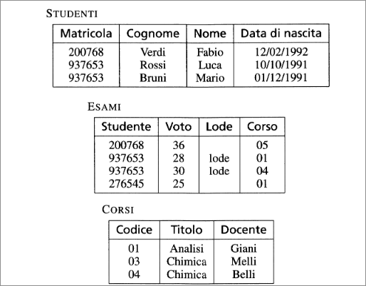
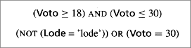
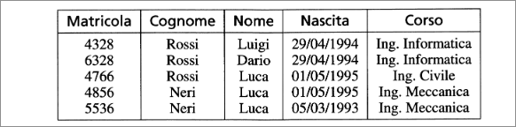
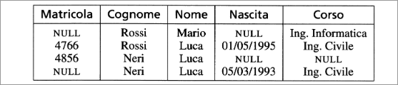
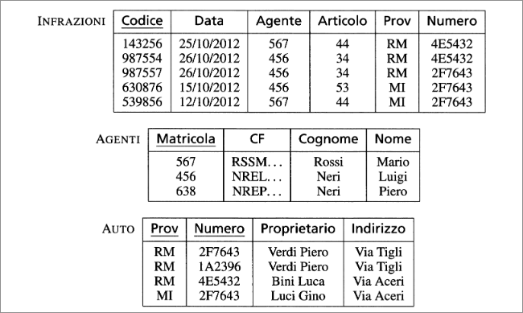
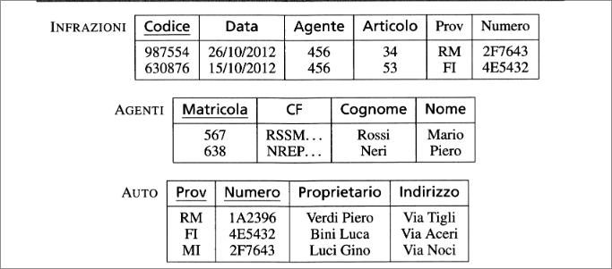

# Vincoli di integrità
Le strutture del modello relazionale ci permettono di organizzare le informazioni per le nostre applicazioni. In molti casi, però, non è vero che qualsiasi insieme di tuple sullo schema rapprresenti informazioni corrette per l'applicazione. Ad esempio:  
  
+ Nella prima tupla della relazione *ESAMI*  abbiamo un voto pari a 36, che nel sistema italiano, non è ammissibile.
+ Nella seconda tupla ancora della relazione *ESAMI* viene attribuita la lode ad un esame il cui voto è 28.
+ Le ultime due tuple della relazione *STUDENTI* contengono informazioni su due studenti diversi con lo stesso numero di matricola.
+ La quarta tupla nella relazione *ESAMI* presenta , per l'attributo *Studente*, un valore che non compare fra i numeri di matricola nella relazione *STUDENTI*. Analogamente la prima tupla presenta un codice di corso che non compare nella relazione *CORSI*.  

Per evitare queste situazioni è stato introdotto il concetto di *vincolo d integrità*, come proprietà che deve essere soddisfatta dalle istanze che rappresentano informazioni corrette per l'applicazione. Ogni vincolo può essere visto come un *predicato* che associa a ogni istanza il valore *vero* o *falso*. Se il predicato assume il valore *vero*, allora diciamo che l'istanza *soddisfa* il vincolo. In generale, a uno schema di base di dati associamo un insieme di vincoli e consideriamo *corrette* le istanze che soddisfano tutti i vincoli.  
E' possibile classificare i vincoli a seconda degli elementi di una base di dati che ne sono coinvolti:  

- Un vincolo è *intrarelazionale* se il suo soddisfacimento è definito rispetto a singole relazioni della base di dati; talvolta il coinvolgimento riguarda le tuple (o i valori addirittura) separatamente le une dalle altre:
  - un *vincolo di tupla* è un vincolo che può essere valutato su ciasuna tupla indipendentemente dalle altre;
  - un vincolo definito sui singoli valori (caso voti > 30) viene detto *vincoli sui valori*.
- Un vincolo *interrelazionale* se coinvolge più relazioni.
## Vincoli di tupla
Una possibile sintassi per esprimere vincoli di questo tipo è quella che permette di definire espressioni booleane (AND, OR , NOT) con atomi che confrontano (operatori di uguaglianza, disuguaglianza, ordinamento) valori di attributo o espressioni aritmetiche su valori di attributo.  
  
## Chiavi 
  
I valori delle varie tuple sono diversi l'uno dall'altro. Ad *identificare univocamente* gli studenti ci pensa il numero di matricola.  
Intuitivamente una chivae è un insieme di attributi utilizzato per identificare univocamente le tuple di una relazione.  
Formalmente:  
+ Un insieme $K$ di attributi è *superchiave* di una relazione *r* se *r* non contiene due tuple distinte $t_1$ e$t_2$ con $t_1[K]=t_2[K]$;
+ $K$ è *chiave* di *r* se è una superchiave minimale di *r* (cioè non esiste un'altra superchiave $K'$ di *r* che sia contenuta in $K$ come sottoinsieme proprio).  

Nell'esempio:
+ l'insieme {**Matricola**} è superchiave; è anche una superchiave minimale, in quanto contiene un solo attributo, quidni l'insieme è una chiave;
+ l'insieme {**Cognome, Nome, Nascita**} è superchiave; inoltre, nessuno dei suoi sottoinsiemi è superchiave: infatti esistono due tuple (prima e seconda) uguali su **Cognome** e **Nascita**, due (le ultime) uguali su **Cognome** e **Nome** e due uguali su **Nome** e **Nascita**; quindi {**Cognome, Nome, Nascita**} è un'altra chiave;
+ l'insieme {**Matricola, Corso**} è superchiave, ma non è una superchiave minimale, perché esiste un sottoinsieme proprio {**Matricola**}, esso stesso superchiave minimale e quindi {**Matricola,Corso**} non è una chiave.  
Non ci sono tuple uguali su **Cognome e Corso**, Cognome e Corso  formano una chiave ma è sempre così?  
I vincoli corrispondono a proprietà del mondo reale modellato dalla base di dati. Interessano a livello di schema. Ad uno schema associamo un insieme di vincoli e consideriamo **corrette** le istanze che soddisfano tutti i vincoli. Alcune sono chiavi per "caso".  
Per esempio, a uno schema:  

<i>STUDENTI</i>(<b>Matricola,Cognome,Nome,Nascita,Corso</b>)
  
vanno associati i vincoli che impongono come chiavi i due insiemi di attributi sopra discussi:

  {<b>Matricola</b>} 
  {<b>Cognome,Nome,Nascita</b>}

Entrambe le relazioni nelle figure precedenti soddisfano tutti e due i vincoli.  
l'esistenza delle chiavi garantisce l'accessibilità a ciascun dato dlla base di dati. Le chiavi permettono di correrlare i dati in relazioni diverse: il modello relazionale è basato su valori.  

## Chiavi e valori NULL

  
In questa figura notiamo problemi di due tipi.  
La prima tupa ha valori nulli su **Matricola** e **Nascita** e perciò su almeno un attributo di ciascuna chiave: questa tupla non è identificabile in alcun modo. Non è possibile, inoltre, in altre relazioni della base di dati, fare riferimento a questa tupla, visto che ciò andrebbe fatto con una chiave.  
L'esempio ci suggerisce dunque di porre limiti alla presenza di valori nulli nelle chiavi delle relazioni. Come soluzione, su una delle chiavi (detta *chiave primaria*) si vieta la presenza di valori nulli; sulle altre sono ammessi.  
## Vincoli di integrità referenziale  
  
Un vincolo di integrità referenziale (*foreign key*) fra un insieme di attributi $X$ di una relazione $R_{1}$ e un'altra relazione $R_{2}$ è soddisfatto se i valori su $X$ di ciascuna tupla dell'istanza $R_{1}$ compaiono come valori della chiave (primaria) dell'istanza di $R_{2}$.
Vi sono vincoli di integrità referenziale fra:
+ l'attributo Agente della relazione Infrazioni e la relazione Agenti;
+ gli attributi Prov e Numero di Infrazioni e la relazione Auto.  

  
La base di dati nella figura viola i vincoli: il primo perchè Agenti non contiene nessuna tupla con valore di Matricola pari a 456, e il secondo perchè Auto non contiene nessuna tupla con valore "RM" su Prov e un'altra con valore "2F7643" su Numero, ma questo non è sufficiente, perché è richiesto che ci sia una tupla su entrambi i valori.
