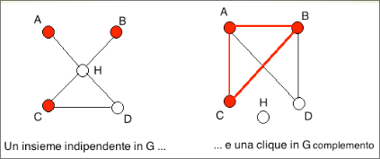

# Il problema CL è NP-completo  

Dati un grafo non orientato $G = (V,E)$ ed un intero $k ∈ ℕ$, esiste un sottoinsieme di almeno $k$ nodi tale che ogni coppia di nodi in quel sottoinsieme è collegata da un arco?

+ $\mathcal{I}_{CL} = \set{\lang G = (V, E), k \rang : G \text{ è un grafo non orientato e } k \text{ un intero positivo }}$.
+ $\mathcal{S}_{CL}(G, k) = \set{C \subset V }$.
+ $\mathcal{\pi}_{CL}(G, k, \mathcal{S}_{CL}(G, k)) = \exist C \in \mathcal{S}_{CL}(G, k) : |C| \geq k \land \forall(u, v) \in C [ (u,v) \in E ]$.  

Dimostriamo che $CL ∈ \bold{NP}$ mostrando un certificato che sia verificabile in tempo polinomiale: un certificato è un sottoinsieme C di V e per verificare che $C$ è effettivamente una clique per $G$, ossia che $C$ soddisfa
$\mathcal{\pi}_{CL}(G, k, \mathcal{S}_{CL}(G, k))$, dobbiamo esaminare ciascuna coppia di nodi $u, v \in C$ e verificare che $(u,v) ∈ E$, perciò verifichiamo un certificato in tempo $O(|V|2|E|)$

Dimostriamo che $CL$ è completo per $\bold{NP}$ riducendo polinomialmente $IS$ a $CL$.
Trasformiamo una istanza $\lang G=(V,E), k \rang$ di $IS$ nell’istanza $\lang G^c=(V,E_c), k \rang$ di $CL$, in cui $G^c$ è il grafo complemento di $G$: $(u,v)$ è un arco di $G^c$ se e soltanto se $(u,v)$ non è un
arco di $G$, ossia $E^c = \set{ (u,v) : (u,v) ∉ E }$.  

$I ⊆ V$ è un insieme indipendente per $G$ se e soltanto se $I$ è una clique per $G^c$, ossia, $\lang G=(V,E), k \rang$ è una istanza sì di $IS$ se e solo se $\lang G^c=(V,E^c), k \rang$ è una istanza sì di $CL$ e calcolare $\lang G^c=(V,E^c), k \rang$ richiede tempo polinomiale in $|\lang G=(V,E), k \rang|$   

  