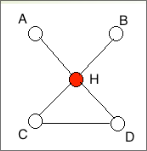
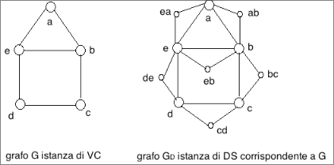
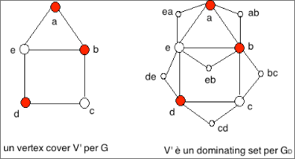
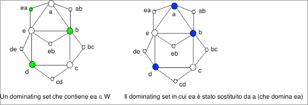

# Il problema DS è NP-completo  

Dato un grafo non orientato $G = (V,E)$, un sottoinsieme $D$ di nodi tale che ogni nodo che non è in $D$ ha almeno un vicino in $D$ è un dominating set di $G$.
Un $DS$ è un insieme di nodi che domina tutti i nodi del grafo.
Un vertex cover $V'$ è sempre un dominating set: se ogni arco ha un estremo in $V'$, ogni nodo non in $V'$ ha un vicino in $V'$.
Ma non sempre un dominating set è un vertex cover :  

  
in figura vediamo un dominating set che non è un vertex cover: infatti, l’arco $(C,D)$ non è coperto dal nodo $H$.

Nel problema Dominating Set vogliamo trovare un sottoinsieme di nodi “piccolo” che domini tutti i nodi di un grafo.    

Dati un grafo non orientato $G = (V,E)$ ed un intero $k ∈ ℕ$, esiste un sottoinsieme di al più $k$ nodi tale che ogni nodo che non è in quel sottoinsieme ha un vicino in esso?

+ $\mathcal{I}_{DS} = \set{\lang G = (V, E), k \rang : G \text{ è un grafo connesso non orientato e } k \text{ un intero positivo }}$.
+ $\mathcal{S}_{DS}(G, k) = \set{D \subset V }$.
+ $\mathcal{\pi}_{DS}(G, k, \mathcal{S}_{DS}(G, k)) = \exist D \in \mathcal{S}_{DS}(G, k) : |D| \leq k \land \forall u \in V-D [ \exist v \in D: (u,v) \in E ]$.  

Il primo passo, per dimostrare la $\bold{NP}$-completezza di $DS$, è dimostrare che $DS ∈ \bold{NP}$.

Un certificato è un sottoinsieme $D$ di $V$.
Per verificare che $D$ è effettivamente un Dominating Set per $G$, ossia che $D$ soddisfa  $\mathcal{\pi}_{DS}(G, k, \mathcal{S}_{DS}(G, k))$, dobbiamo esaminare ciascun nodo $u$ in  $V-D$  e verificare che esiste un nodo $v$  in $ D $ tale  che $ (u,v) ∈ E$. Perciò, verifichiamo un certificato in tempo O(|V|2|E|).  

Dimostriamo che $DS$ è completo per $\bold{NP}$ riducendo polinomialmente $VC$ a $DS$.
Trasformiamo una istanza $\lang G=(V,E), k \rang$ di $VC$ nell’istanza $\lang G_D=(V_D,E_D), k \rang$ di $DS$: in cui $V_D = V \cup W$, con $W = \set{ uv: (u,v) ∈ E }$ e in cui $E_D = E \cup F$, con $F = \set{ (u,uv), (v,uv): (u,v) ∈ E }$  

  

Trasformiamo una istanza $\lang G = (V, E), k \rang$  di $VC$ nell’istanza $ \lang G_D=(V_D,E_D), k \rang$ di $DS$, in cui $V_D = V \cup W, con W = { uv: (u,v) ∈ E }$ e $E_D = E \cup F$, $con F = \set{ (u,uv), (v,uv): (u,v) ∈ E }$

Se $G$ ha un vertex cover $V'$ con $|V'| ≤ k$ , allora, $V'$ è un dominating set per $G_D$, infatti: $V’ ⊆ V ⊆ V_D$; inoltre, comunque scegliamo un nodo $u$ in $V_D$:
+ se $u ∈ V – V'$: poiché $G$ è connesso esiste un arco $(u,v)$ in $E$, e poiché $V'$ è un vertex cover per $G$ allora $v ∈ V'$
+ se $u = xy ∈ W$, poiché $V'$ è un vertex cover per $G$ allora $x ∈ V’$ o $y ∈ V$

  

Trasformiamo una istanza $\lang G=(V,E), k \rang$ di $VC$ nell’istanza $\lang G_D=(V_D,E_D), k \rang$ di $DS$, in cui $V_D = V \cup W$, con $W = \set{ uv: (u,v) ∈ E }$ e $E_D = E \cup F$, con $F = \set{ (u,uv), (v,uv): (u,v) ∈ E }$.
Se $G_D$ ha un dominating set $D$ con $|D| ≤ k$, allora,

1) trasformiamo $D$ in un nuovo dominating set $D'$ per $G_D$ tale che $D' \subseteq V$ e $|D'|=|D|$
    - se $D$ contiene qualche $uv ∈ W$, sostituiamo $uv$ con $u$ (o con $v$, è indifferente)
    - poiché $uv$ domina solo $u$ e $v$, quello che otteniamo è un nuovo insieme dominante  
     

      
     

2) D’ è un vertex cover per $G$, infatti: per ogni arco $(u,v) ∈ E$, $uv ∈ W$
poiché $D'$ è un dominating set per $G_D$ allora $u ∈ D'$ oppure $v ∈ D'$ oppure $uv ∈ D'$ e poiché $D'$ non contiene nodi di $W$, ossia $uv ∉ D'$ allora $u ∈ D'$ oppure $v ∈ D'$.

Quindi, abbiamo dimostrato che $\lang G=(V,E), k \rang$ è una istanza sì di $VC$ se e solo se
$\lang G_D=(V_D,E_D), k \rang$ è una istanza sì di $DS$.
Infine, poiché calcolare $\lang G_D=(V_D,E_D), k\rang$ richiede tempo polinomiale in $|\lang G=(V,E), k \rang|$, questo completa la prova che $VC \leq DS$