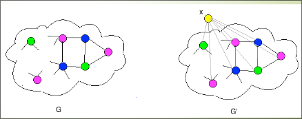

# Il problema COL è NP-completo
Dato un grafo non orientato $G = (V,E)$, si vuole assegnare un colore a ciascun nodo di $G$ in modo tale che vengano soddisfatti alcuni vincoli.
Nel problema di Colorabilità classico il vincolo che deve essere rispettato è: **nodi adiacenti devono essere colorati con colori diversi**.
Possono essere definite, ribadiamo, tante regole diverse per colorare i nodi di un grafo, ma, quando non viene specificato altrimenti, ci si riferisce a questa regola.  

Dati un grafo $G = (V,E)$ ed un intero $k ∈ ℕ$ (con $k ≤|V|$), esiste una assegnazione di $k$ colori ai nodi in $V$ che assegni colori diversi a nodi adiacenti?

+ $\mathcal{I}_{COL} = \set{\lang G = (V, E),k\rang : G \text{ è un grafo non orientato }\ \land \ k \in \N}$.
+ $\mathcal{S}_{COL}(G, k) = \set{c: V →\set{1, 2, … , k} }$.
+ $\mathcal{\pi}_{COL}(G, k, \mathcal{S}_{COL}(G, k)) = \exist c \in \mathcal{S}_{COL}(G, k) : ∀ (u,v) ∈ E [ c(u) ≠ c(v) ]$.  

Dimostriamo che $COL ∈ \bold{NP}$ mostrando un certificato che sia verificabile in tempo polinomiale:
Un certificato è una colorazione $c : V →\set{1, 2, … , k}$.
Per verificare che $c$ è effettivamente una colorazione per $G$, ossia che $c$ soddisfa
$\mathcal{\pi}_{COL}(G, k, \mathcal{S}_{COL}(G, k))$, dobbiamo esaminare ciascun arco $(u,v)$ in $E$ e verificare che
$c(u) ≠ c(v)$.
Perciò, verifichiamo un certificato in tempo $O(|E|)$, ossia, in tempo polinomiale in $| \lang G=(V,E), k \rang |$  

# Il problema $k$-COL    

Il problema $k$-$COL$ è una piccola variazione di $COL$: l’unica differenza è che l’intero $k$ non è parte dell’istanza, ma costante.
Questa sottigliezza “$k$ nell’istanza / $k$ costante” comporta un modo diverso di definire il problema $k$-$COL$.  

+ $\mathcal{I}_{COL} = \set{\lang G = (V, E)\rang : G \text{ è un grafo non orientato }}$.
+ $\mathcal{S}_{COL}(G, k) = \set{c: V →\set{1, 2, … , k} }$.
+ $\mathcal{\pi}_{COL}(G, k, \mathcal{S}_{COL}(G, k)) = \exist c \in \mathcal{S}_{COL}(G, k) : ∀ (u,v) ∈ E [ c(u) ≠ c(v) ]$.  

## $1,2,3$-COL
Nel problema $1$-$COL$ ci si domanda se tutti i nodi possono essere colorati con lo
stesso colore in modo tale che nodi adiacenti non siano colorati con lo stesso
colore.
Questo è possibile se e soltanto se nel grafo non esistono archi, ossia se e solo se $G$ è un insieme indipendente.
Questa proprietà è verificabile in tempo polinomiale. 
Perciò, $1$-$COL ∈ P$.
Anche $2$-$COL ∈ P$ $(2$-$COL \leq 2SAT)$.
$3$-$COL$ è $\bold{NP}$-completo (dimostrazione tramite una riduzione da $3SAT$).  

## $4$-COL  

$(\implies)$ 

Nel problema $4$-$COL$ ci si domanda se i nodi di un grafo $G$ possono essere colorati con 4 colori in modo tale che nodi adiacenti non siano colorati con lo stesso colore.
Abbiamo già visto che $4$-$COL ∈ \bold{NP}$.
Dimostriamo ora che $4$-$COL$ è completo per $\bold{NP}$ tramite una riduzione da $3$-$COL$.
Trasformiamo una istanza $G=(V,E)$ di $3$-$COL$ in una istanza $G'=(V',E')$ di $4$-$COL$:
$V'$ è ottenuto aggiungendo a $V$ un nuovo nodo $x$: sia $x ∉ V$, allora $V' = V \cup \set{x}$.
$E'$ è ottenuto aggiungendo ad $E$ gli archi che collegano $x$ a tutti i nodi in $V$:
$E’ = E \cup \set{ (x,u): u ∈ V}$  

  

Se i nodi di $G$ possono essere colorati con 3 colori in modo tale che nodi adiacenti non siano colorati con lo stesso colore, allora chiamiamo 1, 2 e 3 i colori e:
+ coloriamo con gli stessi colori i nodi in $V' – \set{x}$
+ coloriamo il nodo $x$ con il colore 4
+ abbiamo colorato con 4 colori i nodi di $G'$ in modo che nodi adiacenti hanno colori diversi

Quindi, $G'$ è $4$-colorabile

  

$(\impliedby)$

Trasformiamo una istanza $G=(V,E)$ di $3$-$COL$ in una istanza $G'=(V',E')$ di $4$-$COL$:
+ $V'$ è ottenuto aggiungendo a $V$ un nuovo nodo $x$: sia $x ∉ V$, allora $V' = V \cup \set{x}$
+ $E' = E \cup \set{ (x,u): u ∈ V}$

Se i nodi di $G'$ possono essere colorati con $4$ colori in modo tale che nodi adiacenti non siano colorati con lo stesso colore.Sia $c$ la funzione che $4$-colora $V$, chiamiamo $4$ il colore assegnato al nodo $x$: $c(x) = 4$.
Poiché $x$ è adiacente a tutti i nodi in $V$, allora il colore $4$ non può essere utilizzato per colorare alcun nodo in $V$: per ogni $u ∈ V, c(u) ∈ \set{1,2,3}$.
Poiché $c$ è una $4$-colorazione per $G'$, allora, per ogni $u,v ∈ V$ tali che $(u,v) ∈ E$, $c(u) ≠ c(v)$, ossia, $c$ colora i nodi di $G$ con 3 colori in modo che nodi adiacenti hanno colori diversi.
Quindi, $G$ è $3$-colorabile.
Poiché calcolare $\lang G’=(V’,E’) \rang$ richiede tempo polinomiale in $| \lang G=(V,E) \rang |$, questo completa la prova che $3$-$COL \leq$ $4$-$COL$    

## $k$-COL  
Sia $k ∈ ℕ$ un intero fissato – **fissato una volta per tutte, perciò costante**.
Nel problema $k$-$COL$ ci si domanda se i nodi di un grafo G possono essere colorati con $k$ colori in modo tale che nodi adiacenti non siano colorati con lo stesso colore.
Abbiamo già visto che $k$-$COL ∈ \bold{NP}$  

Dimostriamo ora che $3$-$COL \leq$ $k$-$COL$.

$(\implies)$  

Trasformiamo una istanza $G=(V,E)$ di $3$-$COL$ in una istanza $G'=(V',E')$ di $k$-$COL$:
$G'$ è ottenuto aggiungendo a $G$ una clique $C_k$ di $k-3$ nuovi nodi $x_1, ... , x_{k-3}$ e poi aggiungendo gli archi che collegano ogni $x_i$ a tutti i nodi in $V$  

  

$(\impliedby)$  

Trasformiamo una istanza $G=(V,E)$ di $3$-$COL$ in una istanza $G'=(V',E')$ di $k$-$COL$:
$G'$ è ottenuto aggiungendo a $G$ una clique $C_k$ di $k-3$ nuovi nodi $x_1, ... , x_{k-3}$ e poi aggiungendo gli archi che collegano ogni $x_i$ a tutti i nodi in $V$.

La dimostrazione che $G$ è $3$-colorabile se e soltanto se $G'$ è $k$-colorabile è pressoché identica a quella di $4$-$COL$.
Se $c: V →\set{1, 2, 3}$ è una colorazione dei nodi di $G$ tale che, per ogni $(u,v) ∈ E, c(u) ≠ c(v)$, allora $c': V' →\set{1, 2, … , k}$ tale che $c'(u)= c(u)$ per ogni $u ∈ V$ e $c(x_i) = i+3$ per $i= 1, … , k-3$ è una colorazione dei nodi di $G'$ tale che, per ogni $(u,v) ∈ E$, $c(u) ≠ c(v)$.

Se $c': V' →\set{1, 2, … , k}$ è una colorazione dei nodi di $G'$ tale che, per ogni $(u,v) ∈ E$, $c’(u) ≠ c’(v)$, allora $c: V →\set{1, 2, 3}$ tale che $c(u)= c’(u)$ per ogni $u ∈ V$ è una colorazione dei nodi di $G$ tale che, per ogni $(u,v) ∈ E$, $c(u) ≠ c(v)$.
Poiché calcolare $\lang G’=(V’,E’) \rang$ richiede tempo polinomiale in $| \lang G=(V,E) \rang |$.
Questo completa la prova che $3$-$COL$ $\leq$ $k$-$COL$.  

## COL  

Potrebbe mai accadere che $COL ∈ P$?
Se esistesse un algoritmo deterministico $\mathcal{A}$ che, dati un grafo $G$ e un intero $k$, decidesse in tempo polinomiale se $G$ può essere $k$-colorato, allora, $\mathcal{A}$ ci permetterebbe di decidere in tempo deterministico polinomiale anche $3COL$ – basterebbe eseguire $\mathcal{A}(G,3)$!
$3$-$COL$ $\leq$ $COL$.
E, dunque, $COL$ è $\bold{NP}$-completo.
In effetti, $COL$ è una generalizzazione di $3$-$COL$.
In generale: se un caso particolare di un problema è $\bold{NP}$-completo, la generalizzazione non può essere “meno che $\bold{NP}$-completo”...
L’inverso, ovviamente, non è detto:, il caso particolare $2$-$COL$ di $COL$ è in $P$, il caso particolare $3COL$ è $\bold{NP}$-completo!
