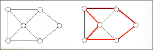
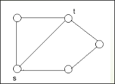
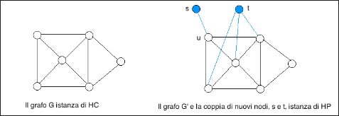
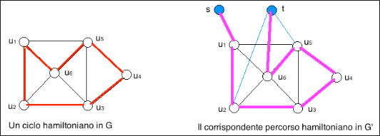

# Il problema HC è NP-completo  

Dato un grafo non orientato $G = (V,E)$, un ciclo in G che passa una ed una sola volta attraverso ogni nodo di $G$ è un **ciclo hamiltoniano** in $G$

  

+ $\mathcal{I}_{HC} = \set{\lang G = (V, E)\rang : G \text{ è un grafo non orientato }}$.
+ $\mathcal{S}_{HC}(G, k) = \set{\lang u_1,u_2,...,u_n\rang: \text{ per } i=1,...,n, u_i \in V \ \land \ n=|V|}$.
+ $\mathcal{\pi}_{HC}(G, k, \mathcal{S}_{HC}(G, k)) = \exist \lang u_1,u_2,...,u_n\rang \in \mathcal{S}_{HC}(G, k) : (u_1,u_n)\in E \ \land \ \forall i=1,...,n-1[(u_i,u_{i+1})\in E] \ \land \ \forall i,j=1,...,n \ e  \ i \neq j \ [ u_i \neq u_j]$.    

$HC$ è $\bold{NP}$-completo, la dimostrazione è omessa.  

# Il problema HP è NP-completo  

Dati un grafo non orientato $G = (V,E)$ ed una coppia di nodi $s, t \in V$, esiste un **percorso hamiltoniano** da $s$ a $t$ in $G$, ossia un percorso fra $s$ e $t$ che passa una e una sola volta attraverso ciascun nodo di $G$?  

+ $\mathcal{I}_{HC} = \set{\lang G = (V, E),s,t\rang : G \text{ è un grafo non orientato }\ \land \ s\in V \ \land \ t \in}$.
+ $\mathcal{S}_{HC}(G, k) = \set{\lang u_1,u_2,...,u_n\rang: \text{ per } i=1,...,n, u_i \in V \ \land \ n=|V|}$.
+ $\mathcal{\pi}_{HC}(G, k, \mathcal{S}_{HC}(G, k)) = \exist \lang u_1,u_2,...,u_n\rang \in \mathcal{S}_{HC}(G, k) : s=u_1\ \land \ t=u_n \ \land \ \forall i=1,...,n-1[(u_i,u_{i+1})\in E] \ \land \ \forall i,j=1,...,n, \ e  \ i \neq j \ [ u_i \neq u_j]$.      

Dimostriamo che $HP \in \bold{NP}$ mostrando un certificato che sia verificabile in tempo polinomiale.
Un certificato è una sequenza di nodi $S = \lang u_1, u_2, … , u_n\rang$. Verifichiamo che $S$ è effettivamente un percorso hamiltoniano da $s$ a $t$, ossia che $S$ soddisfa $\mathcal{\pi}_{HC}(G, k, \mathcal{S}_{HC}(G, k))$ , in tempo $O(|E||V| + |V|^2)$
ossia, in tempo polinomiale in $| \lang G=(V,E), s, t \rang |$   

##  *HC* $\implies$ *HP* 

Dimostriamo che $HP$ è completo per $\bold{NP}$ riducendo polinomialmente $HC$ a $HP$. In effetti, i due problemi HP e HC si assomigliano moltissimo, però la loro somiglianza potrebbe trarre in inganno.
Ad una prima occhiata, potremmo pensare di trasformare una istanza $\lang G=(V,E) \rang$ di $HC$, nell’istanza $\lang G=(V,E), s, t \rang $ di $HP$, in cui $s$ e $t$ sono due qualsiasi nodi in $V$ tali che $(s,t) \in E$ pertanto, potremmo pensare, se c’è un ciclo hamiltoniano in $G$, esso passa sicuramente sia
per $s$ che per $t$, e, per di più, $s$ e $t$ sono collegati da un arco, ma non funziona!  

  
Il grafo contiene un ciclo hamiltoniano
ma non contiene un percorso fra $s$ e $t$
che passi una e una sola volta per ogni
nodo  

Dimostriamo che $HP$ è completo per $\bold{NP}$ riducendo polinomialmente $HC$ a $HP$.
Trasformiamo una istanza $\lang G=(V,E) \rang$ di $HC$ nell’istanza $\lang G’=(V’,E’), s,t \rang$ di $HP$, dove
$s$ e $t$ sono due nuovi nodi, ossia, $s,t \notin V$ e $V' = V \cup \set{s,t}$ ed otteniamo $E'$ scegliendo un nodo $u ∈ V$, collegando $s$ ad $u$ e collegando $t$ a tutti i nodi
che in $G$ sono adiacenti ad $u$: $E' = E \cup \set{(s,u)} \cup \set{ (t,x): (u,x) \in E}$  

  

Trasformiamo una istanza $\lang G=(V,E) \rang$ di $HC$ nell’istanza $\lang G’=(V’,E’), s,t \rang$ di $HP$, dove
$s$ e $t$ sono due nuovi nodi, ossia, $s,t \notin V, V' = V \cup \set{s,t}, E' = E \cup {(s,u)} \cup \set{ (t,x): (u,x) \in E}$.
Se $G$ contiene un ciclo hamiltoniano $\lang u_1, u_2, … , u_n\rang$, scegliamo $u_1= u$ (il nodo al quale è collegato $s$),poiché $(u_i,u_{i+1}) \in E$ per ogni $i = 1, … , n$ e $u_i \neq u_j$ per $i \neq j$, allora $\lang s, u_1, u_2, … , u_n, t \rang$ è un percorso hamiltoniano in $G'$

  

##  *HC* $\impliedby$ *HP* 

Trasformiamo un'istanza $\lang G=(V,E) \rang$ di $HC$ nell’istanza $\lang G'=(V',E'), s,t \rang$ di $HP$, dove
$s$ e $t$ sono due nuovi nodi, ossia, $s,t \notin V, V' = V \cup \set{s,t}, E' = E \cup \set{(s,u)} \cup \set{ (t,x): (u,x) \in E}$.
Se $G'$ contiene un **percorso hamiltoniano** $\lang s, u_1, u_2, … , u_n, t \rang$, poiché $(u_i,u_{i+1}) \in E$ per ogni $i = 1, … , n-1$ e $u_i ≠ u_j$ per $i ≠ j$, e poiché $(u_n, u_1) \in E$ – per costruzione di $G'$, in quanto $t$ è stato collegato a tutti i nodi adiacenti a $u_1$ in $G$, allora $\lang u_1, u_2, … , u_n \rang$ è un ciclo hamiltoniano in $G$.
Infine, costruire $\lang G'=(V',E'), s,t \rang$ richiede tempo polinomiale in $|\lang G=(V,E) \rang |$.
Questo completa la prova che $HC \leq HP$. E che $HP$ è $\bold{NP}$-completo.