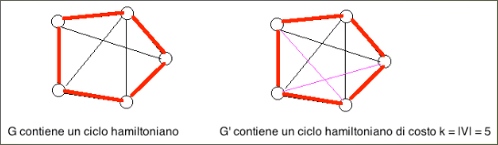

# Il problema TSP è NP-completo  

Dati un grafo non orientato completo e pesato $G = (V,E,w)$, dove $w: E → ℕ$ è la funzione peso, e un intero $k ∈ ℕ$, esiste in $G$ un ciclo hamiltoniano tale che la somma dei pesi degli archi che lo compongono è $≤ k$?  

+ $\mathcal{I}_{LP} = \set{\lang G = (V, E, w),k\rang : G \text{ è un grafo non orientato completo }\ \land \ w: E → ℕ \ \land \ k \in \N}$.
+ $\mathcal{S}_{LP}(G, k) = \set{\lang u_1,u_2,...,u_n\rang: n = |V|}$.
+ $\mathcal{\pi}_{LP}(G, k, \mathcal{S}_{LP}(G, k)) = \exist \lang u_1,u_2,...,u_n\rang \in \mathcal{S}_{LP}(G, k) :\forall i,j=1,...,h, \ e  \ i \neq j \ [ u_i \neq u_j]\ \land w( u_1 , u_2 ) + w(u_2,u_3) + … + w(u_{n-1},u_n) + w(u_n,u_1) \leq k$.  

Dimostriamo, ora, che $HC \leq TSP$.
Trasformiamo una istanza $ \lang G=(V,E) \rang$ di $HC$ nell’istanza $\lang G'=(V,E',w), k \rang$ di $TSP$, dove
$E'$ è ottenuto aggiungendo ad $E$ gli archi mancanti: $E' = E \cup \set{(u,v): u,v ∈ V \ \land \ (u,v) ∉ E}$, la funzione peso $w$ è così definita:
+ per ogni arco di $E$, ossia, per ogni $(u,v) ∈ E$, poniamo $w(u,v)=1$,
+ per ogni arco non in $E$, ossia, per ogni $(u,v) ∉ E$, poniamo $w(u,v)=2|V|$  

$k=|V|$  

  

Se $G$ contiene un ciclo hamiltoniano, tale ciclo è anche contenuto in $G'$: sso è costituito di $|V|$ archi contenuti in $E$, perciò la somma dei loro pesi in $G'$ è $|V|$, Allora, $G'$ contiene un ciclo hamiltoniano di costo $≤ k$.  

  

Se $G’$ contiene un ciclo hamiltoniano $C$ tale che la somma dei pesi degli archi che lo compongono è $≤ |V|$.
$C$ non può contenere archi appartenenti a $E'-E$, perché ciascuno degli archi in $E'-E$ ha peso $2|V|$ e quindi uno solo degli archi in $E'- E$ ha peso maggiore di $k =|V|$, perciò, poiché il peso complessivo di $C$ è $k = |V|$, $C$ è costituito di soli archi contenuti in $E$, ossia, $C$ è un ciclo hamiltoniano contenuto in G. 
Infine, calcolare $\lang G'=(V,E',w), k \rang$ richiede tempo polinomiale in $| \lang G=(V,E) \rang |$.
Questo completa la prova che $HC \leq TSP$.