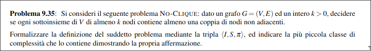
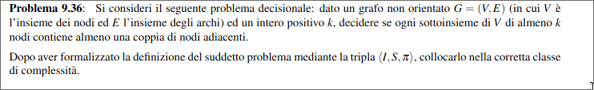

  

+ $\mathcal{I}_{NOCL} = \set{\lang G = (V, E),k\rang : G \text{ è un grafo non orientato } \ \land \ k\in \N}$.
 

+ $\mathcal{S}_{NOCL}(G) = \set{C' \subseteq V: |C'|\geq k}$.
 

+ $\mathcal{\pi}_{NOCL}(G,k \mathcal{S}_{NOCL}(G,k))= \forall C' \in \mathcal{S}_{NOCL}(G,k): \exist u,v \in C' [(u,v) \notin E]$.    

Complentando il predicato $\mathcal{\pi}_{NOCL}(G,k \mathcal{S}_{NOCL}(G,k))$ ottengo:  

$\mathcal{\neg\pi}_{NOCL}(G,k \mathcal{S}_{NOCL}(G,k))= \exist C' \in \mathcal{S}_{NOCL}(G,k): \forall u,v \in C' [(u,v) \in E]$  

Siccome il problema complemento di $NOCL$ è il problema $CLIQUE$ che è in $NP$. E inoltre siccome $CLIQUE$ è $NP$-completo allora $NOCL$ è in $coNP$ ed è $coNP$-completo.  

  

+ $\mathcal{I}_{ISCL} = \set{\lang G = (V, E),k\rang : G \text{ è un grafo non orientato } \ \land \ k\in \N}$.
 

+ $\mathcal{S}_{ISCL}(G) = \set{C' \subseteq V: |C'|\geq k}$.
 

+ $\mathcal{\pi}_{ISCL}(G,k \mathcal{S}_{ISCL}(G,k))= \forall C' \in \mathcal{S}_{ISCL}(G,k): \exist u,v \in C' [(u,v) \in E]$.    

$\mathcal{\neg\pi}_{ISCL}(G,k \mathcal{S}_{ISCL}(G,k))= \exist C' \in \mathcal{S}_{ISCL}(G,k): \forall u,v \in C' [(u,v) \notin E]$  

Siccome il problema complemento di $ISCL$ è il problema $IS$ che è in $NP$. E inoltre siccome $IS$ è $NP$-completo allora $ISCL$ è in $coNP$ ed è $coNP$-completo.  