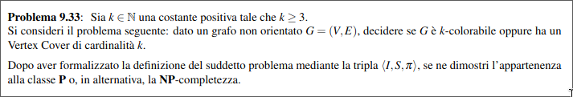

  

+ $\mathcal{I}_{PIS} = \set{\lang G = (V, E), k \rang : G \text{ è un grafo non orientato e } k \text{ un intero positivo } \in \N}$.
 

+ $\mathcal{S}_{PIS}(G, k) = \set{ \set{I_1,...,I_h}: I_i \subseteq V \ \forall i=1,...,k \ \land \ \bigcup_{i=1}^h I_i=V \ \land \ \forall 1\leq i,j \leq h [I_i \cap I_j = \empty]}$.
 

+ $\mathcal{\pi}_{PIS}(G, k, \mathcal{S}_{PIS}(G, k)) = \exists \set{I_1,...,I_h} \in \mathcal{S}_{PIS}(G, k) : \forall 1 \leq i \leq h [u,v \in I_i \implies (u,v)\notin E] \ \land \ h \leq k$.  

Osservo che il problema è in $\bold{NP}$ in quanto dato un certificato del problema verificarlo richiede tempo $O(|\set{I_1,...,I_h}||I_i|^2|E|)$    

Osservo che il problema $PIS$ coincide con problema $COLORABILITÀ$. Dunque è possibile effettuare una riduzione da $COLORABILITÀ$ a $PIS$. Se vi è una colorazione di al più $k$ colori in $G$ significa che vi sono $k$ insiemi indipendenti in $G$.  
Dunque $PIS$ è $\bold{NP}$-completo.  

  

+ $\mathcal{I}_{PCL} = \set{\lang G = (V, E), k \rang : G \text{ è un grafo non orientato e } k \text{ un intero positivo } \in \N}$.
 

+ $\mathcal{S}_{PCL}(G, k) = \set{ \set{C_1,...,C_h}: C_i \subseteq V \ \forall i=1,...,k \ \land \ \bigcup_{i=1}^h C_i=V \ \land \ \forall 1\leq i,j \leq h [I_i \cap C_j = \empty]}$.
 

+ $\mathcal{\pi}_{PCL}(G, k, \mathcal{S}_{PCL}(G, k)) = \exists \set{I_1,...,I_h} \in \mathcal{S}_{PIS}(G, k) : \forall 1 \leq i \leq h [u,v \in C_i \implies (u,v)\in E] \ \land \ h \leq k$.    

Osservo che il problema è in $\bold{NP}$ in quanto dato un certificato del problema verificarlo richiede tempo $O(|\set{I_1,...,I_h}||I_i|^2|E|)$      

Eseguiamo una riduzione da $COL$ a $CL$  

Prendo un'istanza generica di $COL \ \lang G=(V,E),k \rang$: allora, 〈$G = (V, E), k〉 ∈ COLORABILITÀ$ se e soltanto se esiste una partizione di $V$ in $h ≤ k$ sottoinsiemi $V_1,V_2, . . . ,V_h$ tali che, per ogni $i = 1, 2, . . . , h$ e per ogni coppia di nodi $u, v ∈ V_i$ , allora $(u, v) \notin E$. Ma questo significa che, per ogni $i = 1, 2, . . . , h$ e per ogni coppia di nodi $u, v ∈ V_i$ , allora $(u, v) ∈ E^c$. E questo è vero se e soltanto se $\lang G^c = (V, E^c), k\rang ∈ PCL$

+ $\mathcal{I}_{4SAT} = \set{\lang f, X \rang : f \text{ è una funzione booleana in 4CNF } \ \land \ X \text{ insieme di variabili booleane }}$.
 

+ $\mathcal{S}_{4SAT}(f, X) = \set{ a: X \rightarrow \set{v,f}}$.
 

+ $\mathcal{\pi}_{4SAT}(f, X, \mathcal{S}_{4SAT}(f, X)) = \exists a \in \mathcal{S}_{4SAT}(f, X) : f(a(x))=vero$.    

Il problema è riducibile da $3SAT$:  

$3SAT \leq 4SAT$  

Data un'istanza di $3SAT \lang f', X' \rang$ con $f'=\set{c_1,...,c_m}$ per trasformarla in un istanza di $4SAT$ per ogni clausola $c_j$ per $j=1,...,m$ in $f'$ aggiungo una nuova clausola $c_j'$ in $f$. In più all'insieme delle variabili $X$ aggiungo un nuovo insieme di variabili booleane $y_i$ per $i=1,...,m$. Inserisco $y_i$ nella clausola $c_j$ e $\neg y_i$ in $ c_j'$.  Così che in ogni clausola vi sono 4 letterali. In più qualsiasi assegnazione di verità viene assegnata a $y_i$ $f$ è soddisfacibile se e soltanto se le assegnazioni di verità che vengano date ai letterali che erano nelle clausole di $f'$ rendevano soddisfacibile $f'$.  

  

+ $\mathcal{I}_{LP} = \set{\lang G = (V, E), k,s,t \rang : G \text{ è un grafo non orientato e } k \text{ un intero positivo } \in \N \ \land \ s,t \in V}$.
 

+ $\mathcal{S}_{LP}(G, k,s,t) = \set{\lang u_1,...,u_h\rang: \forall i=1,...,h \ u_i \in V}$.
 

+ $\mathcal{\pi}_{LP}(G, k,s,t \mathcal{S}_{LP}(G, k,s,t)) = \exists \lang u_1,...,u_h\rang \in \mathcal{S}_{LP}(G, k,s,t) : s=u_1 \ \land \ t=u_h \ \land \ \forall 1,...,h-1[(u_i,u_{i+1})\in E] \ \land \ \forall 1\leq i,j \leq h, i \neq j[u_i \neq u_j] \ \land \ h \geq k$.  

$HC \leq HP$  

Trasformiamo un'istanza $\lang G=(V,E) \rang \in HC$ in un'istanza di $HP: \lang G'=(V',E'),s,t\rang$. Per farlo aggiungiamo due nodi $s,t \notin V$. Scegliamo un nodo $u_1 \in V$ e colleghiamo $s$ a $u_1$, e colleghiamo $t$ a tutti i nodi vicini di $u_1$. 

$V' = V \cup \set{u,v}$  
$E'=E \cup \set{(s,u_1)}\cup\set{(t,x):(u_1,x)\in E}$  

Dunque se $\lang G=(V,E) \rang$ è un'istanza sì in $HC$ significa che vi è un ciclo hamiltoniano in $G'$ inoltre siccome $s$ è collegato ad un generico nodo $u \in V$ e $t$ è collegato a tutti i vicini di $u$ vi è un cammino che passa per tutti i nodi da $s$ a $t$.   
Se $\lang G=(V,E) \rang$ è un'istanza no in $HC$ significa che non c'è è un ciclo hamiltoniano in $G'$ e quindi non c'è un cammino che passa per tutti i nodi in $G'$ e quindi non c'è un percorso hamiltoniano.  

$HP \leq LP$  

Trasformiamo banalmente un'istanza di $HP \lang G=(V,E),s,t \rang $ in un'istanza di $LP \lang G=(V,E),s,t, |V| \rang$.

  

+ $\mathcal{I}_{3CL} = \set{\lang G = (V, E) \rang : G \text{ è un grafo non orientato }}$.
 

+ $\mathcal{S}_{3CL}(G) = \set{c:V \rightarrow \set{1,2,3}}$.
 

+ $\mathcal{\pi}_{3CL}(G) \mathcal{S}_{3CL}(G) = \exists c  \in \mathcal{S}_{3CL}(G) : \forall (u,v) \in E[c(u)\neq c(v)] \ \lor \ G \text{ è un grafo completo } $.  

$3COL \leq 3CL$   

Data un'istanza $\lang G=(V,E) \rang$ di $3COL$ trasformiamo quest'istanza in un'istanza di $3CL$ $\lang G'=(V',E')\rang$, con:  
+ $V'=V \cup \set{\alpha}$  
+ $E'=E$  
In questo modo se c'è una 3 colorazione in $G$ quindi $\lang G=(V,E) \rang$ è un'istanza si di $3COL$ allora c'è una 3 colorazione in $G'$ quindi $\lang G'=(V',E') \rang$ è un'istanza si per $3CL$.  

Al contrario se non c'è una 3 colorazione in $G$ quindi $\lang G=(V,E) \rang$ è un'istanza no di $3COL$ allora non c'è una 3 colorazione in $G'$ siccome vi è in $G'$ anche un nodo isolato $G'$ non è un grafo completo quindi $\lang G'=(V',E') \rang$ è un'istanza no per $3CL$.  

  
  

+ $\mathcal{I}_{3KCL} = \set{\lang G = (V, E),k \rang : G \text{ è un grafo non orientato } \ \land \ k\in \N}$.
 

+ $\mathcal{S}_{3KCL}(G,k) = \set{\lang C,c\rang: c: V \rightarrow \set{1,2,3}\ \land \ C \subseteq V}$.
 

+ $\mathcal{\pi}_{3KCL}(G,k , \mathcal{S}_{3KCL}(G,k)) = \exists \lang C,c\rang  \in \mathcal{S}_{3KCL}(G,k) : \forall (u,v) \in E[c(u)\neq c(v)] \ \lor \forall u,v \in C[(u,v) \in E] \ \land \ |C|=|V|-k$.    

Dimostriamo che il problema è $NP$-completo:  

$3COL \leq 3KCL$   

Data un'istanza $\lang G'=(V',E') \rang$ di $3COL$ trasformiamo quest'istanza in un'istanza di $3KCL$ $\lang G=(V,E),k\rang$, con:

+ $V=V' \cup \set{\alpha}$  
+ $E=E'$
+ $k=0$
    
In questo modo se c'è una 3 colorazione in $G'$ quindi $\lang G'=(V',E') \rang$ è un'istanza si di $3COL$ allora c'è una 3 colorazione in $G$ quindi $\lang G=(V,E) \rang$ è un'istanza si per $3KCL$.  

Al contrario se non c'è una 3 colorazione in $G'$ quindi $\lang G'=(V',E') \rang$ è un'istanza no di $3COL$ allora non c'è una 3 colorazione in $G$ siccome vi è in $G$ anche un nodo isolato $G$ non ha un sottografo completo di $|V|$ nodi quindi $\lang G=(V,E) \rang$ è un'istanza no per $3KCL$.    

  

+ $\mathcal{I}_{KCOLVC} = \set{\lang G = (V, E)\rang : G \text{ è un grafo non orientato }}$.
 

+ $\mathcal{S}_{KCOLVC}(G) = \set{\lang V',c\rang: c: V \rightarrow \set{1,...,k}\ \land \ V' \subseteq V}$.
 

+ $\mathcal{\pi}_{KCOLVC}(G, \mathcal{S}_{KCOLVC}(G)) = \exists \lang V',c\rang  \in \mathcal{S}_{KCOLVC}(G) : \forall (u,v) \in E[c(u)\neq c(v)] \ \lor |V'|=k \ \land \ \forall (u,v) \in E[u \in V' \lor v \in V']$.  

Dimostriamo la $\bold{NP}$-completezza.  
Il problema è in $\bold{NP}$, infatti dato un certificato del problema verificarlo richiede $O(|E|+|V'|^2|E|)$  

Per dimostrarne la completezza 

