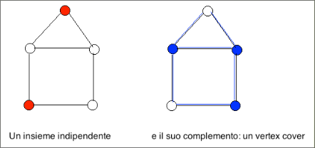

# Il problema IS è NP-completo  

Dato un grafo non orientato $G = (V,E)$, un sottoinsieme di nodi tale che nessuna coppia di nodi in quel sottoinsieme è collegata da un arco è un insieme
indipendente per $G$.
Dati un grafo non orientato $G = (V,E)$ ed un intero $k ∈ ℕ$, esiste un insieme
indipendente per $G$ di almeno $k$ nodi?

+ $\mathcal{I}_{IS} = \set{\lang G = (V, E), k \rang : G \text{ è un grafo non orientato e } k \text{ un intero positivo }}$.
+ $\mathcal{S}_{IS}(G, k) = \set{I \subset V }$.
+ $\mathcal{\pi}_{VC}(G, k, \mathcal{S}_{IS}(G, k)) = \exist I \in \mathcal{S}_{IS}(G, k) : |I| \geq k \land \forall(u, v) \in I [ (u,v) \notin E ]$.  

Il primo passo, per dimostrare la $\bold{NP}$-completezza di $IS$, è dimostrare che $IS ∈ \bold{NP}$.

Dimostriamo che $IS ∈ \bold{NP}$ mostrando un certificato che sia verificabile in tempo polinomiale:
+ Un certificato è un sottoinsieme $I \ di \ V$
+ per verificare che $I$ è effettivamente un insieme indipendente per $G$, ossia che $I$ soddisfa $\mathcal{\pi}_{VC}(G, k, \mathcal{S}_{IS}(G, k))$, dobbiamo esaminare ciascuna coppia di nodi $u,v \in I$ e verificare che
$(u,v) ∉ E$. Perciò, verifichiamo un certificato in tempo $O(|V|2|E|)$

Dimostriamo che $IS$ è completo per $\bold{NP}$ riducendo polinomialmente $VC$ a $IS$, ossia, dimostriamo che $VC \leq IS$. Questa volta, la riduzione è poco più che una osservazione, perché è sufficiente osservare che 
**un sottoinsieme $\bold{I ⊆ V}$ è un insieme indipendente per $\bold{G}$ se e soltanto se $\bold{V'= V – I}$ è un vertex cover per $\bold{G}$**

Dato un grafo $G=(V,E)$, un sottoinsieme $I ⊆ V$ è un insieme indipendente per $G$ se e soltanto se $V'= V – I$ è un vertex cover per $G$
+ se $I ⊆ V$ è un insieme indipendente per $G$ allora, per ogni arco $(u,v) \in E$ accade che $u ∉ I$ oppure $v ∉ I$ - ossia, $u ∈ V'$ oppure $v ∈ V'$, cioè $V'$ è un vertex cover per $G$

+ Se $V' ⊆ V$ è un vertex cover per $G$ allora, per ogni arco $(u,v) \in E$ accade che $u ∈ V'$ oppure $v ∈ V'$ - ossia, $u ∉ I$ oppure $v ∉ I$ , cioè $I$ è un insieme indipendente per $G$  

  

Dimostriamo che $IS$ è completo per $\bold{NP}$ riducendo polinomialmente $VC$ a $IS$, attraverso l'osservazione precedente:  

Trasformiamo una istanza $\lang G=(V,E), k \rang$ di $VC$ nell’istanza $\lang G=(V,E), |V|-k \rang$ di $IS$, in cui il grafo rimane invariato!
$G$ ha un vertex cover $V' \ di \ ≤ k$ nodi se e soltanto se $G$ ha un insieme indipendente $I=V-V' \ di \ ≥ |V|- k$ nodi e calcolare $\lang G=(V,E), |V|-k \rang$ richiede tempo polinomiale in $|\lang G=(V,E), k \rang|$.  

