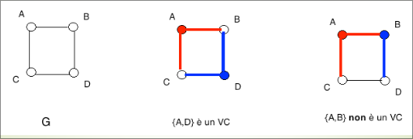
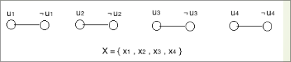
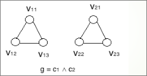
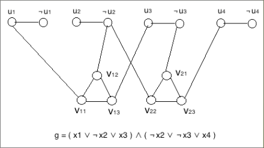
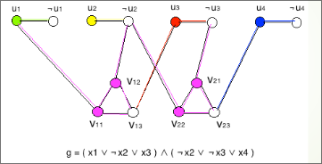

# Il problema VC è NP-completo  

Sia $G = (V, E)$ un grafo non orientato e sia $V' \subseteq V$; 

$V'$ è un vertex cover per $G$ se ogni arco in $E$ ha un estremo in $V'$.
Il problema $VERTEX \ COVER$ consiste nel decidere, dati un grafo $G = (V, E)$ e un intero $k$, se $G$ contiene un vertex cover di cardinalità $\leq k$.
Il problema $VERTEX \ COVER \ (VC)$ pu`o essere formalizzato nella maniera seguente:

+ $\mathcal{I}_{VC} = \set{\lang G = (V, E), k \rang : G \text{ è un grafo non orientato e } k \text{ un intero positivo }}$.
+ $\mathcal{S}_{VC}(G, k) = \set{V' \subset V }$.
+ $\mathcal{\pi}_{VC}(G, k, \mathcal{S}_{VC}(G, k)) = \exist V' \in \mathcal{S}_{VC}(G, k) : |V'| \leq k \land \forall(u, v) \in E [ v \in V' \lor u \in V' ]$.  

Un certificato per una istanza $x = \lang G = (V, E), k \rang$ di $VERTEX \ COVER$ è un sottoinsieme $V'$ dei nodi di $G$. Poichè è possibile verificare se un certificato $V'$ soddisfa il predicato $\rho_{VC} = |V'| \leq k ∧ \forall(u, v) \in E [ u \in V' \lor v \in V' ]$ in tempo $O(|E||V |)$, questo prova che $VC \in \bold{NP}$  

Per dimostrarne la completezza, mostriamo una riduzione polinomiale da $3SAT$, ossia, una funzione $f : \mathcal{I}_{3SAT} \rightarrow \mathcal{I}_{VC}$,
contenuta in $\bold{FP}$, tale che, per ogni $\phi \in \mathcal{I}_{3SAT}$, $\phi \in 3SAT$ se e solo se $f (\phi ) \in VC$.  

Per individuare $f$ utilizzeremo, una tecnica cui faremo spesso riferimento anche in seguito quando vogliamo ridurre un problema $A$ ad un problema $B$: ad ogni struttura dell’istanza di $A$ faremo corrispondere una struttura dell’istanza di $B$, in modo che strutture dello stesso genere presenti nell’istanza di $A$ corrispondano a strutture dello stesso genere dell’istanza di $B$.
A tali strutture daremo il nome di **gadget**.  

Le strutture che compongono un’istanza  $\lang X,g \rang$ di $3SAT$ sono di due tipi:
+ Variabili
+ Clausole  

Trasformiamo ciascuna variabile in $X$ in un arco (**gadget variabile**):
+ Il gadget-variabile della variabile $x_i$ è l’arco $(u_i , ¬ u_i )$
+ gadget-variabile associati a variabili diverse non hanno nodi in comune

  

Scegliendo un nodo in ogni gadget-variabile otteniamo un $VC$ di questa porzione del grafo che stiamo costruendo:
+ Se in un gadget-variabile non scegliamo alcun nodo, non copriamo quell’arco!
+ Allora, un $VC$ minimo di questa porzione di grafo ha cardinalità $|X|$
+ ossia, $|X|$ nodi sono sufficienti, ma con meno di $|X|$ nodi qualche arco rimane scoperto

  

Trasformiamo ciascuna clausola in $g$ in un ciclo di 3 nodi – ossia, il
**gadget-clausola** è $C_3$:
+ Il gadget-clausola della clausola $c_j$ è la terna di archi $(v_{j1} , v_{j2}) , (v_{j2} , v_{j3}) , (v_{j3} , v_{j1})$ 
+ Gadget-clausola associati a clausole diverse non hanno nodi in comune
+ Gadget-clausola e gadget-variabile non hanno nodi in comune

Scegliendo due nodi in ogni gadget-clausola otteniamo un $VC$ di questa porzione del grafo che stiamo costruendo:
+ Se in un gadget-clausola scegliamo meno di due nodi, non copriamo quel gadget!
+ Allora, un Vertex Cover minimo di questa porzione di grafo ha cardinalità $2|g| = 2m$ 
+ Ossia, $2m$ nodi sono sufficienti, ma con meno di $2m$ nodi qualche arco rimane scoperto  

Ora dobbiamo collegare i gadget-clausola con i gadget-variabile. Per farlo utilizziamo il modo in cui sono composte le clausole: colleghiamo ciascun nodo in ciascun gadget-clausola al nodo-variabile che gli corrisponde (ad esempio, se $c_j =(x_1 \lor ¬ x_2 ∨ x_3)$ creiamo gli archi “**obliqui**” $(v_{j1} , u_1) , (v_{j2} , ¬ u_2) , (v_{j3} , u_3)$)  

  

E così, abbiamo costruito il grafo G corrispondente a $\lang X,g \rang$ .
Per completare l’istanza $\lang G,k \rang$  di $VC$ corrispondente a $\lang X,g \rang$ scegliamo $k = |X|+2|g| = n + 2m$. Banalmente, costruire $\lang G,k \rang$  da  $\lang X,g \rang$ richiede tempo polinomiale in $|\lang X,g \rang|$.

Resta da mostrare che $g$ è soddisfacibile se e soltanto se $G$ ha un vertex cover di al più $k= n + 2m$ nodi.
Prima di procedere con questa dimostrazione, ricordiamo che, $n$ nodi sono necessari per coprire gli archi di tutti i gadget-variabile e $2m$ nodi sono
necessari per coprire gli archi di tutti i gadget-clausole perciò, almeno $k = n + 2m$ nodi sono necessari per coprire gli archi di $G$.
Resta da far vedere che $k = n + 2m$ nodi sono sufficienti a coprire gli archi di $G$ se e soltanto se g è soddisfacibile  

###  Se $g$ è soddisfacibile 
Costruiamo l’insieme $V'$ nel modo seguente:
+ Sia $a : X → \set{vero, falso}$ una assegnazione di verità che soddisfa $g$:
  1. Inseriamo in $V'$ $n$ nodi dei gadget-variabile: per $i = 1, … , n = |X|$, inseriamo in $V'$ il nodo $u_i$ se $a(x_i) = vero$ , il nodo $¬ ui$ se $a(x_i) = falso$
  2. per ogni $j = 1, … , m$, scegliamo un letterale $ℓ_{jh} (h=1,\ o \ h=2, \ o \ h=3)$ nella clausola $c_j$ al quale è stato assegnato valore vero da $a$ e inseriamo in $V'$ i due nodi del gadget-clausola associato a $c_j$ che non sono $v_{jh}$
       - ad esempio, se $a(x3) = vero \ e \ c_1 = ( x_1 ∨ ¬ x_2 ∨ x_3 )$ e scegliamo $ℓ_{j3}$, allora inseriamo in $V'$ i nodi $v_{11} \ e \ v_{12}$
+ Ogni arco nei gadget-variabile ha un estremo in $V'$
+ per ogni $j = 1, … , m$, $V'$ contiene due nodi del gadget-clausola associato a $c_j$: pertanto, tutti gli archi nei gadget-clausola sono coperti
+ per ogni $j = 1, … , m$, non abbiamo inserito in $V'$ un solo nodo che è collegato ad un nodo-variabile che appartiene a $V'$: perciò, tutti gli archi obliqui sono coperti    

Quindi i nodi in $V’$ coprono tutti gli archi di $G$:  

  
in figura è mostrato un $VC$ (i nodi colorati) corrispondente all’assegnazione
$a(x_1) = a(x_2) = a(x_3) = a(x_4) = vero$ e la corrispondente copertura degli archi  

$|V'| = n + 2m$

Quindi: se $g$ è soddisfacibile, allora $G$ contiene un $VC$ di $k =( n + 2m)$ nodi

###   Se $G$ contiene un $VC$ $V'$ di $k= ( n + 2m)$ nodi 
+ $V'$ contiene esattamente un nodo per ogni gadget-variabile
+ $V'$ contiene esattamente due nodi per ogni gadget-clausola
+ Poiché $V'$ contiene esattamente un nodo per ogni gadget-variabile, consideriamo la seguente assegnazione di verità a per le variabili in $X$:
    - $a(x_i) = vero \ se \ u_i \in V'$
    - $a(x_i) = falso \ se \ ¬u_i \in V'$
+ Poiché $V'$ contiene esattamente due nodi per ogni gadget-clausola, allora un arco “obliquo” in ogni gadget clausola non è coperto dai nodi in $V'$ del gadget-clausola
+ Allora, per ogni gadget clausola un arco “obliquo” è coperto da un nodo di un
gadget-variabile contenuto in $V'$
    - ossia, da un nodo $u_i$ – e quindi quella clausola contiene $x_i$ come letterale e $a(x_i) = vero$
    - oppure da un nodo $¬ u_i$ – e quindi quella clausola contiene $¬ x_i$ come letterale e $a(x_i) = falso$
+ Questo significa che ogni clausola contiene un letterale al quale a assegna valore vero

Quindi $g$ è soddisfacibile!