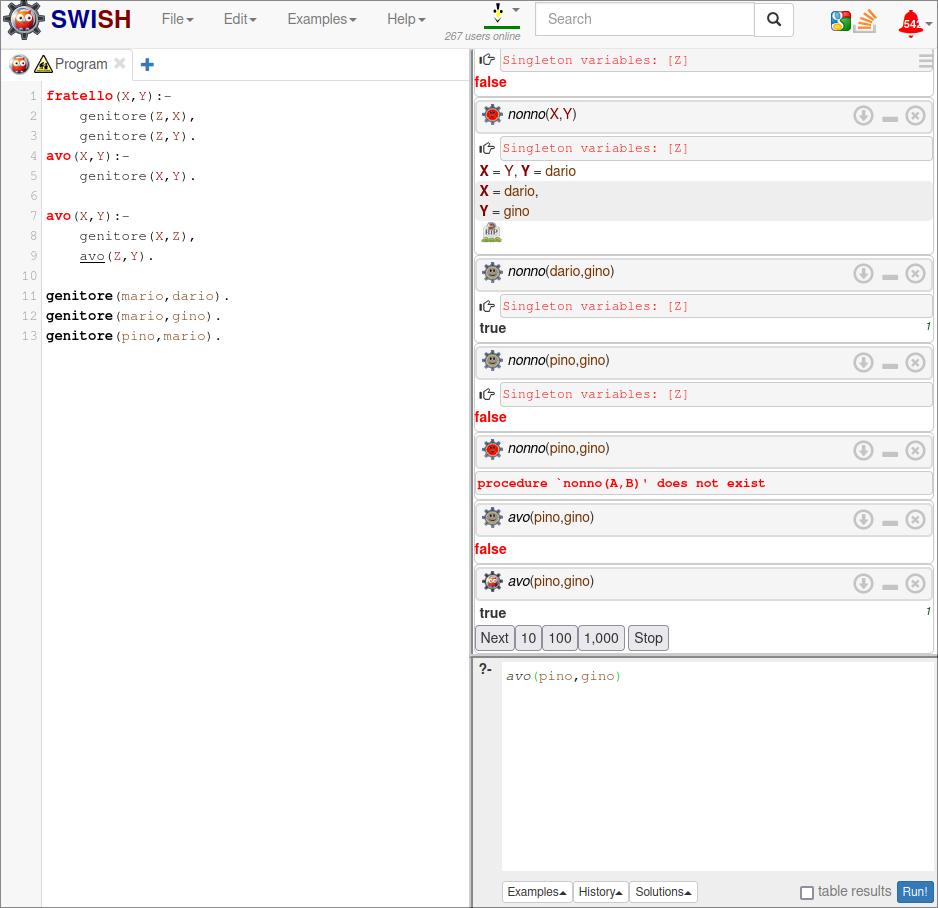

# Lezione 2 Prolog  
+ X variabile vogliamo saperne il valore
+ _x variabile non vogliamo saperne il valore
+ _ non ha un valore fisso
+ a... (minuscolo) costanti  
+ 1... (numero, o qualcosa dall'aspetto numerico) numeri
<!-- + 'X' costante -->

  

