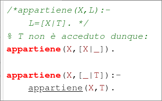
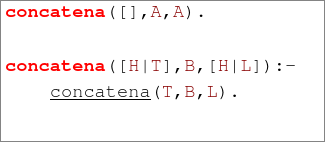

# Induzione Strutturale  

- [H|T] = [a,b,c,d,e] Lista  

  - H sarà unificato con a, T con [b,c,d,e]

- [H|T]=[a]

  - H = a, T = [ ]  

- [H|T] = [ ]  
  - H = False , T = False ; poiché non è unificabile.  

$x \in L$  ?  

appartiene($x,L$)  

o $x$ unifica con H o $x \in T$.  

  

ma come fa a funzionare ?

ES:

?- appartiene(3,[1,3,2])    

appartiene (3,[1,3,2])? No  

appartiene (3,[3,2])? Si  

Nel testa-coda possiamo utilizzare più elementi:  

- [H1,H2|T] = [a,b,c]
  - H1 = a, H2 = b, T = [c]  

EX: 

concatena(A,B,C). 

C è la concatenazione di A e B.

  

