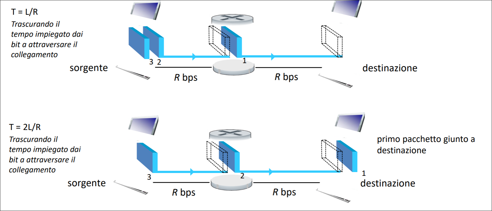

# Introduzione  
## Cos'è Internet  (come insieme di ingranaggi)
+ E' un insieme di miliardi di dispositivi di calcolo connessi (host = end system), gli host che eseguono le applicazioni di rete ai confini di internet (edge).    
+ E' costituito anche da **commutatori di pacchetto**, che inoltrano i pacchetti (router a livello di rete, switch a livello di collegamento).  
+ Tra i commutatori di pacchetto vi sono delle **reti di collegamento**: fibra ottica, rame, segnali radio, segnali satellitari. Che differenziano per tasso di trasmissione.  
+ E' costituito da reti, una collezione di dispositivi, router e collegamenti, gestititi da un'organizzazione.  

>[!NOTE]  
>Internet è una rete di reti, le nostre reti (domestiche, aziendali, etc...)  si connettono ad internet attraverso gli **ISP** (**Internet Service Provider**) come Tim, Vodafone, etc..., che a loro volta devono essere interconessi, altrimenti i clienti Tim potrebbero comunicare unicamente con clienti Tim, per citare un esempio.  

Importanti sono i **protocolli**, controllano l'invio e la ricezione dei messaggi.  
Data la loro importanza per Internet, un accordo sulle funzioni svolte da ogni protocollo risulta fondamentale, qui entrano in gioco gli standard. Gli standard di Internet vengono sviluppati dall'Internet Enginnering Task Force (**IETF**). Le pubblicazioni sugli standard di internet vengono dette Request For Comment (**RFC**).  

## Cos'è Internet  (come fornitore di servizi)  
Un'**infrastruttura** che fornisce servizi alle applicazioni distribuite, che non fanno parte di Internet ma si appoggiano ad Internet.
Fornisce un'interfaccia di programmazione (**Socket**) alle applicazioni distribuite:
"hook" che consentono alle applicazioni mittente/destinataria di "connettersi", usare il servizio di trasporto Internet.  

## Cos'è un protocollo?  

Un **protocollo** definisce il formato e l'ordine dei messaggi scambiati tra due o più entità in comunicazione, così come le azioni intraprese in fase di trasmissione e/o di ricezione di un messaggio o di un altro evento.  
    
## Ai confini della rete  
Ai confini della rete vi sono gli host che possono essere:
+ **Client:** che richiedono i servizi
+ **Server:** che erogano i servizi  

## Reti di accesso e mezzi trasmissivi  
**Come collegare sistemi periferici (host) e edge router (primo router sul percorso dal sistema d'origine a un qualsiasi altro sistema di destinazione)?**  
Attraverso le reti di accesso:
+ reti di accesso residenziali
+ reti di accesso aziendale (scuole, aziende)
+ reti di accesso mobile (WiFi, 4G/5G)  

Scegliendo in base al tasso di trasmissione (velocità di trasmissione, misurata in bit/secondo) della rete di accesso e l'accesso se deve essere dedicato o condiviso tra gli utenti.  

### 1. **Via cavo**
>[!IMPORTANT]  
>**FDM** canali diversi sono trasmesse in bande di frequenza diverse 
> Velocità Assimmetriche: velocità effettive inferiori per limitazioni del provider, distanza, qualità materiale e interferenze.  

+ **HFC** (Hybrid Fiber Coax): asimmetrico, fino a 40 Mbps - 1.2 Gbps in downstream, 30-100 Mbps in upstream
+ Rete ibrida a fibra e cavo coassiale collega le case ai router degli ISP
    + l' utenza domestica condivide la rete di accesso alla stazione di testa
        + downstream: download concorrenti avvengono ciascuno a velocità inferiori alla velocità totale del canale di downstream
        + upstream: necessità di un protocollo di accesso multiplo distribuito per coordinare le trasmissioni
### 2. **Digital Subscriber Line (DSL)**  

+ Utilizza la linea telefonica esistente verso il DSLAM nella centrale locale. I dati sulla linea telefonica DSL vanno su Internet, la voce sulla linea telefonica DSL va sulla rete telefonica.
Velocità assimmetriche:
    + 24 - 52 Mbps come tasso ti trasmissione in downstream dedicato
    + 3.5 - 16 Mbps come tasso di trasmissione in upstream dedicato  

### 3. **FFTx**
+ FTTH (Fiber-to-the-home): 1 Gbps in downlink
+ FTTB (Fiber-to-the-building)
+ FTTC/FTTS (Fiber-to-the-cabinet/Fiber-to-the-street): 100/200 Mbps in downlink
+ FTTN (Fiber-to-the-node)
+ FTTW/FTTR (Fiber-to-the-wireless/Fiber-to-the-radio)  

+ Quando più il collegamento ottico arriva vicino alla destinazione, tanto maggiore sarà la velocità raggiunta nell'ultimo tratto  

+ FTTH
    + fibra diretta: una singola fibra collega una centrale locale a un'abitazione
    + alternativa: ciascuna fibra unscente dalla centrale locale è in effetti condivisa da più utenti e solo in prossimità di questi ultimi viene suddivisa in più fibre, una per ogni utente.
+ Due architetture:
    + Active Optical Network (**AON**): sono delle Ethernet commutate, con commutatori in grado di ricevere/trasmettere segnali ottici
    + Passive Optical Network (**PON**): usano splitter ottici non alimentati che trasmette in broadcast verso gli utenti
+ Fixed Wireless Access (FWA)
    + E' una rete mista, ovvero fibra e radio che raggiunge i clienti con:
        + una rete a banda larga, ossia con velocità fino a 30 Mbps
        + una rete a banda ultralarga, ossia velocità fino a 100 Mbps

### 4. Rete domestica, aziendale, data center  
+ Rete domestica:  

  
+ Rete aziendale:
    + E' un misto di tecnologie di collegamento cablato e wireless, che collegano un misto di switch e router, avendo velocità abbastanza grandi del ordine di 1/10 Gbps.  
+ Rete dei data center
    + I collegamenti ad alta larghezza di banda (da decine o centinaia di Gbps) collegano centinaia o migliaia di server tra loro e a Internet.  

## Invio dei pacchetti di dati  
1. L'host prende il messaggio dell'applicazione.
2. Lo suddivide in frammenti più piccoli, conosciuti come **pacchetti**, di lunghezza $L$ bit.  
3. Trasmette il pacchetto nella rete di accesso al **tasso di trasmissione** $R$ bit/sec.

>[!IMPORTANT]  
> Ritardo di trasmissione del pacchetto $=\frac{L}{R}$   

## Collegamenti: mezzi trasmissivi  
+ **Mezzo vincolato**: i segnali si propagano in un mezzo solido
+ **Mezzo non vincolato**: i segnali si propagano liberamente  

### 1. Doppino di rame intrecciato  
E' un tipo di linea di trasmissione composta da una coppia di conduttori di rame isolati e attorcigliati uno sull'atro, allo scopo di ottimizzare alcune caratteristiche della compatibilità elettromagnetica, come ridurre la diafonia con le coppie adiacenti e in parte le interferenze esterne.

+ Categoria 5: 100 Mbps, 1 Gbps Ethernet
+ Categoria 6: 10 Gbps Ethernet (distanze inferiori a un centinaio di metri)

### 2. Cavo coassiale

È composto da un singolo conduttore di rame posto al centro del cavo (anima) e da un dielettrico (generalmente in polietilene o PTFE) che separa l'anima centrale da uno schermo esterno costituito da fili metallici intrecciati (maglia) o da una lamina avvolta a spirale (treccia), garantendo costantemente l'isolamento tra i due conduttori. Lo schermo di metallo aiuta a bloccare le interferenze. Il cavo è munito poi di connettori ai suoi estremi di connessione.
### 3. Cavo in fibra ottica

E' un mezzo sottile e flessibile che conduce impulsi di luce, ciascuno dei quali rappresenta un bit. Ha un elevata velocità trasmissiva, essendo una trasmissione punto-punto ad alta velocità (fino a decine e centinaia di Gbps). Attenuazione di segnale molto bassa nel raggio di 100 km, ovvero non c'e bisogno di un lelevato numero di ripetitori, inoltre è immune all'interferenza elettromagnetica.
### 4. Canali radio
Trasportano segnali nello spettro elettromagnetico, non richiedono l'installazione fisica di cavi.

+ Wireless LAN (WiFi): decine/centinaia di Mbps, in un raggio di decine di metri
+ Wide-Area: 4G / 5G
+ Bluetooth: distanze brevi, velocità limitate
+ Microonde terrestri: canali punto-punto, fino a 45 Mbps
+ Satellitari, per esempio Starlink con velocità fino a 100 Mbs in downlink, l'unico problema è il grande ritardo. Un satellite funge da ripetitore tra due o più trasmettitori terrestri a microonde, noti come stazoni di terra.
    + Satellite in orbita LEO:
        Non segue un orbita equitoriale, inoltre si sposta velocemente nel cielo essendo un satellite a bassa quota.
    + Satellite in orbita GEO:
        E' sincronizzato con la rotazione terreste, infatti restra immobile nel cielo, ha un orbita solo equitoriale ed ha un ampia copertura, essendo un satellite ad alta quota.
## Il nucleo della rete  
E' una maglia (mesh) di commutatori di pacchetti e collegamenti che interconnettono i sistemi periferici di Internet.  
Internet utilizza **la commutazione di pacchetto**: i sistemi periferici (host) suddividono i messaggi di livello applicativo in pacchetti. La rete inoltra i pacchetti da un router al successivo attraverso i collgamenti, lungo un **percorso** dalla sorgente alla destinazione.  

Il nucleo della rete ha due funzioni chiave:
+ **Inoltro (azione locale) :** sposta i pacchetti in arrivo al collegamento di ingresso del router al collegamento di uscita appropriato, guardando nell'intestazione del pacchetto, dove vi è l'indirizzo di destinazione e la **tabella d'inoltro**.  
+ **Instradamento (azione globale) :** determina i percorsi presi dai pacchetti dalla sorgente alla destinazione, attraverso algoritmi di instradamento.

## Commutazione di pacchetto: store and forward  
Il router deve aver ricevuto l'intero pacchetto prima di poter cominciare a trasmettere sul collegamento di uscita  

  

Ritardo da un capo all'altro (end to end) per la trasmissione di un pacchetto su un percorso di $N$ collegamenti di pari velocità $R$ è  

$d_{end-to-end}=N\frac{L}{R}$ (Trascurando il ritardo di propagazione e altre forme di ritardo)

Ritardo da un capo all'altro (end to end) per la trasmissione di $P$ pacchetti su un percorso di $N$ collegamenti di pari velocità $R$ è  

$d_{end-to-end}=(N+P-1)\frac{L}{R}$ (Trascurando il ritardo di propagazione e altre forme di ritardo)

## Commutazione di pacchetto: accodamento  
L'**accodamento** si verifica quando il lavoro arriva più velocemente di quanto possa essere servito.  
Se il tasso di arrivo al collegamento eccede il tasso di trasmissione del collegamento per un certo periodo di tempo:  
+ i pacchetti si accodano in attesa di essere trasmessi sul collegamento in uscita
+ i pacchetti possono essere scartati (persi) se il buffer dove sono accodati si riempie.  

## Commutazione di circuito  
Le risorse richieste lungo un percorso (buffer e velocità di trasmissione) per consentire la comunicazione tra host sono riservate per l'intera durata della sessione di comunicazione. Ciò ha il vantaggio di avere risorse dedicate e dunque trasferimento dati a velocità costante e garantita. 
I segmenti del circuito restano inattivi se non usati.  
### Multiplexing a Divisione di Frequenza (FDM)
Lo spettro di frequenza di un collegamento viene suddiviso in bande, dedicate a ciascuna connessione. La larghezza della banda viene detta **ampiezza di banda** (**brandwidth**).  
### Multiplexing a Divisione di Tempo (TDM)
Il tempo viene suddiviso in frame di durata fissa, ripartiti in un numero fisso di slot. Ciascun circuito riceve slot periodici e può trasmettere alla massima velocità della banda di frequenza solo nei propri slot temporali.

## Commutazione di circuito vs Commutazione di pacchetto 
La commutazione di pacchetto è ottimo per i dati a "raffica", a volte ha dei dati da inviare, altre no (condivisione delle risorse, assegnazione delle risorse su richiesta), inoltre più semplice: non necessità l'impostazione della chiamata.  
Ma presenta eccessiva congestione: ritardo e perdita dei pacchetti in caso di buffer overflow (necessari protocolli affidabili). 
Inoltre ritardi end to end variabili e imprevedibili, a causa della variabilità e imprevedibilità dei ritardi di accodamento (servizi realtime).  

## Struttura di Internet  
**Dati milioni di ISP come connetterli tra loro?**
Connetterli tra di loro direttamente non è una soluzione scalabile: $O(n^2)$  
Un'idea alternativa è usare degli ISP gloabali di transito  

 
Ma anche così sorge il problema di come collegare questi ISP globali tra loro. Due sono i modi:

+ **Internet exchange point** (**IXP**): punto di incontro dove più ISP possono comunicare tra loro
+ **Peering link**: connessione diretta tra ISP vicini di pari livello (ISP regionale, nazionale, globale, etc...)

  

## Ritardi  

$d_{nodo}=d_{elaborazione \ nodo}+d_{ritardo \ accodamento}+d_{ritardo \ trasmissione}+d_{ritardo \ propagazione}$

> ### $d_{elaborazione \ nodo}$
>+ Controllo di errori sui bit
>+ Determinazione del canale di uscita
>+ Tipicamente $<$ microsecondi
>
>### $d_{ritardo \ accodamento}$  
>+ Attesa di trasmissione 
>+ Dipende dal livello di congestione del router
>
>### $d_{ritardo \ trasmissione}$  
>+ $L:$ lunghezza del pacchetto
>+ $R:$ tasso di trasmissione  
>+ $d_{ritardo \ trasmissione}=L/R$ 
>
>### $d_{ritardo \ propagazione}$
>+ $d:$ lunghezza del collegamento fisico
>+ $v:$ velocità di propagazione  
>+ $d_{ritardo \ propagazione}=d/v$   

>[!NOTE]  
>$d_{end-to-end}=\sum_i(d_{elaborazione \ nodo_i}+d_{ritardo \ accodamento_i}+d_{ritardo \ trasmissione_i}+d_{ritardo \ propagazione_i})$  

## Ritardi di accodamento    
+ $a$ velocità media di arrivo dei pacchetti
+ $L$ lunghezza del pacchetto (bit)
+ $R$ velocità di trasmissione (bit/sec)  

### $\frac{L ^. a}{R}=$ intensità di traffico:
+ $\frac{L ^. a}{R} \approx 0$ ritardo medio di accodamento piccolo
+ $\frac{L ^. a}{R}= 1$ ritardo medio di accodamento grande
+ $\frac{L ^. a}{R} > 1$ più "lavoro" in arrivo di quanto possa essere servito.  

## Perdita pacchetti  
Il pacchetto perso può essere ritrasmesso dal nodo precedente, dal sistema terminale che lo ha generato o non essere ritrasmesso.  

## Throughput  
Frequenza (bit/unità di tempo) alla quale i bit sono trasferiti tra mittente e destinatario, misurata in modo:
+ istantanea: in un determinato istante
+ medio: in un periodo di tempo più lungo (bit ricevuti / periodo di tempo)  
+ 
  

>[!NOTE]
> Il collegamento su un percorso punto-punto vincola il throughput end to end  

## Architettura a livelli  
I protocolli di rete sono organizzati e implmentati in livelli o strati. Siamo interessati ai servizi offerti da un livello a quello superiore, si tratta del cosidetto modello di servizi di un livello. Ogni livello fornisce il suo servizio effetuando determinate azioni all'interno del livello stesso e utilizzando i servizi del livello immediatamente inferiore.

Un livello di protocolli può essere implementato interamente via software, hardware o una combinazione dei due. I protocolli a livello applicazione, quali HTTP, FTP, etc... sono implementato completamente via software nei sistemi periferici. Protocolli di livelli come collegamento o fisico, sono implmentati a livello hardware direttamente nelle schede di rete, mentre protocolli a livello di rete sono un ibrido.  

1. Livello Applicativo, è la sede delle applicazioni di rete e dei relativi protocolli, come HTTP (richiesta e trasferimento di documenti web), SMTP (trasferimento dei messaggi di posta elettronica), FTP (trasferimento di file tra due sistemi remoti).
I pacchetti di informazione a livello applicativo si chiamano messaggi.

2. Livello di Trasporto, trasferisce i messaggi del livello di applicazione tra punti periferici gestiti dalle applicazioni. Abbiamo due protocolli:
    + TCP: servizio orientato alla connessione, ovvero si crea una connessione affidabile tra i due host, garantendo la consegna di dati e l'ordine.
    + UDP: servizio non orientato alla connesssione, inffatti non è un servizio affidabile, e non garantisce la consegna dei dati. I pacchetti di informazione a livello di trasporto si chiamano segmenti.
3. Livello di Rete, si occupa di trasferire i pacchetti a livello di rete, detti datagrammi. Il protocollo di trasporto passa al livello sottostante un indirizzo di destinazione, ovvero un indirizzo IP (Internet Protocol), che definisce i campi dei datagrammi.
4. Livello di Collegamento, si occupa di trasferire un pacchetto da un nodo a quello successivo sul percorso. Alcuni protocoli sono Ethernet, Wi-Fi, PPP. I pacchetti di informazione vengono chiamati frame.
5. Livello Fisico, ha il ruolo di trasferire i singoli bit del frame da un nodo a quello successivo.  

> [!IMPORTANT]
> Incapsulamento, un **messaggio** a livello applicativo $M$ viene passato a livello di trasporto. Ad esso vengono concatenate informazioni aggiuntive $H_t$, che saranno utilizzate dalla parte ricevente del livello di trasporto, costituendo il **segmento** a livello di trasporto.
Il livello di trasporto, passa il segmento al livello di rete, che concatena le proprie informazioni aggiuntive $H_n$, andando a creare il **datagramma** a livello di rete.
A questo punto il datagramma viene passato a livello di collegamento, che anch'esso aggiunge le proprie informazioni $H_l$, creando il **frame** a livello di collegamento.
Quindi a ciascun livello, il pacchetto ha due tipi di campi: **Header** e **Payload**.
