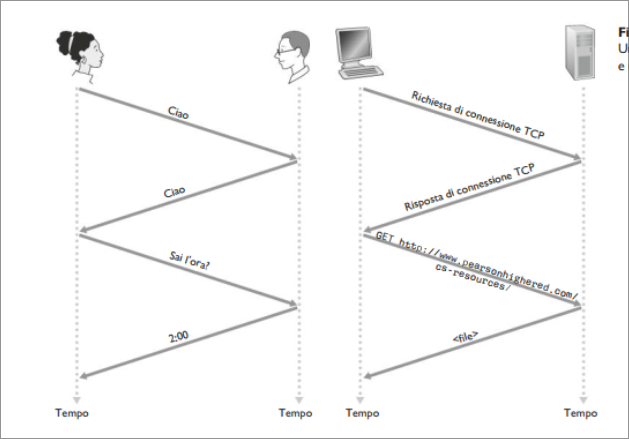
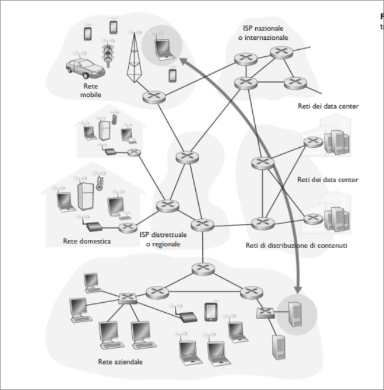
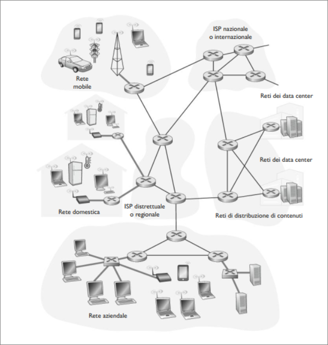
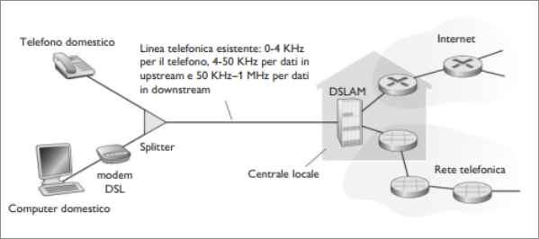
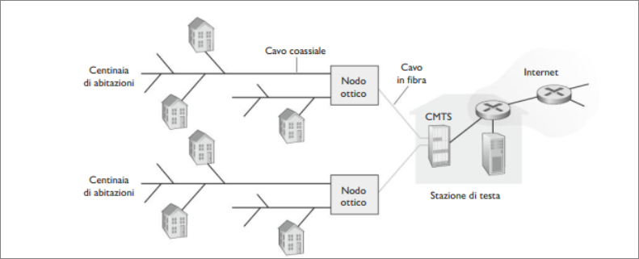
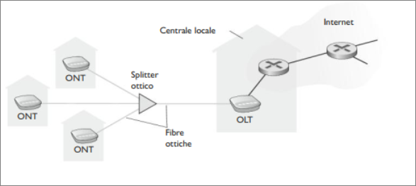
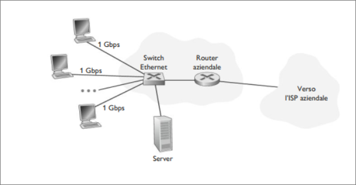
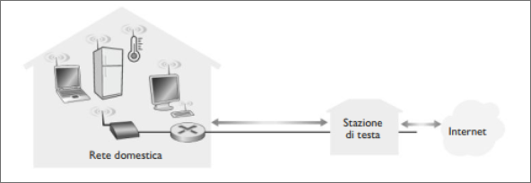
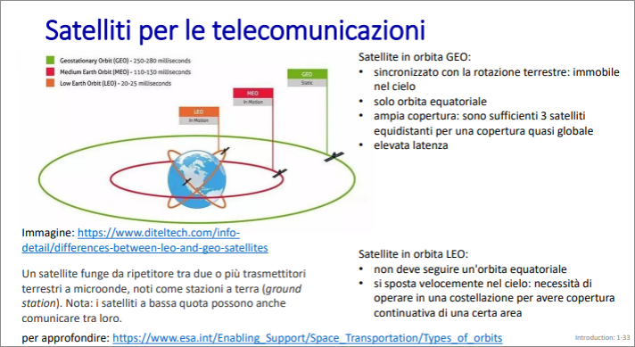

# Reti di calcolatori
## Che cos'è Internet?
Cos'è Internet? Esistono due modi di rispondere a questa domanda. La prima è descrivere gli "ingranaggi" di internet, ossia i componenti di  base hardware e software che la compongono. Un altro metodo consiste nel descrivere Internet in termini di infrastruttura di rete che fornisce servizi ad applicazioni distribuite.

### Gli "ingranaggi" di Internet
Internet è una rete di calcolatori che interconnette miliardi di dispositivi di calcolo in tutto il mondo. Questi dispositivi, in gergo, sono detti **host** o **sistemi periferici**.  
I sistemi periferici sono connessi tra loro tramite una **rete di collegamenti** e **commutatori di pacchetti**. Collegamenti diversi possono trasmettere dati a velocità differenti, e tale **tasso di trasmissione** viene misurata in bit/secondo (*bps*).  
  
Quando un Host vuole inviare dati ad un altro, suddivide i dati in sottoparti e aggiunge un'intestazione a ciascuna di esse: l'insieme delle informazioni risultanti , viene chiamato **pacchetto**.  
I pacchetti sono inviati attraverso la rete alla destinazione, dove vengono riassemblati per ottenere i dati originari. Un commutatore di pacchetto prende un pacchetto che arriva da uno dei collegamenti in ingresso e lo ritrasmette su uno di quelli in uscita. In internet i due principali sono i **router** e i **commutatori a livello di collegamento**. Entrambi instradano i pacchetti verso la loro destinazione finale. I commutatori a livello di collegamento sono solitamente usati nelle reti di accesso , mentre i router nel nucleo della rete. Dal sistema di invio a quello di ricezione, la sequenza di collegamenti e di commutatori di pacchetto attraversata dal singolo pacchetto è nota come **percorso**.  
I sistemi periferici accedono a Internet tramite i **Internet Service Provider** (**ISP**) che comprendono ISP residenziali, ISP aziendali, ISP universitari, ISP che forniscono accesso WiFi in aereoporti, hotel, bar e altri luoghi pubblici e ISP che forniscono accesso in mobilità.  
Un provider è un insieme di commutatori di pacchetto e di collegamenti.Gli ISP forniscono ai sistemi periferici svariati tipo di accesso alla rete. Inoltre rendono disponibile l'accesso a Internet ai fornitori di servizi, connettendone i server a Internet. Gli ISP devono essere interconnessi.  

Sistemi periferici, commutatori di pacchetto e altre parti di Internet fanno uso di protocolli che controllano l'invio e la ricezione di informazioni all'interno della rete. Due dei principali protocolli Internet sono: **Transmission Control Protocol** (**TCP**), e l'**Internet Protocol** (**IP**). Quest'ultimo specifica il formato dei pacchetti scambiati tra router e sistemi periferici.  
Data la loro importanza per Internet, un accordo sulle funzioni svolte da ogni protocollo risulta fondamentale, qui entrano in gioco gli standard. Gli **standard di Internet** vengono sviluppati dall'**Internet Enginnering Task Force** (**IETF**). Le pubblicazioni sugli standard di internet vengono dette **Request For Comment** (**RFC**).
### Descrizione dei servizi 
Possiamo descrivere Internet come un'infrastruttura che fornisce servizi alle applicazioni (posta elettronica, messaggistica istantanea, navigazione WEB, ...). Queste applicazioni sono dette **applicazioni distribuite**, in quanto coinvolgono più sistemi periferici che si scambiano reciprocamente dati. L'aspetto più rilevante è che le applicazioni Internet vengono eseguite sui sistemi periferici e non sui commutatori di paccheto del nucleo della rete, questo perché essi non hanno a che fae con le applicazioni che sono sorgente e destinazione dei dati.  

Ma come fa una parte di applicazione eseguita su un sistema periferico a istruire Internet affinché recapiti dati a un'altra parte di software eseguita su un altro sistema periferico?  
I sistemi periferici collegati a Internet forniscono una **interfaccia socket**, che specifica come un programma eseguito su un sistema periferico possa chiedere  internet di recapitare dati a un programma eseguito su un altro sistema periferico.  
### Che cos'è un protocollo?
**Un'analogia**  

  

Come in figura, il protocollo umano impone come prima cosa un saluto per iniziare la comunicazione con qualcun'altro. La tipica risposta è un messaggio di saluto di ritorno. Implicitamente, una persona interpreta una risposta cordiale come "Ciao" come l'indicazione di poter procedere a chidere l'ora. Una risposta diversa potrebbe indicare come una scarsa propensione a comunicare o l'incapacità di farlo.  
Se le persone adottano protocolli differenti (per esempio se una persona è bene educata e l'altra no, o se una delle due comprende il concetto di tempo e l'altra no) i protocolli non interoperano e non è possibile portare a termine una transazione utile.   
Lo stesso concetto vale per le reti. Lo scambio si appoggia a due (o più) entità che comunicano utilizzando lo stesso protocollo al fine di assolvere un certo compito.  

**Protocolli di rete**  

Un protocollo di rete è simile a un protocollo umano, a eccezione del fatto che le entità che si scambiano messaggi e che intraprendono azioni sono componenti hardware o software di qualche dispositivo.  
Qualsiasi attività in Internet che coinvolga due o più entità remote in comunicazione viene governata da un protocollo.  
Come esempio di protocollo si consideri che succede quando si invia una richiesta a un web server, ossia quando si digita l'indirizzo di una pagina web in un browser.  
Come nella figura precedente (parte destra), per prima cosa il computer invierà un messaggio di richiesta di connessione al web server e si metterà in attesa di un messaggio di risposta. Il web server alla fine riceverà il messaggio di richiesta di connessione e restituirà un messaggio di risposta di connessione. Sapendo che ora è possibile richiedere un documento web, il computer invierà il nome della pagina che vuole prelevare dal server tramite un messaggio GET. Infine il web server restituirà la pagine web (file) al computer.  

*Un* ***protocollo*** *definisce il formato e l'ordine dei messaggi scambiati tra due o più entità in comunicazione, così come le azioni intraprese in fase di trasmissione e/o di ricezione di un messaggio o di un altro evento*.

## Ai confini della rete  

  

Gli host sono spesso suddivisi in due categorie: **client** e **server** in modo informale, i client sono host che richiedono dei servizi e tendono a essere PC, laptop, smartphone e via dicendo, mentre i server si occupano di erogare dei servizi e sono sostanzialmente macchine più potenti che memorizzano e distribuiscono pagine Web o flussi video, ecc...  
Oggigiorno la maggior parte dei server è collocata in grandi **data center**  
### Le reti di accesso  
Finora abbiamo considerato le applicazioni e i sistemi periferici ai confini della rete; esaminiamo ora le **reti di accesso**, cioè la rete che connette fisicamente un sistema al suo **edge router**, che è il primo router sul percorso dal sistema d'origine a un qualsiasi altro sistema di destinazione collocato al di fuori della stessa rete di accesso  

  

**Accesso residenziale: DSL, via cavo, FTTH e 5G fixed wirless**
Oggigiorno i due accessi residenziali a larga banda più diffusi sono il **digital subscriber line** (**DSL**) e quello via cavo.  

  

Come in figura il model DSL dell'utente usa la linea telefonica esistente per scambiare dati con un *digital subscriber line access multiplex*(DSLAM) che si trova nella **centrale locale**. Il modem DSL residenziale converte i dati digitali in toni ad alta frequenza per poterli trasmettere alla centrale locale sul cavo telefonico; tutti i segnali analogici in arrivo dalle abitazioni vengono riconvertiti in formato digitale nel DSLAM.  

Il DSLAM nella centrale locale separa i segnali dei dati da quelli della telefonia e invia i dati su Internet.  Centinaia di abitazioni sono connesse a un unico DSLAM.  
Gli standard DSL definiscono i tassi di trasmissione tra i quali quelloin downstream a 24 e 52 Mbps e quello in upstream a 3.5 e 16 Mbps.  
L'ultimo standard fornisce un tasso aggregato in downstream e upstream di 1 GBPS.  
L'accesso viene detto asimmetrico, perché le velocità di trasmissione in downstream e upstream sono diverse. Le velocità effettivamente raggiunte in downstream e upstream possono essere inferiori, perché il provider DSL può limitare appositamente il tasso di trasmissione quando offre servizi a più livelli o perché il tasso di trasmissione massimo è limitato dalla distanza che intercorre tra l'abitazione e la centrale locale, dalla qualità del materiale e dal grado di interferenza elettrica.  
La DSL è stata progettata da distanze piccole tra l'abitazione e la centrale locale.  

L'**accesso via cavo** utilizza invece le infrastrutture esistenza della televisione via cavo.  

  
Lo schema rappresentato in foto viene chiamato *hybrid fiber coax* (HFC) in quanto impiega sia la fibra ottica sia il cavo coassiale.  

L'accesso a Internet via cavo richiede modem speciali, chiamati **cablemodem**.  
Come il modem DSL, anche il cable modem è generalmente un dispositivo esterno che si connette al PC di casa attraverso una porta Ethernet.  
Alla stazione di testa il sistema i terminazione del cable modem svolge una funzione simile al DSLAM: traduce il segnale analogico inviato dai cable modem in formato digitale.  
I cable modem dividono la rete HFC in due canali: una canale in upstream e uno in downstream. L'accesso è asimmetrico:al canale in downstream vengono allocati tassi di trasmissione più elevati di quello in upstream.  
Un'importante caratteristica di HFC è il fatto di rappresentare un mezzo di trasmissione condiviso. Se diversi utenti stanno contemporaneamente scaricando un file video sul canale di downstream, l'effettiva velocità alla quale ciascun utente riceve il proprio file video sarà inferiore rispetto a quella totale del canale di downstream.  

Una tecnologia promettente che vanta velocità maggiori è detta **fiber to the home** (**FTTH**). Il concetto è semplice: fornire fibra ottica dalla centrale locale direttamente alle abitazioni. Può potenzialmente fornire velocità di accesso a Internet di gigabit al secondo.  

La rete di distribuzione ottica più semplice è chiamata fibra diretta, in cui una singola fibra collega una centrale locale a un'abitazione.
Di solito però una fibra uscente dalla centrale locale è condivisa da molte abitazioni e solo quando arriva vicina alle abitazioni viene suddivisa in più fibre. Vi sono due architetture che eseguono questa suddivisione: le reti ottiche attive (AON, *active optical networks*) e passive (PON, *passive optical networks*). Quelle AON sono Ethernet commutate.  
  

La figura mostra l'FTTH usata nell'architettura PON. Oni abitazione una terminatore ottico chiamato *optical network terminator* (ONT), connesso a un separatore ottico (splitter) tramite una fibra ottica dedicata. Lo splitter combina più abitazioni in una singola fibra ottica condivisa che si connette a un altro terminatore *optical line terminator* (OLT). L'OLT fornendo la condivisione tra segnali ottici ed elettrici, si connette  Internet tamite un router della compagnia telefonica.  Nell'abitazione gli utenti connettono un router residenziale all'ONT e accedono a Internet.  

Infine sta iniziando ad essere utilizzato il servizio **5G Fixed Wirless Access** (FWA) che oltre a promettere velocit elevate lo fa anche senza installare cavi costosi e soggetti a guasti.  
Con tale tipo di accesso i dati vengono inviati in modalità wirless dalla stazione base di un provuider al modem di casa.  

### Accesso aziendale (e residenziale): Ethernet e WiFi
Nelle aziende, università e sempre di più nelle abitazioni per collegare gli host al router di bordo si utilizza una **rete locale** (LAN, *local area network).  
Esistono molti tipi di LAN ma la teconologia Ethernet è attualmente la più utilizzata.  

  

Ethernet utilizza un doppino di rame intrecciato per collegare numerosi host tra loro e connetterli a uno switch Ethernet. Questo viene poi a sua volta connesso a Internet. Con l'accesso a Ethernet gli utenti hanno velocità tra i 100 Mbps e i 10 Gbps, i server da 1 a 10 Gbps.  
In una LAN wirless gli utenti trasmettono e ricevono pacchetti entro un aggio di poche decine di metri da e verso un access point wirless connesso a una rete aziendale, connessa a Internet.  

  

### Accesso wirless su scala geografica: 3G e LTE 4G e 5G  

A differenza del WIFi l'utente può trovarsi a poche decine di chilometri dalla stazione base, invece che decine di metri.  
Consentono accesso wirless a Internet a velocità fino a 60 Mbps.  

## Mezzi trasmissivi  

Per definire cosa sia un mezzo fisico facciamo una riflessione sulla breve esistenza di un bit che viaggia da un sistema periferico ad un altro, attraverso una serie di collegamenti e router. Il bit viene ritrasmesso più volte.  
Il sistema di origine è il primo a trasmettere il bit che sarà ricevuto dal primo router della sequenza; questi lo ritrasmetterà al secondo router che provvederà inviarlo al successivo router, e così via.  
Pertanto il bit quando viaggia dalla sorgente alla destinazione, passa per una serie di coppie trasmettitore-ricevitore, propagandosi dall'uno all'altro sotto forza di onda elettromagnetica o impulso ottico attraverso un mezzo fisico. Questi possono essere cavo coassiale, doppino intrecciato, fibra ottica, spettro radio terrestre. Questi possono dividersi in due categorie: **mezzi vincolati** e **non vincolati**. Nei primi, le onde vengono contenute in un mezzi fisico, quale un cavo in fibra ottica, un filo di rame o cavo coassiale. I secondi, le onde si propagano nell'atmosfera e nello spazio esterno come avviene nelle LAN wirless o nei satelliti.  

### Doppino di rame intrecciato 
Costituito da due fili di rame isolati, ciascuno spesso meno di 1 mm.  Le odierne velocità trasmissive di una rete locale che utilizza il doppino variano tra 10 Mbps e 10 Gbps.  
Ma la categoria 6a può raggiungere velocità trasimissive di 10 Gbps a distanze inferiori a un centinaio di metri.  

### Cavo coassiale
Costituito da due conduttori di rame concentrici, bidirezionale e a banda larga: canali di frequenza multipli sul cavo e centiania di Mbps per canale.  
### Fibra ottica  
Mezzo sottile e flessibile che conduce impulsi di luce, ciascuno dei quali rappresenta un bit. Ha un'elevata velocità trasmissiva: trasmissione punto-punto ad alta velocità (fino a decine e centinaia di Gbps). Attenuazione di segnale molto bassa nel raggio di 100 km. Basso tasso di errore: ripetitori distanziati, immune all'interferenza elettromagnetica.  

### Canali di radio  
Trasportano segnali nello spettro elettromagnetico, non richiedono l'installazione fisica di cavi.  
Tipi:
+ Wirless LAN (WiFi): decine/centinaia di Mbps; decine di metri.
+ wide-area (4G/5G): decine di Mbps (4g) su circa 10 km; 4G+ fino a 300 Mbps.
+ Bluetooth: sostituzione dei cavi, distanze breve, velocità limitate
+ microonde terrestri: punto-punto; canali fino a 45 Mbps.  

