# Reti di Calcolatori e Internet 
## Il nucleo della rete  

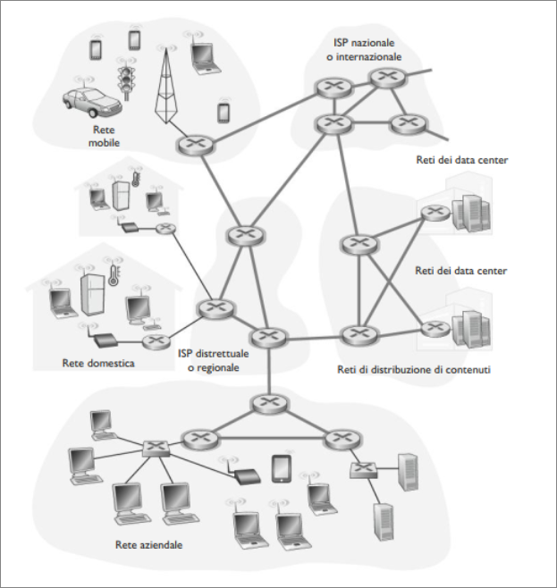  
*Nella figura il "nucleo della rete" è evidenziato con linee più spesse e ombreggiate.* 

### Commutazione del pacchetto  
Le applicazioni distribuite scambiano **messaggi** che possono contenere qualsiasi cosa il progettista del protocollo desideri.  
Possono svolgere una funzione di controllo o contenere dati come in un messaggio di posta elettronica, un'immagine JPEG o un file audio MP4.  

La sorgente suddivide i messaggi lunghi in parti più piccole note come **pacchetti**. Tra la sorgente e la destinazione, questi pacchetti viaggiano attraverso collegamenti e **commutatori di pacchetto** (**router** e **commutatori a livello di collegamento**). I pacchetti vengono trasmessi su ciascun collegamento a una velocità pari alla velocità totale di trasmissione del collegamento stesso. Quindi se un sistema periferico o un commutatore invia un pacchetto di $L$ bit su un canale con velocità di $R$ bps, il tempo di trasmissione risulta pari a $L/R$ secondi.  
**Trasimssione store-and-forward**  

La maggior parte dei commutatori di pacchetto utilizza la **trasmissione store-and-forward**. Ciò significa che il commutatore deve ricevere l'intero pacchetto prima di poter cominciare a trasmettere sul collegamento in uscita il primo bit. Per capire meglio questo tipo di trasmissione si consideri la seguente rete:  

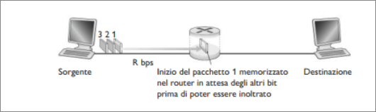  

vi sono due host collegati attraverso un unico router. Un router è usualmente dotato di molti collegamenti; infatti il suo compito è quello di instradare un pacchetto in entrata su un collegamento in uscita.  
Iil destinatario ha ricevuto i primi due pacchetti e il router ha ricevuto il terzo. Infine al tempo $5L/R$ il destinatario ha ricevuto i tre pacchetti.  

In generale, su un percorso consistente di $N$ collegamil destinatario ha ricevuto i primi due pacchetti e il router ha ricevuto il terzo. Infine al tempo $5L/R$ il destinatario ha ricevuto i tre pacchetti.  

In generale, su un percorso consistente di $N$ collegamn questo esempio la sorgente deve inviare alla destinazione tre pacchetti, ogniuno di $L$ bit. Nella figura, la sorgente ha già trasmesso parte del pacchetto 2 in cui i primi bit sono già arrivati al router.  Il router non può trasmettere i bit che ha ricevuto in questo momento perché adotta la modalità store-and-forward; al contrario deve poter prima imagazzinare nel buffer i bit del pacchetto. Solo dopo aver ricevuto tutti i bit del pacchetto il router può iniziare a trasmettere il pacchetto sul collegamento di uscità.  
Calcoliamo ora il tempo che intercorre da quando la sorgente inizia a inviare il pacchetto a quando il destinatario lo ha completamente ricevuto. Stiamo tyrascurando il ritardo di propagazione, ossia il tempo che i bit impiegano a percorrere il collegamento a una velocità che si avvicina alla velocità della luce.  
La sorgente inizia la trasmissione al tempo 1; all'istante $L/R$ secondi ha trasmesso l'intero pacchetto e quest'ultimo è stato ricevuto e memorizzato nel router, in quando si sono trascurati i ritardi di propagazione. In tale istante, il router comincia a trasmetytere il apcchetto verso il canale di uscità verso il destinatario; all'istante $2L/R$ secondi l'intero pacchetto è stato trasmesso dal router e ricevuto dal destinatario. Quindi il ritardo totale è $2L/R$.  

Calcoliamo ora l'intervallo di tempo intercorso da quando la sorgente inizia a inviare il primo pacchetto a quando il destinatario li ha ricevuti tutti e tre.  
Al tempo $L/R$ il router inizia a inoltrare il primo pacchetto. Ma sempre al tempo $L/R$ inizia a inviare anche il secondo , oerché ha appena completato l'invio del primo pacchetto. Quindi al tempo $3L/R$ il destinatario ha ricevuto il primo pacchetto e il router ha ricevuto il secondo. Allo stesso molto al tempo $3L/R$ il destinatario ha ricevuto i primi due pacchetti e il router ha ricevuto il terzo. Infine al tempo $4L/R$ il destinatario ha ricevuto i tre pacchetti.  

In generale, su un percorso consistente di $N$ collegamenti ogniuno con velocità di trasmissione $R$. Applicando lo stesso ragioanemtno di trova che il ritardo da un capo all'altro (end-to-end).  
$d_{end-to-end} = N \frac{L}{R}$.  

**Ritardi di accodamento e perdita di pacchetti**  

Ogni commutatore di pacchetto connette più collegamenti. Per ciascuno di questi, il commutatore mantiene un **buffer di output** (detto anche **coda di output**) per conservare i pacchetti che sta per inviare su quel collegamento. I buffer di output rivestono un ruolo chiave nella commutazione di pacchetto. Un pacchetto in arrivo che debba essere inviato attraverso un collegamento occupato dalla trasmissione di un altro, deve attendere nella doda di output. Di conseguenza oltre ai ritardi di store-and-forward, i pacchetti subiscono anche **ritardi di accodamento** nei buffer di output. Dato che la dimensione del buffer è finita , un pacchetto può trovare il buffer completamento pieno di altri pacchetti che attendono la trasmissione. IN tal caso si verificherà una **perdita del pacchetto**: verrà eliminato o il pacchetto o uno di quelli in coda.  

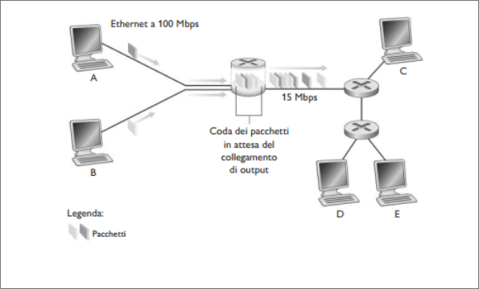

Nella figura i pacchetti vengono rappresentati da piccole lastre tridimensionali. Il loro spessore rappresenta il numero di bit del pacchetto.In questa figura tutti i pacchetti hanno la stessa lunghezza.  
Si supponga che gli host A e B stiano inviando pacchetti a E. Dapprima inviano i loro pacchetti lungo i collegamenti Ethernet a 100 Mbps verso il primo commutatore di pacchetto. Quest'ultimo dirige i pacchetti al collegamento da 15 Mbps. Se per un breve lasso di tempo la velocità di arrivo dei pacchetti al commutatore supera la velocità di inolto sul collegamento in uscita si verifica una congestione, in quanto i pacchetti rimangono in cosa nel buffer di output prima di venire trasmessi sul collegamento.  

**Tabelle di inoltro e protocolli di instradamento**  

Come fa il router a determinare su quale collegamento il pacchetto dovrebbe essere inoltrato? Ciò viene fatto in diversi modi a seconda del tipo di rete.  
In Internet ogni host ha un indirizzo chiamato indirizzo IP.  
Ogni pacchetto che percorre la rete contiene nella propria intestazione l'indirizzo della sua destinazione. Quando un pacchetto giunge a un router della rete, questo esamina una parte dell'indirizzo di destinazione e lo inoltra a un router adiacente. Ogni router ha una **tabella di inoltro** che mette in relazione gli indirizzi di destinazione con i collegamenti di uscità. Quando un pacchetto giunge a un router, questo esamina l'indirizzo e consulta la propria tabella per determinare un collegamento uscente appropriato. Il router dirige il pacchetto verso quel collegamento di uscità.  
Abbiamo appena appreso che un router usa l'indirizzo di destinazione del pacchetto per consultare una tabella di inoltro e determinare il collegamento di uscita corretto. Per impostare le tabelle di inoltro, Internet ha parecchi **protocolli di instradamento**. Questo può ad esempio determinare il percorso più corto da ciascun router verso ciascuna destinazione e usare questo risultato per configurare le tabelle.  

### Commutazione di circuito
Per spostare i dati in una rete di collegamenti e commutatori esistono due approcci fondamentali: la **commutazione di circuito** e la **commutazione di pacchetto**. Esaminiamo ora le prime.  
Nelle reti a commutazione di circuito le risorse richieste lungo un percorso, per consentire la comunicazione tra host, sono riservate per l'intera durata della sessione di comunicazione. Nelle reti a commutazione di pacchetto, tali risorse non sono riservate; i messaggi di una sessione utilizzano le risorse e di conseguenza potrebbero dover attendere per accedere a un collegamento.  
Le reti telefoniche sono esempi di reti a commutazione di circuito. Quando una persona vuole inviare informazioni ad un altro, prima che possa inizare l'invio, la rete deve stabilire una connessione tra mittente e destinatario. Questa connessione nel gergo della telefonia è detta **circuito**. Quando la rete stabilisce un circuito riserva una velocità di trasmissione costante nei collegamenti per la durata della comunicazione.  

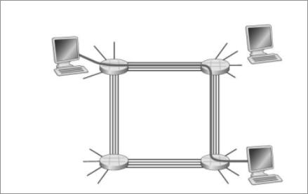  

La figura mostra una rete a commutazione di circuito in cui i quattro commutatori sono interconessi tramite quattro collegamenti. Ciascuno di questi ultimi dispone di quattro circuiti, in modo che ogni collegamento possa supportare quattro connessioni simultanee. Gli host sono tutti direttamente connessi a uno dei commutatori. Quando due host desiderano comunicare la rete stabilisce una **connessione end-to-end** (**punto a punto**) dedicata a loro.  
Affinché A invii messaggi a B, la rete deve prima riservare un circuitosu ciascuno dei due collegamenti. Nell'esempio la connessione punto a punto usa iil secondo circuito del primo collegamento e il quarto circuito del secondo. Poiché ogni collegamento ospita quattro circuiti, per ogni collegamento utilizzato dalla connessione punto a punto la connessione ottiene un quarto della capacità trasmissiva totale del collegamento per la durata della connessione stessa.  

**Multiplexing nelle reti a commutazione di circuito**  

Un circuito all'interno di un collegamento è implementato tramite **multiplexing a divisione di frequenza** (**FDM**) o **multiplexing a divisione di tempo** (**TDM**). Con FDM, lo spettro di frequenza di un collegamento viene suddiviso tra le connessioni stabilite tramite il collegamento. Nello specifico il collegamento dedica una banda di frequenza a ciascuna connessione per la durata della connessione stessa. La larghezza della banda viene detta **ampiezza della banda**.  
Per un collegamento TDM il tempo viene suddiviso in frame di durata fissa a loro volta ripartiti in un numero fisso di slot temporali. Quando la rete stabilisce una connessione attraverso un collegamento, le deidca uno slot di tempo in ogni frame. Tali slot sono dedicati unicamente a quella connessione, con uno slot temporale disponibile in ciascun frame alla trasmissione dei dati di connessione.  

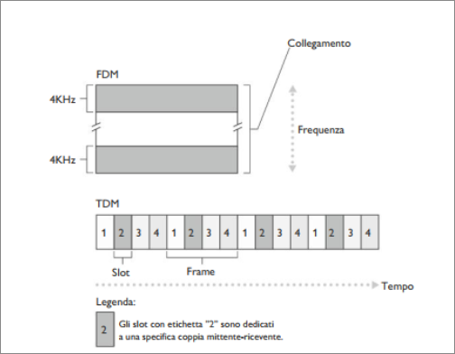  

La figura mostra FDM e TDM per uno specifico collegamento di rete che supporta fino a quattro circuiti. Nel caso di FDM il dominio delle frequenze viene ripartito in quattro bande, ciascuno con ampiezza di 4kHz.  
Nel caso di TDM, il dominio del tempo viene suddiviso in frame, con quattro slot di tempo per ciascun intervallo; a ogni circuito viene assegnato lo stesso slot dedicato in tutti i frame.
Nel caso TDM la velocità di trasmissione di un circuito è uguale alla frequenza di frame moltiplicata per il numero di bit in uno slot. Per esempio se il collegamento trasmette 8000 frame al secondo e ogni slot è costituito da 8 bit, allora la velocità di trasmissione del circuito è di 64 Kbps.  

I sostenitori della commutazione di pacchetto, hanno sempre sostenuto che la commutazione di circuito fosse dispendiosa, dato che i circuiti dedicati sono inattivi durante i **periodi di silenzio**. Un esempio sta nel considerare un radiologo che usa una rete a commutazione di circuito per accedere in remoto a una serie di lastre. IL radiologo predispone una connessione, richiede un'immagine, la osserva e poi ne richiede un'altra. Per tutto il tempo in cui il radiologo guarda le lastre, le risorse di rete vengono sprecate.  
I sostenitori della commutazione di pacchetto tendono anche a sottolineare la complicazione insita nello stabilire circuiti e nel riservare la larghezza di banda punto a punto. Ciò richiede un software complesso.  
**Confronto tra commutazione di pacchetto e commutazione di circuito**  
Perché la commutazione di pacchetto risulta più efficiente? Usiamo un esempio.  Si supponga che gli utenti condividano un collegamento da 1Mbps e che ciascun utente alterni periodi di attività, in cui genera dati a una velocità costante di 100 Kbps, a momenti durante i quali non veongono generati dati. Si ipotizzi che l'utente sia attivo solo per il 10% del tempo. Con la commutazione di circuito è necessario *riservare* 100 kbps per ciascun utente in ogni istante. Per esempio nel caso TDM a commutazione di circuito, se un frame di un secondo viene diviso in 10 slot da 100 ms, ciascun utente si vedrebbe allocato uno slot per frame.  Pertanto il collegamento può supportare simultaneamente solo 10 (=1Mbps/100 kbps) utenti.  
Con la commutazione di pacchetto la probabilità che un determinato utente sia attivo è pari a 0,1. Se sono presenti 35 utenti, la probabilità di avere 11 o più utenti attivi in contemporanea è circa 0,0004. Un altro esempio. Si supponga la presenza di 10 utenti, e che un utente improvvisamente generi 1000 pacchetti da 1000 bit, mentre gli altri rimangono inattivi senza generare traffico. Con la commutazione di circuito TDM e 10 slto da 1000 bit per frame, l'utente attivo può utilizzare soltanto il proprio slot temporale per trasmettere dati, mentre i restnati nove slot del frame rimangono inutilizzati. Trascorreranno dieci secondi prima che il milione di bit dell'utente attivo sia stato completamente trasmesso.  
Nel caso di commutazione di pacchetto, l'utente può continuamente inviare i propri pacchetti alla massima velocità di collegamento, dato che nessun altro utente genera pacchetti che richiedono di essere trasmessi assieme a quelli dell'utente attivo.  

Gli esempi riportati sottolineano la curciale differenza tra le due forme di condivisione della velocità trasmissiva di un collegamento su più flussi di dati. La commutazione di circuito prealloca l'uso dek collegamento trasmissivo indipendentemente dalla richiesta, con collegamenti garantiti, na non utilizzati, che provocano il dispendio di tempo. La commutazione di pacchetto alloca l'uso di collegamenti su *richiesta*. Pacchetto per pacchetto, la capacità trasmissiva dei collegamenti sarà condivisa solo tra gli utenti che devono trasmettere.  

### Una rete di reti

La connessione degli utenti e dei fornitori di contenuti alla rete di un ISP è solo una piccola parte del puzzle daa risolvere per connettere i  miliardi di utenti. Per completare il puzzle bisogna interconnettere gli ISP attraverso una **rete di reti**.  

Un approccio naif sarebbe quello di connettere direttamente ogni ISP diaccesso con tutti gli altri. Una struttura a maglia completa è troppo costosa per gli ISP in quanto richiederebbe a ogniuno di essi di avere un collegamento separato per ciascuna delle centinaia delle migliaia degli altri ISP nel mondo.  

La nostra prima struttura di rete, *Struttura di rete 1*, interconnette tutti gli ISP di accesso con unico ISP globale di transito. Il nostro ISP globale di transito è una rete di router e collegamenti che non solo copre l'intero  globo, ma anche alneo un router prossimo a ogniuno delle centinaia di migliaia ISP di accesso.  

Poiché l'ISP di accesso paga l'ISP globale di transito, l'ISP di accesso è comunemente detto **cliente** (customer) e l'ISP globale di transito prende il nome di **fornitore** (provider).  

Se tuttavia un'azienda costruisse e gestisse un ISP globale che si rivelasse vantaggioso, allora altre aziente costruirebbero il proprio ISP globale di transito e si metterebbero tutti in competizione.  
Questo ragionamento porta alla *Struttura di rete 2*, che consiste di centinaia di migliaia di ISP di accesso e più ISP globali di transito.  
La *struttura di rete 2* è una gerarchia a due livelli nella quale provider globali di trasnito stanno in cima alla gerarchia e gli ISP di accesso alla base.  
Nella realtà sebbene alcuni ISP abbiano veramente una copertura globale impressionante e siano invero connessi a molti ISP di accesso, nessun ISP è presente in ogni posto del mondo.  
Al contrario in ogni regione può esservi un **ISP regionale**. Ogni ISP regionale si connette all' **ISP di primo livello** (*tier-1 ISP*), che non sono presenti in ogni città del mondo.  

Non ci sono più solo ISP di primo livello in competizione ma anche nelle regioni ci sono più ISP regionali in competizione tra di loro. In questa gerarchia ogni ISP di acesso paga l'ISP regionale a cui si connette, che a sua volta paga il suo ISP di primo livello. Un ISP di accesso può anche donnettersi direttamente a un ISP di primo livello  e in tal caso lo paga direttamente. Quindi c'è una relazione cliente-fornitore a ogni livello della gerarchia. Poiché gli ISP di livello 1 sono in cima alla gerarchia, essi non pagano nessuno.  
In alcune regioni ci può essere un ISP regionale più grande , che magari copre l'intera nazione, al quale gli ISP regionali più piccoli si connettono.  

Chiameremo questa gerarchia a livelli, che è un approssimazione grezza dell'internet odierna, *Struttura di rete 3*.  

Per costruire una rete che sia più simile all'Internet odierna dobbiamo aggiungere alla struttura di rete 3 i PoP, il multi-homing, il peering e gli IXP.  
I **PoP** esistono in tutti i livelli della gerarchia tranne che in quello degli ISP di accesso. Un PoP è un gruppo di router vicini tra loro nella rete del provider, tramite il quale gli ISP clienti possono connettersi al fornitore. Una rete cliente si connette al PoP del fornitore affittando un collegamento ad alta velocità da un provider di telecomunicazioni terzo, collegando direttamente uno dei suoi router a un router del PoP.  
Qualunque ISP, tranne quelli del primo livello, può scegliere la modalità **multi-homing** (o **multi-home**). che consiste nel connettersi a due o più ISP fornitori.  
Per esempio, un ISP di accesso può effettuare una connessione multi-home con due ISP regionali o con due ISP regionali e un ISP di primo livello. Allo stesso modo un ISP regionale PUÒ connettersi con modalità multi-home con più ISP di primo livello. Con questa modalità un ISP può continuare a inviare e ricevere pacchetti in Internet anche se uno dei fornitori è guasto.  
Per avere una connessione Internet globale gli ISP clienti pagano i loro ISP fornitori. Il costo riflette la quantità del traffico che l'ISP cliente scambia con il fornitore. Per ridurre tali costi, una coppia di ISP vicini e di pari livello gerarchico può fare uso di **peering**, cioè connettere direttamente le loro reti in modo che tutto il traffico tra di esse passi attraverso una connessione diretta piuttosto che transitare da un intermediario. In questa modalità nessun ISP effettua pagamenti all'altro.  
Utilizzando queste connessioni un'azienda terza può creare un IXP (*INternet exchange point*), un punto d'incontro dove più ISP possono fare peering tra di loro.  

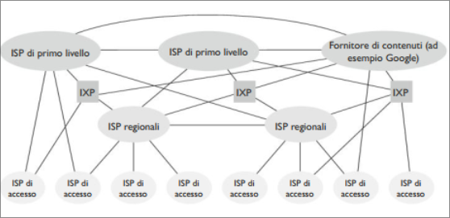  

Ci riferiremo a questo ecosistema consistente in ISP di accesso, ISP regionali, ISP di primo livello, PoP, multi-homing, peering e IXP come alla *Struttura di rete 4*.  

Concludiamo con la *Struttura di rete 5*, che descrive l'Internet odierna. La struttura è mostrata in figura precedente, è costruita sulla *Struttura di rete 4* aggiungendo le reti di distribuzione di contenuti: reti private che connettono i suoi data center a Internet, spesso aggirando ISP tier-1 e regionali.  

>[!NOTE]  
>Riassumendo, oggigiorno Internet è complessa e consiste di dozzine di ISP di primo livello e centinaia di migliaia di ISP di livello inferiore. Gli ISP si distinguono per la copertura geografica: alcuni di essi si estendono per continenti e oceani mentre altri si limitano a ristrette regioni. Gli ISP di livello più basso si collegano a quelli di lovello superiore e questi ultimi si interconnettono tra loro. Gli utenti e i fornitori di contenuto sono clienti degli ISP di livello inferiore, mentre questi sono a loro volta clienti degli ISP di livello superiore. 

## Ritardi, perdite e throughput nelle reti a commutazione di pacchetto  
Idealmente, vorremmo che i servizi Internet fossero in grado di spotare una quantità di dati qualsiasi tra due host, istantaneamente e senza alcuna perdita di dati. Purtroppo non è possibile. Le reti di calcolatori limitano necessariamente il throughput, cioè la quantità di dati al secondo che può essere trasferita tra due host, introducono ritardi tra quest'ultimi e possono addirittura perdere pacchetti.  

### Panoramica del ritardo nelle reti a commutazione di pacchetto 
Ricordiamo che un pacchetto parte da un host (sorgente), passa attraverso una serie di router e conclude il viaggio in un altro host (la destinazione). A ogni tappa, il pacchetto subisce vari tipi di ritardo a ciascun nodo (host o router) del tragitto.  
Di tali ritardi, i principali sono il **ritardo di elaborazione**, **ritardo di accodamento**, il *ritardo di trasmissione* che complessivamente formano il **ritardo totale**. Le prestazioni di molte applicazioni per Internet sono influenzate dai ritardi di rete.  

**Tipi di ritardo**  

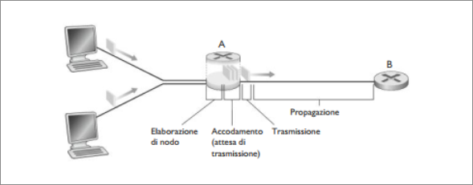  

In figura, un pacchetto viene inviato dal nodo  monte attraverso il router A verso il router B, Il nostro scopo è caratterizzare il ritardo di nodo presso il router A.  
Si noti che il collegamento in uscita dal router A verso il router B è preceduto da una coda. Quando il pacchetto arriva al router A dal nodo a monte, il router ne esamina l'interstazione per determinare l'uscita e quindi dirige il pacchetto su tale collegamento (quello che porta al router B). Un pacchetto può essere trasmesso su un collegamento solo se non ci sono altri pacchetti in fase di trasmissione e se non esistono pacchetti che lo precedono nella coda; se il collegamento è momentaneamente occupato o se altri pacchetti sono accodati, l'ultimo pacchetto verrà messo in coda.  

**Ritardo di elaborazione**  

Il tempo richiesto per esaminare l'intestazione del pacchetto e per determinare devo dirglielo fa parte del **ritardo di elaborazione**. Questo può anche includere altri fattori, tra i quali il tempo richiesto per controllare errori a livello di bit eventualmente occorsi nel pacchetto durante la trasmissione del nodo a monte al router. Nei router ad alta velocità questi ritardi sono solitamente dell'ordine dei microsecondi o inferiori. Dopo l'elaborazione, il router dirige il pacchetto verso la coda che precede il collegamento al router B.  

**Ritardo di accodamento**  

Una volta in coda, il pacchetto subisce un **ritardo di accodamento**
mentre attende la trasmissione sul collegamento. La lunghezza di tale ritardo per uno specifico pacchetto dipenderà dal numero di pacchetti precedentemente arrivati, accodati e in attesa di trasmissione sullo stesso collegamento.  
Se la coda è vuota e non è in corso la trasmissione di altri pacchetti, il ritardo per il nostro pacchetto è nullo.  
Nella pratica i ritardi di accodamento possono essere dell'ordine dei microsecondi o dei millisecondi.  

**Ritardo di trasmissione**  

Assumendo che i pacchetti siano trasmessi secondo la politica first-come first-served, come avviene comunemente nelle reti a commutazione di pacchetto, il nostro pacchetto può essere trasmesso solo dopo la trasmissione di tutti quelli che lo hanno preceduto nell'arrivo.  
Sia $L$ la lunghezza del pacchetto (in bit) e $R$ bps la velocità di trasmissione del collegamento dal router A al router B. Il **ritardo di trasmissione** risulta essere $\frac{L}{R}$. Ordine microsecondi, millisecondi

**Ritardo di propagazione**  

Una volta sul collegamento, un bit deve propogarsi fino al router B. Il tempo è il **ritardo di propagazione**. Il bit viaggia alla velocità di propagazione del collegamento che dipende dal mezzo fisico ed è compresa nell'intervallo che va dai $2 * 10^8 m/s ai 3 * 10^8 m/s$, corrispondente quest'ultimo alla velocità della luce. Il ritardo di propagazione è dato da *d/v*, dove *d* è la distanza tra i due router, mentre *v* è la velocità di propagazione nel collegamento. Ordine dei millisecondi.  

**Confronto tra ritardi di trasmissione e di propagazione**  

Il ritardo di trasmissione è la quantità di tempo impiegata dai router per trasmettere in uscita il pacchetto, ed è funzione della lunghezza del pacchetto e della velocità di trasmissione del collegamento, ma non ha niente a che fare con la distanza tra i due router.  
Il ritardo di propagazione è il tempo richiesto per la propagazione di un bit da un router a quello successivo ed è funzione della distanza tra i due router, ma non ha niente a che fare con la lunghezza del pacchetto o con la velocità di trasmissione propria del collegamento.  

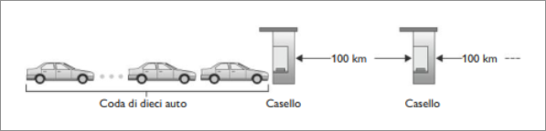  

Siano $d_{elab}, d_{acc}, d_{trasm}, d_{prop}$ i ritardi elaborazione, accodamento, trasmissione, propagazione; il ritardo totale di nodo è:  
$d_{nodo} = d_{elab}+d_{acc}+d_{trasm}+d_{prop}$  

Il contributo di queste componenti del ritardo può variare in modo significativo.  

### Ritardo di accodamento e perdita di pacchetti  
La componente più complessa del ritardo totale del nodo è il ritardo di accodamento.  
A differenza degli altri tre ritardi , quello di accodamento può variare da pacchetto a pacchetto.  
Per esempio, se in una coda vuota arrivano 10 pacchetti contemporaneamente, il primo pacchetto trasmesso non subirà ritardo di accodamento, mentre l'ultimo subirà un ritardo di accodamento abbastanza grande (deve attendere la trasmissione degli altri 9).  
Nel caratterizzare il ritardo di accodamento vengono usate misure statistiche.  
Quando si considera rilevante e quando trascurabile il ritardo di accodamento? La risposta dipende dalla velocità di arrivo del traffico della coda, della veloictà di tramissione del collegamento e dalla natura del traffico entrante.  
Per approfondire l'argomento, denotiamo con $a$ la velocità media di arrivo dei pacchetti nella coda, espressa in pacchetti al secondo. Ricordiamo che $R$ è la velocità di trasmissione. Supponiamo poi che tutti i pacchetti consistano di $L$ bit. Quindi la velocità media di arrivo dei bit in coda è di $La$ bit/s.  
Infine assumiamo che la coda possa mantenere un numero illimitat*o di bit. Il rapporo $La/R$ detto **intensità di traffico**, spesso gioca un importante ruolo nella stima dell'entità di accodamento. 

Se $La/R > 1$ la velocità media di arrivo dei bit nella coda supera la velocità alla quale i bit vengono ritrasmessi in uscita da essa.  
La coda tenderà a crescere senza limiti e il ritardo di coda tenderà a $\infty$.  

Se $La/R \sim 0$ gli arrivi di pacchetti sono pochi e piuttosto distanziati e risulta poco probabile che un pacchetto in arrivo ne trovi un altro in coda. Il ritardo di accodamento sarà quasi nullo.  

Se $La/R \rightarrow 1$ si riscontrano intervalli di tempo in cui la velocità di arrivo supera la capacità trasmissiva e si forma una coda e altri in cui la capacità trasmissiva è inferiore e quindi la coda si riduce.  

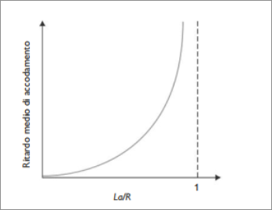  

**Perdita di pacchetti** 

Le code hanno capacità finita. In realtò i ritardi dei pacchetti non tendono all'infinito quando l'intensità di traffico si approssima a 1 ma un pacchetto può trovare la coda piena. Non essendo possibile memorizzare tale pacchetto, il router lo eliminerà.  
Dal punto di vista host, e come se il pacchetto sia stato inviato ma mai ricevuto dal destinatario. La frazione di pacchetti perduti aumentain proporzione all'intensità di traffico.  
Un pacchetto peduto può essere ritrasmesso in modo da assicurare che i dati vengono trasferiti alla destinazione.  
### Ritardo end-to-end  

Consideriamo ora il ritardo dalla sorgente alla destinazione (*end-to-end delay*). Supponiamo l'esistenza di $N-1$ router tra host sorgente e destinazione.  
Ipotiziamo anche che la rete non sia congestionata (trascuro i ritardi di accodamento), il ritardo di elaborazione a ciascun router e presso il mittente sia $d_{elab}$ la velocità di trasmissione in uscità a ogni router e all'host sorgente sia di R bps e la propagazione su ciascun collegamento sia $d_{prop}$. I ritardi totali di nodo si accumulano e danno un ritardo complessivo end-to-end pari a:  

$d_{end-to-end} = N(d_{elab}+d_{trasm}+d_{prop})$.  

**Traceroute**  

Un programma diagnostico che fornisce una misura del ritardo dalla sorgente al router lungo i percorsi Internet punto-punto verso la destinazione. For all $i$:  
+ Invia tre pacchetti che raggiungeranno il router $i$ sul percorso verso la destinazione (con il campo time-to-live uguale a $i$)  
+ Il router $i$ restituirà i pacchetti al mittente 
+ Il mittente calcola l'intervallo tra trasmissione e risposta  

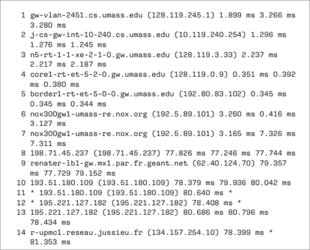  

L'output presenta sei colonne: la prima contiene il valore $n$, il numero del router, la seconda il nome del router, di seguito il suo indirizzo; le ultime tre colonne rappresentano i ritardi di andata e ritorno nelle tre prove. Se l'origine riceve meno di tre messaggi da ogni dato router (per la perdita di pacchetti), Traceroute pone un asterisco subito dopo il numero del router e riporta meno di tre tempi di andatae ritorno per tale router.

Nel percorso abbiamo 14 router tra la sorgente e la destinazione.  
La maggior parte di essi ha un nome tutti hanno un indirizzo. Per esempio il nome del Router4 è *corel-rt-at-5-2-0.gw.umass.edu* e il suo indirizzo è *128.119.0.9*. Analizzando i dati forniti per questo stesso router, vediamo che nella prima delle tre prove il ritardo di andata e ritorno tra la sorgente e il router è stato di 0,351 ms. I ritardi di andata e ritorno per le successive due prove sono stati di 0,392 e 0,380 ms. Questi ritardi includono tutte le componenti di ritardo appena trattate.   
Dato che il ritardo di accodamento varia con il tempo, il ritardo di andata e ritorno del pacchetto $n$ inviato al router $n$ può in realtà essere maggiore rispetto al ritardo di andata e ritorno dal pacchetto $n+1$ inviato al router $n+1$. Infatti nell'esempio si può notare che i ritardi nel Router11 appaiono superiori ai ritardi nel Router12.  

### Throughput nelle reti di calcolatori  
Per definire il throughput end-to-end usiamo un esempio: un trasferimento di un file voluminioso da $A$ a $B$, attraverso la rete. Questo file potrebbe, un grosso videoclip da trasmettere da un computer ad un altro.  

Il **throughput** (*capacità totale*) **istantaneo** in ogni istante di tempo è la veloicità (in bps) alla quale B sta ricevendo il file; molte applicazioni mostrano il Throughput istantaneo durante il download nell'interfaccia utente (speedtest).  
Se il file consiste di $F$ bit e il trasferimento richiede $T$ secondi affinché $B$ riceva tutti gli $F$ bit, allora il **throughput medio** del trasferimento del file è di $F/T$ bps.  

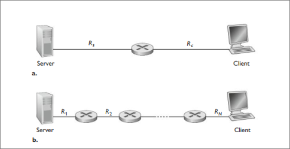  

+ La figura (a) mostra due host, un server e un client connessi da due collegamenti e un router. Si consideri il throughput per un trasferimento di file dal server al client. Sia $R_s$ la velocità del collegamento tra il server e il router $R_c$ quella del collegamento tra il router e il client.  
Qual'è il throughput tra il server e il client? Per rispondere a questa domanda considereremo  i bit come a un fluido e ai collegamenti come a delle condotte. Chiaramente il server non può pompare nel suo collegamento a una veloictà maggiore di $R_s$ bps e il router non può inoltrare bit a una velocità più alta di $R_c$ bps. Se $R_s < R_c$ i bit immessi dal server scorreranno attraverso il router e arriveranno al client a una velocità di $R_s$ bps, dando un throughput di $R_s$ bps. Se invece $R_c < R_s$ allora il router non sarà in grado di inoltrare i bit alla stessa velocità alla quale li riceve. In tal caso i bit lascieranno il router a una velocità di $R_c$, dando un throughput end-to-end di $R_c$.  
Si noti che se i bit continuano ad arrivare al router a una velocità $R_s$ e a lasciarlo a una velocità $R_c$, la quantità di bit accumulata al router in attesa di trasmissione al client cresce indefinitivamente: situazione non possibile.  
Quindi per questa semplice rete con due collegamenti, il throughput è il $min(R_s, R_c)$, cioè la velocità di trasmissione del collegamento che fa da **collo di bottiglia**.  
Avendo determinato il throughput, possiamo ora stimare il tempo necessario a trasferire un grosso file $F$ bit dal server al client come $F/ min(R_s, R_c)$.  
Consideriamo questo esempio:  Supponete di stare scaricando un file MP3 di $F$ = 32 mln di bit.  
Il server ha una velocità di trasmissione di $R_s = 2 Mbps$ e abbiamo un collegamento di accesso di $R_c = 1 Mbps$. Il tempo necessario a trasferire il file è allora di 32 secondi.  
Non teniamo conto di ritardi store-and-forward e quelli legati ai protocolli.  

+ La figura (b) mostra una rete di $N$ collegamenti tra server e client aventi rispettivamente velocità di trasmissione $R_1, R_2,...,R_N$  
Applicando la stessa analisi fatta per la rete con due collegamenti, troviamo anche il throughput per un trasferimento di file dal server al client è il $min(R_1,R_2,...,R_N)$.  

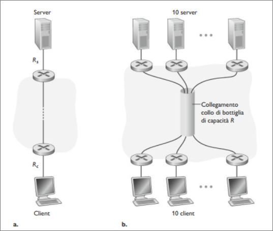 

Il throughput dipende dalla velocità di trasmissione dei collegamenti sui quali passano i dati. Abbiamo visto che, quando non c'è altro traffico che interviene, il throughput può essere semplicemente approssimato alla velocità di trasmissione minima ungo il percorso tra sorgente e destinazione.  

Più in generale, il throughput dipende non solo dalla velocità di tramsissione dei collegamenti lungo il percorso, ma anche dal traffico sulla rete.  

