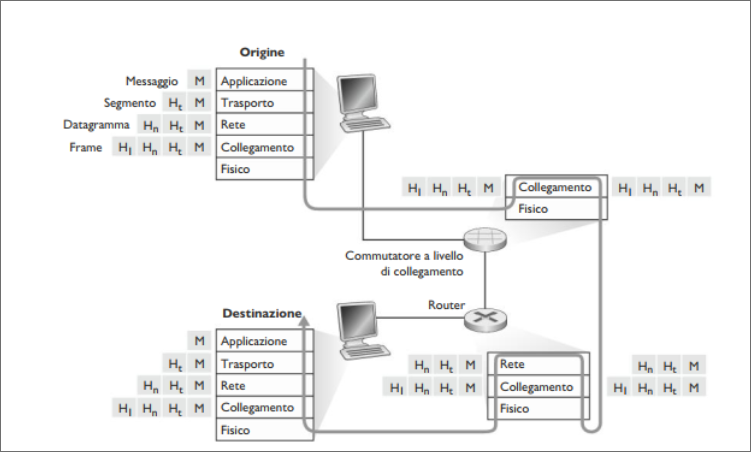

# Reti di calcolatori e Internet
## Livelli dei protocolli e loro modelli di servizio  
### Stratificazione dei protocolli  
Per dare struttura alla progettazione dei protocolli, i progettisti organizzano i protocolli e l'hardware e software che li implementano in **livelli** o **stati**.  
Ciascun protcollo appartiene a uno dei livelli. Siamo interessati ai **servizi** offerti da un livello a quello superiore: il **modello di serviio** di un livello.  
Ogni livello fornisce il suo servizio effetuando determinate azioni all'interno del livello stesso e utilizzando i servizi del livello subito inferiore.  
Per esmepio, i servizi offerti dal livello $n$ possono includere la consegna affidabile dei messaggi da un lato della rete all'altro. Ciò può essere implementato utilizzando un servizio fornito dal livello $n-1$- e aggiungendo qualcosa a livello $n$.  
Un livello di protocolli può essere implementato via software, hardware o misto.  

La stratificazione dei protocolli presenta vantaggi concettuali e strutturali. Fornisce un modo strutturto per trattare i componenti dei sistemi.  
La modularità rende più facile aggiornare le componenti.  
Un eventuale svantaggio è la possibilità che un livello duplichi le funzionalità di quello inferiore.  
Un secondo possibile svantaggio è che una funzionalità a un livello possa richiedere informazioni presenti solo in un altro livello.

Considerati assieme, i protocolli dei vari livelli sono detti **pila di protocolli**. 

  

La pila di protocolli di Internet, in figura, consiste di 5 livelli: applicazione, trasporto, rete , collegamento, fisico. Adottiamo un **approccio top-down**.  

**Livello di applicazione**  

Il livello di applicazione è la sede delle applicazioni di rete e dei relativi protocolli.  
Per quanto riguarda Internet, tale livello include molti protocolli tra cui HTTP (richiesta e trasferimento documenti Web), SMTP (posta elettronica), FTP (trasferimento file tra due host).  
La traduzione di nomi di host in indirizzi di rete a 32 bit, vengono anche esse effettuate con l'aiuto di un protocollo a livello di applicazione, il DNS(*domain name system*).  
Un protocollo a livello di applicazione è distribuito su più host: un'applicazione in un host, tramite il protocollo, scambia pacchetti di informazioni con l'applicazione in un altro host. Faremo riferimento a questi pacchetti di informazioni a livello applicativo come **messaggi**.  

**Livello di trasporto**  

Il livello di trasporto di Internet trasferisce i messaggi del livello di applicazione tra punti periferici gestiti dalle applicazioni. In internet troviamo due protocolli di trasporto: UDP e TCP.  
TCP fornisce alle applicazioni un servizio orientato alla connessione, che include la consegna garantita dei messaggi  a livello di applicazione alla destinazione e il controllo di flusso (corrispondenza velocità di mittente e destinatario). Inoltre fraziona i messaggi lunghi in segmenti più piccoli e fornisce un meccanismo di controllo della congestione. Il protocollo UDP fornisce alle proprie applicazioni un servizio non orientato alla connessione, un servizio senza affidabilità ne controllo di flusso e della congestione. Chiameremo **segmenti** i pacchetti a livello di trasporto.  

**Livello di rete**  

Il livello di rete di Internet si occupa di trasferire i pacchetti a livello di rete detti **datagrammi** da un host all'altro.  
Il protocollo Internet a livello di trasporto in un host di origine passa a livello sottostante un segmento e un indirizzo di destinazione, come una consegna postale. Il livello di rete mette poi al servizio di consegna dek segmento a livello du trasporto nell'host di destinazione.  
Il livello di rete comprende il protocollo IP che definisce i campi dei datagrammi e come gli host e i router agiscono su tali campi. Esiste un solo protocollo IP.  
Il livello di rete contiene, inoltre, svariati protocolli di instradamento che determinano i percorsi che i datagrammi devono seguire tra la sorgente e la destinazione.  

**Livello di collegamento**  

Il livello di rete di Internet instrada n datagramma attraverso una serie di router tra la sorgente e la destinazione. Per trasferire un pacchetto da un nodo a quello successivo sul percorso, il livello di rete si affida ai servizi del livello di collegamento. In particolare ad ogni nodo, il livello di rete passa il datagramma al livello sottostante, che lo trasporta al nodo successivo.  In questo nodo il livello di collegamento passa il datagramma al livello soprastante.  

I servizi forniti dal livello di collegamento dipendono dal protocollo utilizzato. Per esempio alcuni protocolli garantiscono la consegna affidabile.  
Chiameremo frame i pacchetti a livello di collegamento.  

**Livello fisico**  

Mentre il compito del livello di collegamento è spostare interi frame da un elemento della rete a quello adiacente, il ruolo del livello fisico è trasferire i singoli bit del frame da un nodo a quello successivo. I protocolli a questo livello dipendono dal mezzo trasmissivo.  

### Incapsulamento  

  

La figura mostra il percorso seguito dai dati scendendo lungo la pila di protocolli del sistema mittente, risalendo e scendendo lungo le pile di protcolli dei commutatori e infine, risalendo la pila.  
Al pari degli host, organizzano il proprio hardware e software di rete a livelli. In ogni caso non implementano tutti i livelli della èila di protocolli ma solo quelli inferiori.  
Come mostrato nella figura, i commutatori a livello di collegamento implementano i livelli 1 e 2, mentre i router implementano i livelli da 1 a 3, Ciò significa, per esempio, che i router Internet sono in grado di interpretare il protocollo IP, mentre i commutatori a livello di collegamento non possono farlo.  
La figura mostra anche l'importante concetto di **Incapsulamento**.  
Presso un host mittente, un **messaggio a livello di applicazione** $M$ viene passato a livello di trasporto. Nel caso più semplice questo livello prende il messaggio e gli concatena informazioni aggiuntive che saranno utilizzate dalla parte ricevente a livello di trasporto.  Il messaggio a livello di applicazione e le informazioni di intestazione a livello di trasporto costituiscono il **segmento a livello di trasporto** che Incapsula il messaggio a livello di applicazione. Le informazioni aggiunte possono includere dati che consentono a livello di trasporto lato ricevente di consegnare il messaggio all'applicazione desiderata, o potrebbero includere bit di correzione che consentono al ricevente di determinare il cambiamento.  
Il livello di trasporto passa il segmento a livello di rete, quali gli indirizzi dell'host di sorgente e di destinazione, andando a creare un **datagramma a livello di rete**.  A questo punto il datagramma viene passato al livello di collegamento, il quale aggiunge le proprie informazioni di intestazione, creando un **frame a livello di collegamento**. Quindi, a ciascun livello, il pacchetto a due tipi di cambio: intestazione e **payload**, un pacchetto proveniente dal livello superiore.  

\

