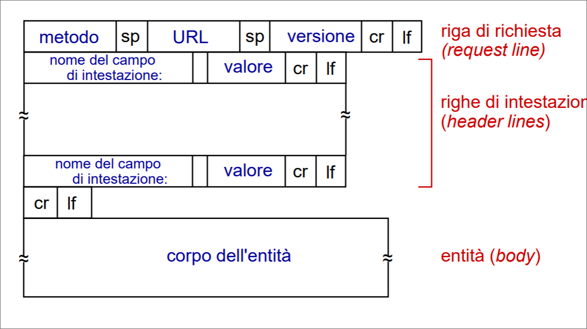
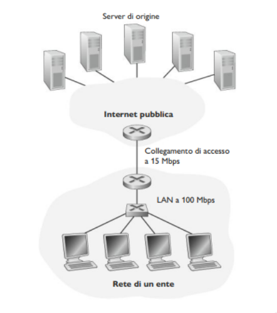

# Livello di applicazione    

Il cuore dello sviluppo delle applicazioni di rete è costituito dalla creazione dei programmi che sono eseguiti dai sistemi periferici e che comunicano tra loro via rete. Prima di inziare a scrivere codice, bisogna progettare l'architettura dell'applicazione e stabilire la sua organizzazione sui vari sistemi periferici. 

### **Paradigma client-server**  
**Server**:  
+ host sempre attivo
+ indirizzo IP fisso
+ spesso in datacenter

**Client**:  
+ contatta, comunica col server, in un qualunque momento
+ può avere indirizzi IP dinamici
+ non comunica direttamente con altri client  

### **Architettura peer-to-peer**
+ Non c'è un host sempre attivo, ma vi sono coppie di host (peer) che comunicano direttamente tra di loro  
+ I peer richiedono un servizio ad altri peer e forniscono un servizio in cambio ad altri peer.  
+ I peer non devono necessariamente essere sempre attivi, cambiano indirizzo IP

>[!NOTE]
> *Scalabilità intrinseca:* nuovi peer aggiungono capacità di servizio al sistema, seppure generino nuovo carico di lavoro  

### Processi comunicanti  
**Processo:** programma in esecuzione su un host  
Processi su host differenti comunicano attraverso lo scambio di messaggi.   

>[!NOTE]
> In un'architettura client-server:  
> **Processo client:**  processo che da inizio alla comunicazione
> **Processo server:** processo che attende di essere contattato  

>[!NOTE]
>Nelle applicazioni P2P un processo può essere sia client che server.  


### Socket  
Un processo invia/riceve messaggi a/da la sua **socket**, analoga ad una porta: il processo mittente fa uscire il messaggio fuori dalla propria porta (socket).   

### Indirizzamento  
Per ricevere messaggi un processo deve avere un **identificatore**.  
Un host ha un indirizzo IP univoco a 32 bit.  
L'identificatore comprende sia l'**indirizzo IP**, che il **numero di porta** (associati al processo in esecuzione su un host).  

Un protocollo a livello di applicazione definisce:  
+ **Tipi di messaggi scambiati**: richiesta, risposta, etc...  
+ **Sintassi dei messaggi**: quali sono i campi nel messaggio e come sono descritti  
+ **Semantica dei messaggi**: significato delle informazioni nei campi
+ **Regole**: per determinare come e quando un processo invia messaggi e risponde.  

**Ma quale servizio di trasporto richiede un applicazione?**  
1. **Perdita di dati** :
   alcune applicazioni richiedono un trasferimento 100% affidabile, altre possono tollerare qualche perdita 
2. **sensibilità al fattore tempo**:
   alcune applicazioni richiedono che i ritardi siano bassi per essere efficaci
3. **throughput**:
   alcune applicazioni, per essere efficaci richiedono un'ampiezza di banda minima, altre l'ampiezza di banda disponibile
4. **sicurezza**:
   cifratura, integrità dei dati  

Osserviamo adesso quali servizi di trasporto mette a disposizione Internet:

1. Servizi di TCP

+ Servizio orientato alla connessione. Crea una connessione TCP tra i socket dei due processi (fase di Handshaking). Questa connessione è di tipo full-duplex, ovvero i processi si possono scambiare contemporaneamente messaggi sulla connessione.
+ Servizio di trasferimento affidabile. I processi hanno la garanzia che TCP trasporti i dati senza errori e nel ordine giusto.

2. Servizi di UDP

+ UDP è senza connessione, e fornisce un servizio di trasferimento dati non affidabile. Il protocollo non garantisce che questo raggiunga a destinazione, e non garantisce neanche l'ordine giusto di arrivo.

## Web e HTTP  
HTTP, protcollo a livello di applicazione del Web, costituisce il cuore del Web. Questo protocollo è implementato in due programmi client-server in esecuzione su due host diversi che comunicano tra loro, attraverso lo scambio di messaggi HTTP.
Il protcollo definisce il formato dei messaggi e le modalità con cui client e server comunicano.

Una pagina Web è costituita da **oggetti** ciascuno dei quali può essere memorizzato su un Web server differente.  
Un oggetto è un file (HTML,immagine JPG, un file JS, un file CSS,...) indirizzabile tramite un URL. La maggioranza delle pagine web consiste di un file HTML principale e diversi oggetti referenziati da esso.
Ogni URL ha due componenti: il nome dell'host del server, e il percorso dell'oggetto:  
```
http://www.SomeSchool.edu/SomeDepartment/picture.gif
```  
### HTTP: Hypertext Transfer Protocol  
Un browser web implementa il lato client di HTTP. Un web server, che implementa il lato server di HTTP, ospita oggetti web, indirizzabili tramite URL.
HTTP definisce in che modo i client web richiedono le pagine web server e come questi ultimi le trasferiscono ai client.    

HTTP usa TCP: il client inizializza la conessione TCP (crea una socket) con il server sulla porta 80, il server accetta la connessione TCP dal client.  
Il client invia richieste e riceve risposte HTTP tramite la propria interfaccia socket, analogamente il server riceve richieste e invia messaggi di risposta attraverso la propria socket.  

>[!NOTE]  
>HTTP è un protocollo "senza stato" o stateless, ovvero non mantiene informazioni sulle richieste fatte dal client.  

Vi sono due tipi di connessioni HTTP:  
+ **Connessioni non persistenti**: 
  1. connessione TCP aperta
  2. almeno un oggetto viene trasmesso su una connessione TCP
  3. connessione TCP chiusa
    >[!NOTE]  
    >Lo scaricamento di oggetti multipli richiede connessioni multiple 

    Seguiamo passo dopo passo il trasferimento di una pagina web dal server al client nel caso di connessioni non persistenti. Ipotizziamo che l'URL del file HTML principale sia:
    ```
    http://www.SomeSchool.edu/SomeDepartment/home.index
    ```
    Ecco cosa avviene:

    1. Il processo client HTTP inizializza una connessione TCP con il server www.SomeSchool.edu sulla porta 80 (default HTTP). Associate alla connessione TCP ci saranno una socket per il client e una per il server.
    2. Il client HTTP, tramite la propria socket, invia al server un messaggio di richiesta HTTP che include il percorso /SomeDepartment/home.index
    3. Il processo server HTTP riceve il messaggio di richiesta attraverso la propria socket associata alla connessione, recupera l'oggetto SomeDepartment/home.index dalla memoria (centrale o di massa), lo incapsula in un messaggio di risposta HTTP che viene inviato al client attraverso la socket.
    4. Il processo server HTTP comunica a TCP di chiudere la connessione. Questo però, non termina la connessione finché non sia certo che il client abbia ricevuto integro il messaggio di risposta.
    5. Il client HTTP riceve il messaggio di risposta. La connessione TCP termina. Il messaggio indica che l'oggetto incapsulato è un file HTML. Il client estrae il file dal messaggio di risposta, esamina il file HTML e trova riferimenti ai 10 oggetti JPEG.
    
    6. Vengono ripetuti i primi quattro passi per gli altri oggetti JPEG.
    > [!NOTE]
    > Definiamo con **RTT** il tempo impiegato da un piccolo pacchetto per andare dal client al server e ritornare al client (include ritardi di elaborazione, accodamento, propagazione)  
      

Per i tempi di risposta vi è necessario un RTT per inizializzare la connessione TCP, un RTT perché ritornino la richiesta HTTP e i primi byte della risposta HTTP più il tempo di trasmissione dell'oggetto.  

>[!NOTE]  
>Il tempo di risposta con connessioni non persistenti è uguale a 2RTT+tempo di trasmissione dell'oggetto.  

+ **Connessioni persistenti**:
  1. connessione TCP aperta;
  2. più oggetti possono essere trasmessi su una singola connessione TCP;
  3. connessione TCP chiusa.  

    Le connessioni non persistenti presentano alcuni limiti: il primo è che ogni oggetto richiesto occorre stabilire e mantenere una nuova connessione (oneroso).
    In secondo luogo, ciascun oggetto subisce un ritardo di consegna di due RTT, uno per la connessione TCP e uno per richiedere e ricevere un oggetto.

    Nelle connessioni persistenti il server lascia la connessione TCP aperta dopo l'invio di una risposta.  
    I successivi messaggi vengono trasmessi sulla stessa connessione aperta. Il client invia le richieste non appena incontra un oggetto referenziato.  
    Vi è necessario un solo RTT per tutti gli oggetti refereziati.  
    In generale il server HTTP chiude la connessione quando essa rimane inattiva per un dato lasso di tempo (intervallo configurabile).

### Messaggio di richiesta HTTP
```
GET /somedir/page.html HTTP/1.1\r\n
Host: www.someschool.edu\r\n
Connection: close\r\n
User-Agent: Mozilla/5.0\r\n
Accept-Language: it\r\n
Accept: text/html, application/xhtml-xml\r\n
Accept-Encoding: gzip, deflate\r\n
Connection: keep-alive\r\n
\r\n
``` 
Si osserva che il messaggio è scritto in *ASCII*, in modo che l'utente sia in grado di leggerlo. Inoltre, ciascuna riga è seguita da un carattere di ritorno a capo (*carriage return*) e un carattere di nuova linea (*line feed*).

Di seguito una descrizione dei campi:   
+ #### Riga di richiesta:  
   La riga di richiesta presenta tre campi: il metodo, il campo URL e il campo versione di HTTP.
   Il campo metodo può assumere diversi valori: 
  + **GET:**  E' usato per richiere una risorsa al server specificata nell'URL. Spesso è usato anche per inviare dati al server, immettendo i dati da inviare direttamente nell'URL, dopo una (*?*). La stringa creata si chiama query string ed è formata da coppie chiiave valore separati da *&*:  
  ```/someDir/index?nome=Francesco&cognome=Rossi```
  
  + **POST:** E' uno dei metodi HTTP utilizzati per inviare dati al server. A differenza del metodo GET, i dati inviati con POST non sono visibili nell'URL, il che lo rende più sicuro per l'invio di informazioni sensibili, come password o dati di pagamento.

  + **HEAD**:Il metodo HEAD viene utilizzato per recuperare le informazioni di intestazione associate a una risorsa specifica, senza trasferire il corpo della risorsa stessa (come in una GET).
  
  + **PUT:** Carica un nuovo oggetto sul server o ne sovrascrive uno già esistente
  
  + **DELETE**: Il metodo DELETE viene utilizzato per eliminare una risorsa specifica dal server.
+ #### Righe d'intestazione:
  + **Host:** hostname e numero di porta (se assente si assume 80 per HTTP e 443 per HTTPS) del server al quale sarà inviata la richiesta. Obbligatorio in HTTP/1.1
  + **User-Agent:** identifica l'applicazione, il sistema operativo, il *vendor* e/o la versione dello *user-agent* che sta effettuando la richiesta  
  + **Accept:** tipo di contenuto, espressi come media type, compresi dal client.
  + **Accept-Language:** linguaggi naturali o locali preferiti dal client.
  + **Accept-Encoding:** Algoritmi di codifica compresi dal client
  + **Connection:** Controlla se la connessione rimarrà aperta al termine dello scambio richiesta/risposta. Il valore close indica che la connessione sarà chiusa; altrimenti, una lista non vuota di nomi di header, in genere solo keep-alive, che saranno rimossi al primo proxy non trasparente o cache, indica che la connessione rimarrà aperta.
  


### Messaggio di risposta HTTP  
```
HTTP/1.1 200 OK
Date: Tue, 08 Sep 2020 15:44:04 GMT
Server: Apache/2.4.6 (CentOs)
Last-Modified: Tue, 01 Mar 2016 18:57:50 GMT
Accept-Ranges: bytes
Content-Lenght: 2651
Content-Type: text/html, charset=UTF-8
\r\n
(data data data data ...)
```  
Di seguito una descrizione dei campi: 

+ #### Riga di stato: 
  presenta 3 campi: la versione del protocollo, un codice di stato e corrispettivo messaggio di stato.

    + **1xx Informational**: una risposta intermedia per comunicaro lo stato di connessione o l'avanzamento della richiesta prima di completare l'azione richiesta e inviare una risposta finale.
    + **2xx Successful:** la richiesta è stata ricevuta con successo, compresa è accettata.
    Per esempio **200 OK** significa che la richiesta ha avuto successo, l'oggetto richiesto viene inviato nella rispsota.
    + **3xx Redirect**, il client deve eseguire ulteriori azioni per soddisfare la richiesta.
    Per esempio **301 Moved Permanently**, significa che l'oggetto richiesto è stato trasferito, la nuova posizione è specificata nell'intestatazione Location.
    + **4xx Client Error**, la richiesta è sintatticamente scorretta o non può essere soddisfatta.
    Per esempio **404 Not Found**, significa che il documento richiesto non si trova su questo server, oppure **406 Not Acceptable**, l'oggetto richiesto non esiste in una forma che soddisfa i vari Accept-*.
    + **5xx Server Error**, il server ha fallito nel soddisfare una richiesta appartemente valida.
    Per esempio **505 HTTP Version Not Supported**, il server non ha la versione di protocollo HTTP.

+ #### Righe di intestatazione:
    + **Date:** la data e l'ora in cui il messaggio è stato originato.
    + **Server:** descrive il software usato dal server di origine per gestire la richiesta (troppi dettagli possono aiutare i malintenzionati ad attaccare il server).
    + **Last-Modified:** la data è l'ora il cui il server di origine crede che l'oggetto sia stato modificato per l'ultima volta.
    + **Accept-Ranges:** indica il supporto del server ai download parziali: il valore, se diverso da none, indica l'unità che si può usare per esprimere l'intervallo richiesto.
    + **Content-Lenght:** lunghezza in byte del corpo dell'entità inviato al ricevente (o che sarebbe stato inviato nel caso di una richiesta HEAD).
    + **Content-Type:** media type nel corpo dell'entità inviato al ricevente (o che sarebbe stato inviato nel caso di una richiesta HEAD).

+ #### Corpo: 
  contiene l'oggetto richiesto.  

## Cookie   
L'interazione HTTP GET/risposta è **senza stato**, ovvero il server non mantiene informazioni riguardo i client. Tuttavia, spesso i web server possano autenticare gli utenti, sia per limitare l'accesso da parte di questi ultimi sia per fornire contenuti in funzione della loro identità. A questo scopo, HTTP adotta i cookie, che consentono ai server di tener traccia degli utenti.  

La tecnologia dei cookie presenta quattro componenti:  
  1. una riga di intestazione nel messaggio di risposta HTTP  
  2. una riga di intestazione nel messaggio di richiesta HTTP  
  3. un file cookie mantenuto sul sistema terminale dell'utente e gestito dal browser dell'utente  
  4. un database sul sito

> Per capire meglio facciamo un esempio:
> Susan usa il browser dal portatile e visita un sito di commercio elettronico per la prima volta.  
> Quando la richiesta HTTP iniziale arriva al sito, il sito crea:  
> + un identificativo univoco
> + una voce nel proprio database, indicizzata dal numero identificativo  
>
> Il server ritorna una risposta che include l'intestazione **Set-Cookie**, che contiene l'identificativo e che sarà aggiunto al file dei Cookie. Le successive richieste del browser di Susan per questo sito conterranno l'identificativo in un'intestazione Cookie.  


Quindi i cookie possono essere usati per:  
 + Identificare gli utenti. La prima volta che visita un sito, un utente può fornire un'identificazione. Successivamente il browser passa un'intestazione di cookie al server durante tute le successive visite al sito.
+ Creare un livello di sessione utente al di sopra di HTTP che è privo di stato.  

## Web Cache  
Una **web cache**, nota anche come **proxy server**, è un entità di rete che soddisfa richieste HTTP al posto del web server effettivo. Il proxy ha una propria memoria su disco (una cache) in cui conserva copie di oggetti recentemente richiesti.

Il browser trasmette tutte le richieste HTTP alla cache:
+ se l'oggetto è nella cache: la cache fornisce l'oggetto al client  
+ altrimenti la cache richiede l'oggetto al server d'origine, memorizza l'oggetto ricevuto e infine lo restituisce al client.  

>[!NOTE]
>Il server comunica alla cache la cache consentita dell'oggetto , nell'intestazione della risposta:  
> ```
> Cache_control: max_age=<seconds>
> Cache_control: no_cache
> ```

Il web caching si è sviluppato in Internet per due ragioni. Innanzitutto, un proxy può ridure i tempi di risposta alle richieste dei client. In secondo luogo, i proxy possono ridurre il traffico sul collegamento di accesso a Internet.  


Prendiamo un esempio:  

Una rete di un ente e la rete publica Internet. La rete dell'ente è una LAN ad alta velocità. Un collegamento a 15Mbps connette un router alla prima parte a uno della seconda. I server di origine sono collegati a Internet e situati in diverse parti del mondo.   

  

Supponiamo che:

  1. Dimensione media di un oggetto: 1 Mbit
  2. Frequenza media browser: 15 richieste al secondo
  3. Messaggi HTTP trascurabilmente piccoli
  4. Velocità media di trasmissione dei dati (Ritardo Internet): 2 s

Quindi, abbiamo che:

+ $\frac{15 (ric/s) \cdot (1 Mbit/ric)}{100 Mbps} = 0.15$: Intensità traffico rete LAN
+ $\frac{15 (ric/s) \cdot (1 Mbit/ric)}{15 Mbps} = 1$: Intensità traffico sul collegamento di accesso

Un'intensità di traffico di 0.15 su una rete locale provoca generalmente alcune decine di millisecondi di ritardo, che può essere trascurato. Però quando l'intensità di traffico si avvicina a 1, il ritardo su un collegamento diventa notevole e cresce senza limiti, pertanto il tempo di risposta medio per soddisfare le richieste diventa dell'ordine dei minuti, se non superiore. Quindi abbiamo due possibili soluzioni:

1. Incrementare la banda sull'collegamento di accesso a Internet, da 15 Mbps a 100 Mbps. Ciò abbasserà l'intensità di traffico fino a 0.15, il che si trduce in ritardi trascurabili tra i due router. Puo però risultare costoso aggiornare l'infrastruttura.
2. Adozione di un proxy nella rete dell'ente. Le percentuali di successo, cioè la frazione di richieste soddisfatte dalla cache, variano tra il 0.2 e 0.7. Supponiamo l'hit rate sia 0.4. Dato che i client e il proxy sono collegati alla stessa rete locale ad alta velocità, il 40% dell richieste verrà soddisfatto dalla cache quasi immediatamente, ossia entro 10 ms. Il restante 60% deve ancora essere soddisfatto dal server di origine. In questo modo l'intensità di traffico sul collegamento di accesso passa da 1.0 a 0.6, che risulta bassa per un collegamento a 15 Mbps. Quindi il ritardo medio è:  
$0.4 \cdot (0.01 s) + 0.6 \cdot (2.01 s) \leq 1.2 s$, che risulta perfino inferiore rispetto alla prima soluzione.

Cosa avviene quando la copia che risiede in cache potrebbe essere scaduta? In altre parole, l'oggetto ospitato nel web server potrebbe esser stato modificato rispetto alla copia nel client (sia esso un proxy o un browser). HTTP presenta un meccanismo che permette alla cache di verificare se i suoi oggetti sono aggiornati. Questo meccanismo è chiamato **GET condizionale**.  

Il client specifica la data della copia dell'oggetto nella richiesta HTTP:  
+ ```if-modified-since:<Data>```  

Il server nella risposta non inoltra l'oggetto se la copia nella cache è aggiornata:  
+ ```HTTP/1.0 304 not modified```  

  

## Da HTTP/1.1 a HTTP/2 a HTTP/3

**Obiettivo principale:** diminuzione del ritardo nelle richieste HTTP a più oggetti

+ **HTTP/1.1**, ha introdotto GET multiple in pipeline su una singola connessione TCP
    + Il server risponde in ordine (FCFS: First-Come-First-Served scheduling) alle richieste GET
    + Con FCFS, oggetti piccoli possono dover aspettare per la trasmissione dietro a uno o più oggetti grandi (HOL: Head-Of-Line blocking)
    + Il recupero delle perdite (ritrasmissione dei segmenti TCP persi) blocca la trasmissione degli oggetti.
+ **HTTP/2**, maggiore flessibilità del server nell'invio di oggetti al client
    + Metodi, codice di stato, maggior parte dei campi di intestazione inalterati rispetto a HTTP/1.1
    + Ordine di trasmissione degli oggetti richiesti basata su una priorità degli oggetti specificata dal client
    + Invio push al client di oggetti aggiuntivi, senza che il client li abbia richiesti (notifiche)
    + Dividere gli oggetti in frame, intervallare i frame per mitigare il blocco HOL.
+ **HTTP/3**, aggiunge sicurezza, controllo di errore e congestione per oggetto (più pipelining) su UDP.

## E-mail  
E una delle applicazioni più diffuse ed elaborate e potente. Rappresenta un mezzo di comunicazione asincrono. La moderna posta elettronica è veloce , facile da distribuire e gratuita. Alcune caratteristiche importanti sono: gli allegati, collegamenti ipertestuali, testo con formattazione HTML e foto.

La posta elettronica è composta da 3 componenti principali:

+ **User agents** (agenti utente), per esempio Outlook, Gmail, Yahoo, etc..., consentono agli utenti di leggere, rispondere, inoltrare, salvare e comporre messaggi.
+ **Mail Servers** (server di posta), costituiscono la parte centrale dell'infrastruttura del servizio di posta elettronica. Ciascun destinatario ha una **mail-box** (casella postale) collocata in un mail server. Se il server non può consegnare la posta, la trattiene in una **coda di messaggi** e cerca di trasferirla in un secondo momento, di solito avviene ogni 30 min.
+ Protocollo **SMTP** (Simple Mail Transfer Protocol), rappresenta il principale protocollo a livello di applicazione per la posta elettronica. Fa uso di TCP per il trasferimento della mail dal mittente al destinatario. SMTP presenta un lato client, in esecuzione sul mail server del mittente, e un lato server, in esecuzione sul server del destinatario. Entrambi i lati possono essere eseguiti su tutti i server di posta. Quando un server invia posta a un altro, agisce come client SMTP; quando invece la riceve, funziona come un server SMTP.  

  

### SMTP 
SMTP costituisce il cuore della posta elettronica. SMTP trasferisce i messaggi dal mail server del mittente a quello del destinatario. Tratta il corpo di tutti i messaggi come semplice ASCII a 7 bit, il che nei giorni d'oggi questa restrizione è piuttosto penalizzante, in quanto richiede che i dati multimediali binari vengano codificati in ASCII prima di essere inviati e che il messaggio venga nuovamente decodificato in binario dopo il trasporto.  

> Esempio 
> 
> 1. Alice invoca il proprio user agent per la posta elettronica,   fornisce l'indirizzo di posta di Bob, compone il messaggio è dà l'istruzione allo user agent di inviarlo.
>  2. Lo user agent di Alice invia il messaggio al suo mail server, dove è collocato in una coda di messaggi.
>  3. Il lato client di SMTP, eseguito sul server di Alice, vede il messaggio nella coda dei messaggio e apre una connessione TCP verso un server SMTP in esecuzione sul mail server di Bob.
>  4. Dopo un handshaking SMTP, il client SMTP invia il messaggio di Alice sulla connessione TCP.
>  5. Presso il mail server di Bob, il lato server di SMTP riceve il messaggio che viene posizionato nella casella di Bob.
>  6. Bob, quando lo ritiene opportuno, invoca il proprio user agent per leggere il messaggio.
> 
>    
  
SMTP rispetto HTTP è un client push, entrambi hanno una interazione comando/risposta in ASCII e codici di stato.  
In HTTP ciascun oggetto è incapsulato nel suo messaggio di risposta, in SMTP più oggetti vengono trasmessi in un unico messaggio. SMTP inoltre usa connessioni persisenti.  

### Formato messaggi  

```
From: alice@crepes.fr 
To: bob@hamburger.edu
Subject: Alla ricerca del significato della vita
(body)
```
Il corpo dei messaggi di posta elettronica è preceduto da un'intestazione contenete informazioni di servizio. Tale informazione periferica è contenuta in una serie di righe di intestazione, definite nell'RFC 5322. Queste righe sono separate dal corpo del messaggio mediante una riga senza contenuto.
## DNS    

Gli host Internet possono essere identificati in vari modi. Gli hostname quali *www.facebook.com*, *www.google.com*, risultano abbastanza appropriati per le persone ma forniscono poca informazione quanto la loro locazione in Internet.
Inoltre dato che questi nomi sono costituiti da un numero variabile di caratteri alfanumerici, sono abbastanza difficili da elaborare per il server. Per questo gli host vengono identificati con gli indirizzi IP.
Questo consiste di quattro byte e presenta una rigida struttura gerarchica.
Ha questa forma: 127.7.106.83 in cui ogni punto separa un byte espressi con un decimale che va da 0 a 256.

Esistono dunque due modi per identificare gli host: nomi e indirizzi IP. Al fine di coinciliare i due approcci è necessario un servizio in grado di tradurre gli hostname nei loro indirizzi IP, compito del DNS.

Il **DNS** (**Domain Name System**), è un protocollo a livello applicazione che si occupa della traduzione dei nomi. Consiste in un database distribuito implementato in una gerarchia di DNS server. Consente quindi agli host, di interrogare questo database per risolvere i nomi.
Il protocollo DNS usa UDP e la porta 53.  

DNS offre ulteriori servizi:

+ **Host aliasing*** Un host dal nome complicato (host canonico) può avere uno o più sinonimi (alias).
Il DNS può essere invocato da un'applicazione per ottenere l'host canonico di un sinonimo.

+ **Mail server aliasing** Gli indirizzi email sono facili da ricordare. Per esempio, se Bob ha un account Hotmail, il suo indirizzo di posta elettronica potrebbe essere semplicemente bob@yahoo.com tuttavia l'hostname potrebbe essere più complicato. Un'applicazione può invocare il DNS per ottenere il nome canonico di un sinonimo fornito come l'indirizzo IP dell'host.

+ **Distribuzione del carico di rete** Il DNS viene anche utilizzato per distribuire il carico tra server replicati, per esempio dei web server. I siti con molto traffico vengono replicati su più server , ognuno eseguito su un host diverso con indirizzo IP differente.
Nel caso du web server replicati, va dunque associato a ogni hostname canonico un insieme di indirizzi IP. Il database DNS contiene questo insieme di indirizzi.

### Funzionamento DNS  

Supponiamo che un'applicazione in esecuzione sull'host di un utente abbia necessità di tradurre un hostname in un indirizzo IP. L'applicazione invocherà il lato client del DNS specificando l'hostname da tradurre.
Su molte macchine UNIX, ***gethostbyname()*** è la chiamata di funzione effettuata da un'applicazione per ottenere il servizio di traduzione.  
Il DNS sull'host invia un messaggio (query) sulla rete. Tutte le query DNS e i messaggi di risposta vengono inviati dentro datagrammi UDP diretti alla porta 53. Dopo un ritardo che varia dai millisecondi ai secondi , il client DNS sull'host dell'utente riceve un messaggio di risposta contenente la corrispondenza desiderata, che viene poi passata all'applicazione che ne ha fatto richiesta.   

Un DNS è costituito da un grande numero di **DNS server distribuiti** per il mondo e da un protocollo a livello di applicazione che specifica la comunicazione tra DNS server e host richiedenti.
Un primo approccio potrebbe essere quello di usare un DNS server contenente tutte le corrispondenze. Con un sistema centralizzato. Questo schema presenta dei problemi:

1. **Un solo point of failure** Se il DNS si guasta, soffre l'intera Internet.

2. **Volume di traffico** Un singolo DNS server dovrebbe gestire tutte le richieste.

3. **Database centralizzato distante** Un singolo DNS server non può essere vicino a tutti clienti. Potrebbero esserci dunque pesanti ritardi.

4. **Manutenzione** Il singolo DNS server dovrebbe contenente record relativi tutti gli host Internet. Un tale server centralizzato non solo sarebbe vasto ma dovrebbe essere aggiornato frequentemente.  

Per trattare il problema della sequenzialità , il DNS utilizza un grande numero di server, organizzati in maniera gerarchica e distribuiti nel mondo. Esistono tre classi di DNS server:
+ **Root server**. In Internet esistono più di 1000 root server, dislocati in tutto il mondo. Forniscono gli indirizzi IP dei TLD server.

+ **TLD server**. Si occupano dei domini di primo livello quali com, org, net, edu e gov e di tutti i domini di primo livello relativi ai vari paesi come it, uk, fr, ca e jp. Forniscono gli indirizzi IP dei server autoritativi.

+ **Server autoritativi**. Ogni organizzazione dotata di host pubblicamente accessibili tramite Internet deve fornire record DNS pubblicamente accessibili che associno tali host a indirizzi IP. Il DNS server autoritativo ospita questi record.

Esiste un altro importante DNS, il**DNS server locale**, che non appartiene strettamente alla gerarchia di server, ma che è comunque centrale nell'architettura DNS. Ciascun ISP (università, ISP residenziale,...) ha un DNS server locale. Quando un host si connette a un ISP, quest'ultimo gli fornisce un indirizzo IP tratto da uno o più dei suoi DNS server locali.
Quando un host effettua una richiesta DNS, la query viene inviata al DNS server locale, che opera da proxy e inoltra la query alla gerarchia dei DNS server.  

### DNS caching  

L'idea alla base del **DNS caching** è molto semplice. In una concatenazione di richieste , il DNS server che riceve una risposta DNS, può mettere in cache le informazioni contenute.
Per esempio ogni volta che il server locale dns.nyu.edu riceve una risposta da qualche DNS server, può conservare in cache le informazioni contenute nella risposta. Se una coppia hostname/indirizzo IP è nella cache di un DNS server e giunge al server un'altra richiesta con lo stesso hostname, il DNS server può fornire indirizzo IP desiderato. Gli host e le associazioni tra nome e indirizzo IP non sono in alcun modo permanenti, i DNS server invalidano le informazioni in cache dopo un certo periodo di tempo.
Un DNS può inoltre, memorizzare in cache gli indirizzi IP dei TLD server, consentendogli di aggirare i root server nella catena di richieste.  

### Record e messaggi DNS
I server che implementano il database distribuito DNS memorizzano i cosidetti **record di risorsa**, tra cui quelli che forniscono le corrispondenze tra nomi e indirizzi.
Ogni messaggio di risposta DNS trasporta uno o più record di risorse.

Un record di risorsa contiene i seguenti campi:
(*Name, Value, Type, TTL*)

**TTL** è il time to live, ossia il tempo residuo di vita di un record e determina quando una risorsa vada rimossa dalla cache.
Il significato di name e value dipende da type:

+ #### Record di tipo A (Address Record):

  + Name: Nome dell'host (hostname).
  + Value: Indirizzo IP associato a quell'hostname.
  + Utilizzo: Mappa un nome di dominio (ad esempio, www.example.com) a un indirizzo IP (ad esempio, 192.0.2.1).

  >Esempio:  
  >(relay1.bar.foo.com, 145.37.93.126, A)

+ #### Record di tipo NS (Name Server Record):

  + Name: Nome del dominio.
  + Value: Hostname del server DNS autoritativo per quel dominio.
  + Utilizzo: Indica quale server DNS è responsabile della risoluzione dei nomi all'interno di un dominio specifico. Questo è essenziale per la gerarchia del DNS, poiché permette di delegare la gestione di un dominio a un server DNS specifico.

  >Esempio:  
  >(foo.com, dns.foo.com, NS)

+ #### Record di tipo CNAME (Canonical Name Record):

  + Name: Nome sinonimo (alias).
  + Value: Nome canonico (nome ufficiale e completo) dell'host.
  + Utilizzo: Permette di associare un alias a un nome canonico. Questo è utile per riferirsi a un host con nomi diversi, senza dover mantenere più record A separati.

  >Esempio:  
  >(foo.com, relay1.bar.foo.com, CNAME)

+ #### Record di tipo MX (Mail Exchange Record):

  + Name: Nome del dominio che riceve la posta.
  + Value: Nome canonico del server di posta responsabile per il dominio.
  + Utilizzo: Indica quale server di posta elettronica (mail server) è responsabile per la ricezione delle email per un dominio specifico. Questo è essenziale per il routing delle email all'interno di Internet.

  >Esempio:  
  >(foo.com, mail.bar.foo.com, MX)

### Messaggi DNS  
Ci sono due tipi di messaggi DNS: **query** e **risposte**. La semantica dei campi dei messaggi DNS è la seguente:

  + I primi 12 byte rappresentano la sezione di intestazione (header section), che a sua volta contiene un certo numero di campi. Il primo è un numero di 16 bit che identifica la richiesta. Tale **identificatore** viene poi copiato nei messaggi di risposta, consentendo ai client di far corrispondere le risposte ricevute. Il campo **flag**, il primo bit indica se il messaggio è una richiesta (0) o una risposta (1). Un ulteriore bit, bit di ricorsione, viene impostato quando un client desidera che il DNS server effettui ricorsione quando non dispone del record.
  + *La sezione delle domande* contiene informazioni sulle richieste che stanno per essere effetuare, include il campo nome con il nome che sta per essere richiesto, e un campo tipo che indica il tipo della domanda sul nome (A, MX).
  + *La sezione delle risposte* contiene i record di risorsa relativi al nome originariamente richiesto. Una risposta può restituire più RR, dato che un hostname può avere piò indirizzi IP.
  + *La sezione autoritativa* contiene i record di altri server autoritativi.
  + *La sezione aggiuntiva* racchiude altri record utili.

### Inserimento di record nel database DNS  
Supponiamo di dover registrare il nome di dominio *networkutopia.com* presso un ente di registrazione (**DNS Registrar**). Un registrar è un azienda che si occupa di verificare l'unicità del nome di dominio, lo inserisce nel database DNS. Esistono molti registrar concorrenti, accredidati dalla **Internet Corporation for Assigned Names and Numbers** (**ICANN**). Al registrar dobbiamo fornire il nome e gli indirzzi IP degli DNS autoritativi primario e secondario. Il registrar inserisce poi due record di risorsa nel TLD server .com: (networkutopia.com, dns1.networkutopia.com, NS), (dns1.networkutopia.com, 212.212.212.1, A). Nel server autoritativo bisogna poi inserire due record, uno di tipo A per *www.networkutopia.com* e uno di tipo MX per *networkutopia.com*.  

## Distribuzione di file P2P

Ci sono coppie di host connnessi in modo intermittente, chiamati peer, che comunicano direttamente l'uno con l'altro. I peer non appartengono ai fornitori dei servizi, ma sono computer, telefoni controllati dagli utenti.

### Client-Server vs P2P
Sia $F$ la dimensione del file. Sia $N$ il numero di copie che devono essere trasmesse. Siano $u_{s}$ la velocità di upload del server, $u_{i}$ la velocità di upload dell' $i-esimo$ peer, e $d_{i}$ la velocità di download dell' $i-esimo$ peer. 

1. Distribuzione file client-server
    - Il server deve inviare (caricare) in sequenza $N$ copie di file. Per inviare $N$ copie, impiega $\frac{N\cdot F}{u_{s}}$.
    - Ogni client deve scaricare una copia del file. Sia $d_{min}$ la banda di donwload più bassa. Allora il tempo di download per il client con la banda minima è almeno $\frac{F}{d_{min}}$.
    - $D_{c-s} \geq max$ { $\frac{N \cdot F}{u_{s}}$, $\frac{F}{d_{min}}$ }.
2. Distribuzione file P2P
   - Il server deve trasmettere almeno un copia del file: $\frac{F}{u_{s}}$. 
   - Ogni client deve scaricare una copia del file: $\frac{F}{d_{min}}$. Come aggregato devono scaricare $N\cdot F$ bit. Capacità totale di upload è $u_{s} + \sum_{i}u_{i}$.
   - $D_{P2P} \geq max$ { $\frac{F}{u_{s}}$, $\frac{F}{d_{min}}$, $\frac{N\cdot F}{u_{s} + \sum_{i}u_{i}}$ }  

**BitTorrent**

BitTorrent è un diffuso protocollo P2P per la distribuzione di file. L'insieme di tutti i peer che partecipano alla distribuzione di un file è chiamato **torrent**. I peer di un torrent scaricano **chunk** del file di uguale dimensione, con una dimensione tipica. Un peer, quando entra a far parte di un torrent per la prima volta, non ha un chunk del file. Col passare del tempo accumula sempre più parti, che, mentre scarica invia ad altri peer. Una volta che un peer ha acquisito un intero file puo decidere di lasciare il torrent o di rimanere, continuando a inviare chunk ad altri peer. Ciascun torrent ha un nodo detto **tracker**, che tiene traccia dei vari peer. Quando un peer entra a far parte di un torrent si deve registrare presso il tracker.


Alice entra a far parte di un torrent. Il tracker seleziona un sottoinsieme di peer e invia l'IP di questi peer ad Alice. Avendo la lista dei peer, cerca di stabilire una connessione TCP con ciascun peer. Periodicamente, Alice richiede ai peer vicini l'elenco di chunk in loro possesso. A un certo istante, Alice chiede ai peer i chunk mancanti, addottando la strategia del *rarest first*. 

Alice invia i chunk ai quattro peer vicini che attualmente le inviano i chunk alla velocità più alta. Questi quattro peer vengono detti **unchoked** mentre gli altri sono detti **choked**. Ogni 30 secondi sceglie casualmente un vicino in più e gli invia chunk. Questo peer è detto **optimistically unchoked**. Se la velocità di questo peer è abbastanza alta, può diventare a fare pare dei 4 peer **unchoked**. Questo meccanismo di scambio viene detto **tit-for-tat**.  

   

## Streaming video e reti per la distribuzione di contenuti

### Video su Internet  
Nelle applicazioni streaming di video registrati, i contenuti sono video memorizzati su server a disposizione degli utenti su richiesta (**on demand**). Un video è una sequenza di immagini, visualizzate tipicamente a velocità costante di , ad esempio, 24-30 immagini al secondo. Un'immagine non compressa e codificata digitalmente consiste in un'array di pixel, ogniuno dei quali codificato con un numero di bit per rappresentare luminanza e crominanza. I video possono essere compressi in modo da raggiungere un buon compromesso tra qualità del video e bit rate.
Dal punto di vista rete, la caratteristica più saliente del video è l'elevata velocità con cui è necessario inviare i bit sulla rete (**bit rate**). Ovviamente più il bit rate è alto, migliore è la qualittà dell'immagine.

  + CBR: (costant bit rate)
  + VBR: (variable bit rate)  

### DASH  

Nello streaming HTTP il video viene semplicemente memorizzato in un server HTTP come un file ordinario con URL specifico. Quando un utente vuole vedere un video, il client stabilisce una connessione TCP con il server e invia un richiesta GET HTTP per il suo URL. Il server invia il file in un messaggio di risposta HTTP, più velocemente possibile dati il traffico e i protocolli di rete. Sul lato client i byte vengono memorizzati in un buffer dell'applicazione client. Quando il numero di byte nel buffer supera una soglia fissata, l'applicazione client inizia la riproduzione. Quindi l'applicazione di video streaming consiste nel visualizzare i frame mentre li riceve, memorizzando nel buffer gli ultimi.

Oltre allo streaming HTTP, è stato sviluppato un altro sistema di streaming basato su HTTTP, Streaming Dinamico Adattivo su HTTP, **DASH**. In DASH i video vengono codificati in diverse versioni, ognuna aventi bit rate differente e quindi un differente livello di qualità. Quando la banda è elevata il client seleziona in automatico i blocchi da una versione con alto bit rate, mentre quando la banda è poca seleziona i blocchi da una versione con basso bit rate.

Con DASH, i video nelle varie versioni sono memorizzate nel server HTTP, ognuno a un URL diverso. Il server HTTP ha anche un file descrizione, detto **manifest file** che per ogni versione fornisce il rispettivo URL insieme al bit rate. Il client innanzitutto richiede il manifest file al server per venire a conoscenza delle varie versioni disponibili. Mentre scarica i **chunk**, misura la velocità di banda, ed esegue un algoritmo per la selezione del prossimo chunk.
  
### CDN  
Le maggiori aziende di video streaming usano le **CDN** (*Content Distributation Networks*). Una CDN gestisce server distribuiti in molti posti diversi, memorizza copie dei video e di altri contenuti web nei server e cerca di dirigere le richieste degli utenti al punto della CDN in grado di offrire servizio migliore. La CDN può essere una **CDN privata**, cioè proprietaria del fornitore di contenuti. Alternativamente può essere la **CDN di terze parti** che distribuisce contenuti per conto di molti fornitori di contenuti come Akamai.  

Le CDN generalmente adottano una delle due politiche di dislocazione dei server che seguono:  
+ **Enter deep**: installare cluster di server negli ISP di accesso sparsi in tutto il mondo. L'obiettivo è quello di essere vicini agli utenti finali in modo da migliorare il ritardo percepito dall'utente e il throughput. 
+ **Bring Home**: costruire grandi cluster in pochi punti chiave e interconneterli usando una rete privata ad alta velocità. Questo CDN propongono i loro cluster negli IXP.  

Vediamo ora il funzionamento di una CDN.  
Supponiamo che Bob richiede il video `https://video.netcinema.com/6Y7B23V`.
1. Bob visita la pagina web di NetCinema.
2. Bob risolve `video.netcinema.com` attraverso il DNS locale.
3. Il **DNS server locale** invia una richiesta al DNS autoritativo per NetCinema ritorna il CNAME per `KingCDN.com`. 
4. Il sistema DNS di `KingCDN.com` fornisce l'indirizzo IP del nodo CDN più vicino (di solito geograficamente) a Bob, ovvero al suo DNS locale.
5. Il DNS locale inoltra l'indirizzo IP del nodo CDN a Bob che fornirà il contenuto all'host dell'utente.
6. Bob, una volta ricevuto l'indirizzo IP del server di `KingCDN`, stabilisce una connessione TCP diretta con il server a quell'indirizzo IP e gli invia una richiesta GET HTTP per il video. Nel caso venga impiegato DASH, il server innanzitutto invierà al client un file manifesto con una lista di URL, uno per ogni versione del video, e il client selezionerà in modo dinamico i blocchi da versioni differenti.