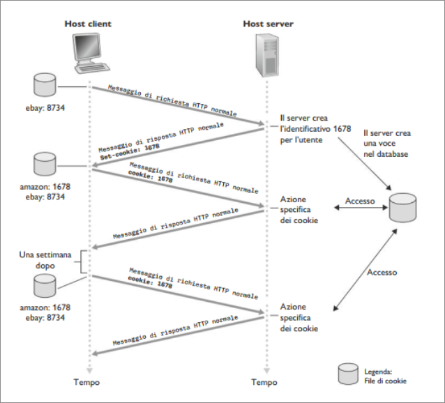
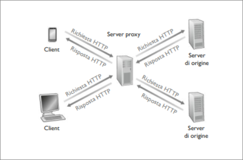
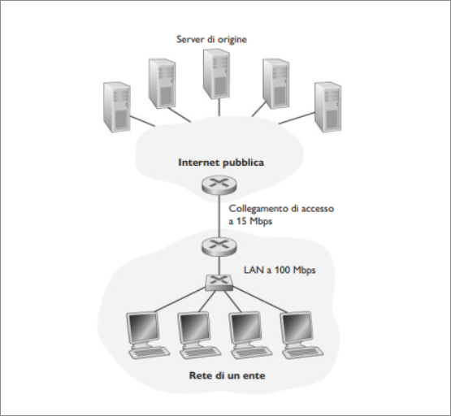
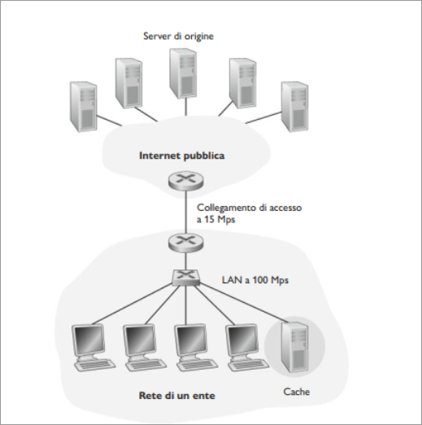
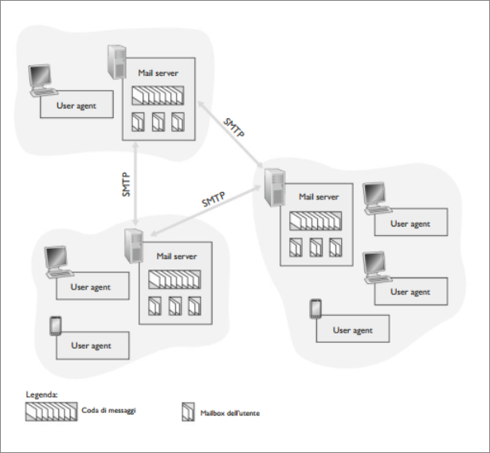
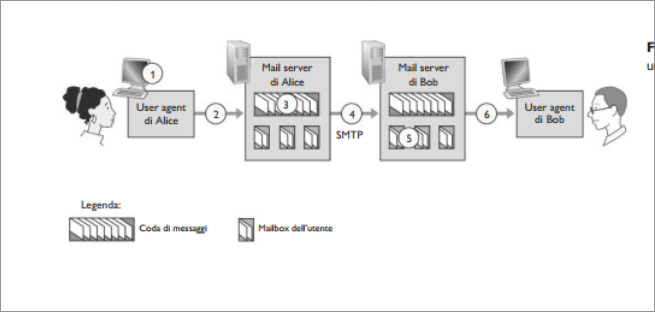
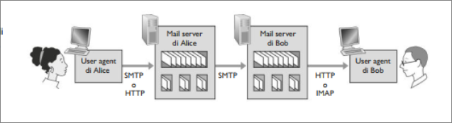

# Livello di applicazione  
## Web e HTTP  
### Interazione utente-server: i cookie  
Abbiamo visto che i server HTTP sono privi di stato. Ciò semplica la progettazione e consente di sviluppare web server ad alte prestazioni. Tuttavia, è spesso auspicabile che i web server possano autenticare gli utenti, si per limitare l'accesso da parte di questi ultimi sia per fornire contenuti in funzione della loro identità.  A questo scopo HTTP usa i **cookie**. I cookie consentono ai server di tener traccia degli utenti. La maggior parte dei siti commerciali usa i cookie.  

  

Come mostrato in figura, la tecnologia dei cookie presenta quattro componenti:  

1. Una riga dìintestazione nel messaggio di risposta HTTP  
2. Una riga di intestazione nel messaggio di richiesta HTTP  
3. Un file mantenuto sul sistema dell'utente e gestito dal browser  
4. Un database sul sito.  

Supponiamo che Susan, che accede sempre al WEB con Internet Explorer dal proprio PC, contatti per la prima volta Amazon.com. Supponiamo inoltre che in passato abbia visistato il sito di eBay. Quando giunge la richiesta al web server di Amazon, il sito crea un identificativo unico e una voce nel proprio daabse, indicizzata dal numero identificativo.  
A questo punto il server risponde al browser di Susan, includendo nella risposta HTTP l'intestazione ```Set-cookie:``` che contiene il numero identificativo.  
```Set-cookie: 1678```  

Quando il browser di Susan riceve il messaggio di risposta HTTP, vede l'intestazione ```Set-cookie:```. Il browser allora aggiunge una riga al flie dei cookie che gestisce. Questa riga include il nome dell'host del server e il numero identificativo nell'intestazione ```Set-cookie```  . Si noti che il file di cookie contiene già una voce per eBay.  
Mentre Susan continua a navigare nel sito di Amazon, ogni volta che richiede una pagina web, il suo browser consulta il suo file dei cookie, estrae il suo numero identificativo per il sito e pone nella richiesta HTTP una riga d'intestazione del cookie che include tale numero.  
```Cookie: 1678```.  
In tal modo è possibile monitorare l'attività di Susan nel sito.  

I cookie possono essere usati per identificare gli utenti. La prima volta che visita un sito, un utente può fornire un identificazione. Successivamente il browser passa un'intestazione cookie al server durante tutte le successive visite al sito, identificando quindi l'utente al server.  I cookie possono essere usati per creare un livello di sessione utente al di sopra di HTTP che è privo di stato. Per esempio, quando un utente si identifica in un'applicazione di posta elettronica, il browser invia le informazioni del cookie al server, permettendo a questo di identificare l'utente attraverso la sessione utente dell'applicazione.  

### Web caching  

Una **web cache**, nota anche come **proxy server**, è un'entità di rete che soddisfa richieste HTTP al posto del web server effettivo.  
Il proxy ha una propria memoria sul disco (cache) in cui conserva copie di oggetti recentemente richiesti.  

  

Come in figura, il browser di un utente può essere configurato in modo che tutte le richieste HTTP dell'utente vengano innanzitutto dirette al proxy server. Una volta configurato il browser, ogni richiesta di oggetto da parte del browser viene inizialmente diretta al proxy.  
Supponiamo che per esempio un browser stia richiedendo l'oggetto  
```http://www.someschool.edu/campus.gif```:  

1. Il browser stabilisce una connessione TCP con il proxy server e invia una richiesta HTTP per l'oggetto specificato  
2. Il proxy controlla la presenza di una copia dell'oggetto memorizzata localmente. Se l'oggetto viene ilevato, il proxy lo inoltra all'interno di n messaggio di risposta HTTP  
3. Altrimenti il proxy apre una connessione TCP verso il server di origine. Quindi il proxy invia una richiest HTTP per l'oggetto. Una volta ricevuta tale richiesta, il server d'origine invia al proxy l'oggetto all'interno di una risposta HTTP  
4. Quando il proxy riceve l'oggetto, ne salva una copia nella propria memoria locale e ne inoltra un'altra copia, all'interno di un messaggio di risposta HTTP al browser.  

Il web caching si è sviluppato in Internet per due ragioni. Innanzitutto, un proxy può ridure i tempi di risposta alle richieste dei client, in particolare se l'ampiezza di banda tra il client e il server d'origine è molto inferiore rispetto all'ampiezza di banda minima tra client e proxy. In secondo luogo, i proxy possono ridurre il traffico sul collegamento di accesso a Internet. Possono ridurre in modo sostanziale il traffico globale del Web in Internet, migliorando di conseguenza le prestazioni di tutte le applicazioni.  



La figura mostra due reti: la rete di un ente e la parte pubblica di Internet. La prima è una rete LAN ad alta velocità. Un collegamento a 15 Mbps connette un router della prima rete a uno della seconda. I server di origine sono collegati a Internet e situati in diverse parti del mondo.  
Supponiamo che la dimensione media di un oggetto sia 1 Mbit e che i browser dell'ente abbiano una frequenza media di 15 richieste ai server di origine al secondo. Ipotizziamo che i messaggi di richiesta HTTP siano piccoli e non creino traffico. Supponiamo anche che la quantità di tempo che intercorre da da quando il router lato Internet del collegamento di accesso inoltra una richiesta HTTP a quando riceve risposta sia mediamente di due secondi (ritardo Internet).  
Il tempo totale di risposta è la somma del ritardo sulla rete locale, del ritardo di accesso (ritardo due router) e ritardo Internet.  

L'intensità di traffico è:  

$(15 richieste/secondo) ^.(1 Mbit/richiesta) / (100 Mbps) = 0,15$  

mentre l'intensità di traffico sul collegamento di accesso (router Internet a router ente):  

$(15 richieste/secondo)^.(1 Mbit/richiesta)/(15 Mbps)=1$  
Un intensità di traffico di 0,15 su una rete quando l'intensità di traffico si avvicina a 1, il ritardo su un collegamento cresce senza limiti. Pertanto il tempo medio per soddisfare le richieste diventa dell'ordine dei minuti, inaccettabile.  

  

Una soluzione (figura) consiste nell'adozione di un proxy nella rete dell'istruzione. Le percentuali di successo (*hit rate*), ovvero la frazione di richieste soddisfatte dalla cache.  
Come esempio, supponiamo che per la nostra istituzione l'hit rate sia 0,4. Dato che i client e il proxy sono coollegati alla stessa rete locale ad akta velocità il 40% delle richieste verrà soddisfatto dalla cache quasi immediatamente. Il restante 60% deve essere ancora soddisfatto dal server origine.  
Ma adesso solo il 60% degli oggetti richiesti passa attraverso il collegamento di accesso e l'intensità di traffico sl colllegamento di accesso si riduce da 1 a 0,6. Pertanto il ritardo medio è:  

$0,4 ^. (0,01 secondi)+0,6^.(2,01 secondi)$  

che è solo leggermente superiore a 1,2 secondi.  

### GET condizionale  

Il web caching porta un problema: la copia di un oggetto che risiede in che potrebbe essere scaduta. Fortunatamente HTTP presenta un meccanismo che permette alla cache di verificare se i suoi oggetti sono aggiornati. Questo meccanismo è detto **GET condizionale**.  
Un messaggio di richiesta HTTP viene detto messaggio di GET condizionale se (1) usa il metodo GET (2) include una riga *If-modified-since*.  

Per prima cosa un proxy invia un messaggio di richiesta a un web server per conto di un browser:  
```
GET /fruit/kiwi.gif HTTP/1.1  
Host: www.exotiquecuisine.com 
```

Poi il web server invia al proxy un messaggio di risposta con l'oggetto richiesto  

```
HTTP/1.1 200 OK  
Date: Sat, 3 Oct 2015 15:39:29  
Server: Apache/1.3.0  (Unix)  
Last-Modified: Wed, 9 Sep 2015 09:23:24  
Content-Type: image.gif 
```

il proxy inoltra l'oggetto al browser richiedente e pone anche l'oggetto nella cache locale.  
Poi una settimana più tardi, un altro browser richiede l'oggetto attraverso il proxy e questo si trova nella cache.  
Questo potrebbe essere stato modificato nel web server, il proxy effettua dunque un controllo inviando una GET condizionale.  

```
GET /fruit/kiwi.gif HTTP/1.1  
Host: www.exotiquecuisine.com  
If-modified-since: Wed, 9 Sep 2015 09:23:24 
```

Alllora il web server invia un messaggio di risposta al proxy:  

```
HTTP/1.1 304 Not Modified  
Date: Sat, 10 Oct 2015 15:39:29  
Server: Apache/1.3.0 (Unix)  
(corpo vuoto)
```

## HTTP/2  

Gli obiettivi di HTTP/2 sono quello di ridurre la latenza percepita attivando il multiplexing di richiesta e risposta su singola connessione TCP , di fornire supporto per la priorità delle richieste e il server push e di fornire una compressione efficiente dei campi di intestazione HTTP.  
HTTP/2 non modifica metodi, codici di stato, URL , campi d'intestazione di HTTP ma il modo in cui vengono formattati e trasportati.  

HTTP/1.1 utilizza connessioni TCP persistenti, consentendo l'invio di una pagina web dal server al client su un'unica connessione TCP. Avendo solo una connessione TCP per pagina web, il numero di socket sul server è limitato e ogni pagina web trasportata ottiene un'equa condivisione della larghezza di banda. Tuttavia gli sviluppatori di browser web hanno rapidamente scoperto che l'invio di tutti gli oggetti di una pagina web su una singola connessione TCP ha il problema dell' **Head of Line** (**HOL**) **blocking**.

Per comprendere il blocco HOL, si consideri una pagina web che include un documento HTML, un clip video e altri oggetti. Supponiamo inoltre che ci sia un collegamento con velocità medio-bassa sul percorso tra client e server. Utilizzando una singola connessione TCP, il videoclip impiegherebbe molto tempo per passare lungo il collegamento e con esso gli oggetti dietrostanti. I browser HTTP/1.1 in genere aggirano il problema aprendo più connessioni TCP parallele, avendo così più oggetti che viaggiano in parallelo. Molti browser HTTP/1.1 aprono fino a 6 connessioni TCP parallele non solo per aggirare il HOL ma per ottenere più larghezza di banda.  
Uno degli obiettivi di HTTP/2 è quello di eliminare o almeno ridurre il numero di connessioni TCP parallele per il trasporto di una singola pagina, riducendo il numero di socket.  

### Framming HTTP/2  
La soluzione di HTTP/2 del blocco HOL, consiste nel suddividere ogni messaggio in piccoli frame e alternare i messaggi di richiesta e risposta sulla stessa connessione TCP.  
Usiamo come esempio una pagina web costituita da un unico grande videoclip e 8 oggetti più piccoli. Pertanto il server riceverà 9 richieste simultaneeda qualsiasi browser. Per queste il server dovrà inviare 9 messaggi di risposta concorrenti.  
Supponiamo che tutti i fotogrammi abbiano lunghezza fissata, il video sia composto da 1000 frame e ogniuno degli oggetti più piccoli sia costituito da due frame. Se si intervallano i frame, il primo frame di tutti gli oggetti più piccoli viene inoltrato dopo aver inviato un frame del videoclip. Quindi dopo aver inviato il secondo frame del videoclip viene inviato l'ultimo frame di ciascuno degli oggetti più piccoli.  Pertanto tutti gli oggetti più piccoli vengono inviati dopo aver inoltrato un totale di 18 frame, se i frame non fossero intervallati, gli oggetti più piccoli sarebbero stati inviati dopo 1016 frame. HTTP/2 riduce il ritardo percepito dall'utente.  

### Priorità dei messaggi di risposta e server pushing  

Un client quando invia richieste simultanee a un server , può dare priorità alle risposte assegnando un peso compreso tra  1 e 256 a ciascun messaggio, inoltre il client indica anche la dipendenza di ogni messaggio da altri specificando l'ID del messaggio da cui dipende.  
Un'altra caratteristica importante di HTTP/2 è la capacità di un server di inviare più risposte per una singola richiesta del cliente. Oltre alla risposta alla richiesta il server può fare un invio *push* al client di oggetti aggiuntivi senza che il client debba richiederli, analizzando ad esempio la pagina HTML, eliminando latenza aggiuntiva dovuta all'attesa per le richieste.  

## Posta Elettronica in Internet  
  

La figura illustra una visione ad alto livello del sistema postale d'Internet: **user agent**, **mail server**, **protocollo SMTP**.   
Utilizziamo un esempio: Alice invia un messaggio a Bob. Gli user agent (Gmail, Outlook, ...) consentono agli utenti di leggere , rispondere, inoltrare messaggi. Quando Alice ha finito, il suo user agent lo invia al server di posta, dove viene posto nella coda di messaggi in uscita. Quando Bob vuole leggere il messaggio, il suo user agent lo recupera dalla casella di posta nel suo mail server.  
Ciascun destinatario ha una **mail box** collocata in un mail server. Questa contiene e gestisce la mail a lui inviate. Il server di alice se non riesce a mandare la mail , la trattiene in una **coda di messaggi** e cerca di trasferirla in un secondo momento (In genere ogni 30 min), se dopo alcuni giorni non è riuscito ad effettuare il trasferimento, rimuove il messaggio e notifica la mancata consegna.  

### SMTP   
Questo protocollo costituisce il cuore della posta elettronica su Internet. Trasferisce i messaggi dal mail server del mittente a quello del destinatario. Nonostante abbia ottime peculiarità, eredita caratteristiche "arcaiche". Ad esempio tratta il corpo di tutti i messaggi di posta come semplice ASCII a 7 bit (che oggi è molto penalizzante).  

Illustriamo questo protocollo con uno scenario:  

1. Alice invoca il proprio user agent per la posta elettronica, fornisce l'indirizzo di posta di Bob, compone il messaggio e da istruzione allo user agent di inviarlo.  
2. Lo user agent di Alice invia il messaggio al suo mail server, dove è collocato in una coda di messaggi.  
3. Il lato client di SMTP, eseguito sul server di Alice, vede il messaggio nella coda dei messaggi e apre una connessione TCP verso un server SMTP in esecuzione sul mail server di Bob.   
4. Dopo un handshaking SMTP, il client SMTP invia il messaggio di alice sulla connessione TCP.  
5. Presso il mail server di Bob, il lato server SMTP riceve il messaggio che viene posizionato nella casella di Bob.  
6. Bob quando lo ritiene opportuno , invoca il proprio user agent per leggere il messaggio.  

  

SMTP di solito non usa mail server intermedi per inviare la posta.  

Ora nel pratico: il client SMTP fa stabilire a TCP una connessione sulla porta 25 verso il server SMTP.  
Se il server è inattivo, il client riprova più tardi. Una volta stabilita la connessione, il server e il client effettuano una qualche forma di handshaking a livello applicativo.  

La seguente trascrizione inizia appena si stabilisce una connessione:  
```
S: 220 hamburger.edu   
C: HELO crepes.fr  
S: 250 Hello crepes.fr, pleased to meet you
C: MAIL FROM: <alice@crepes.fr>
S: 250 alice@crepes.fr ... Sender ok 
C: RCPT TO: <bob@hamburger.edu> 
S: 250 bob@hamburger.edu ... Recipient ok 
C: DATA 
S: 354 Enter mail, end with "." on a line by itself 
C: Ti piace il ketchup? 
C: Che cosa nei pensi dei cetrioli? 
C: . 
S: 250 Message accepted for delivery 
C: QUIT 
S: 221 hamburger.edu closing connection
```

Il client invia un messaggio (```ti piace il ketchup? Che cosa nei pensi dei cetrioli?```) dal server di posta ```crepes.fr``` al server di posta ```hamburger.edu```. Il client ha inviato 5 comandi: ```HELO,MAIL,FROM,RCPT,TO,DATA,QUIT```.  
SMTP fa uso di connessioni persistenti.  
Per effettuare un dialogo diretto con un server SMTP è possibile usare Telnet:  
```Telnet servername 25```  

Dove ```servername``` è il nome di un mail server.  

### Formato dei messaggi di posta  
```
From: alice@crepes.fr
To: bob@hamburger.edu  
Subject: Alla ricerca del significato della vita
//corpo//
```
### Protocolli di accesso alla posta  

SMTP: consegna/memorizzazione sul server del destinatario  
IMAP: consente di recuperare , cancellare e archiviare messaggi memorizzati sul server.  

  


