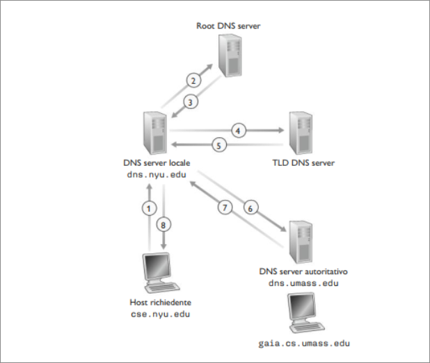
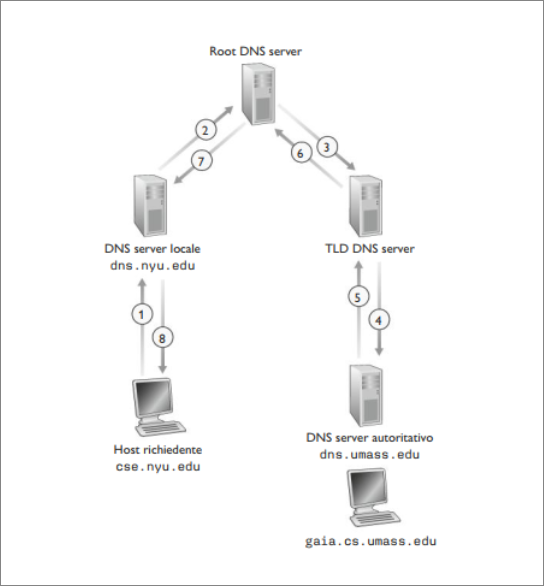
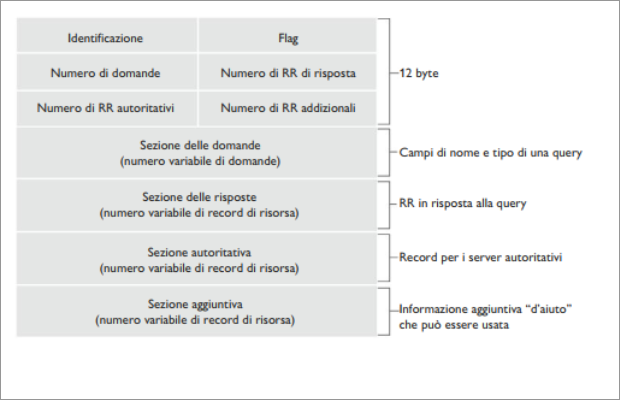
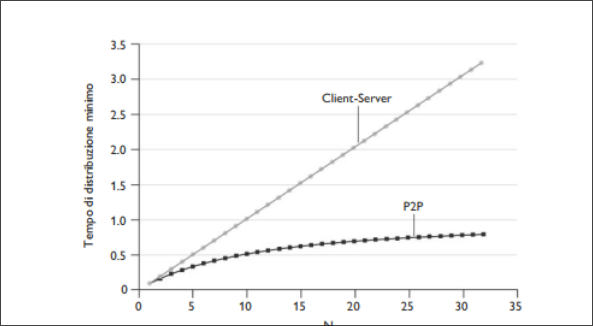
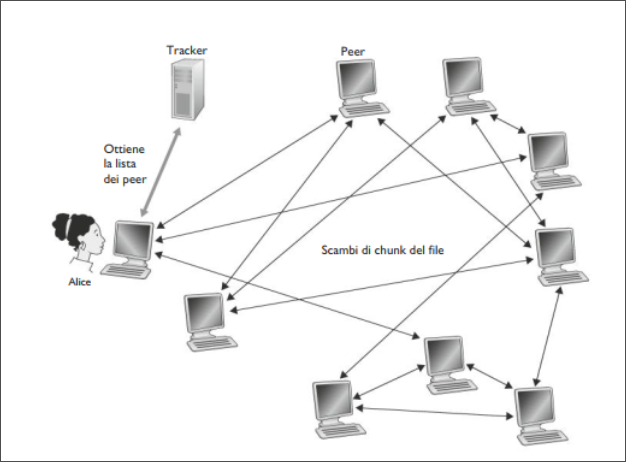
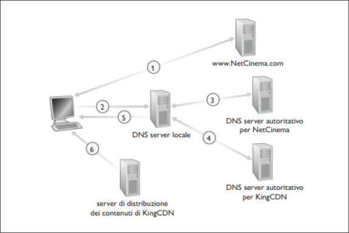

# Livello Applicazione

Gli host Internet possono essere identificati in vari modi. Gli **hostname** quali ```www.facebook.com, www.google.com```, risultano abbastanza appropriati per le persone ma forniscono poca informazione quanto la loro locazione in Internet.  
Inoltre dato che questi nomi sono costituiti da un numero variabile di caratteri alfanumerici, sono abbastanza difficili da elaborare per il server. Per questo gli host vengono identificati con gli **indirizzi IP**.  
Questo consiste di quattro byte e presenta una rigida struttura gerarchica.  
Ha questa forma: ```127.7.106.83``` in cui ogni punto separa un byte espressi con un decimale che va da 0 a 256.  

## Servizi forniti dai DNS  
Esistono dunque due modi per identificare gli host: nomi e indirizzi IP. Al fine di coinciliare i due approcci è necessario un servizio in grado di tradurre gli hostname nei loro indirizzi IP, compito del **DNS** (*Domain name system*).  
DNS è $(1)$ un database distribuito implementato in una gerarchia **DNS server** e $(2)$ un protocollo a livello di applicazione che consente di interrogare il database.  
Il protocollo DNS usa UDP e la porta 53.  
Consideriamo che cosa succede quando un browser in esecuzione sull'host di un utente richiede l'URL ```www.someschool.edu/index.html```. L'host dell'utente, per essere in grado di inviare un messaggio di richiesta HTTP al web server ```www.someschool.edu```, deve come prima cosa ottenere il suo indirizzo IP:  

1.  La stessa macchina utente esegue il lato client dell'applicazione DNS.  
2. Il browser estrae il nome dell'host ```www.someschool.edu ```, dall'URL e lo passa al lato client dell'applicazione DNS.  
3. Il client DNS invia una interrogazione (query) contenente l'host name a un DNS server  
4. Il client DNS prima o poi riceve una risposta, che include l'indirizzo IP corrispondente all'hostname  
5. Una volta ricevuto l'indirizzo IP dal DNS, il browser può dare inizio a una connessione TCP verso il processo server HTTP collegato alla porta 80 di quell'indirizzo IP.  

DNS offre ulteriori servizi:  

+ **Host aliasing** Un host dal nome complicato (**host canonico**) può avere uno o più sinonimi (*alias*).  
Il DNS può essere invocato da un'applicazione per ottenere l'host canonico di un sinonimo.  

+ **Mail server aliasing** Gli indirizzi email sono facili da ricordare. Per esempio, se Bob ha un account Hotmail, il suo indirizzo di posta elettronica potrebbe essere semplicemente ```bob@yahoo.com``` tuttavia l'hostname potrebbe essere più complicato. Un'applicazione può invocare il DNS per ottenere il nome canonico di un sinonimo fornito come l'indirizzo IP dell'host.  

+ **Distribuzione del carico di rete** Il DNS viene anche utilizzato per distribuire il carico tra server replicati, per esempio dei web server. I siti con molto traffico vengono replicati su più server , ogniuno eseguito su un host diverso con indirizzo IP differente.  
Nel caso du web server replicati, va dunque associato a ogni hostname canonico un insieme di indirizzi IP. Il database DNS contiene questo insieme di indirizzi. Quando i clienti effettuano una query DNS per un nome associato a un insieme di indirizzi, il server risponde con l'intero insieme d'indirizzi ma ne varia l'ordinamento a ogni risposta. Dato che generalmente un client invia il suo messaggio di richiesta HTTP al primo indirizzo IP elencato nell'insieme, la rotazione DNS distribuisce il traffico su server replicati.  

## Funzionamento DNS  
Supponiamo che un'applicazione in esecuzione sull'host di un utente abbia necessità di tradurre un hostname in un indirizzo IP. L'applicazione invocherà il lato client del DNS specificando l'hostname da tradurre.  
Su molte macchine UNIX, ```gethostbyname()``` è la chiamata di funzione effettuata da un'applicazione per ottenere il servizio di traduzione.  
Il DNS sull'host invia un messaggio (*query*) sulla rete. Tutte le query DNS e i messaggi di risposta vengono inviati dentro datagrammi UDP diretti alla porta 53. Dopo un ritardo che varia dai millisecondi ai secondi , il client DNS sull'host dell'utente riceve un messaggio di risposta contenente la corrispondenza desiderata, che viene poi passata all'applicazione che ne ha fatto richiesta. Un DNS è costituito da un grande numero di DNS server distribuiti per il mondo e da un protocollo a livello di applicazione che specifica la comunicazione tra DNS server e host richiedenti.  
Un primo approccio potrebbe essere quello di usare un DNS server contenente tutte le corrispondenze. Con un sistema centralizzato. Questo schema presenta dei problemi:  

+ **Un solo point of failure** Se il DNS si guasta, soffre l'intera Internet.  

+ **Volume di traffico** Un singolo DNS server dovrebbe gestire tutte le richieste.  

+ **Database centralizzato distante** Un singolo DNS server non può essere vicino a tutti clienti. Potrebbero esserci dunque pesanti ritardi.  
+ **Manutenzione** Il singolo DNS server dovrebbe contenente record relativi tutti gli host Internet. Un tale server centralizzato non solo sarebbe vasto ma dovrebbe essere aggiornato frequentemente.  

### Un database distribuito e gerarchico  

Per trattare il problema della sequenzialità , il DNS utilizza un grande numero di server, organizzati in maniera gerarchica e distribuiti nel mondo. Esistono tre classi di DNS server: **root server, top-level domain (TLD), server autoritativi** organizzati in una gerarchia.  

  

+ **root server**. In Internet esistono più di 1000 root server, dislocati in tutto il mondo. Forniscono gli indirizzi IP dei TLD server.

+ **TLD server**. Si occupano dei domini di primo livello quali com, org, net, edu e gov e di tutti i domini di primo livello relativi ai vari paesi come it, uk, fr, ca e jp. Forniscono gli indirizzi IP dei server autoritativi.  
+ **server autoritativi**. Ogni organizzazione dotata di host pubblicamente accessibili tramite Internet deve fornire record DNS pubblicamente accessibili che associno tali host a indirizzi IP. Il DNS server autoritativo ospita questi record.  

Esiste un altro importante DNS, il **DNS server locale**, che non appartiene strettamente alla gerarchia di server, ma che è comunque centrale nell'architettura DNS. Ciascun ISP (università, ISP residenziale,...) ha un DNS server locale. Quando un host si connette a un ISP, quest'ultimo gli fornisce un indirizzo IP tratto da uno o più dei suoi DNS server locali.   
Quando un host effettua una richiesta DNS, la query viene inviata al DNS server locale, che opera da proxy e inoltra la query alla gerarchia dei DNS server.  

Vediamo un esempio: Supponiamo che l'host ```cse.nyu.edu``` voglia l'indirizzo IP di ```gaia.cs.umass.edu```. Supponiamo che inoltre il DNS server locale per ```cse.nyu.edu``` sia ```dns.nyu.edu```, mentre un server autoritativo per ```gaia.cs.umass.edu``` sia ```dns.umass.edu```.  

  
l'host ```cse.nyu.edu``` dapprima invia un messaggio di richiesta DNS al proprio server locale ```dns.nyu.edu```. Il messaggio contiene il nome da tradurre (```gaia.cs.umass.edu```). Il server locale inoltra il messaggio di richiesta a un root server. Quest'ultimo prende nota del suffisso ```edu``` e restituisce al server locale un elenco di indirizzi IP per i TLD server responsabili di ```edu```. Il server locale rinvia quindi il messaggio di richiesta a uno di questi ultimi. Il TLD server prende nota del suffisso ```umass.edu``` e risponde con l'indirizzo IP del server autoritativo per l'università del Massachusetts, ```dns.umass.edu```. Infine il server locale rimanda il messaggio di richiesta direttamente a ```dns.umass.edu```, che risponde con l'indirizzo di ```gaia.cs.umass.edu```.  
Può capitare che un TLD conosca un DNS server intermedio, il quale conosce il server autoritativo relativo all'hostname.  

  

L'esempio in figura, fa uso sia di **query ricorsive** che **iterative**. La richiesta inviata da ```cse.nyu.edu``` a ```dns.nyu.edu``` è ricorsiva, in quanto richiede a ```dns.nyu.edu``` di ottenere l'associazione per conto del richiedente. Le successive tre richieste sono iterative , dato che tutte le risposte sono restituite direttamente a ```dns.nyu.edu```  

### DNS caching  
L'idea alla base del DNS caching è molto semplice. In una concatenazione di richieste , il DNS server che riceve una risposta DNS, può mettere in cache le informazioni contenute.  
Per esempio ogni volta che il server locale ```dns.nyu.edu``` riceve una risposta da qualche DNS server, può conservare in cache le informazioni contenute nella risposta. Se una coppia hostname/indirizzo IP è nella cache di un DNS server e giunge al server un'altra richiesta con lo  stesso hostname, il DNS server può fornire indirizzo IP desiderato. Gli host e le associazioni tra nome e indirizzo IP non sono in alcun modo permanenti, i DNS server invalidano le informazioni in cache dopo un certo periodo di tempo.  
Un DNS può inoltre, memorizzare in cache gli indirizzi IP dei TLD server, consentendogli di aggirare i root server nella catena di richieste.  
## Record e messaggi DNS  
I server che implementano il database distribuito DNS memorizzano i cosidetti **record di risorsa**, tra cui quelli che forniscono le corrispondenze tra nomi e indirizzi.  
Ogni messaggio di risposta DNS trasporta uno o più record di risorse.  

Un record di risorsa contiene i seguenti campi:  
 *(Name, Value, Type, TTL)*  

TTL è il time to live, ossia il tempo residuo di vita di un record e determina quando una risorsa vada rimossa dalla cache. Il significato di name e value dipende da type:  

+ *Type=A*: allora name è il nome dell'host e value il suo indirizzo IP (relay1.bar.foo.com, 145.37.93.126, A).  
+ *Type=NS*: allora name è un dominio e value è l'hostname del DNS server autoritativo che sa come ottenere gli indirizzi IP degli host nel dominio (foo.com, dns.foo.com,NS).  
+ *Type: CNAME* allora value rappresenta il nome canonico dell'host per il sinonimo name (foo.com, relay1.bar.foo.com,CNAME).  
+ *Type:MX* allora value è il nome canonico di un mail server che ha il sinonimo name. (foo.com, mail.bar.foo.com,MX). Questo tipo di record consente agli hostname dei mail server di avere sinonimi semplici.  

### Messaggi DNS   
Abbiamo fatto riferimento agli unici due tipi di messaggio DNS: le query e i messaggi di risposta che presentano lo stesso formato:  

  

La semantica dei campi è la seguente:  

+ I primi 12 byte rappresentano la *sezione di intestazione*, che a sua volta contiene un certo numero di campi. Il primo è un numero di 16 bit che identifica la richiesta. Tale identificatore viene copiato nei messaggi di risposta a una richiesta, consentendo al client di far corrispondere le risposte ricevute con le query inviate.  
Troviamo poi il campo *flag*. Il primo di questi il bit di *richiesta/risposta*, indica se il messaggio è una richiesta (0) o una risposta (1)Un bit viene impostato nei messaggi di risposta quando il DNS server è autoritativo per il nome richiesto. Un ulteiore bit, chiamato **richiesta di ricorsione**, viene impostato quando un client desideri che il DNS server effettui una ricorsione quando non dispone del record.  
Si imposta un campo da 1 bit di ricorsione disponibile all'interno di una risposta se il DNS server supporta la ricorsione.  
Troviamo poi 4 ulteiori campi che indicano il numero di occorenze delle quattro sezioni di tipo dati che seguono l'intestazione.  
+ La *sezione delle domande* contiene informazioni sulle richieste che stanno per essere effettuate. Inoltre, include (1) un campo nome con il nome che sta per essere richiesto, e (2) un campo tipo che indica il tipo della domanda (A, MX).  
+ La *sezione delle risposte* contiene i record di risorsa relativi al nome originariamente richiesto. Una risposta può restituire più RR, dato che un hostname può avere più indirizzi IP (server replicati).  
+ La *sezione autoritativa* contiene i record di altri server autoritativi.  
+ La *sezione aggiuntiva* racchiude altri record: per esempio se il campo di risposta relativo a una richiesta MX contiene un record di risorsa che fornisce l'hostname canonico del server di posta, la sezione aggiuntiva contiene un record di tipo A che fornisce l'indirizzo IP relativo all'hostname canonico del server di posta.  

### Inserimento di record nel database DNS  
Supponiamo di aver creato un'azienda chiamata Network Utopia.  
La prima cosa che sicuramente desiderate è far registrare il nome di dominio ```networkutopia.com``` presso un ente di registrazione (**registrar**), un'azienda che verifica l'unicità del nome di dominio , lo inserisce nel database DNS e vi richiede una piccola somma di denaro.  

Quando registrate il nome di dominio ```networkutopia.com``` presso un registrar, dovete fornire anche i nomi e gli indirizzi IP dei vostri DNS autoritativi primario e secondario. Supponiamo che i nomi e gli indirizzi IP ```dns1.networkutopia.com```, ```dns2.networkutopia.com```, ```212.2.212.1``` e ```212.212.212.2```. Per ciascuno di questi due server  autoritativi l'ente si accerterà dell'Inserimento di un record di tipo NS e di tipo A nei TLD server relativi al suffisso com. Più nello specifico, per il server autoritativo primario di ```networkutopia.com``` il registrar inserirebbe nel sistema DNS i due seguenti record di risorsa:  

*(networkutopia.com, dns1.networkutopia.com,NS)*  
*(dns1.networkutopia.com, 212.212.212.1,A)*  

Bisognerà anche accertarsi che il record di risorsa di tipo Aper il nostro web server ```www.networkutopia.com``` e il record di risorsa di tipo MX per il server di posta ```mail.networkutopia.com``` vengano immessi nei nostri DNS server autoritativi.  

## Distribuzione di file P2P  
Ci sono coppie di host connnessi in modo intermittente, chiamati peer, che comunicano direttamente l'uno con l'altro. I peer non appartengono ai fornitori dei servizi, ma sono computer, telefoni controllati dagli utenti.  

### Scalabilità dell'architettura P2P  
  

Come mostrato nella figura, server e peer sono collegati a Internet con collegamenti di accesso: sia $u_s$ la banda di upload del collegamento di accesso del server , $u_i$ la banda di upload del collegamento di accesso dell' $i$-esimo peer e $d_i$ la banda di download del collegamento di accesso dell'$i$-esimo peer. Sia inoltre $F$ la dimensione del file da distribuire (in bit) e $N$ il numero di peer che vuole una copia del file. Il **tempo di distribuzione** è il tempo richiesto perché tutti gli $N$ peer ottengano una copia del file.  
Supponiamo che il nucleo di rete abbia banda in abbondanza, e che i server e i peer non stiano partecipando a nessun'altra applicazione di rete.  
Determiniamo in primo luogo il tempo di distribuzione del file per l'archittetura client-server che indichiamo con $D_{cs}$  

Facciamo le seguenti osservazioni:  

+ Il server deve trasmettere una copia del file a ciascuno degli $N$ peer, cioè $NF$ bit. Dato che la banda di upload del server è $u_s$, il tempo per distribuire il file deve essere almeno $NF/u_s$.  
+ Sia $d_{min}$ la banda di download del peer avente il valore più basso cioè $d_min = min \{ d_1,d_2,...,d_N \}$. Il peer con la banda di download più bassa non può ricevere tutti gli $F$ bit del file in meno $F/d_{min}$ secondi. Quindi il tempo minimo di distribuzione è almeno $F/d_{min}$  

Mettendo assieme queste due osservazioni otteniamo:  

$D_{cs} \geq max \{ NF /u_s, F/d_{min} \}$  

Ciò fornisce un limite inferiore al tempo di distribuzione minimo per l'archittetura client-server. Consideriamolo come tempo effettivo:  

$D_{cs} = max \{ NF /u_s, F/d_{min} \}$  

Vediamo qui che per $N$ sufficientemente grande , il tempo di distribuzione nel caso client-server è dato da $\frac{NF}{u_s}$
Quindi il tempo di distribuzione aumenta linearmente con il numero di $N$ di peer.   

Per l'architettura P2P, quando un peer riceve alcuni dati del file , può usare la propria capacità di upload per redistribuire i dati agli altri peer. Per ottenere una semplice espressione del tempo minimo di distribuzione facciamo in primo luogo un'osservazione.  

+ All'inizio della distribuzione solo il server dispone del file. Per trasmetterlo all'interno della comunità dei peer il server deve inviare ciascun bit del file almeno una volta nel collegamento di accesso.  
Quindi il minimo tempo di distribuzione è $\frac{F}{u_s}$. Diversamente dallo schema client-server, un bit inviato una dal server non può non dover essere inviato di nuovo, in quanto i peer possono re-distribuire i bit tra loro  

+ Come per l'archittetura client-server, il peer con velocità di download più bassa non può ottenere tutti i bit del file in meno di $F/d_{min}$  

+ Infine si osservi che la capacità totale di upload del sistema è uguale alla velocità di upload del server più quella di ciascun peer:  
$u_{tot}=u_s+u_1+...+u_N$. Il sistema deve poter consegnare $F$ bit a ciascuno degli $N$ peer quindi $NF$ bit. Ciò non può essere fatto a una velocità più grande di $u_{tot}$. Dunque il tempo di distribuzione minimo è:  $NF/u_{tot}$.  

Mettendo assieme queste tre osservazioni otteniamo il tempo minimo di distribuzione P2P:  

$D_{P2P}= max(\frac{F}{u_s},\frac{F}{d_{min}},\frac{NF}{u_s+\sum_{i=1}^N u_i})$  

  

### Bit Torrent  
Bit torrent è un famoso protocollo P2P per la distribuzione di file. L'insieme di tutti i peer che partecipano alla distribuzione di un file è detto **torrent**. I peer in un torrent scaricano un **chunk** del file di uguale dimensione. Un peer quando entra a far parte del torrent la prima volta non ha chunk del file. Col passare del tempo accumula sempre più parti che, mentre scarica invia agli altri peer. Una volta che il peer ha acquisito l'intero file può lasciare il torrent o rimanere e inviare chunk agli altri. Inoltre può lasciare il torrent quando vuole con un qualsiasi sottoinsieme dei chunk e rientrare in seguito.  
Ciascun torrent ha un nodo di infrastruttura chiamato **tracker**. Quando un peer entra a far parte di un torrent, si registra presso un tracker e periodicamente lo informa che è ancora nel torrent. In questo modo il tracker tiene traccia dei peer che stanno partecipando al torrent.  

  

Quando un nuovo peer (Alice) entra a far parte di un torrent, il tracker seleziona in modo casuale un sottoinsieme di peer dall'insieme di peer che sono in quel torrent (ad esempio 50), e invia l'indirizzo IP di questi 50 peer ad Alice. Avendo la lista dei peer , Alice riesce a stabilire una connessione TCP "peer vicini". Nella figura si vede che Alice ha solo tre peer vicini. Col passare del tempo alcuni di loro possono lasciare il torrent , mentre altri possono stabilire una connessione TCP con Alice.  
A un determinato istante ciascun peer avrà un sottoinsieme dei chunk di un file e peer diversi ne avranno differenti sottoinsiemi. Periodicamente Alice chiederà a ciascuno dei suoi vicini, tramite le connessioni TCP, la lista dei chunk dei file in loro possesso. Tramite questa conoscenza Alice invierà richieste di nuovo sulle connessioni TCP , per i chunk del file che ancora le mancano.  
Di conseguenza, in un dato istante Alice avrà un sottoinsieme dei chunk di un file e saprà quali chunk hanno i suoi vicini. Con queste informazioni , Alice deve prendere due decisioni: quali chunk deve richiedere per primo ai suoi vicini e a quali vicini dovrebbe inviare i chunk a lei richiesti. 
Per la prima decisione , Alice adotta la tecnica del **rare first**. L'idea è determinare quali sono i chunk più rari tra quelli che ancora le mancano, cioè i chunk con il minor numero di copie ricevute tra i suoi vicini e richiderli per primi, i chunk più rari vengono distribuiti più velocemente.  
Per la seconda, BitTorrent usa un intelligiente algoritmo di trading. L'idea alla base è che Alice attribuisca priorità ai vicini che le stanno inviando dati in questo momento alla velocità più alta.  
Specificatamente, Alice misura continuamente la velocità alla quale riceve i bit e determina i quattro peer che le stanno inviando i bit a velocità più elevate.  
Alice poi controccambia inviando chunk del file a quegli stessi quattro peer. Ogni 10 secondi viene ricalcolata la velocità. Nel gergo questi 4 peer vengono detti **unchoked**.  
Un aspetto importante è che ogni 30 secondi sceglie casualmente un vicino in più e gli invia dei chunk. Chiamiamo Bob il peer scelto casualmente. Nel gergo Bob viene detto **optimistically unchoked**. 
Ogni 30 secondi Alice sceglie casualmente un nuovo compagno di scambi e inizia a scambiare chunk con quello. Se i due peer sono soddisfatti degli scambi , l'uno metterà nell'altro l'uno metterà nella propria lista dei quattro unchoked l'altro e continueranno a effettuare scambi finché non troveranno un partner migliore.  
Tutti gli altri peer vengono detti chocked e non ricevono alcun chunk da Alice.  

## Streaming video e reti per la distribuzione di contenuti  
### Video su Internet  
Nelle applicazioni streaming di video registrati, i contenuti sono video memorizzati su server a disposizione degli utenti su richiesta (*on demand*)  Un video è una sequenza di immagini, visualizzate tipicamente a velocità costante di , ad esempio, 24-30 immagini al secondo. Un'immagine non compressa e codificata digitalmente consiste in un'array di pixel, ogniuno dei quali codificato con un numero di bit per rappresentare luminanza e crominanza. I video possono essere compressi in modo da raggiungere un buon compromesso tra qualità del video e bit rate.  
Dal punto di vista rete, la caratteristica più saliente del video è l'elevata velocità con cui è necessario inviare i bit sulla rete (**bit rate**). I video distribuiti in rete variano da 100 kbps a oltre 4 Mbps. Ciò può tradursi in enormi quantità di traffico e di spazio di archiviazione.  
La misura in assoluto più importante per lo streaming è il througput medio, il cui valore deve essere almeno pari a quello del bit rate del video per avere una riproduzione continua.  

### Streaming HTTP e DASH  

Nello streaming HTTP il video viene semplicemente memorizzato in un server HTTP come un file ordinario con un URL specifico. Quando un utente vuole vedere un video, il client stabilisce una connessione TCP con il server e invia una richiesta GET HTTP per il suo URL. Il server invia il file video , all'interno di un messaggio di risposta HTTP, più velocemente possibile dati il traffico e i protocolli di rete. Sul lato client i byte vengono memorizzati in un buffer dell'applicazione client. Quando il numero di byte nel buffer supera una soglia fissata, l'applicazione  client inizia la riproduzione: periodicamente prende i frame video dal buffer, li decomprime e li visualizza all'utente.  

Lo streaming HTTP presenta uno svantaggio: i client ricevono tutti la stessa versione codificata del video, nonostante abbiano a disposizione una larghezza di banda che può variare sensibilmente da un caso all'altro e nel tempo. Per superare il problema nasce un nuovo tipo di streaming : **streaming dinamico adattativo su HTTP** (DASH). In DASH, i video vengono codificati in diverse versioni ogniuna avente un bit rate differente e quindi un differente livello di qualità.  
Il client richiede pezzi di segmenti video lunghi alcuni secondi da versioni differenti in modo dinamico. Quando la banda disponibile è elevata, il client seleziona automaticamente i blocchi da una versione con alto bit rate, mentre quando la banda disponibile è poca, una versione a basso bit rate. Il client seleziona un blocco alla volta con un messaggio di richiesta GET HTTP.  

Con DASH, i video nelle varie versioni vengono memorizzati nel server HTTP, ogniuno a un URL diverso. Il server HTTP ha anche un file di descrizione (**manifest file**)  che per ogni versione fornisce il rispettivo URL insieme al bit rate. Il client richiede innanzittuo il file di descrizione per venire a conoscenza delle varie versioni disponibili. Quindi seleziona ad ogni istante un blocco, specificando nel messaggio di richiesta GET di HTTP un URL e un intervallo di byte. Mentre scarica i blocchi , il client misura la banda di ricezione ed esegue un algoritmo per selezionare il blocco successivo.  

### Reti per la distribuzione di contenuti 
Mandare in streaming una grande mole di traffico a utenti sparsi in tutto il mondo, fornendo riproduzione continua e alta interattività, è davvero una grande sfida.  
Le maggiori aziende di video streaming usano le **CDN** (*Content Distributation Networks*). Una CDN gestisce server distribuiti in molti posti diversi, memorizza copie dei video e di altri contenuti web nei server e cerca di dirigere le richieste degli utenti al punto della CDN in grado di offrire servizio migliore. La CDN può essere una **CDN privata**, cioè proprietaria del fornitore di contenuti. Alternativamente può essere la **CDN di terze parti** che distribuisce contenuti per conto di molti fornitori di contenuti come Akamai.  

Le CDN generalmente adottano una delle due politiche di dislocazione dei server che seguono:  
+ **Enter deep**: Una filosofia è quella di entrare in profondità nelle reti di accesso degli ISP installando gruppi di server, detti cluster, negli ISP di accesso sparsi in tutto il mondo.  L'obiettivo è quello di essere vicini agli utenti finali in modo da migliorare il ritardo percepito dall'utente e il througput diminuendo il numero di collegamenti e router tra l'utente finale e il cluster CDN da cui riceve i contenuti.  
+ **Bring Home**: L'approccio è quello di portarsi in casa l'ISP costruendo grandi cluster in pochi punti chiave e interconnetterli usando una rete privata ad alta velocità. Queste CDN pongono i loro cluster negli IXP.  

Una volta posizionati i cluster, la CDN replica i contenuti su di essi. I video raramente richisti o che sono popolari solo in alcuni paesi non vengono copiati su tutti i cluster. Molte CDN non spingono i loro video verso i cluster ma usano una semplice strategia per cui se un client richiede un video a un cluster che non lo ha memorizzato, il cluster recupera il video da un archivio centrale o da un altro cluster e ne memorizza localmente una copia mentre lo manda in streaming al client.  

#### Come funziona la CDN 

Quando un browser nell'host di un utente chiede il recupero di uno specifico video identificato da un URL, la CDN deve intercettare la richiesta in modo da poter (1) determinare il cluster di server più appropriato per quel cliente a quell'istante e (2) dirigere la richiesta del client a uno dei server di quel cluster.  

Molte CDN sfruttano il DNS per intercettare e ridirigere le richieste. Usiamo un esempio: un fornitore di contenuti , NetCinema impieghi una CDN di terze parti, KingCDN, per ridistribuire i suoi video. A ogni video sulla pagina web di NetCinema viene assegnato un URL che include la stringa "video" e un identificatore univoco per tale video: al video *Transformers 7* potrebbe essere assegnato *http://video.netcinema.com/6Y7B23V*  

  

Vengono compiuti i seguenti passi:  

1. L'utente visita la pagina NetCinema  
2. Quando l'utente seleziona il link *http://video.netcinema.com/6Y7B23V*, il suo host invia un interrogazione DNS a video.netcinema.com  
3. Il **DNS server locale** dell'utente invia l'interrogazione DNS a un DNS server autoritativo per NetCinema che osserva la stringa "video" nel nome dell'host video.netcinema.com.  Il DNS server autoritativo per NetCinema per passare l'interrogazione DNS a KingCDN, invece di restituire un indirizzo IP, restituisce all'LDNS il nome di un host nel dominio di KingCDN ad esempio *a1105.kingcdn.com*.  
4. Da questo momento l'interrogazione DNS entra nell'infrastruttura DNS privata di KingCDN. Lo LDNS dell'utente invia quindi una seconda interrogazione per *a1105.kingcdn.com*, e infine il sistema DNS di KingCDN restiusice gli indirizzi IP di un server di KingCDN all'LDNS.   
5. LDNS inoltra l'indirizzo IP del nodo CDN che fornirà il contenuto all'host dell'utente.  
6. Il client, una volta ricevuto l'indirizzo IP del server KingCDN, stabilisce una connessione TCP diretta con il server a quell'indirizzo IP e gli invia una richiesta GET HTTP per il video. Nel caso venga impiegato DASH, il server innanzitutto invierà al client il file manifesto.  


