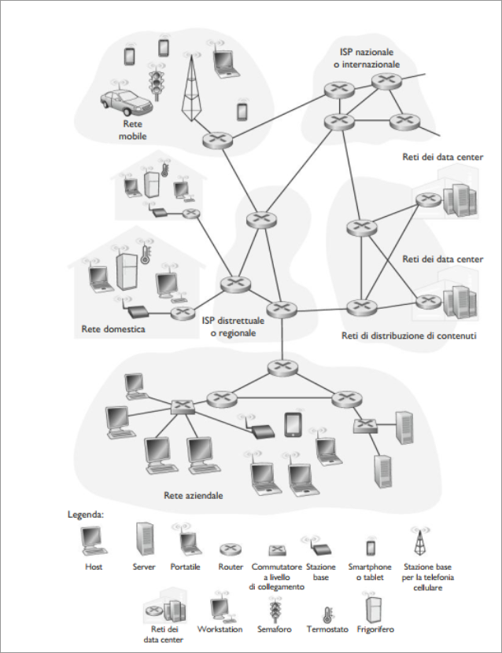

# Reti di calcolatori
## Che cos'è Internet?
Cos'è Internet? Esistono due modi di rispondere a questa domanda. La prima è descrivere gli "ingranaggi" di internet, ossia i componenti di  base hardware e software che la compongono. Un altro metodo consiste nel descrivere Internet in termini di infrastruttura di rete che fornisce servizi ad applicazioni distribuite.

### Gli "ingranaggi" di Internet
Internet è una rete di calcolatori che interconnette miliardi di dispositivi di calcolo in tutto il mondo. Questi dispositivi, in gergo, sono detti **host** o **sistemi periferici**.  
I sistemi periferici sono connessi tra loro tramite una **rete di collegamenti** e **commutatori di pacchetti**. Collegamenti diversi possono trasmettere dati a velocità differenti, e tale **tasso di trasmissione** viene misurata in bit/secondo (*bps*).  
  
Quando un Host vuole inviare dati ad un altro, suddivide i dati in sottoparti e aggiunge un'intestazione a ciascuna di esse: l'insieme delle informazioni risultanti , viene chiamato **pacchetto**.  
I pacchetti sono inviati attraverso la rete alla destinazione, dove vengono riassemblati per ottenere i dati originari. Un commutatore di pacchetto prende un pacchetto che arriva da uno dei collegamenti in ingresso e lo ritrasmette su uno di quelli in uscita. In internet i due principali sono i **router** e i **commutatori a livello di collegamento**. Entrambi instradano i pacchetti verso la loro destinazione finale. I commutatori a livello di collegamento sono solitamente usati nelle reti di accesso , mentre i router nel nucleo della rete. Dal sistema di invio a quello di ricezione, la sequenza di collegamenti e di commutatori di pacchetto attraversata dal singolo pacchetto è nota come **percorso**.  
I sistemi periferici accedono a Internet tramite i **Internet Service Provider** (**ISP**) che comprendono ISP residenziali, ISP aziendali, ISP universitari, ISP che forniscono accesso WiFi in aereoporti, hotel, bar e altri luoghi pubblici e ISP che forniscono accesso in mobilità.  

